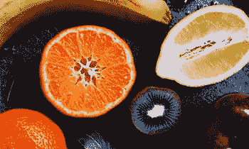
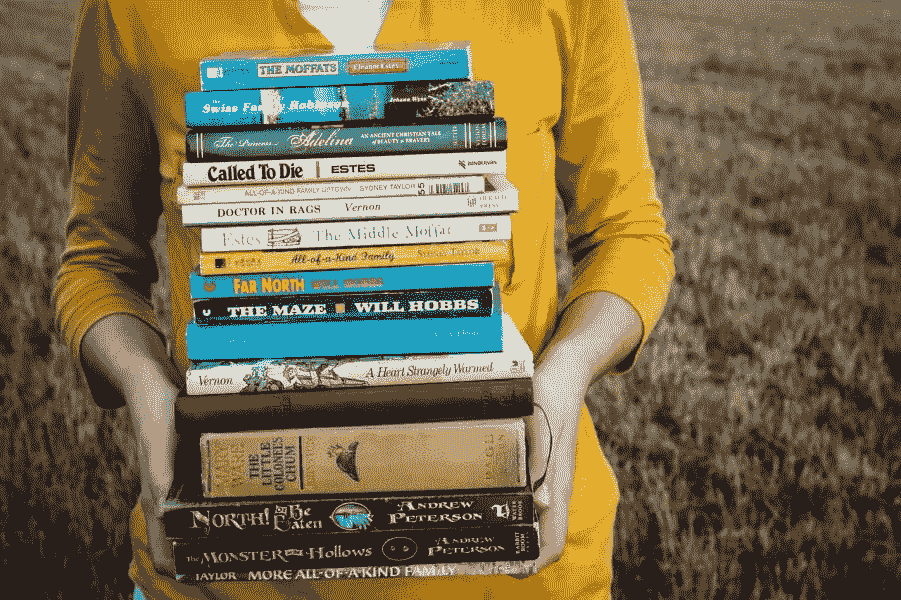
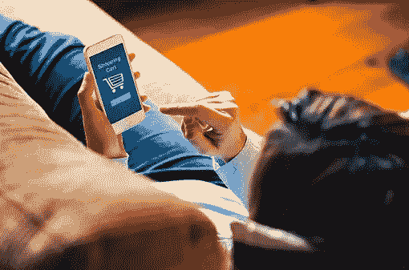

# 帮助你实现新年决心的书籍

> 原文：<https://medium.com/swlh/books-that-help-you-keep-new-years-resolutions-b2a526de5b7>

这是一年中神奇的时刻，每个人都在等待新事物的开始。当然，这意味着制定新年计划，希望今年你能变得更好。不幸的是，到了二月，你放弃了，希望明年你会做得更好。所以我们给你列了一个很棒的书的清单，可能会对你有所帮助，激发一些灵感。

**决心 1:保持健康**

每年的 12 月 31 日，我都会对自己许下承诺，这是我最后一次吃垃圾食品、碳水化合物、喝酒以及所有这些东西。然后在 1 月 15 日，我看着自己问:“你为什么会这样？你为什么买那袋多力多滋？”因此，我开始在网上寻找可以帮助我改变饮食习惯的信息。

*什么健康*作者王丽娟

对于那些一直在思考如何开始健康饮食，但却找不到合适的动力继续这样做的人来说，这是一本很好的读物。《健康是什么》今年出版，作者 Eunice Wong 探索了工业食品和制药行业。也许在研究了你实际摄入的食物后，你会想对你的饮食计划做些改变。

*如果我们的身体会说话:人体操作指南*

如果你仍然不相信你的身体对你处理它的方式不满意，你绝对需要阅读印第安纳大学医学院毕业生詹姆斯·汉布林的《如果我们的身体会说话》。这不是你用奇特的医学语言写的典型的书。詹姆斯·汉布林的《人体操作指南》平实易懂。弄清楚你是否真的需要八杯水，这就是为什么你应该把糯米糕放到一边。

决心 2:多读书

啊…一本教你如何读书的书，听起来很疯狂吧？或者一本解释你如何爱看书的书？是啊，听起来确实很疯狂。但是试一试。就一本书。

莫蒂默·阿德勒的《如何阅读一本书:智能阅读经典指南》

这本书甚至不是在本世纪出版的。但绝对是经典。我相信你知道如何阅读，这是你在小学里学过的。但是为了理解而阅读和为了信息而阅读是完全不同的两回事。你想知道如何最大限度地阅读书籍，那就去看看莫蒂默·阿德勒的《智能阅读指南》。

威尔·施瓦尔贝的《为生活而书》

给所有爱书人(也包括讨厌书的人)的书。书把你带到哪里，能对你的人生产生什么影响？你是如何找到一本书，会符合你的心情或目前的生活状况？它是你所有新年决心的灵感和安慰的巨大源泉。

**决心 3:少花钱，多存钱**

多读书，保持头脑清醒，少吃垃圾食品——与坚持理财的决心相比，坚持这些决心听起来像是小菜一碟。好吧，你需要的只是一个你可以遵循的平滑透明的系统。

*破产千禧年:停止勉强度日，让你的财务生活走在一起*艾琳·劳里著

你还年轻，你还在上大学或者刚刚毕业，一想到要付账单、缴税和数数就不寒而栗？这本书是一个百宝箱，里面装满了关于如何保持财务健康的黄金建议和极其有价值的信息。

*贫穷而美丽的生活:小城镇的预算，大城市的梦想*作者斯蒂芬妮·奥康奈尔

一个更奇特的个人理财指南。尤其是如果你没有很多财务要处理的话。尤其是如果你住在像纽约这样的大城市，你赚的每一分钱都很重要。斯蒂芬妮·奥康纳向年轻人展示了如何在小预算下过上美好的生活。

用这些**好书充分利用 2018 年。嘿，也许你的决心会持续到夏天；)**

## 这篇文章发表在 [The Startup](https://medium.com/swlh) 上，这是 Medium 最大的创业刊物，拥有 277，994+读者。

## 在这里订阅接收[我们的头条新闻](http://growthsupply.com/the-startup-newsletter/)。

