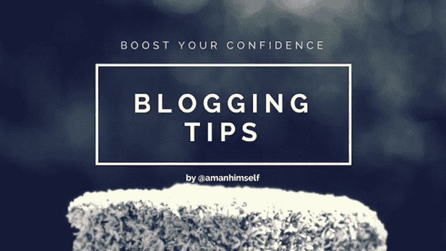
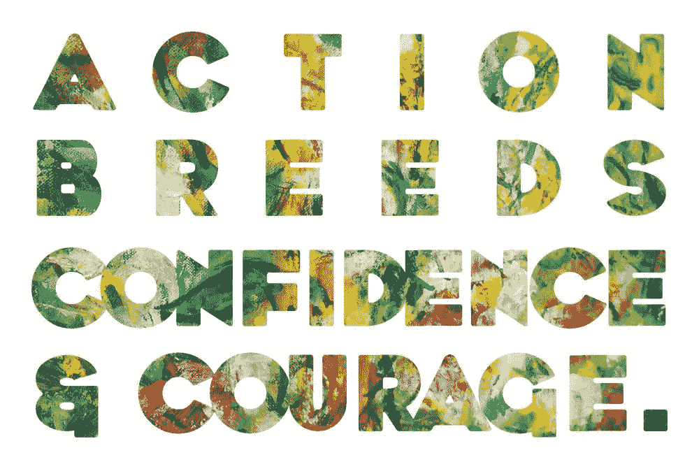

# 增强你写博客的信心，写下这篇文章

> 原文：<https://medium.com/swlh/boost-your-blogging-confidence-and-write-that-post-9124731c7fcc>

> 不要等待。时机永远不会恰到好处。——拿破仑·希尔

缺乏自信是博主不发表帖子的原因之一。特别是，在这个信息过载的时代，我们倾向于收集大量的信息，而不去关注我们感兴趣的主题或内容，但由于缺乏信心，你最好的帖子从未发表过。当点击发布按钮的时候，我们都在与自信作斗争。我写博客已经四年多了，我和你一样在为自信而奋斗。我有和你一样的疑问和担忧。

这是一种想让你停止写作的疾病。它希望你停止研究，停止获取知识，停止与读者分享知识。这就是我心目中“缺乏自信”的定义。

然而，你不能在这场持续的斗争中失败。如果你输了，意味着你的博客完蛋了。无论你是重新开始，还是暂时写博客，我都建议你继续你的旅程。要赢得这场战斗，就要发布你的下一篇博文，而要做到这一点，你现在就可以从增强自信开始。

# 采取行动

不要只是坐在那里思考。写那个帖子。尽可能多写草稿。尽可能多的编辑。写吧。出现在你脑海中的东西和在虚空中是一样的。要让它成为一个存在的实体，换句话说，要赋予它生命，你就得写那该死的帖子！

# 尝试你舒适区之外的东西

写或张贴一些与你的专业无关或不属于你的专业领域的东西。要有创意。这会提高你的自信程度，也会让你的听众开心。你可能最终会学到一些新的东西，并对这个话题感兴趣，它成为帖子队列中的一个常规突破。这里的另一个好处是，它会给你时间准备你的利基内容。

source: Flickr.com/

# **认为自己长得丑对你不好**

就像梅根·拉姆齐在 ted 演讲中提到的关于身体意象的问题，包括我们作为人类在现实生活中如何看待我们的身体意象，我希望你停下来，注意你的思绪，无论何时你被一个想法、一个话题或者你想在博客上做的一个实验所启发。不要太在意他们。事实上，尽快开始完全忽略它们。

专注于你正在做的事情。你不知道将来会发生什么。你不知道下一篇博文会收到多少反馈。要知道这一切，你必须赋予它自己的生命。自我肯定的谈话是你或任何人能给自己的最好的建议。训练你的头脑去实现自我价值的信念，并看到结果。

作为参考，你可以在这里看一下梅根·拉姆齐的 TED 演讲*。*

# *阅读！*

*阅读对任何作家或博客来说都很重要。尽可能多读书。用帮助你提高自信水平的内容充实你的头脑。它工作了。以书的形式，强烈推荐《拿破仑·希尔的*思考致富》。**

*另外，看看这两位博主:*

*   *[大流士·福鲁](http://dariusforoux.com/blog/) ( [大流士·福鲁](https://medium.com/u/54163a1723f6?source=post_page-----9124731c7fcc--------------------------------)*
*   *本杰明·哈代 ( [本杰明·p·哈代](https://medium.com/u/5153880ce2ee?source=post_page-----9124731c7fcc--------------------------------))*

*他们是伟大的励志作家，通过分享他们自己的生活经验以及克服内心障碍和缺乏信心的有趣技巧。*

> *耐心、坚持和汗水是成功的最佳组合。——拿破仑·希尔*

*🙏*继续写博客！你可以在* [*推特*](https://twitter.com/amanhimself) *和我的* [*书博*](http://readingbooks.blog) *上找到我。**

**

## *这个故事发表在 [The Startup](https://medium.com/swlh) 上，这是 Medium 最大的企业家出版物，拥有 305，505+人。*

## *在这里订阅接收[我们的头条新闻](http://growthsupply.com/the-startup-newsletter/)。*

**