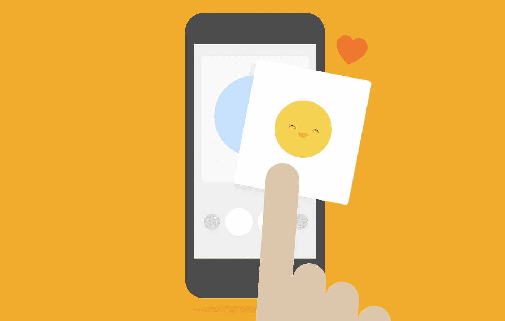
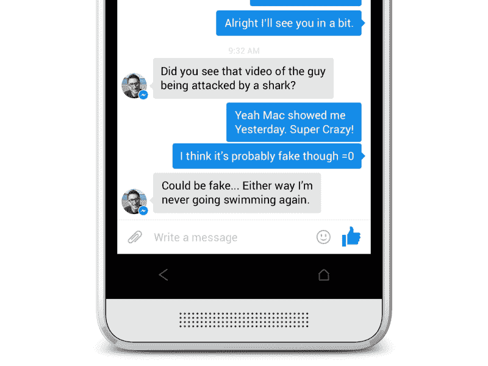
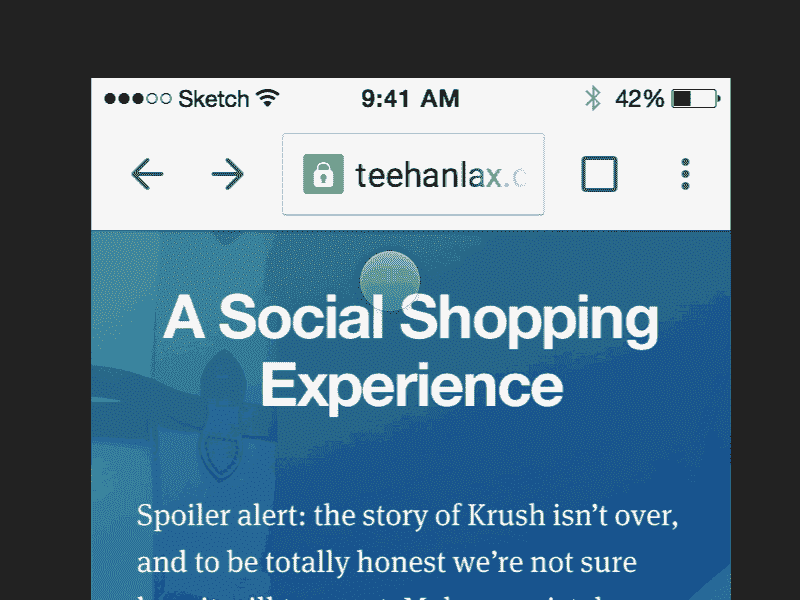
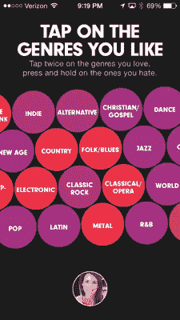
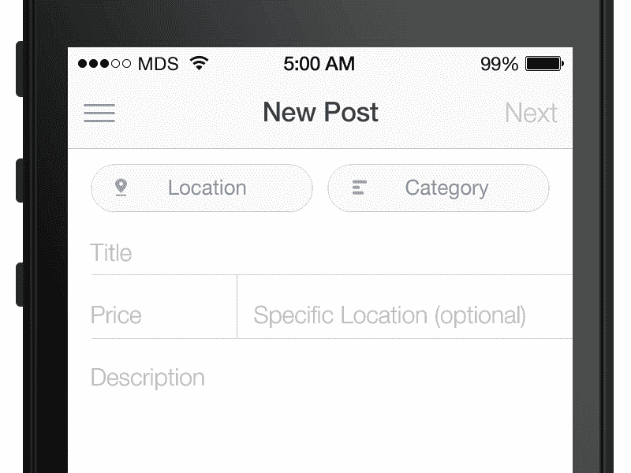
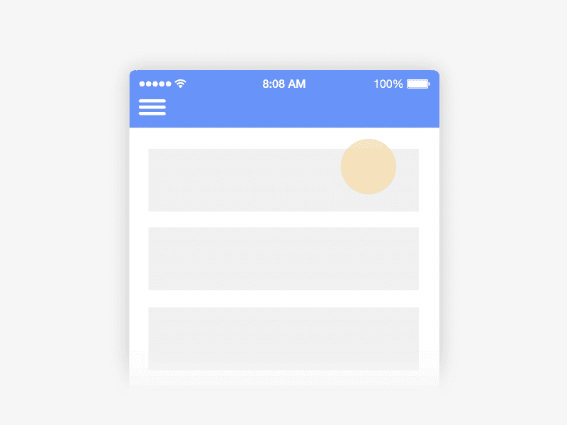
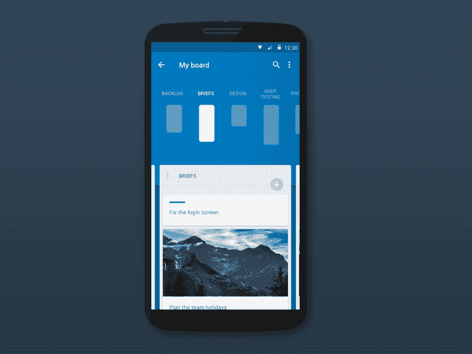
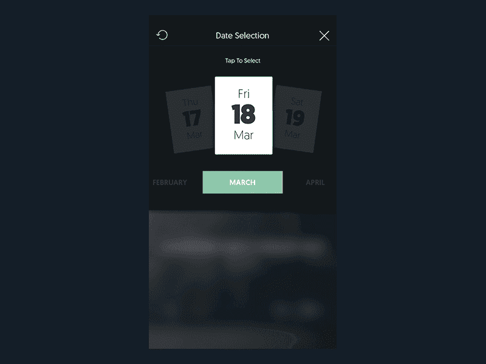
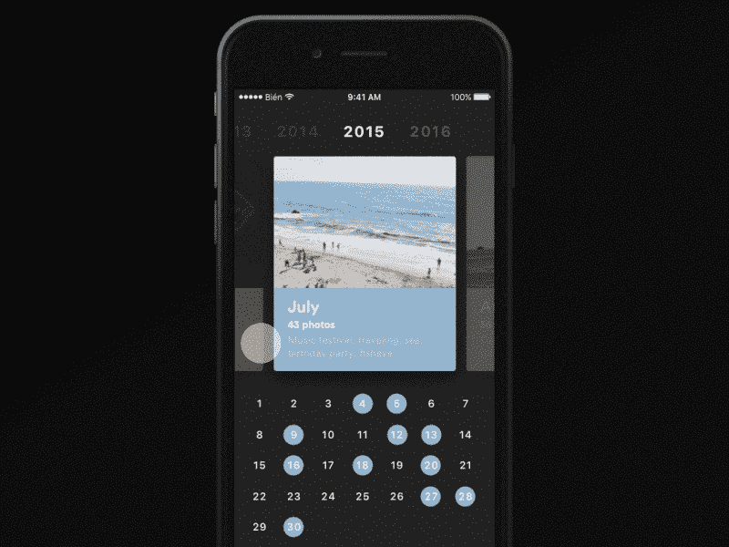

# 通过微互动提升你的设计

> 原文：<https://medium.com/swlh/boost-your-design-by-micro-interactions-9fdb628e42ec>

Illustration by [Frank Rapacciuolo](https://dribbble.com/frankiefreesbie)

## 如何在你的应用中设计细节和动画

每天都有数百万人与智能手机互动，并执行不同的操作:输入密码登录社交网络、关闭音量、按下 like 按钮等。这些操作中的每一个都是微交互。

几天前，我和一个朋友在 Facebook Messenger 上测试，我发现了一些奇妙的事情。我想发送一个*“喜欢”*(竖起大拇指)，但我不小心多按了几下按钮。我发现，如果按住按钮，图标会变得越来越大，直到你把手指从屏幕上拿开。我在那里呆了几分钟，重复了几次手术，这太滑稽了。我当时很茫然。

**Thumbs up** diFacebook Messenger

这个动画是微交互的一个很好的例子，因为它实现了三个重要的功能:

*   传达状态并提供反馈
*   增强直接操作的感觉
*   帮助人们看到他们行动的结果

根据《微交互》的作者丹·萨弗的说法，这些是微交互的功能。

**微互动到底是什么？**

用户动作触发了设备的另一个动作。从技术上讲，它包括:

*   **触发**:用户按下按钮，微交互开始。
*   规则:交互行为的方式。
*   **反馈**:设计如何将微交互传达给用户。
*   **循环:**确定微交互如果重复会持续多久，以及它如何随时间变化。

移动用户与两个关键的设计元素互动:功能和细节。功能吸引人们使用产品，细节让他们兴奋。使用微互动，你可以把一些无聊和无生气的事情变成有趣和好玩的事情。每个设计师的梦想都是一个运行良好的应用程序，没有错误，易于使用，并且更多地关注细节和微交互，应用程序可以是完美的。

另一个让我印象深刻的微交互的好例子是谷歌 Chrome 刷新。

Pull to refresh action, Google Chrome. Animation by [Chris Lee](https://dribbble.com/Cleer)

使用这种类型的交互可以轻松直观地刷新页面。这是我们本能地做的一个自然手势的延续，这个手势在屏幕上向下拖动。在这种情况下，还有另外两个动作:*“添加窗口”*和*“关闭窗口”*，它们代表了我们在使用浏览器时需要的动作。

除了有用的特性，在设计一个微交互时，有一个因素我们必须时刻牢记在心:**游戏因素**。添加一个新窗口或关闭它是如此令人愉快，就好像我在玩它一样。试试吧，它会以同样的方式影响你！

[*【拉动刷新】*交互的创造者 Loren Brichter](http://unraveled.com/archives/2009/11/tweetie-interview-loren-brichter) 说:
*“为什么要让用户停止滚动，抬起手指，然后轻点一个按钮？为什么不让他们继续他们已经在做的姿态呢？当我想看更新的东西时，我会向上滚动。我知道我自己做了滚动手势。”*

**如何设计微交互？**

进行微交互对设计师来说是令人兴奋的，因为它有可能实验新的设计方案，寻找给用户带来惊喜的新方法。但要做到这一点，你必须记住几件事:

*   **设身处地为用户着想**，利用你所拥有的一切来弄清楚他们是如何使用你的应用的。
*   **创建功能动画**。动画不仅具有美感，而且能够增强用户体验。
*   **尽情娱乐你的用户。**用户在使用 app 时的感受，是他一直使用的事实背后的原因。如果用户喜欢这种体验，觉得很愉快，他就会回来。
*   **不要惹人厌。**动画太多对用户产生反效果。烦人的用户让他们远离你的应用。
*   **使用人类语言**和非技术语言。一个有趣而讽刺的副本可以让你暂时忘记应用程序中的一个空白页面是多么令人沮丧。

另一个有趣的微交互例子是在 Beats 应用程序中选择流派(现在是音乐)。

Genres selection, Beats

在 Beats 应用中，可以以有趣的方式选择流派，而不会感到无聊，使选择像游戏一样。这样，你就可以想象出是怎么回事了。当按下圆圈时，选择流派。底部出现“下一步”按钮，允许您继续下一步。在用户头像周围会出现一个进度条，指示初始旅程的确切进度。通常，用户倾向于跳过入职培训的步骤，甚至没有阅读所写的内容。

这种微交互抓住了用户的注意力，并引导他完成游览的各个步骤。同时，他正处于愉快的经历中。

**结论**

我总是被设计良好的应用程序所吸引，这些应用程序具有功能性和令人愉快的设计。如果你将这些因素与微观互动结合起来，你就能创造出完美的产品，因为一方面你吸引了用户的注意力，另一方面你也产生了愉快的情绪。

> 细节就是设计。查尔斯·伊姆斯

一些激励我的动画:

Float Label Form Interaction by [Matt D. Smith](https://dribbble.com/mds)

Pull to refresh by [Michael B. Myers Jr.](https://dribbble.com/drawsgood)

Trello Navigation by [Aurélien Salomon](https://dribbble.com/aureliensalomon)

The PartyUp App — Calendar [Kreativa Studio](https://dribbble.com/teams/KreativaStudio)

Photo Calendar for iOS by [Bien Studio](https://dribbble.com/bien)

Magic Tabs by [Abhinav Chhikara](https://dribbble.com/abhinavc)

资源:[微互动图书](http://www.amazon.it/Microinteractions-Color-Edition-Designing-Details/dp/1491945923)(丹·萨弗)

感谢阅读！

*_
我是谁？我是*[*musix match*](http://about.musixmatch.com/)*的产品设计师。致力于让产品更具吸引力、功能性和易用性。***[*推特*](https://twitter.com/frankiefreesbie) [*领英*](http://it.linkedin.com/in/frankrapacciuolo)**