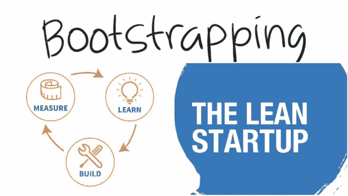

# 创业，不要马上辞职

> 原文：<https://medium.com/swlh/bootstrapping-a-start-up-without-quitting-your-job-immediately-f1f4339eee53>

在平常的一天，当你拼命工作时，或者在周末，当你在漫长而艰难的一周工作后，将自己淹没在你最喜欢的毒药中时——然后它突然袭击了你。你有一个想法，可以解决一个问题，并发展成一个可持续的业务，或者让你有一个有利可图的退出。你的啊哈时刻！！

[Source](http://irosh.info/30/4489134-think.html)

# 如何在不遭受巨大财务损失的情况下启动一项新业务？

> 你已经被创业的虫子咬了一口，你作为一个受薪员工的日子可能会很有限。

对你来说，下一件显而易见的事情是弄清楚如何在不辞职的情况下开始创业。根据我 12 个月前创业的亲身经历，你应该遵循以下几点:

首先计算出 12 个月(或者 18 个月或 6 个月，取决于你想在打电话之前尝试和冒险多长时间，以防事情不按你希望的方式发展)你需要多少钱来支付所有必要的个人支出(必需品、租金/ EMI、旅行等)，并计划多快能存下这笔钱，以便让你能够冒险一试。

> 一个没人告诉你的简单方法是削减一些不必要的开支。

[Source](http://www.venturegali.com/2016/03/25/bootstrapping-lean-startup-methodology/)

你可能会发现，你需要再工作 12 个月，才能为之后的 12 个月攒够钱。多么令人沮丧！！！！“当我知道我的想法将成为一项成功的业务时，我到底应该在 12 个月内做些什么？风险资本家会在我的办公室外排队，求我接受他们的钱，我的每一个目标客户都会购买我提供的产品或服务？如果在我开始着手实施这个想法并取得成功之前，有人已经实施了这个想法，那该怎么办？”

好消息是你不必把这个想法搁置起来。你可以从**的这一刻**开始着手你的想法。你可能一周工作 5 天，每天工作 12-13 个小时(还有漫长的通勤时间)。你需要每天 8 小时的睡眠来过健康的生活。锻炼、日常杂务等会消耗掉每天剩下的 3-4 个小时。你需要每周至少给你的家人一天时间。那你怎么能在不辞职的情况下实现你的想法呢？

# **周末创业:那到底是什么？**

利用周末和假期的空闲时间把你的想法写在纸上。计算你需要多少资金来实施这个想法并维持 12 个月的运营，并看看你可以筹集资金的方式——个人储蓄(至少在你需要的 12 个月的基础上再增加几个月)和来自家人和朋友的资金是目前你唯一现实的选择。

私募股权投资者(包括天使投资者和风险投资基金)不太可能加入，除非你有一个 MVP(最低可行产品)，一个由彻底的市场研究支持的合理的商业计划，以及一个等待购买你的产品的客户群的证明。

在进行初始评估时，确定您试图解决的确切问题，找出已经可用的解决方案，并回答以下问题:

1.与现有解决方案相比，您的解决方案有何不同或更好？

2.你需要什么资源来制造解决问题的产品？

3.进入的障碍是什么？

4.谁会买你的产品？

5.你如何确保你的产品能够经受住竞争？

6.你创业背后的目标是什么？你是希望建立一家可以长期持续的公司，还是一家可以盈利退出的公司？你将如何建造它？

你可能不具备企业所需的所有资源和技能。视角不同不会是坏事。考虑让一位联合创始人加入进来。一个或两个，但不会更多。这个/这些人必须和你有共同的愿景(但如果需要的话，他/她准备指出其中的缺陷)，有相似的倾向和客观的思维方式，有资金、时间和技能来投资这个项目。

Source: [https://msmemitra.com/](https://msmemitra.com/)

随着创始团队的分类，您需要进行详细的市场研究，以了解真正的问题以及您的解决方案的可行性、可行性和可伸缩性。

# **意想不到的挣扎**

从那一刻起，你可能已经工作了 3 个月，你可能一天工作 13 个小时，一周工作 7 天。工作中的压力比以往任何时候都大，你的家庭需要更多的关注，你会产生意想不到的费用，这将你的计划又推迟了几个月。

> 优先！如果情况需要，你可以 8 周不去想这个主意。

一段时间后，事情会有所缓解，你将能够在周末继续你的想法。为你的团队设定一个时间表。在接下来的 4-5 个月里，在商业计划进行到一半的时候，准备好一个原型，并努力建立一个可能对购买你的产品感兴趣的客户渠道。测试原型可能的错误，并花更多的时间来确定可以进行的改进。

在接下来的几个月里，设定一个目标来准备好 MVP。开始运行测试并检查您的清单。再一次评估一下，你个人需要多少钱才能在接下来的 12 个月里生存下去，并进一步投资这家初创企业。

如果你确信你已经得到了足够的，那就把你的论文交上来，然后等待你最后一次走出办公室的那一天，带着灿烂的微笑和征服世界的梦想。真的发生了，你成功了！

> 尽管生活中有很多糟糕的事情，尽管和你的合伙人有很多争论，但是你已经到了准备好迈出这一步的阶段了！！！！你的产品发布只有几个星期了。

在接下来的几周里，努力测试你的 MVP，对你的产品进行必要的修改，再次测试，并为你的产品的推出进行宣传。你可能一周要工作 100 个小时，以确保产品上市按计划进行，并且客户真的喜欢你提供的产品。

向有限的客户群提供此 MVP，并收集反馈。如果客户喜欢它，并且你有超过 90%的正面评价，有 70%的人准备注册使用你的最终产品，你已经得到了市场的认可，并建立了你的销售渠道。

# **筹集资金:真的需要走 VC /天使路线吗？**

Source: [https://msmemitra.com/](https://msmemitra.com/)

占领市场需要多少资金？你真的需要从外部筹集资金吗？就我个人而言，我是自举的超级粉丝，如果你有资源去做的话。通过这种方式，创始人可以参与到游戏中，而你可以保证对企业的完全控制。

你可以按照自己的节奏扩大规模，而不用担心董事会希望提高顶线以推高估值并进行一轮又一轮的融资，同时将你的股份稀释到变得无足轻重的程度，你只不过是一名高管，为董事会的愿景而工作，董事会成员都是希望实现有利可图的退出的投资者(嗯，这并不像听起来那么糟糕，在大多数情况下和某些行业中，没有顶线的积极和指数级增长，企业就无法生存)。

印度政府一直专注于促进印度的企业家精神。印度的初创企业可以找到并利用中央政府推动的、适用的和行业特定的[计划和补贴](https://msmemitra.com/home/schemessubsidies)的好处。在业务的任何阶段，初创企业也可以考虑可用的[债务融资](https://msmemitra.com/home/debt)选项。

印度的银行和 NBFCs 已经看到了初创企业的潜力，如果你有一个好的产品、团队、市场和一个有合理财务预测的商业计划，它们愿意提供信贷服务。

最大的神话是，你需要烧 X 烧 Y 个月，才能在第(Y+1)个月达到每月 X 的销售额。

> 建立一个成功的自举企业的关键在于同等重视顶线和底线。力争收支平衡，最大限度地降低费用，以尽早实现盈利。

发布后，你的大部分现金将花在工资、租金和营销上。虽然节省租金的唯一选择是在家办公/共享办公空间，或者与另一家初创公司共用一间办公室，但有一些方法可以最大限度地减少薪资和营销支出。

# **降低成本:员工持股计划和自动化**

Source: [https://msmemitra.com/](https://msmemitra.com/)

开发一些方法来自动化你企业中多余的流程，这将为你节省一些雇佣多余员工的费用。向核心团队提供 12 个月的授权期的员工持股计划，并向销售团队提供基于目标的薪酬结构。

营销呢？对于一家基于互联网的初创企业来说，数字营销绝对至关重要。你真的需要在早期聘请一家机构来管理你的数字营销吗？不尽然！！市场上有更便宜和更好的选择，如 Dfizz.com 的—一种数字营销自动化软件，它实时建立一个网站(以及域名和主机)，并在人工智能的帮助下，自动化社交媒体营销，包括内容发现和搜索引擎优化的与您的业务相关的内容创建。除此之外，【Dfizz.com】还提供 CRM、平面设计和社交媒体上的客户互动。所有这些都只是你雇佣社交媒体经理/代理的一小部分费用。

# 如果事情没有按计划进行会发生什么？

你的想法和你的执行力一样好。如果事情不像你计划的那样发展，吸引力比估计的要低，如果你确信产品很适合市场，你就需要转向。也许你不能令人信服地向市场提供你的产品。也许你的销售团队无法向你的客户传达正确的信息。

你需要卷起袖子，制定新的策略，并根据客户的反馈对产品做出改变。在最糟糕的情况下，如果你认为你最初的市场调查是不正确的，你的产品并不适合这个市场，或者如果超出你控制的情况(经济、政治、社会)已经创造了一个你无法生存的环境，那么是时候吸取教训，减少损失，继续前进了。

在最好的情况下，你要么创建一家可以花很多钱收购的公司，要么创建一家将逐渐从初创企业转变为中小企业、大型非上市私人公司，最终转变为大型上市公司的企业。

总之，只要你清楚自己的目标、目标市场、销售和营销策略，并且能够打造出一款与众不同的产品，那么在创业初期，你就有可能在不辞职的情况下启动一家初创企业。

感谢您的阅读。如果这对你有帮助，别忘了鼓掌和分享。有不同意见？让我们连线[support@msmemitra.com](mailto:support@msmemitra.com)

**关于我:**我和 Ashish Jacob 一起在印度创办了[MSMEmitra.com](https://msmemitra.com/)，为初创企业和中小企业提供金融咨询和商业顾问服务，帮助企业找到最合适的融资方案和适用的计划和补贴，并通过我们的银行、NBFCs、风投和 PE 投资者网络提供融资援助。目前，我们还在致力于开发一个平台，对初创企业和高增长潜力的中小企业的潜在投资机会进行描述、宣传和排名(基于某些关键指标)。

## 这篇文章发表在 [The Startup](https://medium.com/swlh) 上，这是 Medium 最大的创业刊物，有+ 370，107 人关注。

## 订阅接收[我们的头条新闻](http://growthsupply.com/the-startup-newsletter/)。

