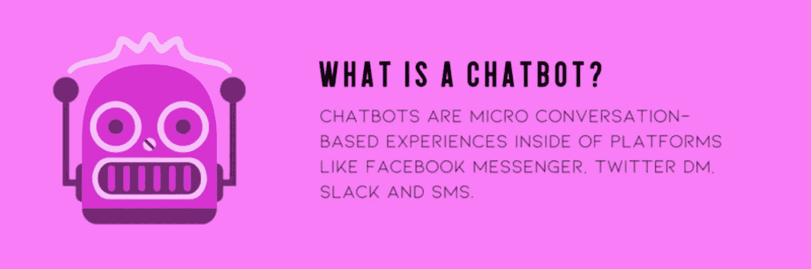
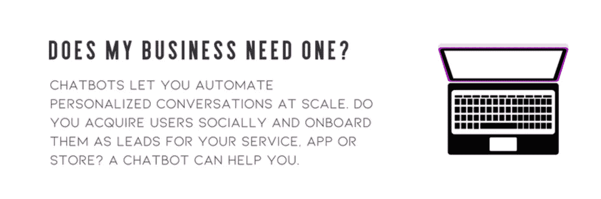
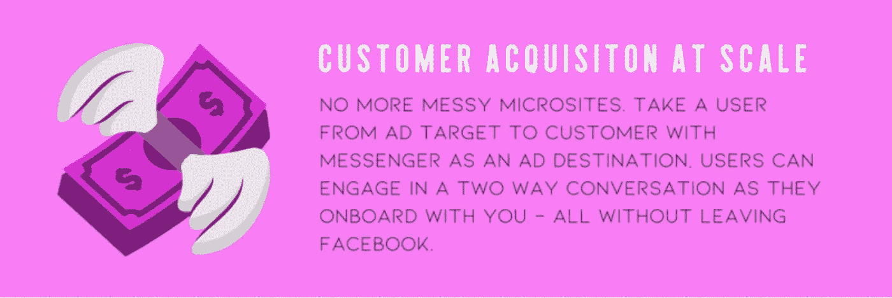
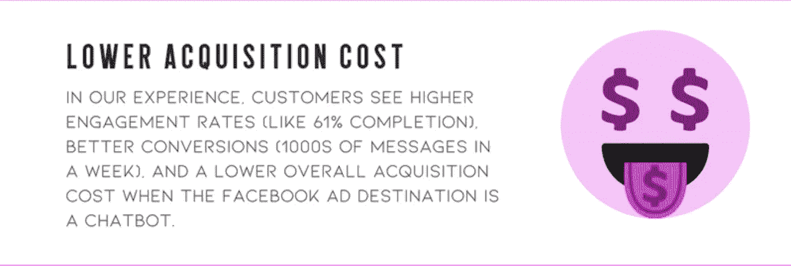
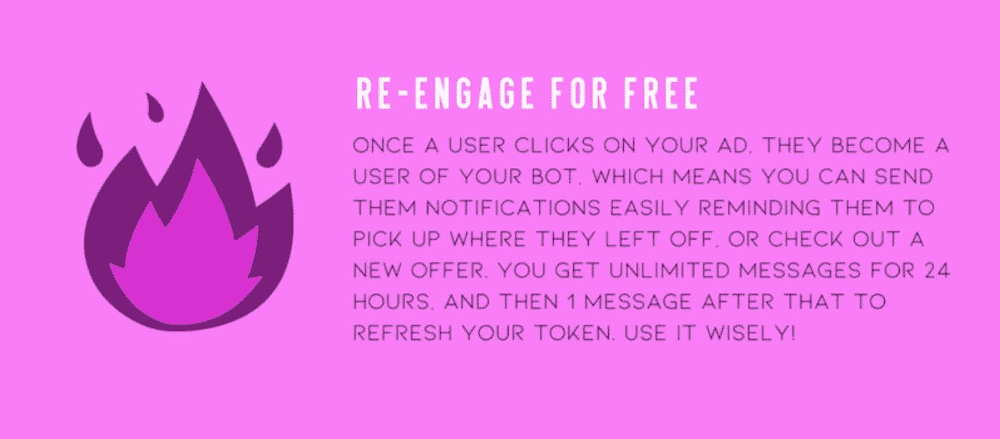
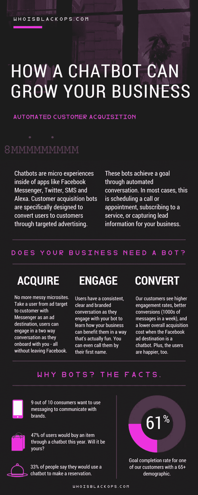

# 机器人基础:聊天机器人如何发展你的业务

> 原文：<https://medium.com/swlh/bot-basics-how-a-chatbot-can-grow-your-business-d7073f928e70>

随着我对有个性的聊天机器人的广泛而永恒的热爱，我开始了一个新的博客系列。在我们超越自我开始[编写聊天机器人脚本和构建原型](https://chatbotsmagazine.com/how-to-start-designing-chatbots-if-you-have-no-experience-8b2ba1e762dd)之前，还有一些基础知识要讲。例如，**聊天机器人如何发展你的业务？**聊天机器人是给谁用的？他们不是为了谁？我们来探索一下。

首先，什么是聊天机器人？我喜欢把它们看作是**微型的、基于对话的体验**，存在于消息应用程序中，比如 Facebook Messenger、Twitter DM、Slack、SMS 和 Voice。

对于企业，我们将重点关注**客户获取机器人。**这些都是相同的基于对话的微观体验，但它们是专门设计来通过定向广告将用户转化为顾客的**。这些机器人有一个通过自动对话实现的**具体且可衡量的目标**。在大多数情况下，目标是这样的事情:安排一个电话或约会，订阅一项服务，购买一些东西，或捕捉你的业务线索信息。**它们促进你的业务发展。****

帮我报名，对吧？在你开始为你的公司创建聊天机器人之前，有几件事要问你自己:

*   你是通过社交获取用户的吗？
*   你有付费社交预算来获取这些用户吗？
*   除了销售之外，你是否有价值让用户分享？

我的意思是，用户不想点击你在脸书或推特上的广告，让你直接告诉他们注册或下载。他们想要价值。他们想要一根胡萝卜。可能是你将网站的自动报价工具转化为对话，提供可以帮助客户改善生活的独家见解，或者免费赠送一些东西。首先考虑你能为你的客户提供什么价值，然后围绕它建立一个互动的对话。

现在让我们来看看与传统的脸书广告相比，用聊天机器人获得客户的好处。

首先想到的是方便。[10 个用户中有 9 个用户**希望**使用信息与品牌](https://www.agilitypr.com/pr-news/retail/consumers-want-to-text-with-brands/)沟通。让我们给顾客他们想要的！在短信上，我们看到**第一周有 1000 条信息**进入我们的机器人。在脸书，65 岁以上人群中有 61%的顾客完成了我们聊天机器人的目标。用户在脸书上接触广告时的体验通常是一个静态的微型网站向他们出售东西。当广告目的地是聊天机器人时，用户可以在了解你的服务的同时进行双向对话。他们甚至玩得很开心。向每一位与你合作的客户提供**个性化**、**一致的品牌体验对你的业务来说是无价的。**

47%的用户表示他们今年会通过聊天机器人购买物品。当广告目的地是聊天机器人(而不是微型网站、网站或应用商店)时，我们的客户都看到了更低的购买成本。而且，他们的客户实际上*喜欢*使用它。33%的用户表示他们会使用聊天机器人进行预订，37%的用户更愿意通过品牌的脸书页面而不是他们的网站购物。让我们让顾客更快乐。

使用聊天机器人发展业务的秘诀是拥有你的用户。一旦用户使用了你的聊天机器人，你就不需要付费联系他们了。在 24 小时内，你可以给用户发送无限的信息(这应该是一个吸引人的双向对话)，并提醒他们从他们停止的地方继续。在那一天之后，你可以在任何时候再获得 **1 条消息**(免费)来重新吸引用户。明智地使用它！想出创造性的方法来**鼓励用户回到你的机器人**并回复你以刷新 24+1——为他们的生日、大促销或订单更新保存消息，并确保问一个至少有是或否答案的问题。

准备好用聊天机器人拓展你的业务了吗？看看下面这张方便的信息图，它解释了我们在这篇文章中提到的所有基础知识。把它分享给你的朋友和同事，请继续关注我的下一篇文章《基础》，在那里我将揭示人们实际上想要使用的客户获取机器人的技巧。

*尽快为你的品牌需要一个聊天机器人？想要谈论机器人、对话设计或社交媒体吗？点击我的* [*，加入我的脸书群。*](https://www.facebook.com/groups/210860349731183/)

## 这篇文章发表在 [The Startup](https://medium.com/swlh) 上，这是 Medium 最大的创业刊物，有 321，672+人关注。

## 订阅接收[我们的头条新闻](http://growthsupply.com/the-startup-newsletter/)。

