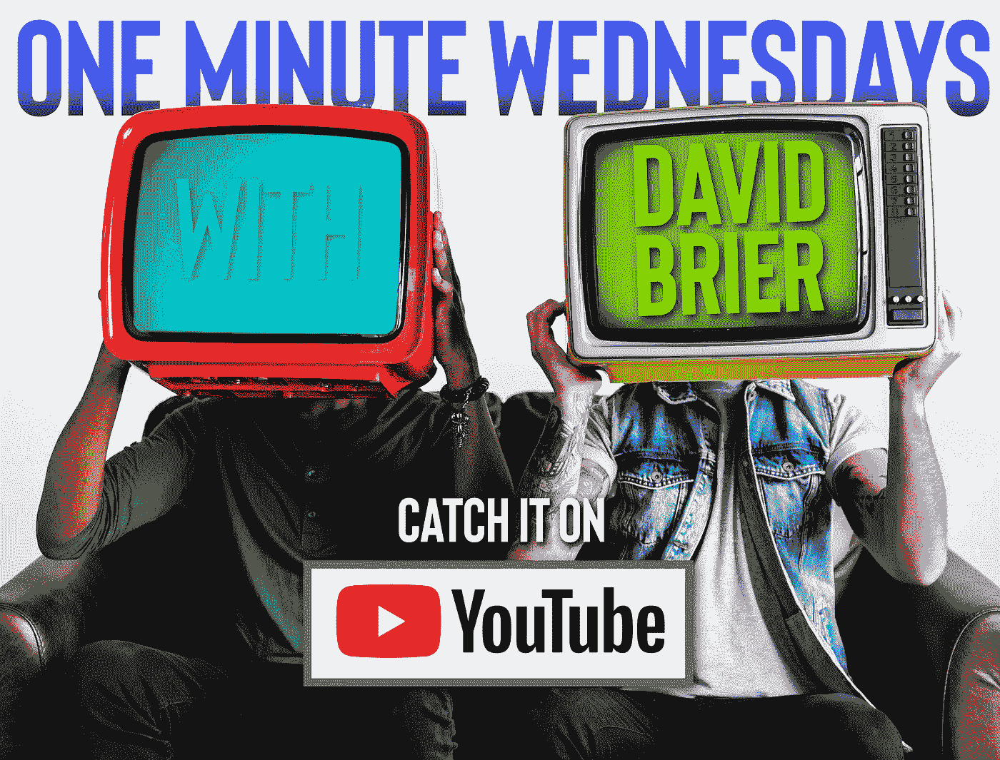
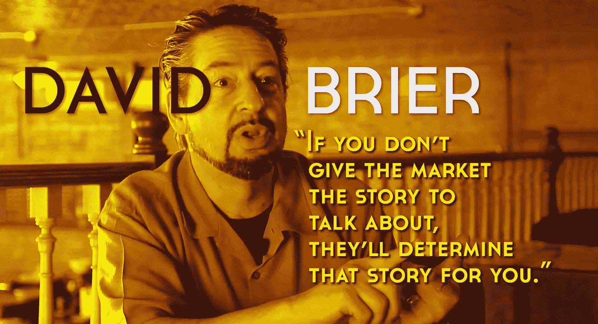

# 品牌 101:转向能力

> 原文：<https://medium.com/swlh/branding-101-ability-to-pivot-d9d0e2e497c2>

由 [***欧石南***](http://david@risingabovethenoise.com)

在世界上最好的品牌和创造者中，支点能力是一项关键的基本技能。

> ***“一个支点只是战略上的改变，而没有愿景上的改变。”*** 埃里克·里斯，*纽约时报*畅销书作者，*精益创业*

这位敏锐的作者继续说道，“每当企业家看到实现他们愿景的新方法——一种更成功的方法——他们就必须保持足够的敏捷来抓住它。”

# 旋转的能力:这是精神和身体上的

这就是为什么我在《周三一分钟》的第 40 集里关注这个每个品牌都需要的重要和基本的技能。

有多重要？重要的是，潜在的伟大品牌在继续做事情的时候保持平凡，因为“这是我们一直做的方式。”

这是停滞不前。

这就是失败。

那就是无法像现实世界中的变化那样快速转变。

想想那些伟大的篮球运动员、赛车手或企业家，你会发现他们有一个共同的特点:旋转的能力。

那就是足够专注、足够快速的能力，以及当因素改变和转移时重新评估新方法的能力。

“pivot”的同义词是*敏捷。随着形势的变化，你可以迅速重新计算一个替代方案。*

这种事发生在*人身上。*

碰巧遇到了*的情况。*

碰巧*产品发布。*

恰巧*新电影。*

发生在*品牌上。*

> 任何努力中最伟大的艺术家、作家、企业家和创造者在遇到变化时都不会被抛弃。由于变量已经改变，他们重新计算。

# 周三一分钟:终极每周支点工具

随着第 40 集的播出，[很多集](https://www.youtube.com/playlist?list=PLpkEFqzZFOZ_aeEt44vIDEGWCO4mUW9Tp)都在 60 秒左右的时间里发布了数量惊人的有价值的素材。

点击这里查看完整播放列表(以及任何你错过的剧集)。

## 从这篇文章中获得了价值？
然后鼓掌，分享，关注我，订阅我的 [YouTube 频道](https://www.youtube.com/user/headmusik)每周有新视频。需要一个品牌重塑或一个难忘的主题演讲人？在这里找到我。

## 这篇文章发表在 [The Startup](https://medium.com/swlh) 上，这是 Medium 最大的创业刊物，有+ 374，685 人关注。

## 订阅接收[我们的头条新闻](http://growthsupply.com/the-startup-newsletter/)。

