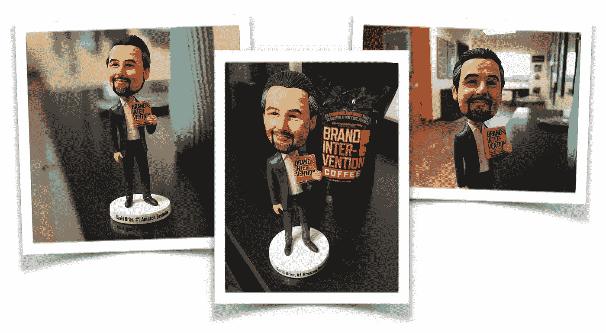

# 小品牌不知道一个简单的事实

> 原文：<https://medium.com/swlh/brands-that-stay-small-dont-know-one-simple-fact-99812d9d7c09>

所以首席执行官坐下来问，“为什么有这么多品牌保持小规模？”

在所有通常的回答被说出后，房间陷入沉默。

一个尴尬。怀孕了。沉默。

是的，有一个被许多品牌忽视的秘密品牌成分。

他们怎么都错过了呢？

因为他们都在寻找“银弹”

找错了地方。

# 关于小品牌的突发新闻

没有灵丹妙药。

但是在那里 ***是*** 一个胜过一切的强大工具。

对于不经意的观察者来说，它是看不见的。

就像许多人忽视的奥运冠军使用的重要成分一样看不见。

# 藏在显眼的地方

奥运会马拉松冠军的明显原因将被归于所有明显的因素:

*   肌肉力量，
*   耐力，
*   肌肉脂肪比，
*   跑步者有多灵活等等。

但是还有一件事，没有它，其他因素都不重要…

这就是我今天周三一分钟的内容:

# 一个常见的错误

低估了这一因素的力量:*分化。*

这就是为什么我们会注意到某些品牌。

为什么我们阅读某些作者的作品。

为什么我们庆祝某些艺术家和他们的作品。

以及为什么我们会停下来注意任何事情。

我们注意到不同的东西，而忽略了普通的、平常的和可预测的东西。

可能对你来说只是不同而已。

这并不能减轻一个事实，如果你想让你的品牌呼吸，你最好得到一些空气。

那空气呢？这叫*差异化。*

## 这篇文章发表在 [The Startup](https://medium.com/swlh) 上，这是 Medium 最大的创业刊物，拥有+400，714 名读者。

## 在此订阅接收[我们的头条新闻](http://growthsupply.com/the-startup-newsletter/)。

