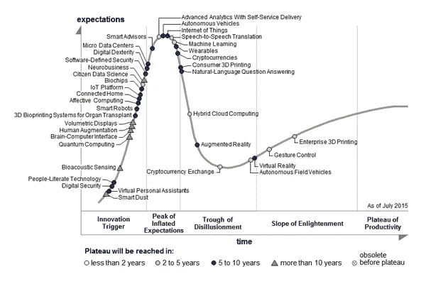

# 打入机器学习市场

> 原文：<https://medium.com/swlh/breaking-into-the-machine-learning-market-55d4ba1369cc>

[source](https://www.google.com/url?sa=i&rct=j&q=&esrc=s&source=images&cd=&cad=rja&uact=8&ved=2ahUKEwjevJ-V2fbdAhWqKcAKHVmoCucQjRx6BAgBEAU&url=https%3A%2F%2Fsingularityhub.com%2F2018%2F06%2F20%2Fwhy-we-need-to-fine-tune-our-definition-of-artificial-intelligence%2F&psig=AOvVaw3M5O1qkfLpC3UalEvuTcCQ&ust=1539082961206448)

**更新**:我开了一家科技[公司](http://www.legislate.tech)。你可以在这里找到更多

自 2015 年以来，机器学习一直处于 Gartner 炒作周期的顶端，在过去几年中，NIPS 等领先的机器学习会议的与会者人数呈爆炸式增长。今年的发布会在不到 12 分钟的时间内就销售一空！

Gartner Hype Curve 2015 ([source](https://www.google.com/url?sa=i&rct=j&q=&esrc=s&source=images&cd=&cad=rja&uact=8&ved=2ahUKEwiW9cmyxPbdAhUHAsAKHWjmD6MQjRx6BAgBEAU&url=https%3A%2F%2Fwww.gartner.com%2Fnewsroom%2Fid%2F3114217&psig=AOvVaw0SGFhhnXAnNDZ45SnMf1FY&ust=1539077438240142))

围绕机器学习的大肆宣传是由大型科技公司推动的，这些公司通过提供“足球运动员”薪水和收购人工智能初创公司来争夺机器学习人才。众所周知，谷歌在 2014 年以 4 亿英镑收购了 Deepmind，当时该公司只有 50 名员工，前一年亏损 670 万英镑。

> 随着科技投资热潮和人才短缺，现在应该是推出人工智能创业公司的理想时机？

从人工智能人才多年积累的数据中提取有价值见解的潜力，推动了对人工智能人才的追捧。如果你能够分析客户的购买数据，你就可以建立模型，预测他们接下来最有可能购买哪些商品。有了这些见解，你就可以更有效地利用内部资源，推荐有助于增加利润的相关产品。这就是为什么大型科技公司正在使用机器学习来改善客户的“用户体验”。

> W 通过机器学习？

机器学习模型在这些用例中工作得非常好，因为它们本质上是数据驱动的，并且它们的性能随着可用数据量的增加而提高。数据越多，建立精确模型的机会就越大(注意数据的质量几乎比数量更重要)。然而，正如您可能已经推断的那样，机器学习模型需要数据，因此:

> 一个 AI 创业公司没有数据是没有用的。

对于人工智能创业公司来说，他们需要数据。

**容易？**

不尽然——最有趣的数据掌握在传统玩家手中，他们不喜欢分享自己的数据，也在建立自己的内部数据科学团队。

> 好吧，那么人工智能初创公司应该从替代来源建立专有数据集？

在这个领域已经有一些成功的创业公司，但在大多数情况下，他们都是在搜集和清理数据，这对于其他人来说很难复制，但并非不可能。唯一可防御的“专有”数据集是通过你的产品和使用它们的客户获得的，这是大型科技公司的做法(如脸书、Instagram、亚马逊……)。然而，如果你不在社交媒体领域，这意味着你已经找到了一个垂直应用(如保险)，它可以受益于人工智能的加速，这将足以说服客户使用你的产品。通常，垂直行业中的机器学习实现相当轻，因为大部分价值来自于您的领域专业知识，这些专业知识影响了您如何将机器学习融入现有应用程序。

> 如果人工智能初创公司只能通过领域专业知识来防御，那么人工智能专家是否应该专注于提供镐和铲？

[source](https://www.google.com/url?sa=i&rct=j&q=&esrc=s&source=images&cd=&cad=rja&uact=8&ved=2ahUKEwjtkqXn2PbdAhUkLsAKHW7TAMQQjRx6BAgBEAU&url=https%3A%2F%2Fvimeo.com%2Fpicksandshovels&psig=AOvVaw0qZdEL5yDf3DozxWZzgRDq&ust=1539082865592184)

大部分机器学习模型和工具都是开源的，这使得提供镐和铲变得困难。另一种方法是将这些开源包包装起来，使它们非常用户友好，以便没有数据科学经验但具有领域专业知识的人可以使用它们。听起来很棒，只不过这个市场已经有很多玩家了，比如[数据机器人](https://www.datarobot.com)、[大台库](https://www.dataiku.com)和 Mind Foundry 的[奥达斯](http://mindfoundry.ai/audas)。

> 那么，有什么办法呢？

以下是我对人工智能初创公司如何在当今的机器学习市场上产生影响的想法:

*   开源:如果你卖的是镐和铲，它们应该完全或者部分开源。数据科学家对付费服务怀有极大的敌意，赢得他们的唯一方法是极其透明并提供免费服务。在这种情况下，商业模式的目标是[以产品为导向的增长](https://openviewpartners.com/product-led-growth/)并将企业合同出售给他们的经理。
*   **内部部署**:如果您试图向传统企业销售产品，无论是哪个行业，越来越多的企业都会出于数据隐私、安全和监管方面的考虑要求内部部署。这已经成为向大公司销售人工智能解决方案的一个条件。
*   **盲服务**:如果您还没有准备好提供现场服务，您可能希望提供不访问客户模型或数据的 AI，而是通过与元数据交互来提供见解。例如， [OPTaaS](https://mindfoundry.ai/optaas) 仅使用参数输入和相关分数，通过网络服务优化其客户的模型。
*   **时间序列**很难分析，因为即使是专家也会陷入许多陷阱，最常见的是过度拟合。自动化机器学习初创公司胆怯地提供 TS 工具，但很少完全解决问题，也不提供针对这些陷阱的保证或保护措施。如果你对此感兴趣，请关注 [Mind Foundry](http://mindfoundry.ai) 。
*   **量子机器学习**:量子计算可能会[(也可能不会)](https://spectrum.ieee.org/tech-talk/computing/hardware/dwave-launches-free-quantum-cloud-service)成为未来的事情，但与此同时，机器学习算法可以用来让量子计算更快到来。 [OPTaaS](https://optaas.mindfoundry.ai) 目前被一个 QC 研究小组用来调谐量子态学习电路的循环参数。

我很想听听你对人工智能初创公司未来的想法和预测，所以请随时评论或通过[邮件](http://Charles.brecque@mindfoundry.ai)直接联系我！

## 这篇文章发表在 [The Startup](https://medium.com/swlh) 上，这是 Medium 最大的创业刊物，拥有+ 376，225 名读者。

## 在这里订阅接收[我们的头条新闻](http://growthsupply.com/the-startup-newsletter/)。

