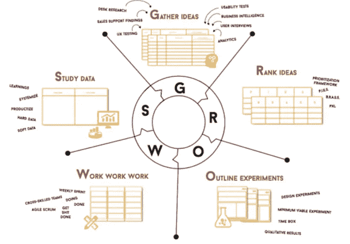

# 突发新闻:增长黑客不是魔术，它是一个循序渐进的过程。

> 原文：<https://medium.com/swlh/breaking-news-growth-hacking-is-not-magic-its-a-step-by-step-process-6018a46e09bc>

> 爱上过程，结果就来了。—埃里克·托马斯

真相:增长黑客并不神奇。因此，如果你认为仅仅调整你当前小猪粉红行动号召的颜色，就能给你的公司带来 30%的疯狂提升转化率，你最好三思而行。你是否遵循了一个严格的流程来研究、优先排序、设计、测试，然后准确地分析这个实验？如果没有，我很抱歉地告诉你，这个实验不太可能神奇地吸引新客户。

放心吧。无论是 Airbnb、优步、Booking 还是大多数高增长公司，他们都没有因为一些随机的想法而找到自己非凡的增长秘诀。**发现“银弹”是努力工作的结果，也是获得值得关注的东西的严格过程。**

> 除了销售信函宣传和夸张的推销之外，对任何企业都有效的“神奇增长技巧”是不存在的。

此外，如果我同意我们听说的所有时髦的“黑客”技术——抓取、黑帽营销、自动化、病毒循环等等。——可以超级强大的推动一个公司的成长，我感觉我们可能错过了最关键的一点。除了这个时髦词，成长黑客(GH)是一个循序渐进的过程。

If these guys are doing so many experiments, it must be for a reason, isn’t it?

闲话少说，在本文中，我将深入探讨我在阿姆斯特丹的成长部落学院(Growth Tribe Academy)接受的为期 3 个月的内部培训中所学到的成长黑客方法。请注意，我将特别关注许多成功的科技初创公司用来扩大业务规模的快速实验过程。希望知识能帮到你们中的一些人！

PS1:请注意，以下几段是我对成长型企业的理解，也是我作为一名企业家的亲身经历。

PS2:如果你期待一份新奇的待办事项清单，你在这里是找不到的。

# 第一步:在盲目应用 GH 方法之前，确保你的产品符合市场需求

Image Credits: [Tech Sahara](http://techsahara.com/product-market-fit-the-one-metric-that-decides-whether-your-startups-dies-or-perseveres/)

*“初创公司在向金字塔顶端发展和扩大业务之前，需要有产品/市场契合度的坚实基础。”*

> *-* [*肖恩·埃利斯*-](http://www.startup-marketing.com/the-startup-pyramid/)

## 1——如果你没有实现产品的市场适应性，一个快速增长的过程是没有用的(PMF)。

如果你的产品或服务没有 PMF，一个成长团队不会有多大帮助… **如果你没有发现你的用户喜欢你的产品并一直使用它，那么尝试扩展一个产品是没有意义的。句号。**在这个阶段，你应该专注于向正确的市场提供正确的产品。采用精益创业的心态和方法，弄清楚谁是你的(潜在)客户，了解他们的需求，并打造一款出色的产品，将他们转变为你的第一批大使。是的，这可能需要一些时间和大量的调整，但你可能会同意，试图扩展一个低劣的产品对你的时间管理来说更糟糕。

## **2——但是你怎么知道你已经到达了圣杯 PMF？**

*   ***肖恩·埃利斯*** [***【非常失望】法***](https://www.amazon.com/Hacking-Growth-Fastest-Growing-Companies-Breakout/dp/045149721X)
    1。你发送一份调查问卷**主要是发给你的活跃用户
    2。你问他们:“**如果你明天不再使用我们的产品，你会有什么感觉？他们可以在“非常失望”、“有些失望”、“不失望”或“我再也不用这个了”之间做出选择。将你的回答分段后，如果**至少有 40%的受访者“非常失望”**，你就达到了 PMF 的门槛。****

然而，对于一些产品来说，这可能更难应用，所以这就是为什么一些增长黑客更喜欢使用 Brian Balfour 方法来表明你有 PMF。

*   ***布莱恩·鲍尔弗*** [***三连胜进场***](http://www.coelevate.com/essays/product-market-fit)
    1。你的产品有某种形式的**强劲的有机顶线增长** →有 PMF 的产品通常会得到推荐，并受益于有机增长。
    2。你的产品有**好的留存** →你留住了你的用户，你的流失率(如果适用的话)很低。例如，Snapchat 曾经拥有 50%的日活跃用户。
    3。你的用户**正确地使用你的产品** →你必须对自己诚实，什么是对你的应用或产品的有意义的使用。如果你有一个创业公司的在线招聘板，并且每个创业公司每三个月发布一个职位，这可能是好的！但是，对于 Slack 这样的工具来说，它可能每天要发送二十次消息。

## 那么增长黑客在 PMF 之前是无用的吗？

好吧，如果一个成长团队在 PMF 之前尝试建立一个快节奏的过程没有意义，我们仍然可以识别问题/解决方案匹配阶段和 PMF 阶段之间的重叠(参见下面的幻灯片),在这两个阶段使用成长黑客(GH)是有意义的。在此期间，应通过查看数据和使用模式，使用生长激素来确定产品上市前适合产品的增长机会。在[本书牵引](https://www.amazon.com/Traction-Startup-Achieve-Explosive-Customer/dp/1591848369)中开发的靶心模板就可以在那个时刻使用。请注意，这也将有助于在稍后阶段优化已经具备产品/市场契合度的产品的增长。

Image Credits: [Startitup](http://startitup.co/guides/294/becoming-a-lean-startup-guru?view=whole)

## 4 —找到应用成长过程方法的最佳时机

Image Credits: [Brian Balfour](https://brianbalfour.com/essays/traction-vs-growth), former VP Growth at Hubspot

对布莱恩·鲍尔弗来说，初创公司会经历三个成长阶段。".
1。牵引力
2。过渡
3。增长

正如你所看到的，在正确的时间关注正确的战略可以帮助你的创业达到下一个水平。如果你想要更多的见解，看看这里的文章。显然，每个企业都将有一个稍微不同的时刻，这时尝试进入下一个阶段是有意义的。请注意，由于我们正处于我的创业公司[Les Sherpa](https://sherpas.com/)的“过渡阶段”,我在文章的其余部分可能会有一点点偏见。

*PS:*[*Les Sherpas*](https://sherpas.com/)*是一家由法国大型孵化器* [*站 F*](https://stationf.co/) *直接现场孵化超过 1000 家创业公司的 ed-tech 创业公司。此外，我们在三个月的时间里被* [*的 f 站纪录片系列*](https://foundation-thedoc.com/) *跟踪(从 1000 家创业公司中选出四家)。在我们第一个最低可行产品发布一年后，我们为高中和大学提供的在线辅导服务刚刚达到平台上给出的 10 000 小时。我们现在希望增长更快，达到下一学年的 30 000 小时！*

# 步骤 2:在你的组织中实施成长黑客过程的五个先决条件

*PS:我强烈推荐* [*这段来自成长部落*](https://www.youtube.com/watch?v=Zr7iJ9A90Oc) *的 youtube 视频是我用大卫·阿诺克斯的大部分知识过程写成的。*

Image Credits: [Growth Tribe](https://www.growthtribe.io/)

一旦你有了适合你的产品市场，在实施一个有效的成长过程和实现你的目标之前，这只是一个漫长道路的开始。事实上，这需要你自己去理解并在你的团队中正确地沟通什么是你业务的关键组成部分。为什么？你需要每个人都参与到这个成长过程中来，以使它成功。

为此，在进入快速试验 G.R.O.W.S 阶段之前，明确定义前五个先决条件→业务模型画布、价值主张画布、人物角色、盗版漏斗和 OMTM。

你不知道这些缩写是什么吗？让我们一起来分解它们！

## 1 —业务模型画布

首先，让我们看看维基百科的定义，“*商业模式画布是一个战略管理和精益创业模板，用于开发新的或记录现有的商业模式。它是一个可视化图表，包含描述公司或产品的价值主张、基础设施、客户和财务的元素。*

我想你明白了。它在一页上直观地描述了你的公司在做什么。拥有一个全球视野，认识新的人，让每个人都知道你在过去几年(几个月)都在做些什么，这很酷。).这是一个非常典型的商学院的东西，我想几乎每个人都知道，所以我不会用创建它的所有步骤来烦你。但是，如果你还没有这样做，拿起笔，开始填写下面的模型。

Image Credits: [Business Model Alchemist](http://businessmodelalchemist.com/tools)

## 2 —价值主张画布

整合到商业模型画布中，深入挖掘这个元素是很有趣的，因为这是你的产品的核心和价值所在。有了这张画布，**你可以描绘出谁是你的客户，你的价值主张是如何形成的，以使他们喜欢你的产品**。如果你是创始人之一，这可能对你来说是显而易见的，但你确定你团队的其他人都明白吗？无论如何，确保每个人都在同一条线上总是更好。

此外，正如 Phil Morle 在这里解释的那样，一旦你填写了文档，下一步就是“弄清楚这是否只是你对完美价值主张的一个梦想，或者它是否取决于你的客户的行为。”(第二个解决方案是您正在寻找的解决方案；))

Image Credits: [Strategyzer](https://strategyzer.com/)

## 3 —人物角色

人物角色是代表品牌受众的虚构个人资料。开发一个人物角色有助于你将观众带入生活，并更准确地锁定他们。

为什么要定义你的人物角色？目标是成功地设身处地为顾客着想，尝试在脑海中再现他们的思维和行为方式，并最终找到他们问题的解决方案。一旦完成，销售你的产品就会容易得多，因为你知道他们在找什么。
举例来说，如果你和艾丽西娅(Alicia，一家科技初创公司的人力资源初级员工)或菲利普(一家老牌公司的销售经理)交谈，你在社交网络上的策略将会不同。

如何建立你的人物角色？你应该遵守的一些规则。

1.  **把你自己限制在三个最重要的虚构人物上。**我知道你想用你的产品瞄准最大数量的人，但如果你用定制策略瞄准你的人物角色，效率会高得多。一旦你达到了你想要的门槛，你就可以逐渐扩大。
2.  **遵循精确提问的严格流程，更好地定义你的典型人物角色。除了经典的姓名、年龄、工作角色和一些人口统计数据，你还应该关注更全面的问题。他们性格的哪些方面是必不可少的？(可以用心理学大五模型或者 MBTI 模型)。他们在哪里闲逛？他们在网络上的行为是怎样的？他们的一天是什么样子的？他们的需求和目标是什么？他们如何试图解决他们的问题？他们用什么代替你的产品？等等。**
3.  **通过测试人物角色对信息设计和说服的反应，验证你对他们的假设。如果没有结论，试着完善你的角色类型，验证你的假设，直到你得到结论。**

Images Credits: [Xtensio](https://xtensio.com/user-persona/)

## 4 —海盗漏斗

海盗漏斗是一个有用的客户生命周期框架，由 Dave McClure 发明，你可以用它来规划和优化你的营销漏斗。主要思想是，对于每一个产品，用户都要经历一个相似的旅程(AAARRR)。如果你不熟悉它，让我给你自己介绍这六个步骤，然后为你自己的事业制定计划。

当你设计你的盗版漏斗时，要记住三件事:

1.  你应该**准确定义顾客**在其旅程中采取的行动。在它旁边，您应该**指出哪些指标显示了客户兴趣(软转化)或意向(硬转化)**。举个例子，知名度可以通过你网站的流量来定义，但是你应该关注的衡量指标是每月的独立访客。或者，如果你在保持部分，你可以通过邀请朋友的人数来定义它，并通过病毒系数来衡量它。
2.  **漏斗灵活**。漏斗可以根据你的业务类型有不同的顺序。我上面放的那个更“电子商务时尚”。但对于一个 SaaS 企业或任何基于订阅的模式，你更有可能拥有这种流量:认知→获取→激活→保留→推荐→收入。无论如何，深呼吸，做一个与你的生意相对应的漏斗。
3.  **不要忘记根据客户群划分漏斗**。需要注意的是，你的产品或服务可能有多个渠道。举个例子，像 Hotjar 这样的公司，无论是小型创业公司还是代理公司，每个步骤都有不同的定义。或者，如果我们采取 Airbnb (marketplace 模式)，主人(供应)和客人(需求)的客户旅程并不相同。

## OMTM

> 在任何给定的时间，有一个指标是你最应该关心的。- [精益分析](https://www.amazon.com/Lean-Analytics-Better-Startup-Faster/dp/1449335675)，克罗尔&约斯科维茨

**重要的一项指标(OMTM)是您在当前发展阶段最关注的一项指标。因为你知道该关注什么，所以设计和进行有意义的实验变得更容易。**

Image Credits: [Growth Tribe](https://www.growthtribe.io/)

长期的焦点是你的北极星度量(NSM)。这是你前进的方向，一路上所有的决定和 OMTM 都应该帮助你到达那个 NSM。想象一下，你正走在通往北极星的路上，但是一座山突然挡住了你的去路。你必须想出一个不同的短期目标来克服这座大山。例如，这可能是你一个月的 OMTM。

关于这个话题，要记住两件事:

1.  **你不会永远只关注 OMTM】。把它看作是一段预定时间的焦点。一旦你达到目标指标/日期，这种情况就会改变。然后，您决定它是否仍然是关注的最重要的指标。举个例子，在我的初创公司 Les Sherpas，我们目前的 OMTM 是免费试用后的转化率，我们的 NSM 是每年在平台上给出的小时数。但是，当我们专注于实现产品与市场的匹配时，我们的 OMTM 曾经是保留。**
2.  **您将一直跟踪和查看多个号码**。这些是您的关键绩效指标(KPI ),您将每天跟踪和报告这些指标以获得更多数据驱动的决策，即使最重要的是 OMTM。其他指标将被储存起来以备将来使用，例如何时向投资者讲述公司历史或制作信息图表。如今，使用 Geckoboard、Mixpanel、Kissmetrics 等工具设置和管理工具相对容易。无论如何，不要让你追踪这么多事情的能力分散你的注意力。所以，是的，为什么不捕捉一切，但最重要的是，专注于什么是重要的。

# 步骤 3:实施快速实验流程

A Growth Marketing Process: [Sean Ellis Rapid Experimentation Model](https://www.amazon.com/Hacking-Growth-Fastest-Growing-Companies-Breakout/dp/045149721X) VS [Growth Tribe Rapid Experimentation Model](https://www.youtube.com/watch?v=Zr7iJ9A90Oc)

现在我们已经完成了五个先决条件(步骤 2)，让我带您逐步了解如何在您的组织内实施 G.R.O.W.S 循环。不管你是应用肖恩·埃利斯方法还是增长部落方法(G.R.O.W.S ),增长营销过程将确保你能快速试验并为你的企业找到巨大的成功。

## 1 —收集想法(G/G . r . o . w . s)

在这个阶段，你的团队应该为可能改善你的 OMTM 的成长实验提出假设。

***如何想出有影响力的创意？***

*   **观察你的市场**。最佳实践、电子书、趋势、文章、竞争对手捎带等。
*   **做一些研究(定量和定性)**。如果定量数据(分析、热图……)告诉你什么、在哪里、多少，定性数据(可用性测试、调查、客户反馈……)通常会告诉你你的客户为什么会有这样或那样的行为。定性将使你能够窥视你试图向其推销的人的内心。

***如何在管道中插入新的创意？***

> *“成长主管必须建立一个项目管理系统，以便轻松协调创意的提交和管理，以及结果的跟踪和报告。进入你的渠道的想法越多，你找到刺激增长的赢家的机会就越大。”——肖恩·埃利斯，黑客成长*

首先，如果你不知道如何为你的团队建立一个项目管理系统(CRO 工具)，你可以使用[肖恩·埃利斯工具](https://growthhackers.com/software)、[有效实验](https://effectiveexperiments.com/)，甚至一些 [Airtable](http://airtable.com) 免费模板(我已经在这个工具上自由设计了自己的)。

一旦这样做了，把重点放在每个想法的格式部分，这应该是相同的，以方便他们排名。你可以按照这个流程:
- **想法名称**:简洁明了→ 50 字 max
- **想法描述**:想法的人、事、地点、时间、原因、方式。
- **假设**:让你的假设简单、明确、可测试。这是一个简单的预期因果命题。我很喜欢做假设的一句话是来自荷兰机构[在线对话的一句话:](https://onlinedialogue.nl/)如果我们“应用这种变化”，这些“指标变化”对于“这部分用户”，是因为这种“行为原因”。
- **要测量的指标**:输入要测量的硬数据和软数据，不要忘记输入该实验的最低成功标准

## 2 —对意见进行排序(R of G.R.O.W.S)

所以，现在，你应该有一个充满惊人想法的想法储备。

然而，在团队在“冲刺会议”(你回顾想法并选择你要启动的实验的那一天)考虑想法之前，提交想法的人应该总是在项目管理软件中给它打分。尽管这在开始时相当苛刻，但随着实践的进行，您会发现它变得越来越容易，因为您已经习惯了行业基准和以前的实验结果。

你被宠坏了，因为很多模型已经证明是非常有效的。在我的初创公司，我们通常使用 ICE 模型(肖恩·埃利斯方法)，但你也可以使用 Growth Tribe 的 BRASS and PIES 模型(参见这个 [Youtube 视频](https://www.youtube.com/watch?v=Zr7iJ9A90Oc))。你的电话！

请注意，非常有影响力的想法(高影响力得分)通常需要更多的工作，顺利实施至关重要。因此，在没有几周时间准备发布的情况下，进行一些更容易的“低挂水果”测试总是好的。此外，不要花太多时间过多考虑评分，因为如果增长主管看到提交者没有注意到的一些问题，他可以随时调整评分。这里的目标是让团队继续前进。

即使在经历了评分过程并缩小了你想尝试的实验列表后，在接下来的一周里，你仍然可能会有比你能测试的更多的想法。所以，这里的诀窍是:

1.  要求每个人只选择两到三个想法作为本周实验的候选人。
2.  **这些“最有希望”的想法将在成长冲刺会议**(通常每周或每两周一次)上提出并审查，会上将选择要运行的实验。
3.  **成长团队将根据其假设**对创意进行合作评分**，并选择 ICE 得分最高的实验进行运行**。举个例子，在我的创业中，我们经常采取两种方法，因为我们的资源仍然有限，但这可能会因周而异。

## 3—概述实验(G.R.O.W.S .的命令)

让我们假设你的成长会议已经结束，你有两个实验要在本周启动。你应该如何组织你的团队来设计这个实验？

> "**做得比完美更好**"雪莉·桑德伯格

*   ***搞得又快又脏。*** 请记住，在那个阶段，你应该把重点放在设计“又快又脏”的实验上，而不是完美的实验。这里的目标是了解实验是否能在短时间内成功(速度在这个生长过程中至关重要)。如果在实验刚刚结束后，它看起来是有希望的，你将能够加倍努力，并一直提高结果。如果没有，你不会花太多时间去考虑一个 d****的解决方案。
*   **让您的团队协作并快速执行**。随着你的成长壮大(成长团队中不止一个人，woot-woot)，你可以如下组织自己。一个过程驱动的增长领导者，一个一直快速构建、破坏和修复的开发者，一个可以接受“不那么漂亮”设计的 UX/UI 设计师，一个可以处理数据并从中得出结论的数据分析师。当然，随着你的成长，成长团队甚至可以欢迎更多的人(营销人员、其他开发人员)。

## 4 —工作、工作、工作(G.R.O.W.S 的 W)

> “有时你必须先跑，然后才能走”
> 
> 托尼·斯塔克，别名钢铁侠

Photo Credits: [Tucocinaytu](http://www.tucocinaytu.com) and [Marketing Insider Group](https://marketinginsidergroup.com/strategy/kanban-goals-scrum-agile-marketing/)

在这个阶段，你的实验设计就完成了。所以…让我们把事情做完。确保你做了 20%的工作，却产生了 80%的成果！你会有时间调整这个实验，如果它有希望的话，就加倍下注。正如谚语所说，“更聪明地工作，而不是更努力”。

我决定不太关注这一部分，因为我觉得每个公司都有稍微不同的方式来组织自己让事情运转起来。我只建议专注于将敏捷 Scrum 的原则应用于营销。如果你不熟悉，我强烈推荐 ConversionXL 的这篇文章。

## 5 —研究数据(G.R.O.W.S 的)

> “有时，事情可能不会如你所愿，但每晚都应该努力。”迈克尔·乔丹

让我们非常清楚。这一阶段是最困难的阶段之一，原因有二。

1.  得不到(甚至更糟)结果的几率相当高。不要沮丧，这很正常。在找到推动你成长的最佳时机之前，你可能会以启动许多失败的实验而告终。
2.  **实验的分析部分不容易**。这一部分应该由增长主管和数据科学家(如果有)一起仔细完成，因为您可能会有误报或错误的假设。

了解这一点后，在分析实验结果时，通常会经历三个阶段:

Template of an experiment. Image [credits](/@kevinygu/growth-hackers-should-think-like-scientists-518db238ef55)

1.  **你的实验已经结束**(通常在一到三周后，以避免季节性影响)，正在等待评估。
2.  **成长负责人按照他创建的评估每个实验的模板分析结果**。(参见左图)
3.  **成长负责人将实验置于以下情况之一** **用于下一步**:不确定、失败不值得调整、失败值得调整、成功&继续探索、成功&扩大规模。

嗯，一旦你完成了这个阶段，**你就可以回到 G.R.O.W.S 循环中，一次又一次地做实验。**不要忘了利用这个分析阶段为你的下一个实验总结一些可操作的知识。要做到这一点，你可以考虑对你的受众进行细分(按国家、按手机与台式机、按购物车中的产品数量等)。).即使出现假阳性的几率更高，拥有这些数据仍然很有趣，尤其是在启动新实验时。

示例:

*   在所有变体中，折叠下方的功能模块增加了新用户的 conv 率。
*   新主题的出现使桌面用户的点击率比主页提高了 1.4%。

**关于 A/B 测试的一些想法**

你将能够做到这一点，只有当你有足够的流量和转换。理想情况下，你应该总是有 1000 个你想通过 A/B 测试增加的转换。在达到这个“优化阶段”之前，你通常处于试图获得第一批客户的早期创业公司的羔羊中，所以这一切都是为了冒险。不要过于关注小的微调 A/B 测试，而要追求大的改变。如果你在那种情况下，做有重大影响的大测试(同时有很多变化),比如多元测试。

Image credits: [Online Dialogue](https://onlinedialogue.nl/wp-content/uploads/2017/09/NIOSummit_2017_TonWesseling_pdf.compressed.pdf)

**如何确定你的 A/B 测试分析正确？**

这个问题很难回答，因为我不是专家，但这里有一些我发现的经验。首先，你必须决定采用哪种统计方法来宣布你的变异是赢家。"在最优化领域有一场哲学统计学的辩论:贝叶斯和频繁主义者."( [ConversionXL](https://conversionxl.com/blog/bayesian-frequentist-ab-testing/) )

当你要选择一个时，你应该记住三件事:
-速度
-你愿意承担的风险
-沟通

*   [***频率主义者方法***](https://abtestguide.com/calc/)
    - **风险**:在研究领域和一个最优世界中，我会说这种方法更有可能给你带来近乎“完美”的统计结果。在这个实验中，只有当变异达到你所期望的统计显著性水平(通常是 95%或 99%)时，你才可以宣布这个变异(相对于控制组)是赢家。
    - **速度**:尽管如此，如果你使用这种方法，快速实验过程可能会慢一点，因为你需要在实现被宣布为赢家的实验之前达到这些高阈值。
    - **沟通**:统计显著性、p 值、功效、beta……哼，所有这些“好听”的词在向你团队的其他人解释你的实验时都没有帮助。
*   [**贝叶斯方法**](https://abtestguide.com/bayesian/)
    - **风险**:我们身处一个商业世界，要考虑很多可能影响你实验的变量(特别促销、假期、天气等)。).此外，如果您仍处于“过渡阶段”，并且没有真正使用完美的微调优化模型，那么达到 99%的显著性可能不是您的主要关注点。在这种情况下，您可以定义阈值，例如:80%概率→变异被宣布为赢家。75%及以下→复试。85% →实施并用于接下来的实验。这是关于你愿意承担的风险，以使你的业务蓬勃发展。当你的公司成长的时候，你可以让这些门槛进化。
    - **速度**:风险较高，但速度通常也较高。因为你不需要超高的阈值意义，你可以设计更快速和肮脏的解决方案，如果成功的话就加倍下注。
    - **沟通**:透明多了，比如“变异 B 优于控制组 A 的几率是 84，4%”。

# 附加步骤:行动手册

Image [credits](https://www.bruna.nl/engelse-boeken/the-playbook-9781849832496?channable=e11996.OTc4MTg0OTgzMjQ5Ng&gclid=Cj0KCQjwttbWBRDyARIsAN8zhbKpt2PnH-12CSJWCE-kY6Djqn7UIgiiUtu1gJLaQoNPjxSiTDj-XIUaAuMWEALw_wcB)

你应该总是**有一个知识库，在那里你存储着你过去做的所有实验**以及你的假设和结果。这将避免多次启动相同的失败实验，并将促进成长团队中新员工的入职，因为他们可以看到你正在做的过程。另外，让你的利益相关者跟随也是一件好事。

此外，许多非常成功的团队会定期在公司内部进行沟通，让员工加速成长过程。因此，考虑在 Slack 上创建一个频道，专门用来分享测试结果和讨论它们。

**你得到了快速实验流程？那我们开始工作吧！**

希望你喜欢这篇文章。感谢阅读！:)

# 想多读点？

你可以在 [Twitter](https://twitter.com/william_mievre) 或 [Linkedin](https://www.linkedin.com/in/william-mievre/) 上关注我，在那里接收我的建议。

PS:如果您发现任何语法、拼写或标点错误，请告诉我。我总是热衷于提高我的英语水平。干杯！

## 这篇文章发表在 [The Startup](https://medium.com/swlh) 上，这是 Medium 最大的创业刊物，有 322，555+人关注。

## 在这里订阅接收[我们的头条新闻](http://growthsupply.com/the-startup-newsletter/)。

