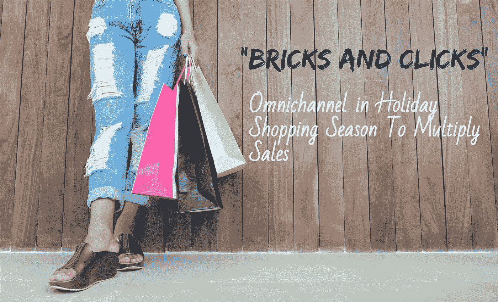
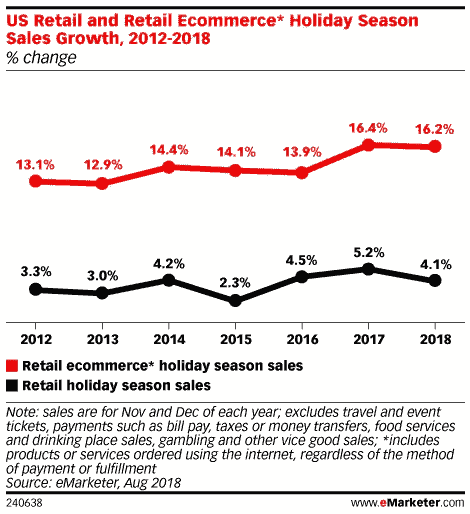

# “实体店”——假日购物季全渠道销售倍增

> 原文：<https://medium.com/swlh/bricks-and-clicks-omnichannel-in-holiday-shopping-season-to-multiply-sales-8a150337f749>

在你的手机上设置在线购物或前往当地市场的提醒，零售业最大的活动就在这里！

是的，假日购物季节正在敲门，将提供门克星交易！几乎每个零售商和购物者都对黑色星期五、网络星期一、感恩节以及最大的假日购物季感到兴奋。11 月底是包括谷歌、沃尔玛、亚马逊、百思买和微软在内的最大零售组织和品牌最大折扣和交易的时候。

这篇文章是写给每一个想在这个节日里提高销售额的零售商的。它涵盖了数据、趋势、消费者行为、战略、市场洞察，并专注于可以帮助您赢得零售之战的全渠道战略。

***我们开始吧！***

在继续之前，你需要考虑几个日期:

*   感谢，给予——11 月 22 日
*   黑色星期五——11 月 23 日(美国最大的销售活动之一)
*   网络星期一—11 月 26 日(全年最大的零售活动)
*   绿色星期一——12 月 10 日(第二大在线假日购物)
*   免费送货日—12 月 14 日(美国)

# 2018 年假日购物:你需要关注的预测和市场趋势

根据 eMarketer 的数据，2018 年美国假日电子商务销售额预计将增长 16.2%，达到 1233.9 亿美元。

*Image Courtesy:* [*eMarketer*](https://www.emarketer.com/content/holiday-shopping-2018-10)

根据客户情报咨询公司[沃克](https://assets.kpmg.com/content/dam/kpmg/xx/pdf/2018/03/global-retail-trends-2018.pdf)的“2020 年客户研究”:

> “到 2020 年，客户体验将取代价格和产品，成为关键的品牌差异化因素。”

根据 Adobe 的 2017 年在线购物报告，去年网络星期一以 65.9 亿美元创造了美国最大在线销售日的记录。

根据 Adobe 购物数据[显示，2017 年假日购物季(11 月 1 日至 27 日)带动了 500 亿美元的在线收入，比去年增长了 16.8%。](https://news.adobe.com/press-release/experience-cloud/adobe-data-shows-cyber-monday-largest-online-sales-day-history-659)

[Adobe 报告](https://news.adobe.com/press-release/experience-cloud/adobe-data-shows-cyber-monday-largest-online-sales-day-history-659)称，移动端创造了新的记录，占总访问量的 47.4%(39.9%为智能手机，7.6%为平板电脑)和总收入的 33.1%(24.1%为智能手机，9.0%为平板电脑)。

统计数据可能会继续令人惊讶，大市场的大幅增长将继续占据主导地位。但是，为了在假日季节创造更高的收入，人们需要有突破性的战略和战略规划来促进假日购物季的销售。

最近， [*阿里巴巴的光棍节创造了 308 亿美元的销售新纪录，这是通过专注于代表品牌无处不在的零售全渠道战略——线下和线上。*](https://www.spec-india.com/blog/the-30-8-billion-figure-of-alibabas-singles-day-festival-why-it-is-worth-discussing/)

这证明实体零售并没有真正衰落。事实上，它已经开始作为增加销售的一个关键策略而受到欢迎。

如果你能观察到，全新的零售商阶层正在崛起，他们不仅在网上购物，而且更经常光顾实体店。到 2019 年 1 月，90%的零售仍将在实体店完成。【[来源](https://assets.kpmg.com/content/dam/kpmg/xx/pdf/2018/03/global-retail-trends-2018.pdf)

> 在亚马逊制造出能给你理发的无人机之前，你有一个真正的理由去商店。
> ——玛丽·狄龙，ULTA 美容公司首席执行官

零售是关于顾客的。这不仅仅是交易、产品和支付，而是体验。零售商正在通过拥有实体店和网店来重塑他们的业务。

# "**实体和点击**"零售模式:物理和数字体验的无缝集成

零售商更加关注消费者的支出、习惯、满意度和行为，为他们提供卓越的购物体验。为了实现这一目标，领先的零售商正在利用他们的实体店来创建更强大的在线战略。

> 我正在阅读所有这些关于零售实体的报告，说这都是关于在线的…我认为实体是一个惊人的机会，可以利用我们的商店和商店员工作为一种工具，以其他零售商没有的方式真正参与社区活动。
> –吉姆·布雷特，西埃尔姆公司总裁

你还可以看到，以网上商店起家的零售商现在正通过开设线下商店来了解他们的客户。(**例子:Amazon Go** )。

将现实生活中的购物体验和数字接触点结合起来，这是一个非常明确的战略，总体上创造了卓越的客户体验，这是赢得客户芳心的关键。

# 为什么选择全渠道？

在电子商务时代，许多零售巨头正在通过开设实体店来提升他们的商业战略，从而创造令人难忘的购物体验。

此外，考虑以下场景:

*   顾客可以在线浏览并获得店内优惠券，以使用
    在线购买和店内提货
*   浏览店内产品后再购买
*   顾客忠诚度积分可以通过店内购买和在线通知来增加
*   采用正确的全渠道方法可以改善客户服务

# 零售商如何创造完美的全渠道战略？

以下是一些可以帮助零售商提高整体业绩和促进销售的因素。

## 研究和定位你的目标受众

你需要清楚地知道你的客户在哪里，这样你才能专注于特定的渠道。对他们使用的平台进行彻底的研究，了解他们通常更喜欢的购物渠道。

例如，您可能意识到您的客户不使用 Etsy，您可以避免在该渠道上浪费资金，并专注于其他盈利渠道

为你的企业找到受欢迎的渠道的最好方法是使用谷歌分析。你将会更好的了解那些最有效的渠道来吸引访问者到你的网站。你会对客户如何了解你的业务有一个适当的想法。

## 在每个接触点吸引您的客户

无论你是经营一家小型夫妻店还是大型企业的一部分，你都需要让每个接触点都是可购物的。

假设客户从您的网站/手机应用程序向他们的购物车添加了一件产品。现在他们登陆脸书/Instagram/Pinterest，你的产品必须出现在基于之前产品历史的“推荐产品”上。

要做到这一点，您可以使用电子商务管理平台将您的商店直接与社交媒体平台集成，使您的客户能够回到您的在线商店。有了渠道和在线商店之间的这种联系，你可以在社交媒体上开展促销活动，为你的网站增加流量。

## 弥合线上和线下商店之间的差距

如今，顾客期望从品牌线上和店内获得无缝体验。因此，零售商必须致力于在两家商店之间创造一个平稳的过渡。

例如:你可以选择“网上购物，店内挑选”你可以让顾客在网上下订单，然后从实体店提货。这将提供增强的客户体验，因为您的客户可以节省大量时间。

例如，梅西百货推出了一个新的电子商务平台，他们的网站不仅创造了 10 亿美元的在线销售额，还影响了价值 50 亿美元的店内销售额。梅西百货商店配送中心补充了“店内购买在线提货”计划，将顾客带入商店。

## 移动商务

如果你一直关注前一年的统计数据，从 2016 年到 2017 年，花在移动设备上的购物时间份额增加了 5%。根据 Adobe analytics，45%的网站访问来自智能手机。

零售商可以预计 2018 年将更加依赖移动设备。

零售商必须专注于移动优化网站、原生应用，并且必须提供最新销售的推送通知。利用 beacon 技术让购物者了解附近的交易，并提供个性化的移动体验，以提高客户满意度。

## 当天交货

2017 年假日季电子商务技术不可否认的赢家是当天送达供应商。除了亚马逊在提供卓越客户体验方面的先锋作用，Nordstrom 和沃尔玛等零售商也推出了当天送达服务来促进销售。为了应对竞争，零售商必须考虑提供当天送达服务。由于交付失败或用户体验不佳，品牌声誉很容易受损。虽然这个节日一年一次，但零售商必须使用现代技术来提供无缝的客户体验。

# 使用有助于增加销售额的现代技术:

*   集成聊天机器人，可确保即时和 24*7 客户服务
*   使用机器学习算法，通过分析习惯、消费和信息来更好地为客户服务
*   通过应用 RPA(机器人流程自动化)消除重复性任务
*   人工智能驱动的对话和语音辅助管理客户服务
*   借助商业智能，获得更快、更好的个性化体验
*   使用增强现实/虚拟现实来创造身临其境、有影响力的体验，从而吸引客户
*   通过安全、互联、快速的流程，确保所有渠道中品牌的真实性和完整性
*   安全的支付网关和强大的社交媒体存在突出了品牌影响力

# 提供全渠道体验的品牌

## **绿洲**

Oasis 是一家英国时装零售商，他们使用电子商务网站、移动应用程序和实体店来提供出色的用户体验。

如果顾客走进一家商店，他们会发现销售人员手持 iPads，提供即时、准确和最新的产品信息。最上面的樱桃，如果一些产品缺货，员工可以立即在网上订购，并直接送货上门。

此外，购物者可以下载 Oasis 应用程序，以补充他们的店内和网上购物体验。

## **梅西百货**

移动应用程序上的购物体验与店内购物体验之间的重叠越来越多；梅西百货让购物者能够使用梅西百货的应用程序对附近商店的商品进行分类，以便那些喜欢从应用程序购买商品并在店内提货的人使用。除此之外，该应用程序的用户可以保持登录长达 6 小时，无需重新输入他们的信息。

> “我们的目标是为顾客提供最佳体验，无论顾客选择何种方式与我们互动:手机、桌面、商店还是所有方式”
> –r . b . Harrison，梅西百货首席全渠道官

## 这才刚刚开始:

我们希望您已经清楚地了解了能够显著提高投资回报率的见解和趋势。

你对 2018 年的假日季有什么策略？你计划了包含上述所有因素的战略吗？你使用任何不同的策略来吸引你的顾客吗？你可以通过下面的评论告诉我们。

这篇文章最初发表在我们的博客上:[这里](https://www.spec-india.com/blog/bricks-and-clicks-omnichannel-in-holiday-shopping-season-to-multiply-sales/)

## 这篇文章发表在[《创业](https://medium.com/swlh)》上，这是 Medium 最大的创业刊物，有+391，714 人关注。

## 订阅接收[我们的头条新闻](http://growthsupply.com/the-startup-newsletter/)。

