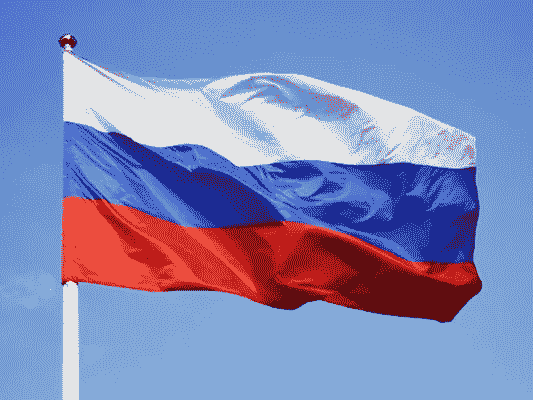
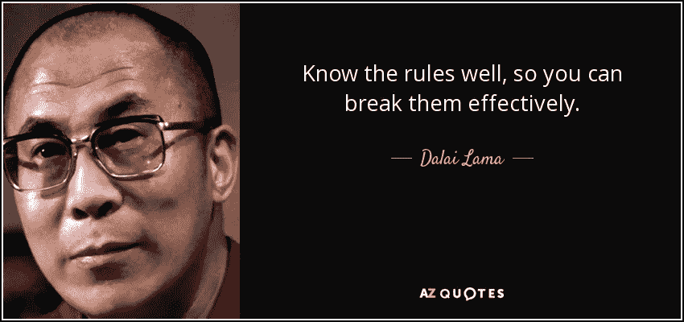

# ICO 最佳管辖区的简要分析

> 原文：<https://medium.com/swlh/brief-analysis-of-best-jurisdictions-for-an-ico-8c34bdb3c9f7>

ICO 是一个什么样的怪物？在世界上的任何地方，对这一过程是否有任何明确的规定？对此，什么是最好的管辖区？今天，我们将在一篇分析性的长篇阅读中回答这些问题。

为了得到这些答案，我们对透明项目进行了研究。我们从[https://www.smithandcrown.com](https://www.smithandcrown.com/)获得了主要信息，还研究了许多执行 ICO 的项目的白皮书以及外国立法。让我们仔细看看几个国家。

# *俄罗斯联邦*

2014 年，俄罗斯银行发布了一封信，指出数字货币是一种货币替代品。2017 年，他们改变了看法，提出将加密货币视为数字商品。然而，据报道，比特币网站仍然被封锁。这就是为什么大多数俄罗斯 ICO 项目都避免在俄罗斯注册法人实体。

尽管如此，俄罗斯总统指示俄罗斯银行和政府起草加密货币、采矿和 ICO 的法规。根据总统在 10 月 10 日金融领域数字技术会议后的指示，必须在 2018 年 7 月 1 日之前对立法进行相关修订。

**结论:我们认为，在相关法规通过之前，使用俄罗斯法人实体执行 ICO 是有风险的。**

# *瑞士*

在瑞士，有一部关于集体投资的法律——CISA。由于监管《国际劳工组织条例》的个别成文法仍然不存在，CISA 以类似的方式适用。根据 CISA，没有瑞士金融市场监管局(FINMA)的批准，你不能筹集投资。只有在 FINMA 授权后，你才能以加密货币的形式筹集集体投资。要做到这一点，你需要在瑞士注册你的公司，或者在另一个司法管辖区组织公司的永久机构。根据我们的消息来源，在瑞士建立一家公司将花费你高达 3 万美元。

至于税收，欧盟有以下方法:比特币是一种货币，而不是数字商品。这一事实自动将比特币收购为法定货币的交易排除在增值税返还基数之外。

**结论:我们认为瑞士是 ICO 的一个很好的司法管辖区选择，尽管这将带来巨大的成本并需要 FINMA 的授权。**

# *新加坡*

新加坡目前没有适用于监管加密货币和 ICO 的法律。他们现在正在起草。然而，国家的官方立场表明，他们不打算实施任何禁止性措施。

**结论:该管辖区对 ICO 有利，但首先需要计算所有的财务风险。**

# *美国*

在美国，适用于包括 ICO 在内的加密货币交易的法律早已生效。您需要获得特殊授权或许可证，才能透明合法地经营加密货币业务。除此之外，加密货币在美国被归类为财产，因此，所有与之相关的交易都要缴税。

**结论:如果你不是美国居民，如果你没有特别的执照，我们不建议你在这个国家进行 ICO。**

# *爱沙尼亚*

在爱沙尼亚，国家立法中既没有具体说明也没有提到《国际海事组织条例》。然而，也有成功实施 ICO 的公司透明注册的案例。

爱沙尼亚是欧盟成员国。根据加密货币交易的性质，欧盟成员国的国家立法对加密货币交易征税的程序进行监管。通常，为了征税，数字货币被视为无形资产或商品。

**结论:我们认为爱沙尼亚是 ICO 的理想管辖地。**

# 代币可以赋予持有者哪些权利？

我们将只列出其中的一些。

1.  投票权；
2.  访问权限；
3.  获得部分利润的权利；
4.  使用服务的权利；
5.  购买公司产品的权利。

在回顾了主要司法管辖区、税收和 ICO 组件之后，让我们继续考虑加密货币投资可能面临的风险。

# *ICO 带来的风险:*

1.违反相关司法管辖区的现行法律。

2.不缴税。

为了降低风险，您需要仔细研究所选择的司法管辖区，并确定您在该国面临的风险水平。

## 综上所述，在对 ICO 做出决定之前，你需要对所有现有的管辖权、法律、规定进行彻底的分析；了解这些司法管辖区的税收政策，并分析您自己的风险，以确定如何、在哪里以及何时开始 ICO 阶段。如果你看到了全貌，有了清晰的路线图，那么你的 ICO 就不会在名为“加密货币交易”的汪洋大海中撞上冰山。

您可能还喜欢:

[dig mus 案例:ICO 用什么营销工具？](/@MNazaruk/case-by-digmus-what-marketing-tool-to-use-for-ico-d74ac4458281)

Digmus 案例:脸书广告对 ICO 有效吗？

[在初创企业的 ICO 期间，电报有用吗？](/@MNazaruk/is-telegram-useful-during-an-ico-of-a-start-up-14e291a0c324)

## 这个故事发表在 [The Startup](https://medium.com/swlh) 上，这里有 263，100 多人聚集在一起阅读 Medium 关于创业的主要故事。

## 订阅接收[我们的头条新闻](http://growthsupply.com/the-startup-newsletter/)。

