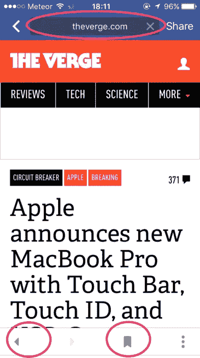
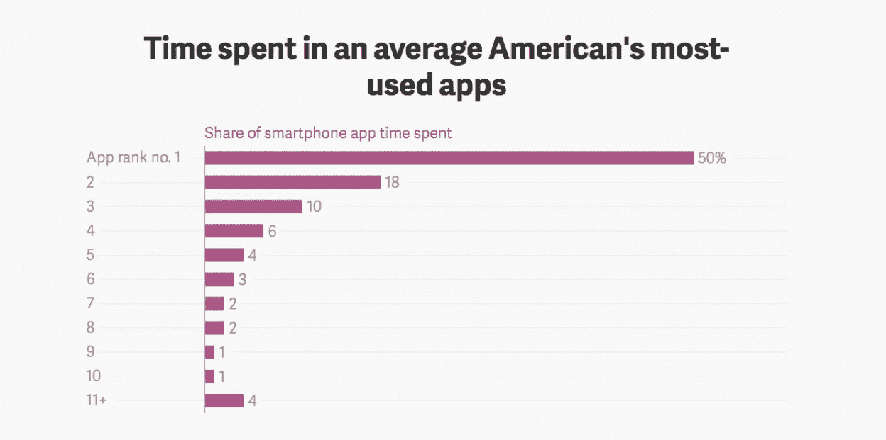
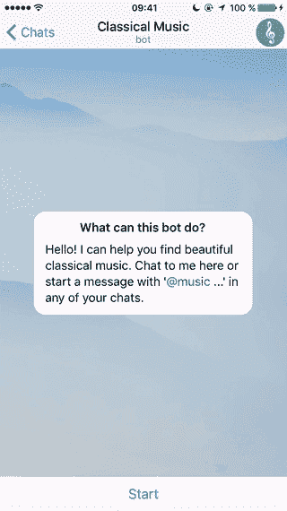

# 浏览器，而不是应用程序，才是移动的未来

> 原文：<https://medium.com/swlh/browsers-not-apps-are-the-future-of-mobile-c552752ff75>

# 在关于移动未来的讨论中，一个常见的说法是“最终，所有的移动应用都将是 iOS 或 Android 应用。”

但是这些评论者中的许多人在帮助本地移动应用生存方面有既得利益。

关于全原生移动应用世界的宣言忽略了一个事实，即浏览器和网络正在迅速成为未来的移动操作系统，而原生应用正在慢慢消亡。

# 原生应用对某些事情是好的，但不是所有事情

当然，本地应用在某些方面非常出色。它们非常适合频繁、大量使用的任务，如与朋友、家人和同事通信，这是我们每天都要做多次的事情。Snapchat、WhatsApp 和 Facebook Messenger 等应用程序需要直接访问摄像头、麦克风和操作系统。因此，这些类型的应用程序应该是原生的 iOS 和 Android 应用程序。

但是真的有必要在本地安装其他类型的应用吗？

> 今天的移动网络和浏览器可以轻松处理我们想要完成的几乎所有事情。

我们不要忘记，本地移动应用是短期连接问题的短期解决方案。在一个 4G、wifi 无处不在的世界里，这些问题几乎都消失了。

例如，由于移动网络功能和标准的进步，巴塔哥尼亚等公司已经告别了他们的原生移动应用程序。

# 我们花在移动网络浏览器上的时间比我们想象的要多

不仅仅是公司在远离本地应用——普通美国人现在每月下载零应用。这与我们花在手机上的时间没有太大关系——将这种应用疲劳与我们花在浏览器上的时间相比。

每个人都熟悉 Firefox、Chrome、Safari 和 Internet Explorer——带有地址栏、搜索功能和向前向后跳转按钮的“传统”浏览器。但它们并不是我们每天使用的唯一浏览器。

> 我们花越来越多的时间在消息应用和社交网络上，它们本身就是移动网络的包装器。

它们实际上是浏览器。这些浏览器给了我们渴望的社交环境和联系，而这是传统浏览器所没有的。

例如，脸书是我们的社交网络浏览器。它让我们很容易浏览和发现我们最喜欢的朋友、企业和内容。脸书不需要通过传统浏览器“拉”内容，而是根据我们和我们朋友网络的兴趣“推”内容给我们。我们也看到了一些美学上的转变，一些新功能帮助脸书的 iOS 应用接近真正的浏览器。

*The new Facebook in-app browser features back and forward buttons, which let you bookmark pages and input your own URL.*

与此同时，Slack 是我们的工作浏览器。它让我们很容易发现文档、对话和数据。在过去，我们必须从同事那里寻找我们需要的信息，我们会错过我们不知道我们需要的信息。今天，我们的同事通过 Slack 这样的浏览器向我们“推送”文档和更新，让我们的工作生活变得更加简单和一体化。

WhatsApp 是我们亲密朋友网络的浏览器。无论是一对一还是小组讨论，我们都从最亲密的关系中获得个性化的内容。这些连接将内容“推”给我们来浏览和消费。我们相信他们的推荐——这是浏览网页最个性化的方式。

以上消息应用当然是原生应用。但重要的是，它们包含了新的功能，取代了以前在其他本机应用程序或任何其他地方执行的活动。

由于外部软件开发商的数百万次智能集成，提供了令人眼花缭乱的功能，人们几乎不需要离开这些新型浏览器。

> 事实上，这些消息和社交浏览器非常成功，我们往往只需要三个就可以发现、检索和消费我们渴望的所有内容。难怪脸书、谷歌和许多其他公司在这一领域下了大赌注。如果你拥有了浏览器，你就拥有了观众。

*According to comScore, users spend 50% of their app time in the most used app, and almost 80% in their top three apps.*

# 机器人，新的浏览方式

这些新浏览器模式令人兴奋的地方在于，许多东西仍在不断变化。

自 20 世纪 90 年代以来，书签一直是操作系统的核心部分，由桌面图标和“开始”菜单代表。随着我们在桌面浏览器上花的时间越来越多，我们依赖于不同的新型书签。我们用书签标记了网页 URL 和域名。我们安装了工具栏来访问 MSN News、Google Search 和 Yahoo！邮件。我们手动管理自己的内容。

> 我们在手机上看到的是，机器人作为一种新型的动态书签出现在移动网络浏览器上。

机器人可以在我们需要时向我们推送内容，而不是每次都进入地址栏，键入 url，然后等待接收内容。他们可以了解我们最有可能接触的内容，并随着时间的推移为我们提供更多相关内容。他们为我们策划内容。

以 Telegram 中的“@music”功能为例。它使用一个内置键盘，可以让你查找和听音乐，甚至不需要发送任何信息。当你翻阅搜索结果页面时，它会即时更新自己的信息。

因此，代替 a)单独的本地移动应用(如 Spotify)或 b)必须在浏览器(如 Chrome)中搜索和发现音乐，机器人将能够为用户提供全面的体验，让他们在餐厅预订或购买商品，而无需离开他们的社交或消息应用。

随着时间的推移，机器人成为我们标记兴趣和行为的一种方式。为我们检索的内容是可操作的。我们可以预定东西和买东西。我们可以读东西。监管过程是由我们的亲密朋友网络和人工智能推动的。

# 这对未来的创业公司意味着什么

网络现在是，并将永远是世界上最受欢迎的移动操作系统，而不是 iOS 或 Android。重要的是，下一代软件公司不会只专注于构建现有网络应用的原生 iOS 或 Android 版本。

只要确保这些网络应用程序能够在新一波的移动浏览器——信使中很好地渲染和运行就行了。不要仅仅为了一个想象中的发行机会而为 iOS 或 Android 构建。分发存在于今天人们花费大部分时间的地方——社交和消息应用程序，为机器人化的世界提供的新的移动浏览器。

由[对讲机](https://www.intercom.com/?utm_source=medium&utm_medium=distribution&utm_campaign=201611-browsers)的高级产品经理[休·杜尔金](https://twitter.com/hughdurkin)撰写。插图由[凯尔西执笔](http://bit.ly/2fsIaq7)。这篇文章最初出现在 [Inside Intercom](https://blog.intercom.com/?utm_source=medium&utm_medium=distribution&utm_campaign=201611-browsers) 博客上，我们定期在这里分享我们对创业公司、公司文化、产品战略和设计的想法。

休在内部通话播客上分享了更多关于这个特定话题的想法，你可以在下面收听。

[Intercom](https://www.intercom.com/?utm_source=medium&utm_medium=distribution&utm_campaign=201611-browsers) 为企业开发消息应用，帮助他们理解客户并与客户交谈。