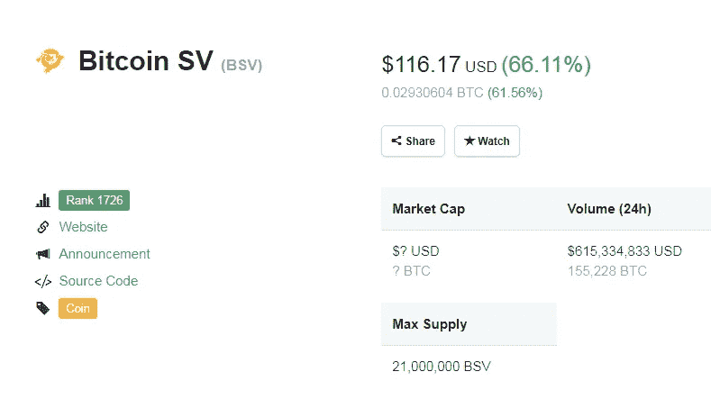
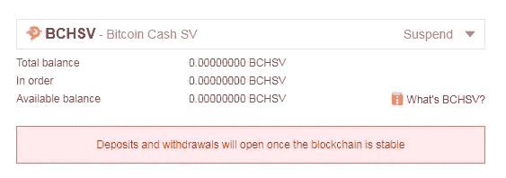
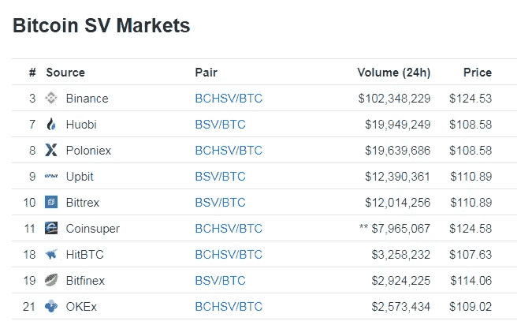

# BSV 如何将币安客户置于风险之中

> 原文：<https://medium.com/swlh/bsv-on-binance-customers-at-risk-f11953dd35ba>

## 由[苏朱](https://twitter.com/zhusu)和[哈苏](https://twitter.com/hasufl)

比特币 SV 今天上涨了 66%，成为交易量第六大的加密资产。对于一枚还未广泛上市的硬币来说，令人印象深刻？经过进一步调查，真正的原因可能是最大的比特币交易所不负责任的商业决策。

# 存款被禁用

在过去的几天里，BSV 占币安总成交量的 19%，仅次于 BTC/USDT 的 28%。那么，你怎样才能加入这种乐趣呢？你不能。与 Poloniex 和 Bitfinex 不同，**币安已经禁止存款和取款，**称担心 BSV 区块链不够“稳定”。

唯一在币安拥有 BSV 的人是那些在叉子之前在币安拥有 BCH 的人。这就造成了这样一种局面:一小部分人有 BSV 可以卖，而很多人可以买。币安阻止大部分现有供应进入市场，造成暂时和人为的短缺。

# PnD 风险

我的理论是，某个实体在币安 fork 前持有大量 BCH，现在控制着大部分供应。这使得他们能够**进行专业的抽水和倾倒，**他们首先通过以越来越高的价格向自己来回出售 BSV 来提高交易价格。受社交媒体报道的进一步推动，**散户投资者 FOMO 投入了**。在泵的高度，原来的持有人分发硬币零售和清算他们的立场。

通常，这种 PnD(或市场拐点)事件有突然供应冲击的风险。一个很好的例子是 1869 年的“黑色星期五”，两名投机者试图垄断黄金市场，将价格从每盎司 133 美元提高到 160 美元。但当另一个黄金主要持有者美国财政部向市场出售其供应时，他们的计划受到了阻挠，这使价格回落至 138 美元，并使罪犯负债累累。

然而，在币安，新的供应被阻止进入市场。谁控制了有限的 BSV，谁就可以毫无风险地进行交易。当币安最终允许存款时，价格肯定会回落，让散户买单。

# 对更广泛市场的影响

币安什么时候会认为 BSV 链条“足够稳定”？我不知道，但你可以进一步推测，这种情况为 BSV 内部人士创造了一种**激励，让他们保持连锁“不稳定”**(例如通过对自己进行另一次连锁重组“攻击”)，直到所有币安内部人士都成功地将他们的袋子甩给币安客户。

币安(人为)活动的增加也对整个市场产生了影响。作为最大的交易所，它扭曲了所有其他交易所的价格，因为人们根据感知的需求调整他们的价格预期(“为什么我要以低于币安的价格出售？”).这使得 BSV 持有者可以将他们的硬币存放在 Poloniex 或 Bitfinex，进一步在市场上出售。结果，BSV 的交易价格比币安高出 14%，或者比“真实”交易价格低 12%，这取决于你怎么看。

## **结论**

合乎逻辑的结论是，币安**不负责任地允许交易一种无法存入或取出的资产，而且这种资产只有极少量的供应。我建议币安**要么启用存款，要么立即停止交易**。在他们天真地试图保护零售客户免受 BSV“不稳定”的影响时，币安制造了一种局面，这种局面造成了比它所包含的更大的风险和滥用的可能性。**

## 这篇文章发表在 [The Startup](https://medium.com/swlh) 上，这是 Medium 最大的创业刊物，拥有+393，714 名读者。

## 在此订阅接收[我们的头条新闻](http://growthsupply.com/the-startup-newsletter/)。

