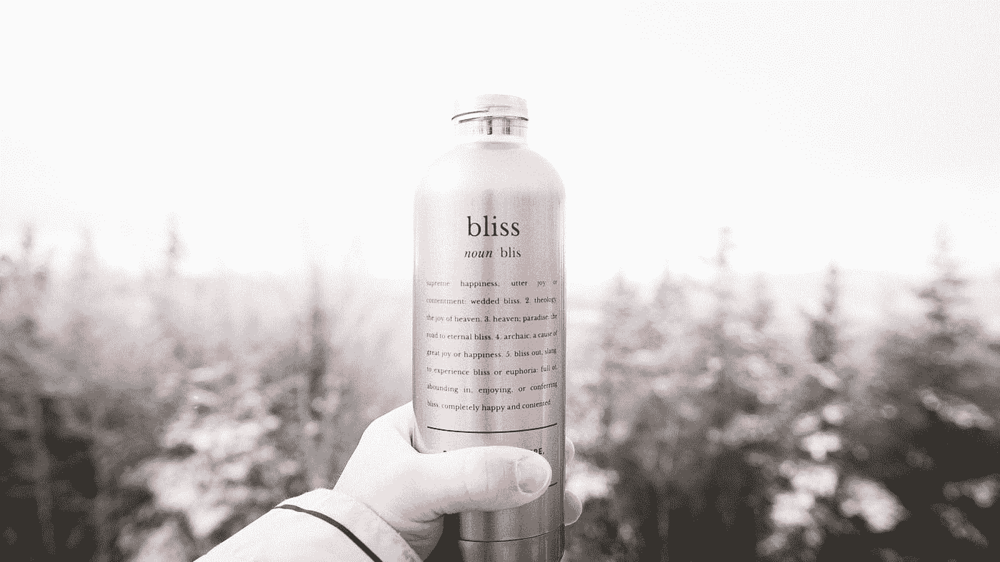

# 初露头角的企业家:你能卖瓶装水吗？

> 原文：<https://medium.com/swlh/budding-entrepreneurs-can-you-sell-bottled-water-5c87914c50f1>

Photo by [William Bayreuther](https://unsplash.com/@wbayreuther?utm_source=medium&utm_medium=referral) on [Unsplash](https://unsplash.com?utm_source=medium&utm_medium=referral)

## 你需要学习的重要一课

几分钟前，我刚刚从与一个通过 FaceBook 群认识的人聊天中赚了 10 美元。我明白，10 美元听起来不多。但这对我来说是件新鲜事。人们愿意为我知道的东西付钱？

瓶装水练习是我从[返工播客](https://itunes.apple.com/us/podcast/rework/id1264193508?ls=1)中听到的一项活动(是的，是来自 37signals 的家伙)。这是给学习企业家精神的学生的一个练习。

瓶装水是你能销售的最不性感的产品。但是它会教你很多关于商业的东西。学生们被问及他们想要订购多少，然后他们继续策划如何清算他们的资产。他们会考虑如何营销他们的产品，如何给它打上品牌，如何在街上销售。

练习结束后看到班级人数减半并不奇怪。50%的人会订购额外的库存，另一个人会因为最初的订单没有改变而生气。

成功者和失败者的区别——定位。那些发了大财的人，在人们渴望瓶装水的地方销售。一个小组在跑步活动中出售水瓶。

在电影[华尔街之狼](https://en.wikipedia.org/wiki/The_Wolf_of_Wall_Street_(2013_film))中，乔丹·贝尔福特问观众终极销售挑战，“卖给我这支笔。”从那时起，我就一直在思考这个挑战。现在我有了答案。

不要把笔卖给不需要的人。当你的客户一开始就不想要这支笔的时候，不要费心去谈论这支笔的所有卓越品质。把笔卖给需要写字，又没有笔的人。

常识，我知道。但经常被忽视。

我们卖给不需要我们产品的人。我们卖瓶装水给那些有酒杯的人。我们把房地产卖给那些买不起的人。我们把社交媒体服务卖给那些不懂得欣赏它的人。

你知道单词*说服*里面有单词*欺骗*吗？被骗的感觉好吗？你想欺骗其他人吗？

这就是我们卖东西时所做的。

我们尽力说服我们的客户改变他们的世界观。我们期望基督徒一夜之间变成穆斯林。

向基督徒推销基督教，向穆斯林推销伊斯兰教。这能有多难？

把东西卖给已经被卖了的人。

几分钟前，我帮助某人建立了一个 Shopify 支付网关。这是大多数人失败的地方。我在一个 FaceBook 群中发布了我已经破解了代码。这一步我失败了无数次，花了几个月才想通。

如果你是美国公民，这最多需要一周时间，但是对于像我这样的非美国居民，这需要更多的理解和阅读。所以我向他概述了我们的困境，最后，他给了我一些钱作为我对他的帮助。

我不需要卖任何东西。他饿了，我在那里满足他的胃口。

我可以扩大这一交易的规模，开发一个迷你课程来教授像我这样的人，他们很难建立这样的课程。我不需要卖给那些想通了的人，我会卖给那些在寻找答案中迷失的人。

你今天卖什么？你给自己定位在哪里？你发现自己说服你的客户了吗？

记住瓶装水和笔，让它给你带来完成销售的新视角。

回头见，我的朋友。

## 这篇文章发表在《创业公司》杂志上，这是 Medium 最大的创业刊物，有 340，876 人关注。

## 订阅接收[我们的头条](http://growthsupply.com/the-startup-newsletter/)。

