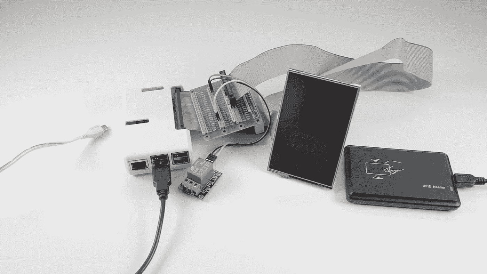

# 为您的智能家居打造树莓派智能门锁安防系统！—打开网络

> 原文：<https://medium.com/swlh/build-a-raspberry-pi-smart-door-lock-security-system-for-your-smart-home-switched-on-network-515ad8755241>

这个项目[获得了电动汽车连接竞赛](https://www.electromaker.io/contest/connectivity)的二等奖！

你可能已经熟悉了 ***双*** 因素认证，用于登录你的网上银行或你的脸书或电子邮件账户等安全系统。这种门禁系统更进一步，使用三因素认证。要打开门，你需要:

1.  一个 RFID 密钥卡
2.  一个 6 位数的密码
3.  随机生成的一次性接入码，并以文本形式发送到您的手机。

(**注意:**这是“三因素”认证，只是广义上的，因为其中两项是“您拥有的东西”。然而，由于该系统是完全开源的，这三个步骤可以根据您的意愿进行修改，例如，可以包括指纹或视网膜扫描仪。)

# 要为自己构建这个项目，您需要…

*   覆盆子馅饼。我用的是一个内置 WiFi 的[树莓 Pi 3](http://amzn.to/2sdq9lK) 和一个有助于保护和安装在墙上的盒子
*   一个 [USB RFID 阅读器](http://amzn.to/2sikupH)。这一个简单地通过 USB 插入，就像一个键盘输入来自 RFID 智能钥匙和卡片的代码
*   树莓派的[触摸屏 LCD](http://amzn.to/2uIWWfl)。
*   一个 [GPIO 扩展板](http://amzn.to/2tn1uYG)
*   连接扩展板的带状电缆
*   用于连接触摸屏的阴对阳带状电缆
*   一个 5V 单通道[继电器开关](http://amzn.to/2udy92H)
*   一个[电子门锁](http://amzn.to/2udLpEG)
*   一个[电脑电源](http://amzn.to/2tMe0ly)和电源线(给树莓派和电子门锁供电)
*   一些[杜邦电缆](http://amzn.to/2tM6Rll)用于连接继电器开关

您还需要一些工具，所以在开始之前，请确保您已经准备好了以下所有工具:

*   一个[万用表](http://amzn.to/2AtjMeD)，用于检查电压
*   各种尺寸的[螺丝刀](http://amzn.to/2zGLlUF)
*   一些[剥线钳和钢丝钳](http://amzn.to/2hfLaVn)
*   一个[烙铁](http://amzn.to/2AslE7H)
*   一些 [choc 块](http://amzn.to/2jaN91e)，用于将电线连接在一起
*   一支[胶枪](http://amzn.to/2tgUekp)
*   一把[无绳电钻/螺丝刀](http://amzn.to/2AlnVR7)
*   一个[拼图](http://amzn.to/2AtqCRq)

# 步骤 1:为 Raspberry PI 安装和配置 LCD 触摸屏

我们需要做的第一件事是让我们的液晶触摸屏工作。根据您购买的版本型号，它可能会附带要安装的驱动程序，也可能会附带自己的操作系统映像，供您写入 Raspberry Pi 的 SD 卡。我的就是这种情况，所以我需要使用 Win32 Disk Imager 将图像写入我的 SD 卡。确保您选择了正确的写入设备，这样您就不会意外擦除任何外部硬盘驱动器！

完成后，将 microSD 卡插回 Raspberry Pi，并像这样将 LCD 安装到 GPIO 端口，从 SD 卡插槽旁边的顶端开始，远离 USB 和以太网端口。接下来，拿着 microUSB 电源线并将其插入以启动 Rapsberry Pi，以确认屏幕及其触摸屏元件工作正常。

正如你所料，显示器的方向是横向的，但对于我们的虚拟键盘，我们希望显示器是纵向的，所以我们需要更改一些配置文件来实现这一点。通过 WiFi 或以太网电缆将您的 Raspberry Pi 连接到网络后，打开启动目录中的 config.txt 文件:

```
$ sudo nano /boot/config.txt
```

该文件决定了显示器的方向。我们正在寻找包含“dtoverlay=waveshare35a”的底部行，我们将在它后面添加一个分号，后跟“rotate=180”。保存并退出。

接下来，我们需要旋转触摸屏以匹配显示屏，因此我们需要打开“99 校准”配置文件:

```
$ sudo nano /etc/X11/xorg.conf.d/99-calibration.conf
```

在这个配置文件中，我们首先需要将 SwapAxis 选项从 1 更改为零，然后输入以下校准选项的基本值。完成后，保存并退出。然后，您可以重新启动您的 Pi，一旦它启动备份，您的显示器应该旋转到纵向。

# 步骤 2:在 Raspberry Pi 上安装 MySQL 数据库和 Apache Web 服务器

当我们在 shell 中时，现在是安装数据库的最佳时机，它将保存我们的门禁系统的访问控制列表，并记录所有成功和不成功的访问尝试的日志。我们将安装一个完整的 LAMP 堆栈，这样我们就可以使用 phpMyAdmin 访问数据库，这也意味着您可以使用 PHP 创建自己的 web 界面，以便在将来轻松地向系统添加和删除用户。

首先，我们将使用以下命令安装 Apache web 服务器:

```
$ sudo apt-get update $ sudo apt-get install apache2
```

一旦设置好了，我们将安装 PHP，然后是 MySQL。

```
$ sudo apt-get install php libapache2-mod-php php-mcrypt php-mysql $ sudo apt-get install mysql-server
```

作为 MySQL 服务器安装过程的一部分，它会要求您为“ **root** ”用户输入一个安全的密码，所以请输入一个并确保您不会忘记。

最后，一旦 MySQL 安装完毕，我们将重启 Apache，然后安装 phpMyAdmin。

```
$ sudo service apache2 restart $ sudo apt-get install phpmyadmin php-mbstring php-gettext
```

作为安装过程的一部分，它会询问我们想要配置哪个 web 服务器来使用它，所以确保选择了 Apache 并选择 OK。我们将允许 phpMyAdmin 自动安装和配置自己的数据库，然后输入我们在安装 MySQL 时选择的 root 密码，以允许 phpMyAdmin 创建自己的数据库和用户。接下来，我们将为该用户创建一个安全密码。

安装完成后，你可以在你的网络浏览器中输入你的 Pi 的 IP 地址，然后输入“ **/phpmyadmin** ，然后用你在安装 MySQL 时创建的 **root** 账户登录。

# 步骤 3:安装 Python 脚本并设置数据库表

现在是时候安装 Python 脚本了，它就像胶水一样把所有东西粘在一起。它接收来自智能钥匙和触摸屏的用户输入，它与数据库对话以查看谁被允许访问，并使用 [Twilio](https://www.twilio.com/) 向用户发送短信。

Python 脚本和空白数据库表可以从 GitHub 下载，网址:[https://github.com/paulfp/Three-Factor-Security-Door](https://github.com/paulfp/Three-Factor-Security-Door)

一旦您通过 phpMyAdmin 导入了数据库文件，您将看到数据库包含 3 个表。第一个名为 ***access_list*** ，这个表包含了每个可以进入被我们锁定的门保护的区域的人的详细信息。在这里，您可以看到我添加了几个用户，包括他们的姓名、他们的遥控器的 RFID 代码、他们的 PIN 和他们的手机号码，以便向其发送 SMS 双因素授权代码。我们还包括一个图像文件，以便欢迎屏幕可以显示头像。确保这是一个 GIF 文件，并将其存储在与 Python 脚本相同的目录中。

其次，我们有一个 ***access_log*** 表，它记录了所有访问系统的尝试——成功的和不成功的。这记录了提供给扫描仪的任何 RFID 代码，它们当时是否被授权，输入了什么 PIN，一次性代码被发送到哪个移动号码，以及它是否被正确输入等等。这些日志记录信息在现实世界中非常有用，既可用于诊断合法用户访问的问题，也可用于收集任何人试图获得未授权访问的证据。

最后一个表包含我们的 Twilio 帐户详细信息，我们用它来发送文本消息，在门暂时解锁允许授权方访问之前，启动验证过程的最后一部分。

将 Python 脚本下载到 Raspberry Pi 用户的/ **home** 目录，确保安装了脚本所需的所有依赖项。

# 步骤 4:让 Python 脚本在您的 Raspberry Pi 启动时自动加载

每当 Raspberry Pi 启动时，我们都需要让脚本自动加载。为此，我们需要在**自动启动**配置文件中添加一行。在您的终端中键入以下内容:

```
sudo nano ~/.config/lxsession/LXDE-pi/autostart
```

然后添加这样一行:

```
@sudo python lock.py
```

保存并退出。

# 步骤 5:连接 GPIO 扩展板和继电器开关

随着我们的 Pi 上的一切都已设置好，现在是时候断开屏幕并将 Pi 放入其保护壳中了。为了保持对 GPIO 端口的访问，我们使用了一根短的 26 针阴对阳带状电缆，我们还需要添加一个 GPIO 扩展板。这是因为触摸屏 LCD 用完了一些我们需要在继电器中使用的引脚，即 5V 引脚。如果您愿意，您也可以从电源装置的另一个 5V 插头为继电器供电。为了将屏幕连接到电路板上，我们需要另一根长带状电缆，并且您需要小心地将几个未使用的引脚弯曲到一边，以使其适合。然后，连接触摸屏并再次给 Pi 加电，以确保一切正常。

下一步是将我们的继电器连接到 GPIO 端口。这是一个 5V 继电器，因此正极引脚需要用杜邦电缆连接到我们 GPIO 扩展板上的 5V 引脚，负极引脚当然可以接地。信号引脚需要连接到任何编号的 GPIO 引脚，并确保您选择的是一个没有被触摸屏用于任何事情的危险的引脚；如你所见，我在这里选择了 13 号引脚，这是一个很好的选择。

# 步骤 6:连接 RFID 阅读器并测试

现在是时候连接一切了，包括 RFID 阅读器，看看它是否工作！拿起你的 RFID 标签，拿在阅读器前。它认出了我，并显示了我的名字和照片。然后我输入我的密码，1 2 3 4 5 6，然后它会生成一个随机的一次性密码，以短信的形式发送到我的手机上。

我一输入这个代码，你就会听到“*的咔嚓声！继电器开关的*亮起，几秒钟后再次“咔嗒”一声关闭。稍后，当我们把它安装到门口时，继电器开关将连接到电子门锁上，从而打开门锁。

# 第七步:准备双电压(5V / 12V)电源，同时给树莓派和电子门锁供电

接下来，我们需要准备好电源，为树莓 Pi(需要 5V)和门锁(需要 12V，使用继电器开关触发)供电。我们希望整个系统只使用一根电源线供电，所以我们需要一个可以同时提供 5V 和 12V 的电源，所以我们使用的是台式计算机电源。

在这一点上，指出我们将要处理带电电压似乎是谨慎的。请注意，是低压，而不是电源电流——但显然，电源本身确实插入了电源。因此，只有当你对自己正在做的事情有信心和把握的时候，你才需要自担风险。如果你有任何疑问，不要继续，而是咨询有经验的，合格的和有能力的专业人士。我不能为你的行为承担任何责任！明白了吗？对，我们是……

# 步骤 7b:如何在没有连接到计算机主板时打开 ATX 电源

正如您所知，当您插入电脑时，电脑不会立即打开，即使电源上的小开关本身处于“打开”位置，您也必须先按下电脑机箱前面的“打开”按钮。嗯，在这种情况下，我们希望我们的电源只使用它自己的开关来打开，所以我们需要做一些电子方面的工作。从 PSU 盒子里出来的无数电缆中，你只会找到一根绿色的；这是信号电缆，需要永久短接至黑色接地电缆。拿起绿色电缆和任何黑色电缆，然后用剪刀剪断它们，然后从每一端剥去一小段，露出里面的裸线。把它们拧在一起，这样它们就不会磨损，然后拿一块巧克力从末端切下一块。将绿色和黑色电缆连接在一起，然后插上电源并打开 PSU 来测试它是否工作。耶，成功了！

现在，我们需要拿一根通常为硬盘提供 5V 和 12V 电压的 SATA 电源线，用万用表测试触点，检查哪根是哪根。将万用表的黑色触点放在黑色接地线上，然后测试黄色和红色触点，检查哪一个是哪一个。如你所见，黄色代表 12V，红色代表 5V。

切断 SATA 连接器，露出两对电缆；一个 5V 接地，一个 12V 接地。剥去每根电线的两端，扭曲它们以防止磨损，然后切断一个 4 向 chocblocks 部分。像这样把 4 根电缆连接到垫块上，给我们一个方便的 5V 和 12V 电源。

# 步骤 8:将 Raspberry Pi 连接到 5V 双电压电源

接下来，带上你的树莓派附带的电源。虽然它的末端是一个 microUSB 插头，但由于它只提供电源，没有数据传输，所以电缆只有两个芯；正反。剪断电源上的电缆，然后将两个芯线分开几厘米。剥去并扭转两端，然后寻找电缆上的标记，以确定哪一个是负极。如果没有任何明显的标记，你将不得不用你的万用表做一些检测工作。将 USB 电源线连接到我们刚刚准备的 chocblock，确保连接到 5V 电源，在我的情况下是红色的。

我们可以通过将电源线连接到我们的 Raspberry Pi，然后打开我们的电源单元来检查这一点。正如你在这里看到的，它工作得非常好！

# 步骤 9:测试和连接电子门锁

现在是时候将我们的注意力转向电动门锁扣了——这是位于门框中的锁扣，通常是关闭的，所以除非向锁扣提供 12V 电压，否则不会允许门打开，在这种情况下，它允许自己打开，有效地解锁门。

如果我们打开罢工，你可以看到两根非常细的电线，这是要焊接到这个黑色塑料顶部的接触。在这一个上，电线是如此的薄和脆弱，以至于它们在运输中被折断了，所以为了补救这一点，我们将移除固定触点的黑色塑料夹子，并焊接一些更长的电线。我们已经得到了一些方便的，因为我们刚刚切断了电源，所以让我们从那里拿一些长度的电线，剪断它们，然后剥去和扭转两端。

现在是时候拿出你的烙铁，用一些焊料在电线的裸露端上镀锡了，然后把门撞过来，把我们的新电线焊接到顶部两根非常脆弱的裸露电线上。

现在是测试门撞击的时候了，让我们将它直接连接到我们之前创建的 12V 电源，并观察当我们打开电源时会发生什么。

# 步骤 10:将电子门锁安装到门框中，将电子元件安装到墙壁中

现在需要将门锁安装到您的门口，取代您现有的锁扣板。在这里，我正在将该系统安装到这个门框模型中，我已经将它组装起来作为演示，所以你必须原谅这种有点劣质的木制品！在我的矿上，电子设备将位于立柱墙内，但在继续之前，请确保您遵守您所在地区的所有建筑法规。

第一步是钻一个大小合适的洞，让电缆穿过木头到达下面的电源。将我们的双电压电源电缆沿垂直梁向上延伸，穿过 choc 块的中心钻一个小导向孔，然后拧紧到位。然后，将 USB 电源线从孔中拔出，为树莓派供电。接下来，我们需要决定我们的组件在立柱墙内的排列，我正在使用上一个项目的备用木块来创建一个小平台，我可以在上面安装 GPIO 扩展板。继电器开关就在垂直横梁上，紧挨着电子锁。

Raspberry Pi 的外壳在其底座上有安装点，因此测量它们之间的距离，然后将测量结果转移到水平梁，标记两个点以插入一些小螺钉，几乎一直向下但不完全向下。有了这些，树莓皮就可以放上去滑回去，牢牢地固定住。电源线整齐地延伸到插座，现在可以插入了。

# 步骤 11:连接继电器开关、树莓 Pi 和电子门锁

将安装块固定到位，尽量不要像我一样劈开木头，哎呀！如有必要，钻一个导向孔以避免这种情况。然后，拧紧 GPIO 扩展板，并将继电器开关固定在靠近电子锁扣的位置。接下来，将一根电缆直接从门扣连接到继电器的常开端子。任何一个都可以，因为它不是一个极化的组件。然后将一段电缆连接到接地端子，穿过我们钻的孔，然后将其连接到我们的双电压电源的负极端子。最后，将门卡的另一根电线连接到 12V 正极电源。

# 第 12 步:在墙上打孔，安装 RFID 阅读器和 LCD 触摸屏

接下来，我们需要在墙上凿洞来安装 RFID 阅读器和 LCD 触摸屏。我先在一个麦片包装上标出了洞，以确保位置正确，然后以此为指导在墙上标出洞。在要切掉的区域中心钻一个洞，然后用竖锯把两个方块都切掉。我用了一些绝缘胶带使我的演示装置的边缘看起来更整洁，你当然可以让你的看起来比我的好得多！

为了安装 RFID 阅读器，我在不包含信息图的那一半正面使用了一些热胶水，然后将它压在墙上。我还用了一些胶带来帮助固定它，因为这个 USB 型号不是专门用于墙壁安装的。我以同样的方式安装我的液晶显示器，这并不理想，我不建议在现实世界中使用这种方法，但它应该可以很好地演示这个版本。

接下来，将 miniUSB 电缆连接到 RFID 阅读器，并启动 Pi 来测试它的工作情况。

现在是最后的润色了，所以让我们用一些木块来固定电源，然后修剪掉所有电缆的多余长度。小心地将它们一个接一个地拆开，剪成合适的长度，剥去并扭转两端，然后重新连接。然后，用大头钉把它们整齐地固定住。



The Raspberry Pi and components ready to create the Ultimate Smart Door Lock!

我们完事了。总结一下我们的构建，我们有一个由继电器开关激活的电子门锁，它反过来由我们的 Raspberry Pi 的输出控制，它使用 RFID 阅读器和触摸屏输入拒绝或允许访问。它还通过 WiFi 连接到互联网，使用 web 服务通过 SMS 将一次性密码发送到用户的手机，起到三重身份验证的作用。整个装置由一个电脑电源供电，它位于墙内

这就是我们，一个可笑的安全门禁系统，可以进入你家或办公室最秘密的房间。如果您打算自己构建一个，本文开头有您需要购买的所有低成本组件的链接，以及下载我的 Python 脚本以加载到您的 Raspberry Pi 的链接。一定要给我发一张你工作设置的图片或视频——我是 Twitter 上的@ [paulfp](https://twitter.com/paulfp) 。

*原载于 2017 年 11 月 10 日*[*【https://www.switchedonnetwork.com*](https://www.switchedonnetwork.com/2017/11/10/build-the-ultimate-door-security-system-with-three-factor-authentication/)*。*