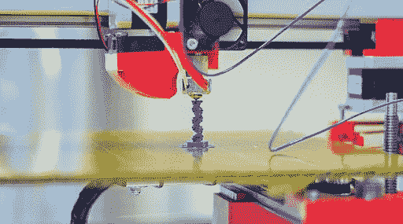

# 在你建造它之前先建造它

> 原文：<https://medium.com/swlh/build-it-before-you-build-it-7462f6766aa7>

几年前，我们正在努力开发我们产品的下一个版本。它是为 DIY 者设计的吗？它会是我们现在的设备的轻量级版本吗？它会是我们产品的 B2B 迭代吗？

我们努力了几个月，直到我们达成了一个想法，我们认为这是我们能想到的最好的版本。这场斗争包括大量的辩论、加班和冗长的议会式会议，这些会议有时会很激烈。然而，直到我们选择了这个想法并开始着手实施，我们才意识到这将是一个失败。

在构建新产品的宣传活动时，与我们的第一个版本相比，它似乎很肤浅，很明显，它缺少了许多市场所需的组件。我们开发的第一个产品是大胆的。第二个很实用，甚至我们都不太相信。尝试构建它的实践帮助我们认识到，阐述好处、将其相对于其他产品进行定位以及适当定价是行不通的。

先建产品页再建产品，让我们认识到了正确的路径。也就是说，对我们产品的第一个版本做同样的事情帮助我们看到它是非常不同的。

我们不是第一个发明这个的人。建筑师首先为他们的建筑建模。应用程序设计师创建线框。甚至还有一个关于《老友记》布景设计师的精彩故事:

亚马逊也习惯于在产品发布前几年就先发布新闻稿。这里有一篇沃纳·威格尔写的关于这种做法的很棒的文章。

在这个过程中最好的事情就是意识到产品是无用的。你可以很快发现这一点，先建一点再建很多。

## 这个故事发表在[的创业](https://medium.com/swlh)上，这是 Medium 最大的创业刊物，有 339，876+人关注。

## 订阅接收[我们的头条新闻](http://growthsupply.com/the-startup-newsletter/)。

