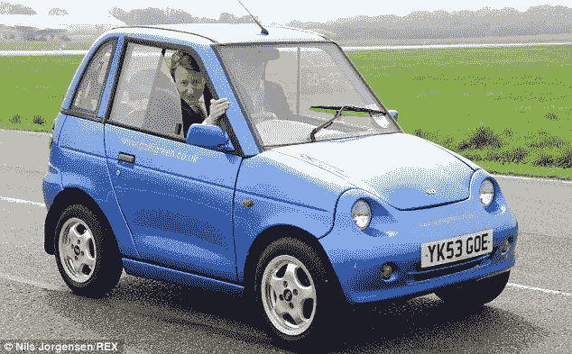

# 建造人们想要的，而不是他们需要的

> 原文：<https://medium.com/swlh/build-what-people-want-not-what-they-need-c04e466f8bdf>

People don’t want an environmentally friendly car. They want a bad-ass sports car.

我最近收到这个问题:

> 我开发了一个软件产品。市场上对它没有需求，但我相信人们 ***需要它*** *。我如何让人们使用它？*

# 以下是我的回应:

你的产品获得成功的唯一途径是制造人们想要的东西。

识别“需求”是不够的:

*   为了长期健康，人们需要减肥，但大多数人并不这样做。(在美国，超过 68%的成年人超重或肥胖。
*   人们需要转用环保交通工具来减少空气污染，但大多数人没有这样做。([私家车燃油排放量持续上升](http://www.statcan.gc.ca/pub/16-001-m/2010012/ct017-eng.htm))

然而，有一些成功的产品可以帮助人们减肥，远离化石燃料。他们的秘密？他们把产品包装成人们想要的样子。

# 非软件示例

洛杉矶减肥中心向顾客承诺他们想要的东西:更性感的身体。

埃隆·马斯克从人们想要的东西开始，让更多的人驾驶电动汽车:一种快速、豪华的汽车。(Model S 能在 2.5 秒内从 0 加速到 60 英里/小时)。

# 詹姆斯的理论

我的朋友 James Clear(T21)有一个理论:许多积极的习惯(比如健康的饮食)在短期内是痛苦的，但从长期来看是有益的。

人们很难去做他们知道对他们有益的事情。好处是未来太远。吃糖果会有即时的回报(味道很好)，但会有长期的危害(体重增加、疾病)。吃蔬菜是相反的:短期的痛苦，但更健康的未来。

詹姆斯认为，激励员工的秘诀是将长期利益与短期回报挂钩。

所以，如果你要卖一辆环保汽车，首先要把它作为一辆豪华跑车来推销。在特斯拉历史的早期，人们想要拥有独家跑车的地位。为了帮助世界减少温室气体排放，埃隆·马斯克(Elon Musk)不得不创造一种产品，给人们一种短期奖励(在这里是地位和速度)。

# 这如何应用于构建软件产品？

我最喜欢的例子是[约会戒指](https://www.datingring.com/)。

他们推出了一个大胆的前提:一个没有个人照片的约会网站。这是一个理性的想法。如果你在寻找一生的伴侣，在照片上向左或向右滑动太肤浅了。通过实验，他们发现与一群人相亲是寻找潜在伴侣的最佳方式。

单身人士需要他们的服务，但这不是他们想要的。

由于用户希望看到可能匹配的照片，注册受到了影响。约会圈被迫重新推出一个网站，允许人们上传照片，并控制他们的喜好。

# 通往卓越的最短路径

要想成功，就要做一些能给用户带来快速收益的东西，然后随着时间的推移继续提供价值。

罗布·沃林称之为“通往卓越的捷径”在你的入职培训中，帮助你的客户做一些让他们对你的产品感到兴奋的事情。

> 如果你有发票软件，也许是他们发出第一张发票的时间，也许是他们拿到钱的时间，我们还不知道，我们只能猜测。如果你有求婚软件，也许是他们第一次求婚的时候。如果你有电子邮件营销软件，它将要么当他们得到他们的第一个订户，也许当他们发送他们的第一封电子邮件。——罗布·沃林([来源](http://blog.profitwell.com/double-your-trial-to-paid-conversion-rate-with-onboarding)

# 最后的想法

> 人们可能不想要你的产品提供的进步。

顾客没有理性地做出购买决定。他们情绪化地购买，然后用逻辑使他们的购买合理化。

太多聪明的人试图出售人们需要的产品，而不是制造人们想要的东西。

干杯，
贾斯廷·杰克逊

> PS:我更新了我最畅销的书*，增加了关于产品验证的章节。[点击这里获取免费章节](https://devmarketing.xyz/signup/)。👈*

*💻查看我的简讯:[justinjackson.ca/newsletter](https://justinjackson.ca/newsletter)
专为 SaaS、软件和数字产品企业设计。*

> *👏谢谢你们的掌声！👏*

**原载于 2017 年 7 月 6 日*[*Justin Jackson . ca*](https://justinjackson.ca/need-want)*。**