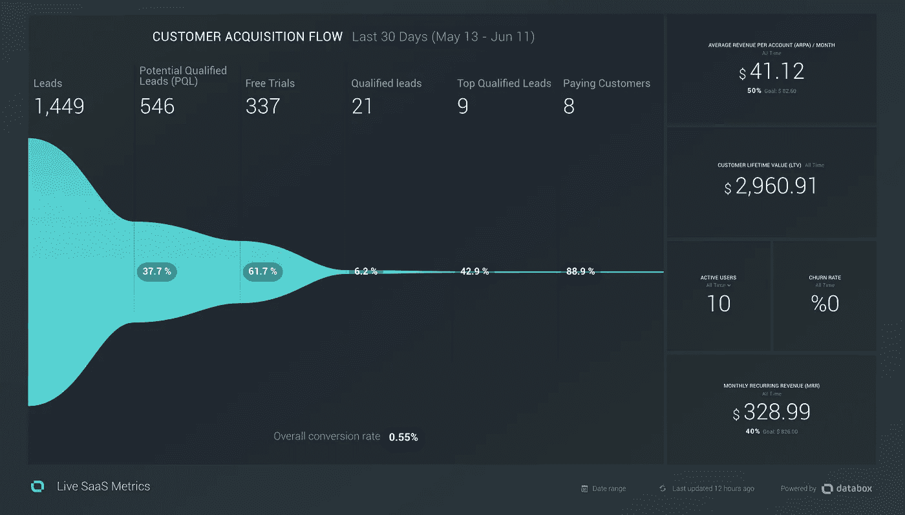
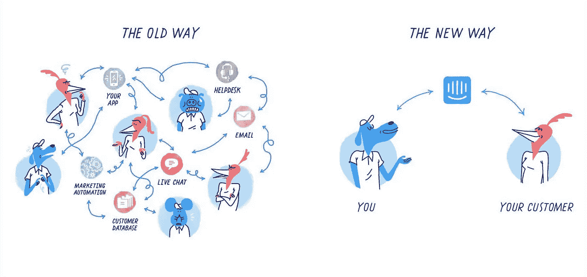
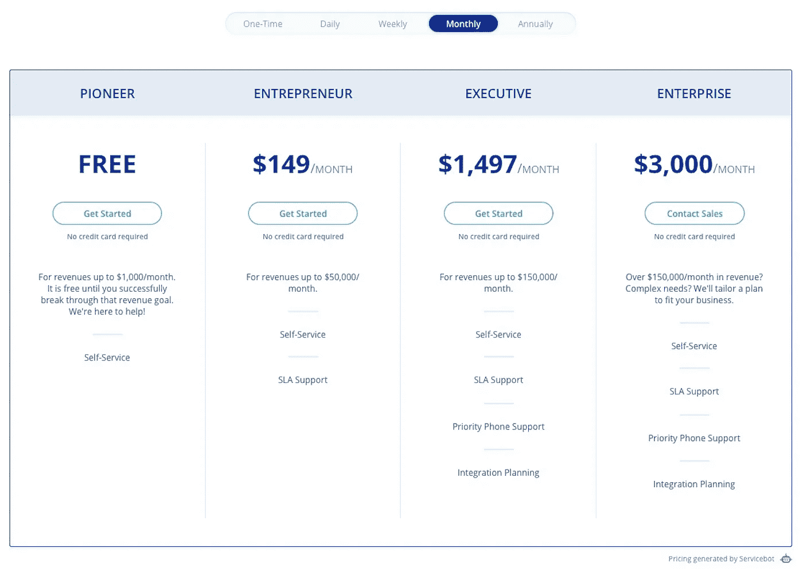
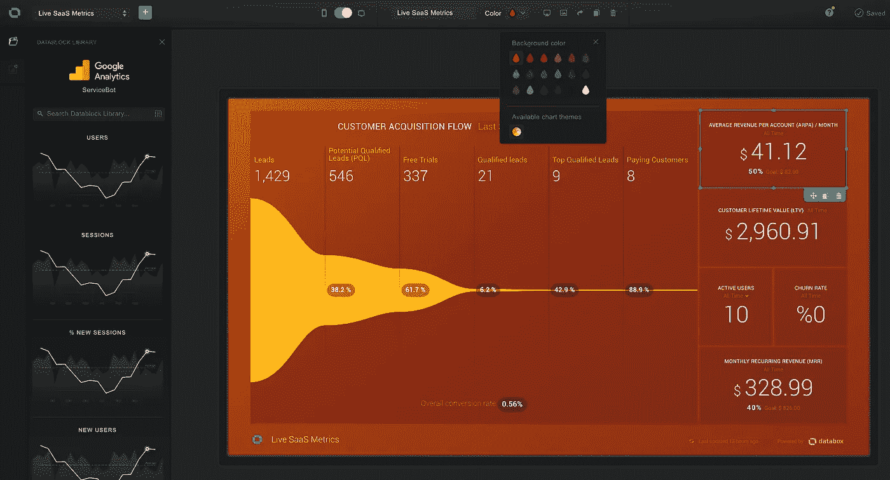

# 监控您最重要的 SaaS 指标的最佳方式

> 原文：<https://medium.com/swlh/build-your-dream-saas-dashboard-using-databox-intercom-stripe-and-servicebot-fc5caae85b2e>

我已经记不清我的团队中有多少人要求转换目标、财务预测或一些随机的分析指标。然后我把他们引向我冗长的、难以理解的、静态的 Google Sheets 投影，并说“我已经和你分享了这个文档，但是你又来了！”如果你熟悉这种情况，你并不孤单。

跟踪您最重要的 SaaS 指标既耗时又具有挑战性，因为它们变化如此之快，并且需要不断地重新计算。您的关键指标必须始终是最新的、可访问的和可展示的。在这篇文章中，我将教你如何建立正确的仪表板。您可以与您的团队、合作伙伴和投资者分享。一个给你发送每日报告，并允许你与任何人分享你最近的实时数据。看起来像这样的一个:

# 了解关键指标

理解关键指标至关重要。每天早上开始工作时，你需要知道什么？

好的，让我们假设你正在营销一家 SaaS 公司，该公司向客户出售每月 99 美元的订阅服务。你提供 14 天的软件试用。此外，您的应用程序有一组需要客户完成的步骤，以便开始使用您的软件，并可能向您付款。在营销一家 SaaS 公司时，你应该能立即获得的最有价值的数据是什么？让我们回顾一下:

*   访问者:有多少人访问过你的网站？
*   **线索**:有多少人试图通过你的网站聊天、联系表格、日历演示或登录页面联系你？
*   **免费试用**:有百分之多少的人注册了免费试用？
*   **合格的销售线索**:有多少免费试用账户通过了所有入职步骤？
*   **付费客户**:有多少人付费给你？
*   **每位客户的平均收入(ARPA)** :每位客户每月的平均收入是多少？
*   **终生价值(LTV)** :一个客户一生平均会付给你多少钱？
*   **流失率**:你的账户注销率是多少？每个月有多少人取消？
*   MRR 和阿里:你每月和每年的经常性收入是多少？

我们的目标是将所有这些信息放入一个图表中，您可以每天参考，并了解您的营销进度。比较你的月、周、日报告。你可以用五个主要工具来构建这个仪表盘: [Google Analytics](https://www.google.com/analytics/#?modal_active=none) 、 [Intercom](https://www.intercom.com/) 、 [Stripe](https://stripe.com/) 、 [Servicebot](https://servicebot.io/) 和 [Databox](https://databox.com/) 。

# 使用谷歌分析

听起来很简单。确保你使用谷歌分析来跟踪你的每日访客。GA 将为您提供网站和登录页面流量数据，以及地理位置、访问持续时间和逐页分析。你所要做的就是复制并粘贴 GA embed 代码到你的网站，并确保它能跟踪你的流量。简单易行。

# 用对讲机管理

我知道网站聊天有很多选择，但对讲机不仅仅是一个聊天平台。对讲机将让您管理您的所有线索，基本上可以回答我们上面讨论的一半问题。要从 Intercom 获得最大效果，请尝试以下方法:

*   **设置您的网站聊天。** Intercom 为您提供了一个嵌入代码，您可以将它复制并粘贴到您的网站上，这样您的客户就可以开始与您对话。每个新的对话都将被视为内部通话中的一条线索。
*   **将所有线索转发给对讲机。**您可能有一份联系表，人们可以通过它向您发送询问，您可能有一份演示时间表，用于向潜在客户展示您的产品，或者只是让销售线索直接通过电子邮件与您联系。不要将这些引线分开。通过将所有潜在客户电子邮件转发到您的内部通信帐户，将它们全部转移到内部通信。对讲机具有开箱即用的功能。
*   **向对讲机发送使用数据。**这不是必需的，但是如果您真的想体验一下，您可以将您的客户使用数据从您的 SaaS 直接发送到 Intercom，以跟踪上线转换。这将教会你很多关于你的入职流程。

如果你是创业公司，申请[对讲机前期启动程序](https://www.intercom.com/early-stage)。

# 与 Stripe 和 Servicebot 一起销售

希望你没有一些定制的计费解决方案卖给你 SaaS。如果你这样做了，我会建议你转而使用那些可以减轻你负担的工具。不要多此一举。创建一个 Stripe 帐户，然后创建一个 Servicebot 帐户，将您的 Stripe 连接到 Servicebot，您就获得了一个带信用卡支付处理器的 SaaS 管理平台。一个平台，可以收集你所有的财务数据，与内部通信数据混合，并将其发送到 Databox。

Servicebot 帮助创建您的定价表，允许您的客户注册您的软件，升级和降级他们的计划，更新他们的信用卡，并取消他们在您这里的帐户。你要做的就是:

*   **设置您的产品。**创建您的 SaaS 产品并添加您的价格。
*   **使用可嵌入程序。**使用 Servicebot 可嵌入代码将价格表、账单和结账 UI 元素嵌入到您的网站和 SaaS 中。
*   **接通对讲机。**将您的内部通信帐户连接到 Servicebot，以导入您的销售线索活动和资格信息。

然后，Servicebot 可以每天将所有的转换和财务统计数据发送到 Databox。

Pricing page generated by Servicebot

# 使用数据框查看

最后，是你展示数据的时候了。没有比 Databox 更容易、更快速地构建按需分析图表的工具了。他们创造了一个非凡的用户界面，允许你将数据从不同的连接拖放到你的图表中。完成上述步骤后，使用 Databox 即可轻松获得 SaaS 分析仪表板:

*   **连接谷歌分析。** Databox 与 Google Analytics 深度整合。这是他们最强的连接之一，你可以从 GA 中获得任何访问者数据。
*   **连接到 Servicebot。**创建一个新的自定义连接，让 Servicebot 将您的数据发送到 Databox。然后，您可以将不同的小部件拖放到图表中，并用 Servicebot 分析数据填充它们。

Chart creation tool by Databox

# 共享您的仪表板

为您的新仪表板感到自豪，并与大家分享。人家再也不会问你皈依和理财目标了。向投资者展示你的 SaaS 增长率，用你的数据改进你的营销活动。

如果你需要帮助设置你的 SaaS 分析仪表板，你可以使用我的日历链接预约一次 [15 分钟的咨询。](https://calendly.com/servicebot/consultation)

## 这个故事发表在 [The Startup](https://medium.com/swlh) 上，这是 Medium 最大的创业刊物，拥有 344，974+人关注。

## 在此订阅接收[我们的头条新闻](http://growthsupply.com/the-startup-newsletter/)。

