# 在巴厘岛构建加密货币应用:我作为数字流浪者的新生活的五大利与弊

> 原文：<https://medium.com/swlh/building-a-cryptocurrency-app-from-bali-digital-nomad-f7ff0e0d6800>

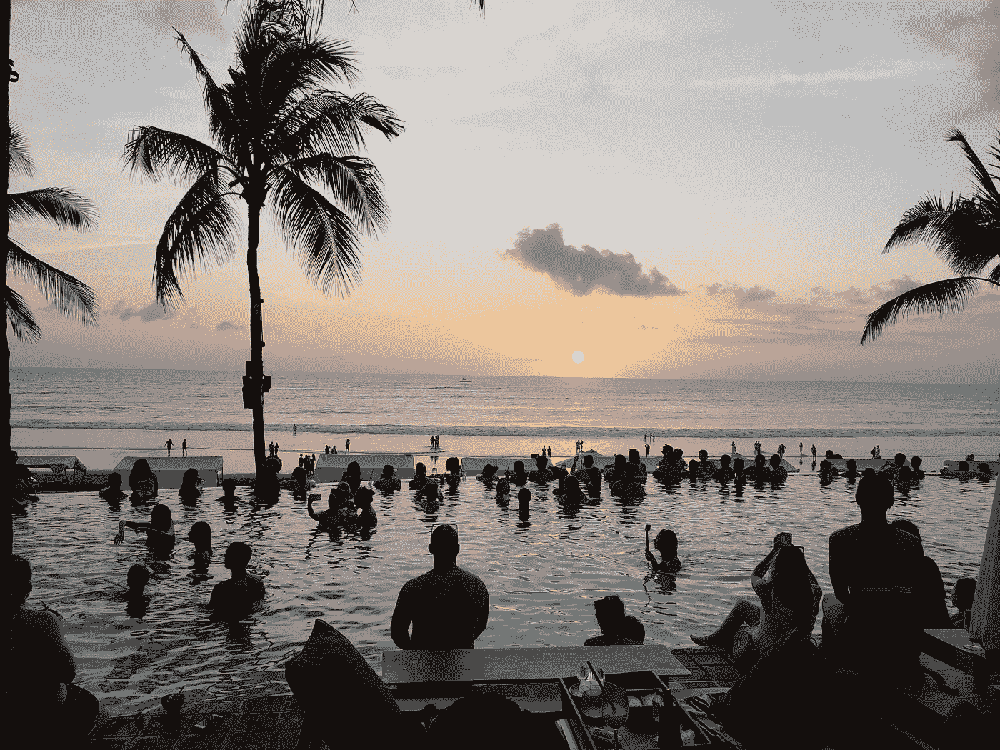

Potato Head Beach Club - Bali

2016 年，我卖掉了我的公司 SNAP Interactive。我在那里担任联合创始人兼首席执行官近十年的经历是一次狂野之旅；一个见证了我们中的 12 个人几乎在一夜之间成为百万富翁；我荣幸地敲响了纳斯达克的开市钟；在这一年里，我犯了一些错误，但最终学到了一些非常有价值的教训，让我继续前进。那次经历也启发我写了一本书，《爆炸性增长——增长到 1 亿用户我学到的几件事》，可以在[亚马逊](https://www.amazon.com/Explosive-Growth-Learned-Growing-Million/dp/1619617692)上买到。也许你听说过？也许不是。

你是否熟悉我写到这里的考验和磨难并不重要，因为不管怎样，是时候进入下一个篇章了——我的数字游牧生活。这就是我现在想与你分享的故事。会像我之前的故事一样充满动荡吗？它会以同样多意想不到的方式改变我的生活吗——无论是好是坏？这些事情还有待观察，但我必须说，这是一个非常好的开始。

大约四五个月前，我开始了成为数字流浪者的旅程，当时我决定不再续签公寓租约，并将所有个人物品存放起来。我明白了，完全投入到如此大的改变中去，是成功的关键。

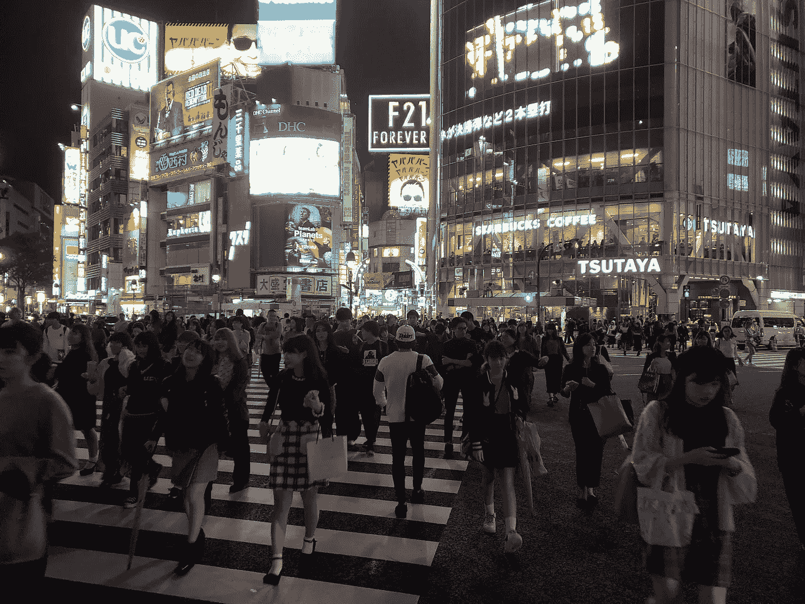

Shibuya Crossing In Tokyo — The World’s Busiest Intersection

我的第一站是东京，现在我发现自己沐浴在巴厘岛的热带气候中。离家(纽约市)很远，但这可能正是我充分利用新生活方式所需要的。我到这里才几个星期，但我对最初的结果印象深刻。

不幸的是，作为一名数字游牧者，我所学到的大部分东西，都是通过亲身经历学来的。我希望我能有一个人——也许是一个导师——能让我为我将会遇到的一些高潮和低谷做好准备。因此，这是我写这篇博客的灵感。

如果你正在考虑成为一名数字流浪者，我想让你知道那会是什么样子和感觉。看看我在巴厘岛的经历中发现的以下五大优点和缺点。希望，在那之后你会有一个好的想法去期待什么…享受吧！

# **优点**

DT2【igital Nomad Programs:如果你想知道我最初是如何来到这里的，一家名为[黑客天堂](https://www.hackerparadise.org/)的令人兴奋的创新创业公司就是答案。他们的使命是促进数字游牧生活方式。更具体地说，他们帮助企业家在世界各地的异国他乡优化他们的生产力。他们负责远程工作的所有后勤工作，因此您可以专注于实现您最具创意和改变游戏规则的想法。

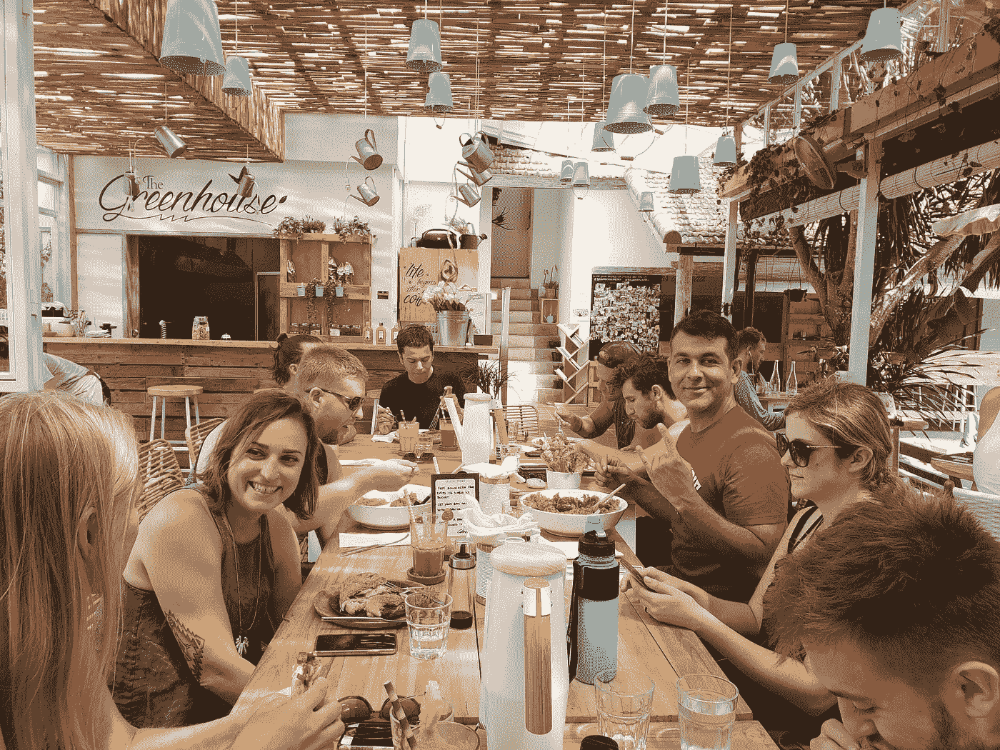

Hacker’s Paradise At Our Weekly Lunch

他们从 2014 年才开始这样做，但似乎更久了，因为到目前为止我的体验非常棒。我参加了一个从 10 月 21 日到 12 月 15 日的项目，主题是加密/创业。如果你不喜欢巴厘岛和 crypto，黑客天堂和其他类似的公司一样，经营着各种各样的项目，这些项目以不同的主题为特色，全年在不同的国际地点蓬勃发展。可以在 [Instagram](https://www.instagram.com/hackerparadise/?hl=en) 关注黑客天堂。

V ***ibrant 创业和密码社区:*** 这可能是我迄今为止旅行中最惊喜的一次。这很大程度上可能要归功于黑客天堂和类似的项目，但巴厘岛本身似乎也是数字游牧民的岛屿天堂，拥有非常优质的创业生态系统。

我已经遇到了几个非常有才华和知识渊博的人，他们以各种方式激励了我。其中一个是软件工程师，他从零开始为一枚顶级硬币创造了一个加密钱包。另一个人创建了一个加密投资基金和一个场外交易市场。我的团队不仅仅是加密联系人，还包括数字营销、品牌、自由职业设计方面的专家([杰斯](http://heyjess.com/)和[艾米丽](https://www.etsy.com/shop/bybahe/))，以及才华横溢的企业家，包括经营[自由职业律师](http://www.freelance.legal/)的律师尼克和[前端角度工程师](https://mattlewis.me/)马特。我的小组还包括丽贝卡·梅恩，一位浪漫小说作家，她正在写她的第五部浪漫小说。

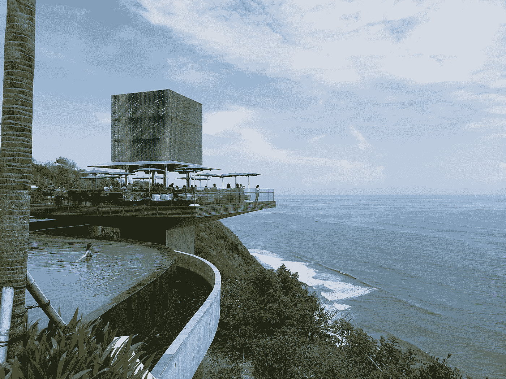

Omnia Day Club Bali

惠普社区是多样化的，因为它在各个方面都是创新和卓越的，每周都有有趣的人加入——包括该集团的最新成员，OpenCollective.com[和 Storify.com](http://www.opencollective.com)的创始人泽维尔·达曼[。我很幸运能和 Xavier 一起搭车去令人惊叹的 Omnia 日间俱乐部。在整个观光旅程中，我们讨论了我们的初创企业，并分享了几个关于如何发展它们的令人信服的想法。](https://medium.com/u/388996e27d02?source=post_page-----f7ff0e0d6800--------------------------------)

[Outpost](https://www.instagram.com/destination.outpost/) Coworking In Canggu, Bali

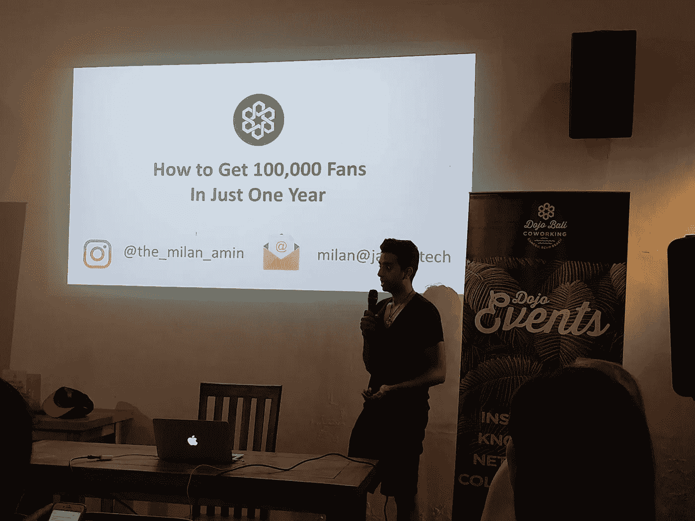

[@the_milan_amin](https://www.instagram.com/the_milan_amin) Teaching Us How To Grow Our Social Media Following

巴厘岛也有大量的共同工作空间，支持志同道合的专业人士开发和提炼他们的最佳创意。其中的三个地点——[前哨](https://www.outpost-asia.com/)、[道场](https://www.dojobali.org/)和 [Hubud: Ubud 共同工作&社区空间](https://medium.com/u/6cc600e583d8?source=post_page-----f7ff0e0d6800--------------------------------)——在大多数夜晚都会与来自各行各业的超级成功企业家举行令人难以置信的会谈。除了晚间谈话，还有频繁的见面会、早餐会、午餐会，甚至偶尔的 TEDx 会议。上周， [Hubud: Ubud 联合工作&社区空间](https://medium.com/u/6cc600e583d8?source=post_page-----f7ff0e0d6800--------------------------------)举办了[创业周末](https://hubud.org/specialevents/startup-weekend-bali/)，由 [Techstars](https://medium.com/u/d12b11b4aabd?source=post_page-----f7ff0e0d6800--------------------------------) 提供支持。这是一整个周末，旨在帮助数字游牧民族启动他们的创业。

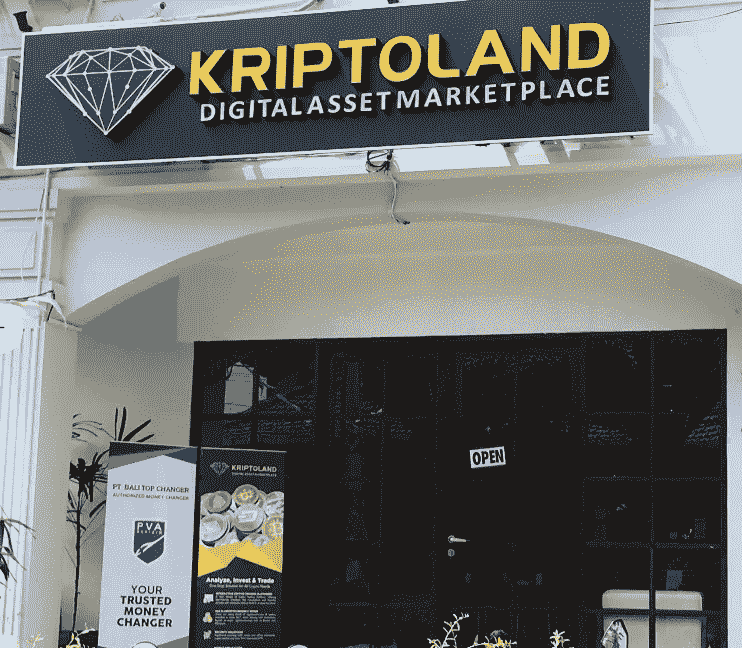

Bali has Kriptoland!

巴厘岛也有一个秘密的存在，这使它成为我即将推出的新应用的理想目的地。(也许在下一篇博客中会有更多的介绍。)事实上，甚至有一个加密会议即将召开，名为 [BlockBali](https://www.blackarrowconferences.com/blockbali.html) 。

F ***ewer 分心:*** 如果你正在考虑数字游牧生活方式，这应该成为你决策的重要因素。通过每天不受干扰地工作五到六个小时，我的效率翻了一番。远离曼哈顿日常生活的不断干扰，对重振我的精神和创造力有着惊人的好处。我也不是唯一这样想的人。众所周知，沃伦·巴菲特和比尔·盖茨都曾长期寻求逃脱。他们说这能让他们头脑清醒，让他们在更高的水平上执行。我完全同意。

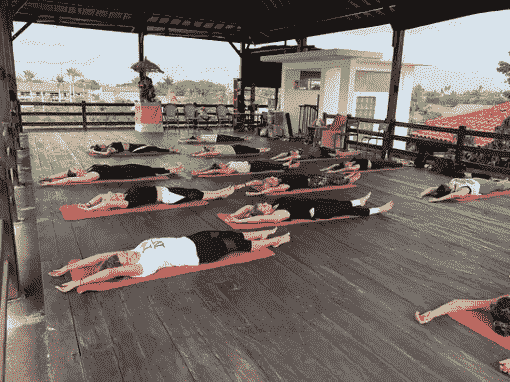

Morning Workout At [Roar Fitness](https://www.instagram.com/roarfitnessberawa/)

时差是排除杂念的关键因素。从巴厘岛到纽约市大约有 12 个小时的时差，所以你不太可能被电话打断。例如，如果我在下午 2:00 做某件事，我不太可能被电话打断，因为回到家已经是凌晨 2:00 了。所有这些额外的时间帮助我最终致力于晨练(看风景没有坏处)。

C 然而，当我计算出 1 美元兑换 15000 多印尼盾的汇率时，我意识到价格并没有那么糟糕。事实上，这真的非常便宜(每人只需 10 美元)，尤其是考虑到账单包括 7%的服务费和 10%的税率。

在巴厘岛，生活成本是如此之高，我可以为我的企业提供资金，过上比我在美国梦想的更高质量的生活。例如，按摩已经成为我的日常生活，因为在这里它们只需要 5 美元多一点。

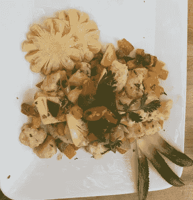

A Delicious $4 USD Pineapple Chicken Dish

**食物**:在巴厘岛花十几美元吃一顿大餐实际上有些困难。你真的需要增加饮料和额外的东西。然而，不要让低廉的价格欺骗了你，因为这里的食物令人难以置信。大部分有利于健康的生活方式，以各种果汁和新鲜蔬菜为特色。如果你能拿的番石榴和椰子只有这么多——像我一样——你仍然可以找到一个很好的地方来逃避罪恶的快乐，比如不那么健康，但非常令人满意的汉堡和薯条。

# **缺点**

B ***阿里肚子:*** 旅行的头几天，我们一行大约四分之三的人因为一种不那么亲切地被称为巴厘岛肚子的东西而病倒了。不知何故，我避免了这种对人类消化系统的祸害，但它似乎几乎不可避免地在某个时候会发生。

然而，不要让这些琐碎的事情阻止你享受成为数字流浪者的自由。对于所有的好处来说，这只是一个小小的代价，你可以采取一些常识性的预防措施。首先，只去高档饮食场所。外出就餐时注意一丝不苟的清洁，即使刷牙也只使用瓶装水。

除了这些小措施，你能做的最好的事情就是接受巴厘岛肚腩会在某个时候来找你，度过 24-48 小时的痛苦，当它结束时，回到工作岗位。

M ***inor 不便:*** 商务便利设施一应俱全，但要做好工作不一致的准备。白板*之类的东西的交付应该*到达…最终。在获得打印和扫描服务方面也有困难，在国外获得公证可能需要几周的等待时间。此外，互联网有时会很不稳定。

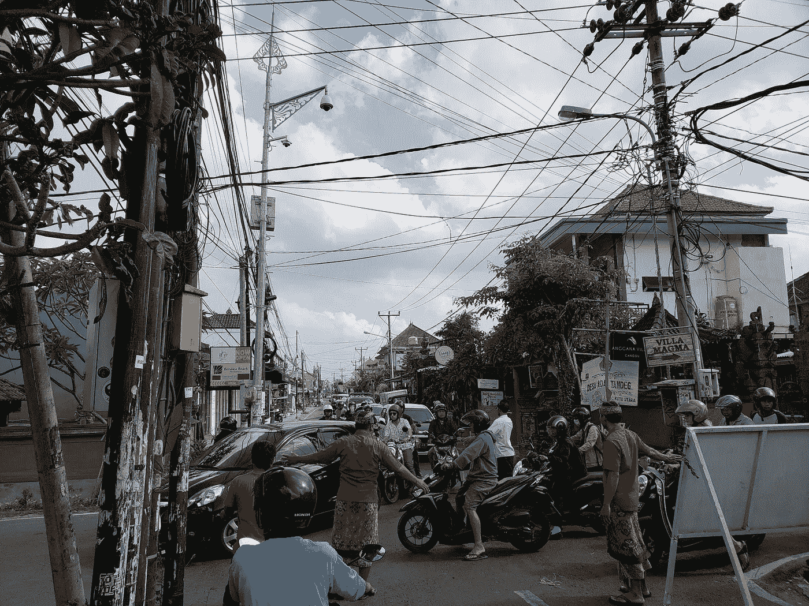

A Traffic Jam in Canggu, Bali

巴厘岛的交通绝对是一场噩梦。这些道路没有分割线、交通灯、停车标志或任何其他简单的安全措施，这些措施让大多数纽约人每天都不会发生车辆杀人事件。在这条路上，几乎每个人都是为了自己。这里也没有人行道，所以当行人也不是件轻松的事。从这个意义上说，在任何地方步行或开车都是可以验证的自由活动，这可以让在纽约开车看起来像在公园里悠闲地散步。

我建议对这些你在美国可能认为理所当然的小不便进行仔细规划。例如，ATM 机不会像在纽约那样以三种不同的品牌出现在几乎每个街角，所以使用现金需要一个已知来源的旅行计划。即使你找到了自动提款机，如果它能用，那你就很幸运了。

计划给家里的朋友和家人打电话也是一个好主意。事实上，12 小时的时差使它几乎是强制性的。虽然这可以被看作是排除干扰的有利条件，但当你因为任何原因而不得不打电话给某人时，这也可以被看作是一个不利条件。

D ***不同的干扰:*** 巴厘岛与纽约或美国其他任何地方都有不同的干扰。你不会被源源不断的短信、电话、电子邮件以及来自朋友、家人和同事的其他提醒所干扰，你可能会被一些你见过的最美丽的背景和自然美景所干扰。

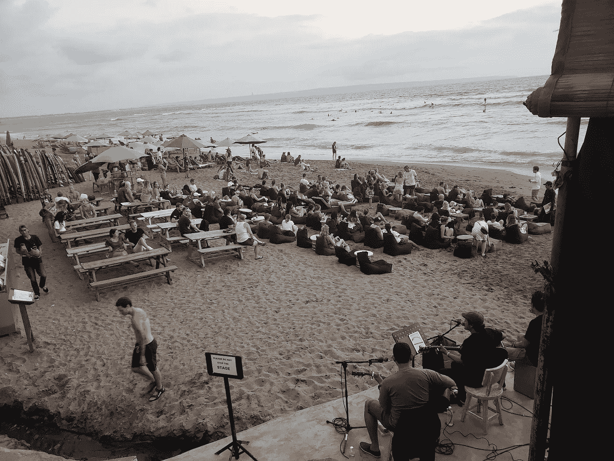

Daily Live Music at Sandbar For The Sunset

例如，你不会坐在酒店大厅或董事会会议室进行信息讨论，而是坐在白色沙滩上柔软舒适的椅子上，背景是纯净的蓝绿色海水，微风凉爽着你古铜色的皮肤。这个二分法怎么样？

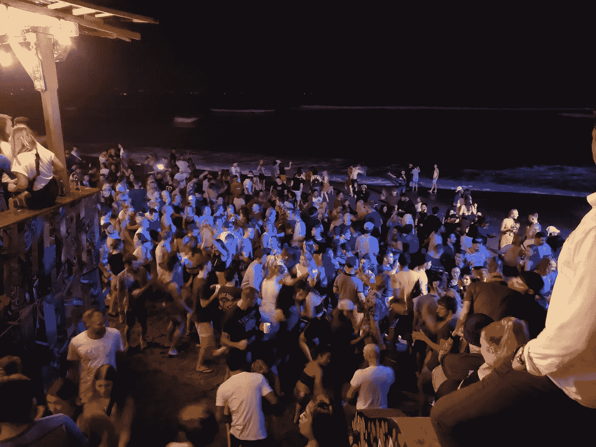

This is Sandbar (the same beach bar as above) at 2am.

巴厘岛的夜生活也很棒。如果冲浪是你的事，那也有很多；还有一些宁静的稻田和其他地区，也有令人惊叹的景色值得欣赏。这一切都导致了严重的 FOMO(害怕错过)。

避免这些干扰和在其他地方避免它们是一样的；你需要有纪律。我只是简单地承诺自己每天不间断地工作四到五个小时，而我的专业产出可能是在曼哈顿工作十到十二个小时。

T ***何火环:*** 当你冒险来到这个世界的这一部分时，请握紧你的帽子。距离巴厘岛约 100 英里的龙目岛岌岌可危地坐落在世界上最危险的地理位置之一——火环上。这是地球上最快的板块碰撞发生的地方，这导致了世界上大约 90%的地震。

害怕飞行: 如果飞行的想法让你夜不能寐，让你起草一份新的遗嘱，作为飞行前宗教仪式的一部分，那么一旦你到达这里，就要脚踏实地。该地区因航空安全记录糟糕而臭名昭著。一个可怕的例子是，几周前，一架几乎全新的喷气式飞机在这里起飞后不久坠毁，机上 181 人全部遇难。

## **工具清单**

还和我在一起吗？爽；这里列出了一些工具，它们对我在遥远的地方构建应用程序非常有帮助:

*   **Slack** :与我在白俄罗斯的开发团队沟通。
*   [地球类邮件:](https://twitter.com/earthclassmail)邮件扫描转发服务。
*   [Airtable](https://medium.com/u/40fe149223fd?source=post_page-----f7ff0e0d6800--------------------------------) :用于组织我的个人生活，并与开发者合作开发我的新应用。
*   **Skype&**[**Zoom**](https://medium.com/u/c4c2efc9bc0a?source=post_page-----f7ff0e0d6800--------------------------------):与开发团队和朋友进行视频电话会议。
*   [公证](https://medium.com/u/ee0dcab08f33?source=post_page-----f7ff0e0d6800--------------------------------):无论你身在何处，都能获得公证文件。
*   **WhatsApp** :通过语音、视频和文本与世界上任何人自由交流。
*   **神童应用**:在我忙碌的时候快速提醒我。
*   Dropbox:从任何地方访问我的文档。

你可能已经知道一些其他有用的东西，或者一旦你来到这里，你会发现一些新的东西。如果是这样，请让我知道他们。知识共享是我们在数字游牧社区取得成功的关键。

## **接下来是什么？**

所以，现在你知道了——我在巴厘岛作为一名数字流浪者的最好和最糟糕的新生活，以及一些帮助你摆脱困境的友好建议。我该何去何从？我还没完全弄明白。现在，我会随机应变。也许我会在巴厘岛多呆一段时间，或者我会搬到一个新的热带地区。也许我甚至会走向另一个极端，去参观冰川国家公园。我对此表示怀疑，但谁也不知道。有一件事我可以肯定:如果我拼命工作，在我的新加密应用程序中赚了 7800 万美元，我肯定这次不会失去它……(你真的应该看看我的[畅销书](http://explosive-growth.com)——[爆炸式增长](http://explosive-growth.com)。)

## 如果你喜欢这篇文章，请点击下面的按钮👏。

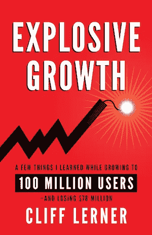

[克里夫·勒纳](http://explosive-growth.com/about/)是[畅销书](http://explosive-growth.com)、[、*、*、](http://explosive-growth.com)、*、*的作者，这些书可以在[亚马逊](https://www.amazon.com/Explosive-Growth-Learned-Growing-Million/dp/1619617692/)、*上购买。他就如何实现爆炸性增长为初创公司提供建议。克里夫目前正在开发一款[加密货币应用](https://buysellhodlapp.com)，其目标是让 1 亿用户采用加密。*

## 这篇文章发表在 [The Startup](https://medium.com/swlh) 上，这是 Medium 最大的创业刊物，有+393，714 人关注。

## 订阅接收[我们的头条新闻](http://growthsupply.com/the-startup-newsletter/)。

