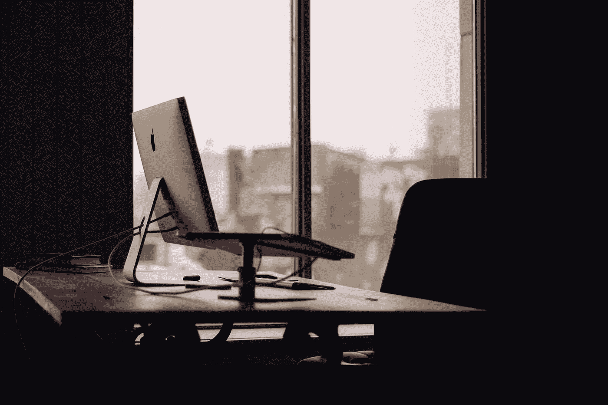
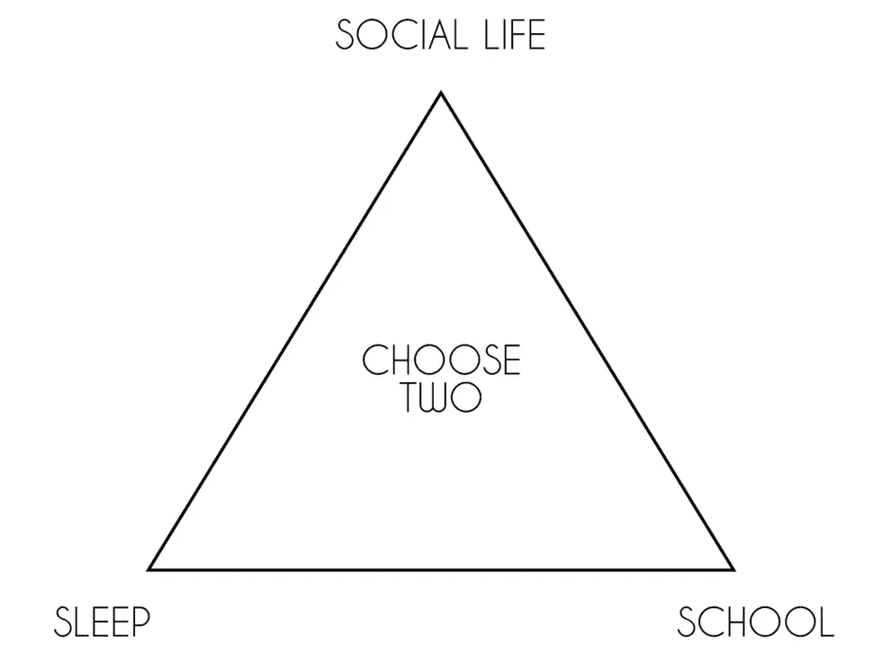

# 围绕工作和生活建立一个健康的心态:它如何导致交付伟大的设计工作而不精疲力竭

> 原文：<https://medium.com/swlh/building-a-healthy-mindset-around-work-and-life-how-it-leads-to-delivering-great-design-work-8cdbd415c152>

自从我开始全职工作以来，我一直对按时完成像素百分比的工作和尽快完成我能想到的一切感到压力。上个月，我很早就来上班，一直工作到下午 6-7 点，中间几乎没有休息。这个时间表工作了几个星期，然后我开始觉得没有动力，无聊，并且过于依赖冰拿铁和那些诱人的椒盐卷饼，早餐时会叫我的名字。我对自己的感觉感到迟钝和沮丧，这种感觉开始渗透到我生活的其他方面，我觉得我开始失去控制。

[https://www.theodysseyonline.com/reality-balance-struggle](https://www.theodysseyonline.com/reality-balance-struggle)

我们做了很多选择。我们做出的选择通常取决于我们想要做什么才能快乐，这些选择可以分为三类:职业/工作、人际关系/爱情和健康/生活方式。我们倾向于优先考虑两个，这完全正常，因为这意味着事情进展顺利。理想情况下，这三者能和谐地工作是再好不过了。对我来说，我一直把工作放在首位，以至于它开始对我的健康和社交生活产生影响，从而使这种负面反馈循环永久化，使我对目前的状况感到满意，并能够清楚地看待事情。对我来说，这意味着不要为了过度工作而牺牲其他一切，为自己设定不切实际的目标来实现某些事情，并且过多地关注无关紧要的事情，例如设计中的小细节，这些细节将继续变化，并且不会对核心业务目标做出贡献。

> 你永远都有工作，但这取决于你对待工作的心态，它要么让人充满活力，要么让人疲惫不堪。

以下是我根据自己的经验和其他经验得出的一些自我认识，可以帮助你在实现目标的同时建立一种更加平衡的生活方式:

# 了解你在业余时间和工作中做的事情，以及这些事情给你带来的总体感受

我认为我们看待工作与生活平衡的方式有点极端。尽管我们在工作内外做的事情可能不同，但我们处理事情的方式不会改变。一个例子是，如果你是那种工作时间很长，然后周末参加派对的人，你可能不会给自己时间放松。在这种情况下，当然，你在做着令人敬畏的工作，在聚会上玩得很开心，但是因为你唯一缺少的就是休息，所以你很有可能会筋疲力尽。

以前，我对待工作的方式是我经常一次做太多事情。我在个人生活中看到了这种行为模式，因为我对太多人说了“是”，所以尽管说了“是”，与朋友的计划还是失败了。我不喜欢我分散自己的方式，以至于没有完成我给自己设定的目标。

尽管我在工作之外做的事情不会影响到我在工作中做的事情，但我做事的行为会影响我在这两个方面的快乐。如果我没有努力实现管理工作的健康平衡，它会直接影响我不工作时的感觉。

# 超额完成 100%是不可持续的

我发现，如果我现在没有意识到，工作过度会影响我的身体感受，会导致未来的长期问题。尽管我现在很想实现我的目标，但我投入的努力不应该损害我的健康，否则我甚至不能做我想做的事情。在过去，我设定了一些不切实际的目标，当我没有达到这些目标时，我会感到沮丧，陷入自怜之中。

> 小收获胜过大收获

我们最好保持一致，不要对自己太苛刻。有时候我觉得自己进步不够，或者在退步。这很正常，在这种时候，我们需要在内心寻求安慰，并意识到我们不会在一夜之间到达我们想要的地方。做大之前需要时间、耐心和小收获。

# 以你能跟上的速度工作

我意识到我的工作方式(每周 60 多个小时的工作),在<6 hours of sleep and coffee allowed me to makes lots of progress, but this routine started to take a toll on me. I felt sluggish and burnt out, not to the point where I didn’t want to do anything, but I was pretty close. Once I started getting signals from my mind that it wasn’t wise to continue this, I gave myself more time to rest and less pressure to keep working. Doing this, made me less stressed and it actually made me more productive because I was recharging myself and allowing myself to thrive in other areas of my life, such as exercise, hobbies and spending quality time with people. I’m a lot happier

> Be strategic about where you put effort to get the most effect.

By working at a pace I felt comfortable in, it has allowed me to be more present at work, more motivated to stay on top of things and has enabled me to see the bigger picture of things instead of focusing on a specific aspect of work. If I had continued to overwork myself, despite the results I would get in the short term, I know it would make me more depressed, tired to consistently deliver the way I had been doing in the long run.

# **结尾笔记**上运行

我相信有可能对睡眠、工作和社交时间进行优先排序，这是平衡这三个方面的结果，如果我们不能同时平衡所有事情，可以在不同的时间减少做一件事情。有时我会优先考虑工作，在我需要制定最后期限的时候，或者当我觉得我没有花足够的时间与朋友在一起时，我会在一周内安排一些时间与他们共进午餐。我总是努力获取我需要的东西，融入我生活的方方面面，而不是把我所有的时间都投入到我生活的一个方面。当我这样做时，它往往会对我的感觉或其他方面产生连锁反应。

*查看我在**[***UX 研究***](http://skl.sh/2nal9ZT)**上的 Skillshare 课程，学习新的东西！***

**为了帮助你开始拥有自己的设计生涯，这里有一些来自 [**Rookieup**](https://transactions.sendowl.com/stores/8219/107314) 的神奇工具，我曾经在这个网站上得到资深设计师的指导。**

*   **在经验丰富的设计师的帮助下制作一个作品集**
*   **[强化和建立你的投资组合的基本工具](https://transactions.sendowl.com/stores/8219/107314)**

**链接到其他一些很酷的读物:**

*   **[我从两次面试和收到谷歌的邀请中学到了什么](/google-design/what-i-learned-from-interviewing-and-receiving-offers-from-google-two-times-e1d1a7b715bc)**
*   **我作为一名应届毕业生去脸书面试。以下是我对设计的了解**
*   **[旅程规划是获得共鸣的关键](https://uxplanet.org/journey-mapping-is-key-to-gaining-empathy-1da5b54655e1)**
*   **[UX 立足于理性，而非设计](https://uxplanet.org/ux-is-grounded-in-rationale-not-design-49e8f77b8f58)**

****

## **这篇文章发表在 [The Startup](https://medium.com/swlh) 上，这是 Medium 最大的创业刊物，拥有+ 378，529 名读者。**

## **在这里订阅接收[我们的头条新闻](http://growthsupply.com/the-startup-newsletter/)。**

****