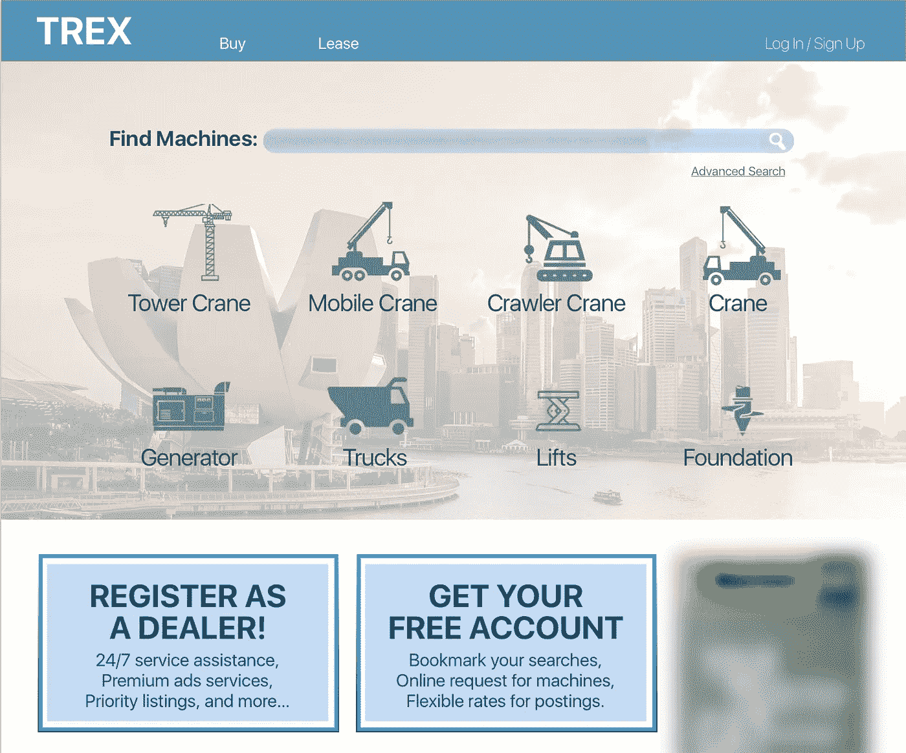
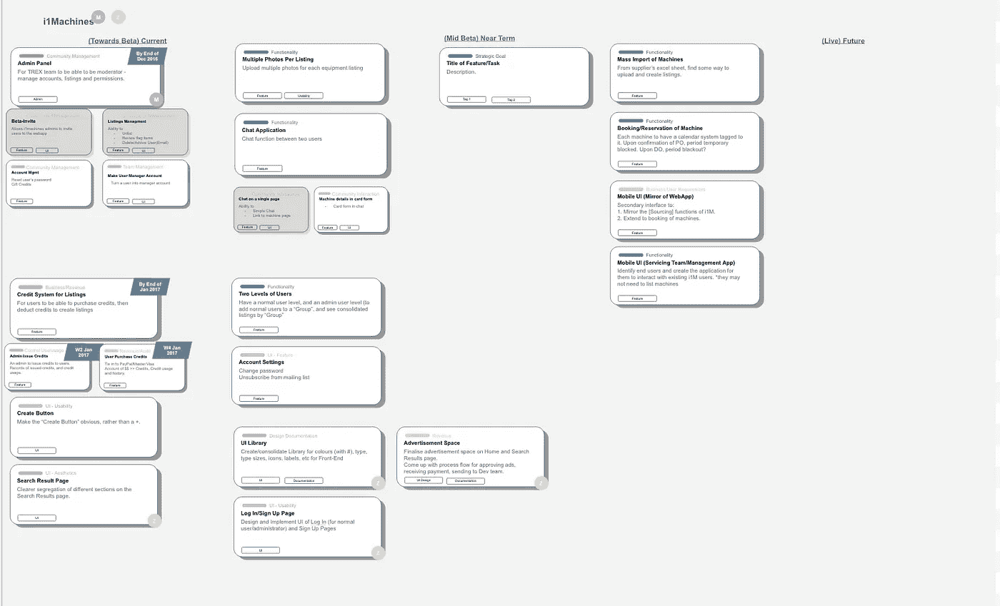

# 构建(最低生存能力)产品

> 原文：<https://medium.com/swlh/building-a-minimum-viable-product-cbd57cc07f8d>

## 这要从策略说起。

Photo by Jared Sluyter, Unsplash.

回到 2016 年 4 月，马丁和我花了 5 周时间为 B 构建了一个非常简单的网络原型——一个建筑设备的在线市场。利用这个原型，B 决定正式构建 [TREX](https://blog.i1machines.com/what-is-trex-650fdaf0c91a) ，目标是将设备的物理购买、销售和租赁数字化。

# 开始

The very first iteration of the online equipment marketplace.

当我们开始建立“真正的”网站时，马丁和我回到了设计阶段。在与 B 进行了多次密切磋商后，我们开始列出我们必须构建的所有功能，以便我们可以提出一个时间表。我们从我们能想到的或从其他网站引用的东西中列出了这个列表，同时删除了“不完全合适”的功能。这份名单不断变化，不断增长。

当我们觉得列表足够详尽时，我们开始构建导航流程和数据库。我们预计在未来 6 个月内完成这些工作:

> ***功能:用户账号、用户列表、个人资料页面、查询/聊天、书签、公司个人资料页面、团队账号、搜索页面。***5 月:导航流程+数据库探索
> 6 月:UI 草图+数据库 0.1 +数据库 0.2
> 7 月:前端编码
> 8 月:捆绑前后端

不用说，我们超过了我们的时间表，只有马丁编码前端和后端，而我做视觉设计。显然，我们不仅在系统应该如何设计方面缺乏经验，而且在项目安排方面也是如此。

# 重新评估产品开发

你不能只是把项目分成前端和后端，并为每个部分估计一个时间表。我们搞砸了最初的时间表，但我们学会了确定项目的范围。

因此，我们再次审视了所有功能，并根据功能的“重要性”对它们进行了优先排序——我们认为这对用户来说是必要的。我们根据规模更好地估计了构建每个功能所需的时间。我们还遵循了一个类似瀑布的开发工作流程，准备在我们前进的过程中适应它，以保持对“敏捷实践”的忠实。我们计划在新年前完成。

现在，总共开发了 7 个月。有了更精确的范围，我们这次做对了吗？几乎没有。我们推出了一款功能性产品，但远未完成。嗯，没有产品是完整的，但它并不完全是“最低限度可行的”。

# 审查“范围”和“优先顺序”

此时，我们还将 marketplace 重命名为 i1Machines，而 TREX 仍然是公司的名称。我们的团队(已经扩大到 3 人)也运行了一轮内部用户测试来寻找有问题的页面，Martin 在两周内解决了这个问题。除了一些 bug 和不完整的特性，这个网站基本上是“最低限度可行的”。

这一次，马丁和我决定采用特雷罗式的产品路线图。我们可以将每个特性分解成多个部分，每个部分都要在一周的“冲刺”中完成。我们为每个功能/任务分配了标签，以定义任务的类型。这些任务被进一步分为当前、近期和未来三个阶段，作为一种优先排序的方式。

Our new product roadmap, with scoping, deadlines, tags, and prioritisation. Built on Google Drawings.

我们用任务和范围的日历视图进一步补充了上述路线图。这成了一个非常方便的工具，我们用来每周检查一次，以确保我们按计划进行，团队的其他成员也很容易知道我们每个人在做什么。

然而，不断地检查路线图和拖放任务花费了大量的精力。如果我们有一个实物模型就在我们的面前，不断提醒我们自己这些任务，这也是很有用的。

# 战略在哪里？

尽管我们在产品开发中一直在实践优先顺序，但我们并没有明确说明优先顺序的基础。我们“知道”有必要建立一个信用体系，但没有说明其目的。我们“同意”公司简介页面对商业用户是必要的，但没有说明它将如何使用户受益。

我们的每个决定背后都有战略原因，不写下来会在团队中造成很多模糊。对于一个特定的功能，我们每个人可能会有不同的解释。只有通过我们最近的路线图(以 excel 表格的形式)，我陈述了战略目标，我才意识到这一点。

> 我们对公司简介页面有不同的想法，这导致我们对它的需求和任务复杂性有不同的优先级。只有当我们讨论它的战略目的时，我们才同意它实际上应该是什么。

当团队成长时，制定战略尤为重要，因为不同领域的用户研究人员、业务开发人员和营销主管都有各自的优先事项。

# 它从策略开始

事后看来，如果有明确的战略目标，我们的许多决策(不仅仅是产品开发)都会受益。*我们应该接受某个特定的投资者吗？是否应该聘请前端开发人员？*

定义策略有助于调整团队。我们是否都同意在这个时候有必要采取某种行动？

定义策略有助于简化解决方案。*这是我们为实现目标所能创造的“最低可行性”吗？*

定义战略有助于定义可衡量的指标。*应该衡量什么，最终是否实现了战略目标？*

请在下面的评论中让我知道你的策略，或者如果任何一点引起你的共鸣，请给我一个❤

。April:我们现在正在修改我们的用户界面，然后在 5 月份进行公测。

**更新，8 月**:我们已经开放了 i1 机器的访问。我已经写了我们如何使用 [MVP 作为验证工具](/@zhihannn/so-you-think-your-mvp-is-the-solution-c06eef1ff298)，以及我们如何从我们的 MVP 继续前进。