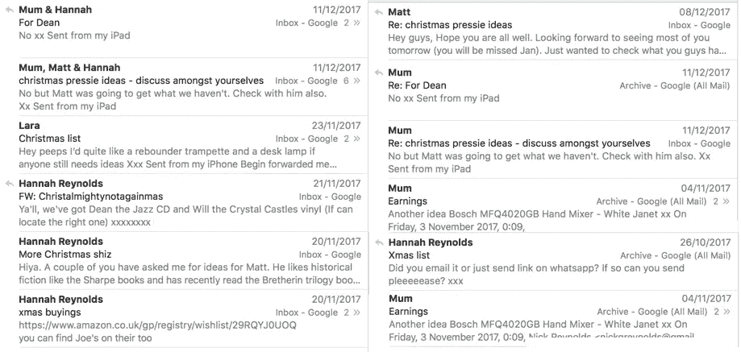
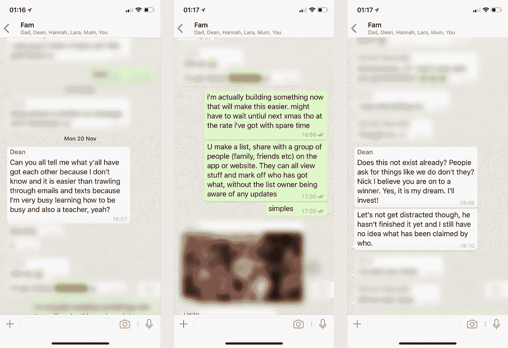
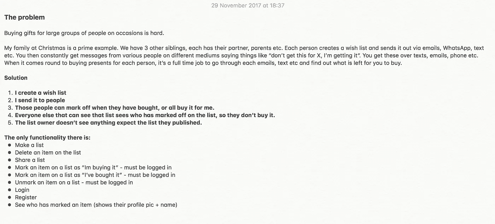
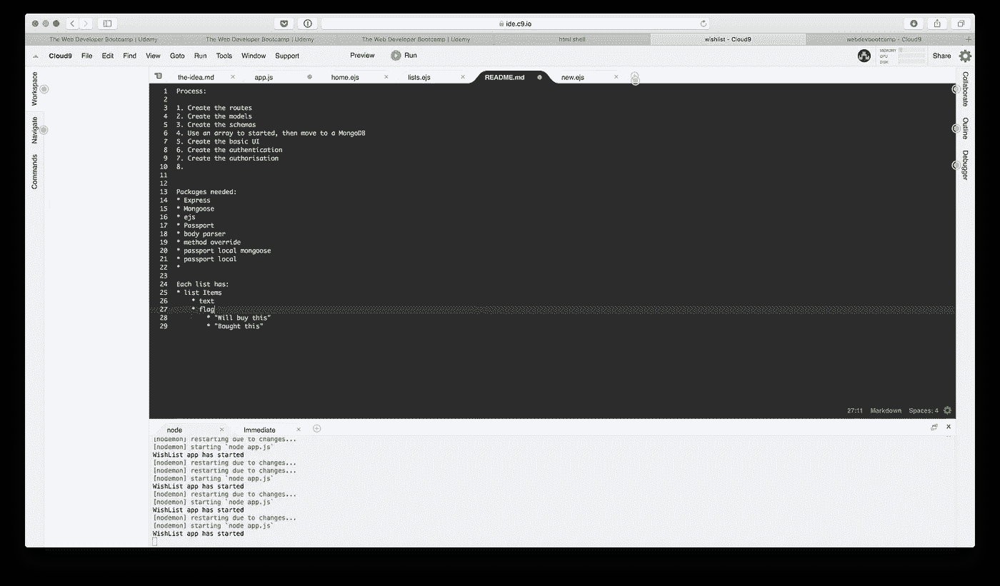
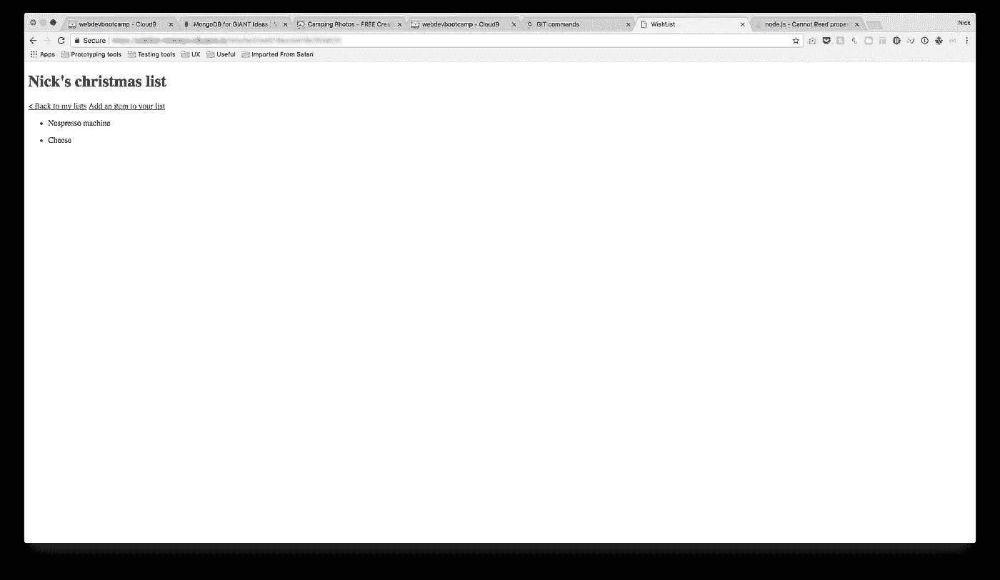

# 构建一个产品来解决我自己的问题:为什么我要构建 Wantt

> 原文：<https://medium.com/swlh/building-a-product-to-solve-my-own-problem-why-im-building-wantt-d9e9d5a9a8a4>

这是一个关于一个 UX 设计师学习编码的故事，他构建了一个迄今为止只解决了他们自己的问题的产品，以及学到的东西。

*这篇文章和后面的文章将讲述我的旅程，从解决我自己的问题开始，通过构建一个我称之为“Wantt”**的* [*产品来解决它，同时学习有价值的编码技巧。*](https://www.wantt.it)

*我的目标是讲述我作为一名设计师的编码方法，以及我所面临的挑战。希望这是一个很好的阅读其他设计师寻找建立自己的产品。*

# 自我介绍

我是[尼克](https://twitter.com/Nick__Reynolds)，UX &的产品设计师，一直想学习编码。我就像其他成千上万每天早上浏览[产品搜索](https://www.producthunt.com/)“今天”信息的梦想家一样，希望我能辞掉工作，做自己的事，而不是别人的。梦想有一天我会从我的东西上赚钱，然后在我的余生继续做更多的东西。然后摆个街边小吃摊..

我总是有想法，但从来没有将想法付诸实践的技能和决心。总有一些事情阻碍着我，不管是我缺乏编程能力，还是生活事件。

我可以验证想法，画出草图，与人交谈，但是，当实际构思一个软件或基于网络的产品时，我总是被基本原型的局限性所束缚。当然，我有朋友和联系人可以帮我，但有时你只想自己做。我没钱付给开发商或朋友，如果你不付钱给他们，你不能像这样:

> 伙计，你还没完成那个专题吗？

我在编码方面有些经验。我在大学时做过一些(RIP [ActionScript 3](https://en.wikipedia.org/wiki/ActionScript) )，实际上是以前端模板构建员的身份开始了我的职业生涯(尽管只有 3 个月)，这意味着我可以创建一个简单的网站并做一些基本的 JS。

我喜欢编程，这一直是我一直想填补的技能空白，为了自我实现，也为了帮助我的职业生涯。我不断受到像[孟到](https://twitter.com/MengTo)这样的设计师的启发，他们是完整的产品设计师包，能够构思、设计和建造他们想象的任何东西。

我意识到，为了能够开始在我的脑海中构建所有的想法，我至少需要了解完整的 web 开发，这样我就可以构建一些 MVP。我在 Udemy 上开了一个[全栈 web 开发课程(全面推荐这个)，这就是这个故事的开始..](https://www.udemy.com/the-web-developer-bootcamp/learn/v4/overview)

# 这个问题，以及这个想法

当【2017 年 10 月 1 日来到的时候，我已经学了一半了，我收到了妈妈发来的第一条关于圣诞节的短信..🤦🏻‍

> **妈妈:**圣诞礼物创意请 xx

她喜欢有备无患，祝福她。

随着 11 月的到来，我开始收到更多关于圣诞节的信息。这次是我的家人。

Behold: the full time job that is Christmas gift buying in my family..this is just some of the emails.

**今年圣诞节总共有:**

*   **多个群发邮件。相同的电子邮件有多个回复主题，每个主题都有不同的收件人，因为他们不想让别人看到他们给他们买了什么。混乱的🤷🏻‍**
*   **WhatsApp 的一个主要群组**，每个人都要求彼此给他们发送当前想法。
*   **多个 WhatsApp 群组**，每个群组都留出一个人来讨论每个人要给那个人买什么。通常群组的名字是被遗漏的人的名字，所以有时你会不小心回复了那个认为你把它发送到私人群组的人..哎哟🤦🏻‍.
*   **亚马逊愿望清单。**有些人发送了亚马逊愿望清单，这很好，但它有时不会删除已购买的商品，所以您仍然必须尝试找出谁购买了什么，以及有什么可以购买！
*   **谷歌文档。这是我的愿望清单。这是我试图将列表集中在一个地方，减少我必须做的工作量。这个想法是让每个人都看到我喜欢什么，他们可以在他们之间进行安排。成功了..一点点。人们忘记了链接，仍然存在人们不知道每个人买了什么的问题。如果他们标记为*“劳拉正在购买这个”*，我会看到，那就毁了这个惊喜！我知道..第一世界的问题..**
*   电话里的美好的老对话

**反正你大概是看到这里头疼吧。从我记事起，这种事每年都会发生。给你一些背景，我有三个兄弟姐妹，每个都有一个伴侣和父母。我们通常为每个人/夫妇买 1-3 份礼物..我开始想，一定有更好的方法。**

我看了几个“愿望清单”网站，但它们要么过于复杂和臃肿，要么只允许你添加他们正在出售的东西。我也看了几个应用程序，它们太臃肿，粘性不够。更不用说，为了让我的家人使用它，它必须非常容易使用，而且有粘性。

> 我想，去他妈的，我要自己做一个，并在这个过程中学习一些东西。

# 入门指南

我是 UX 职业选手。我以研究、设计和处理数码产品为生。所以，你可以想象我知道从哪里开始。

**识别问题:**对，打勾

**确定用户需求:**没错，打勾。我刚刚面试了我自己

**验证想法/需求:** Ermm..有点儿

这是当我对自己说，我不需要向任何其他人验证，除了我的家人。现在，我这样做是为了解决我和家人的问题，也是为了学习编码。如果我需要，我的家人也需要，这就是我需要的所有认可。我大脑的 UXer 那一面在内部死了一点，但是有意义。

That’s all the validation I need, onward!

## 竞争对手呢？

就像我之前说的，我用过几个，但是没有一个能让我真正坚持下来。此外，现在我真的不在乎是否有其他东西可以做得更好。我做这个是作为一个学习项目，如果它所带来的只是一个我可以在圣诞节简单地与我的朋友和家人一起使用的产品，并且我因此获得了编码技能..我没意见。

## 见见我的“项目简介”

1 白板草图之后，我准备开始编码！

**等等。什么，没有设计？**

不，我试着运行这个“精益”，我有不到一个月的圣诞节。我想在圣诞节前得到一些工作原型的验证。*请记住，我甚至还没有学到构建这个工具所需的课程部分。*

我开始编码。

Initial planning in progress, when I had reached a level in the course to plan the build of “wishlist”.

I ended up having to buy myself that Nespresso machine..

# 现在

目前，在撰写本文时(2018 年 4 月)，**我已经花了大约 4 个月的时间在晚上和周末开发这个产品。**我没能在圣诞节前完成一个基本的原型，但我在 1 月 10 日的生日时完成了👍。我的家人是我的测试员。在接下来的文章中了解它是如何进行的！

我把这个产品叫做 **wantt** ，因为你列出了你想要的东西，而“Want”是一个非常昂贵的域名..😉我就快有一个 MVP 了。我会用它，还有一些朋友和家人。不知道别人会不会觉得有用。

**我已经建立了上面的初始项目简介，所以用户可以期待:**

*   创建一个愿望清单，添加你想要的物品
*   与其他 Wantt 用户共享该列表
*   列表浏览者可以标出他们将要/已经购买的东西
*   一旦标出，其他任何人都不能标记该商品，你的名字会在你购买时显示出来
*   列表所有者看不到任何标记活动

**更新:**MVP 在 [https://www.wantt.it](https://www.wantt.it) 上线，你可以用它来满足你所有的送礼需求！我有 600 多个用户，一切都很顺利。当我可以的时候，我会带来新的特性，并且希望能够写一些关于我的进展的后续文章！

*我将在这个故事中发布更多的文章，跟踪我的开发过程，从项目设置，到高级特性(对于像我这样的新手来说是高级的)，以及部署。希望这也能对其他希望开发自己产品的人有所启发。敬请关注这些文章。*

你可以关注我这里，如果你喜欢以上漫谈的声音: [Twitter](https://twitter.com/Nick__Reynolds) ， [LinkedIn](http://www.linkedin.com/in/nickreynolds) ，[产品猎奇](https://www.producthunt.com/@nick__reynolds)。

## 这个故事发表在 [The Startup](https://medium.com/swlh) 上，这是 Medium 最大的创业刊物，拥有 313，216+人关注。

## 在此订阅接收[我们的头条新闻](http://growthsupply.com/the-startup-newsletter/)。

