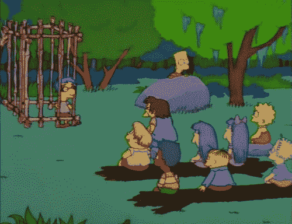

# 在产品开发领域建立销售团队

> 原文：<https://medium.com/swlh/building-a-sales-tribe-in-a-product-development-world-a6b977529f4f>

It’s not always so easy for us sales folks

成长阶段的公司可能过于关注用户增长，而收入是每个人脑海中一个遥远的想法。在开发人员与销售人员的比例更有利于编码人员的公司中，这一点尤其如此。虽然开发人员可以开发出令人惊叹的产品，让用户“哦”和“啊”，但从长远来看，如果没有引擎驱动顶线结果，如果资源变得稀薄，用户增长就会停滞。

对企业来说，重要的是要记住:**销售有助于为公司的愿景提供资金。**

这些公司面临的挑战是销售团队缓慢但不可避免的演变。这些是第一批被雇佣来加速公司成功的脾气暴躁、说话快且极具竞争力的员工。他们来自以销售为主导的大型公司，这些公司的文化与他们所习惯的不同，他们需要学习如何快速适应以产品为中心的环境。

我是那些从大公司(甲骨文)跳槽到小公司的销售人员之一。以下是我在产品开发主导的世界中建立成功销售渠道的过程中获得的一些有用的快速技巧。

## **销售团队的骨干应该是“支持文化”**

想象一下这样一个世界，你打电话给你的客户，他们很高兴听到你和你的推销。听起来像梦里的情形，对吗？如果你致力于客户保持和收入增长，你需要一个简单的销售周期给你的团队，那么关键是要有一个强大的支持文化。

如果支持是根深蒂固的，那么拥有一个友好的顾问式销售代表也会给你带来更好的回报。他们会更多地考虑“我如何帮助这个人？”而不是他们自己的佣金支票，并为开发团队提供巨大的红利，包括产品功能请求和真实客户案例反馈的良好联系。**这是销售人员可以提供的产品的一个好处，适用于所有企业，无论哪个行业。**

在获取客户方面，这种策略很有帮助，因为口碑对推荐很有帮助，当市场对你的产品有好感时，电话推销变得更容易。

## **测试！这不仅仅是产品的事情**

如果你在一家定价起点非常低的公司工作，如果你试图提高每月经常性收入(MRR)或每用户平均收入(ARPU)，你就需要找到价值所在。在我建立第一个成功的销售渠道之前，我已经参加了三次不同的销售测试。

我一路走来学到的是像对待科学实验一样对待测试。遵循科学方法，确保你正确地衡量你的观察、假设、预测、实验和结论。例如，如果你的目标是增加 ARPU，你的新销售团队未来成功的重要因素可以包括:你有多少管道，销售周期有多长，投资回报率将是多少。你必须在一个测试你的收入增长想法的框架内衡量这一点，以确保你可以复制你的成功和规模。

当销售成为一门学问，就变得可以预测，可以预测的收益就是最好的那种。这正是你的产品同行希望看到的，如果他们将来能为你做些什么的话。你越是说他们的语言，向他们展示你的测试将会产生的潜在影响，他们就越能接受你的输入和想法。

## **了解增长的重要指标**

在我的 SaaS 世界和销售部门，我遵循 CAC(客户获取成本)比率。作为一名销售人员，我总是把收入作为我的关注点，但我的注册会计师/商业管理硕士/工商管理硕士学位也让我考虑利润。您的销售团队的 CAC 比率将有助于确定何时扩大规模以及何时维持现有规模。这里有一篇由 Bessemer Venture Partners 撰写的[优秀文章](https://bvp.app.box.com/v/10lawsofcloudcomputing)，为你很好地分解了 CAC 比率；我强烈推荐。

基本前提是这样的:取两个季度之间的毛利率，年化后除以上一季度的成本。如果你的 CAC 比> 1.0，那就多投资！如果是< 0.33 then something is wrong. If it’s between 0.33 and 1, then focus on productivity improvement.

If you follow this method you’ll grow your sales team properly and keep your finance folks happy.

While the sales teams’ success is good news for everyone, the view from within the Product Development world may be clouded by the short term demands of their jobs (and oh boy what a demanding job it is!). Product teams are concerned about their weekly/quarterly/annual goals and their deadlines; they live in a world of sprints and launches. As such, presenting your Product team with a list of daily demands on what you think is best can conflict with what they’ve been trying to solve for weeks.

It is really important that you can understand what they’re focused on because **,那就是你产品的发展方向，也是你必须销售的产品。**

一些公司遵循 OKR(目标和关键结果)流程。这是一个很棒的系统，因为它让公司里的每个人都能看到每个人都在做什么。

如果你要建立一个测试，最好把你自己和这些目标联系起来，看看你如何有效地促进和提高他们的关键结果。

## **如何达到功德**

一切都是为了团结。如果你目前生活在一个产品开发的世界里，因为你需要改变来使你的销售生活更容易，你需要后退一步，想想你对他们有什么要求。你的工作和他们的工作一致吗？如果没有，那么这是你在现有渠道之外学习并成为一名内部企业家的机会！

我得到的最好的建议之一来自一位产品经理:

> "*如果你要我给你做点什么，你必须先问问自己:产品经理没有做什么，因为他们在给我做什么？*

保持冷静，记住你们都是一伙的。产品人员希望帮助大众，而你希望为公司赚钱，这样你就能接触到大众。通过交付一个结构化的、经过测试的商业案例，你将能够推动公司前进，而不是原地打转。永远寻求和谐，记住帮助他们理解你的观点是你的工作。

一旦你最终获得了协同效应，产品到位，所有的障碍都将消失，执行完全取决于你和你的销售团队。