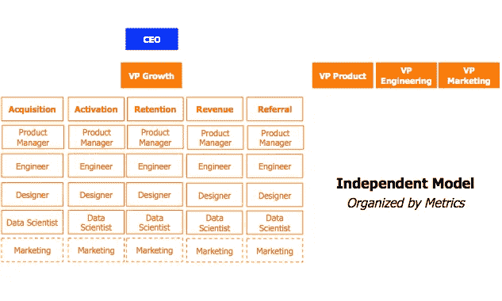
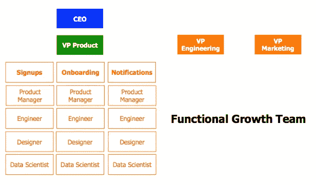

# 建立世界级的成长团队。

> 原文：<https://medium.com/swlh/building-a-world-class-growth-team-25cb508e666d>

采访格林斯基增长副总裁马特·比文斯和古斯特前增长主管尼克·索曼。

建立一个增长团队已经成为几乎所有初创公司创始人的新困扰之一。更多的传统行业也越来越重视这种类型的团队结构。

不仅如此，现在人们越来越有兴趣了解支配增长和商业战略的基本原则。

今天，超过 2130 家公司——基于发表本文之前从 [AngelList](https://angel.co/) 获得的数据——正在寻找与增长角色相关的人，并且“增长黑客”和“增长营销”这两个术语在过去 5 年中一直在[的谷歌](https://trends.google.com/trends/explore?date=2013-06-28%202017-07-28&geo=US&q=growth%20hacking,growth%20marketing)中流行。

这可能是一个很好的理由，正如保罗·格拉厄姆早在 2012 年在他的文章[“创业=成长”](http://www.paulgraham.com/growth.html) *:* “唯一重要的事情就是成长。我们与初创公司相关的其他一切都源于增长。”

但如今，科技初创企业环境中的增长与特定角色或一套策略的关系更少，而更多的是围绕在组织周围建立增长流程和数据驱动型文化的基础工作。

正如[肖恩·埃利斯](https://twitter.com/SeanEllis)和[摩根·布朗](https://twitter.com/morganb)在他们的《黑客成长**:**

**“通过打破传统的业务孤岛，组建跨职能的协作团队，将具有分析、工程、产品管理和营销专业知识的员工聚集在一起，growth hacking 使公司能够有效地将强大的数据分析和技术知识与营销技能结合起来，快速设计出更有前途的方式来推动增长”**

*像脸书、优步、Airbnb 这样的公司，甚至在这里的 [Earnest](https://www.earnest.com/) 也已经意识到，实现这一目标的唯一途径是摆脱传统的职能组织设计，建立一个支持快速增长环境的跨职能增长团队。*

*考虑到这一点，您在考虑增长时需要回答的一些关键问题可能包括:*

*1.什么时候是开始考虑增长的合适时机？*

*2.成长团队的正确结构是什么？*

*3.谁是你成长团队中的关键人物？*

*为了回答这个问题，我采访了 [Gusto](https://gusto.com/) 前增长主管[尼克·索曼](https://medium.com/u/d6ec26c9bd33?source=post_page-----25cb508e666d--------------------------------)和[马特·比文斯](https://medium.com/u/5f4e31ad5a18?source=post_page-----25cb508e666d--------------------------------)，他是我在 Earnest 的前经理，现在是 [Greensky](https://www.greenskycredit.com/) 的增长副总裁，以更好地了解如何建立一个世界级的增长团队的最佳实践和想法。*

# ***思考第一天的成长***

*并非所有的公司天生都有相同的增长潜力。*

*对一些公司来说，增长是产品本身的副产品。像 Slack、Twitter、脸书、Airbnb growth 这样的公司已经能够以有机的方式呈指数级增长，这是因为这些产品固有的网络效应。*

*但现实是，对大多数公司来说，增长是一个更慢、更困难的过程，尽管他们拥有令人惊叹的产品和喜爱这些产品的客户。*

*尼克·索曼(Nick Soman at Gusto)说，一家公司的竞争优势不再仅仅在于产品本身，还在于成长的战略过程。公司的竞争优势现在由两个因素分享:*

1.  *打造人们喜爱的产品*
2.  *知道如何有效地种植这种产品*

*“今天比十年前更容易制造出伟大的产品，更多的公司每天都在制造越来越多的产品，”索曼说。“如果你的技术没有每天都变得非常好，或者你的产品没有创造网络效应，你需要依靠你的成长过程作为一个差异化因素”*

> *请给尼克鼓掌！*

*索曼说，他认为公司需要从第一天起就将增长视为可持续的竞争优势。*

*一个明显的例子是，对于公司来说，拥有一个定义良好的 SEO 策略有多么重要，它可以帮助他们利用有机收购渠道，并降低他们的长期收购成本。*

*像 Moz、Buffer、Hubspot 和 Airbnb 这样的公司是研究如何从总体角度和收购效率角度思考增长的著名案例，这些案例帮助他们发展了业务。*

*如果你想知道从哪里开始你的 SEO 策略，这里有一些需要考虑的要点。*

# ***了解贵公司所处的阶段***

*虽然思考我们之前在第一天描述的内容很重要，但 Matt Bivons 补充说，了解你作为一家公司或初创公司处于哪个阶段对于了解何时拉动什么增长杠杆至关重要。**“增长=速度，而速度是当今市场的竞争优势，”**比文斯说。*

*有一个很好的类比来理解这一点，那就是将[增长与金矿开采进行比较。](https://venturebeat.com/2015/08/11/growth-hacking-has-two-phases-and-using-the-wrong-one-can-sink-you/)*

**探矿阶段* —前系列 A /前 PMF*

*你正在做许多零碎的事情，测试假设，看看你是否能找到黄金。*

**矿工阶段* —后意甲/后 PMF*

*你发现了黄金，现在你开始安排开采这些黄金所需的流程和人员。*

**

*两种心态——探矿者和采矿者——在实现目标所需的策略和战略方面是不同的，在成长团队所需的资源和人员方面也是不同的。*

*了解你的公司所处的阶段，以及从长远来看，成长如何成为一种竞争优势，是创造成功成长文化的第一步。*

# ***构建您的成长团队***

*对 Matt 来说，无论公司类型、所处阶段或商业模式如何，成长团队都有两个基本要素。*

*“一个成长团队的核心论点是 1)减少摩擦，2)加速客户感知的价值，”他说。“这两个组件 100%依赖于您的产品。这就是为什么你需要围绕以产品为中心的人来构建你的增长团队。”*

> *请为马特鼓掌！*

*这一点非常重要，因为你需要一个团队结构，能够在提出正确的问题和测试每一个假设的文化下支持和发展。这些是成长团队需要不断寻找答案的一些问题:*

*   *你的客户如何与你的产品互动？*
*   *对你的客户来说，什么是真正重要的？*
*   *你的产品如何尽快提供/解决这种体验/痛苦？*

*尼克补充说，同样重要的是，创始人需要参与其中，否则一个成长型团队要取得成功将非常困难。*

*“由于增长的运作方式与大多数组织中的其他领域不同，对于一个健康的增长团队来说，围绕着创造用户体验和开发创始人需要参与的产品，有一些活动是正常的，”他说，“至少在对这些活动的理解和优先排序方面，否则增长团队会不断被推回去。”*

*考虑到这一点，接下来的步骤将是开始考虑你的组织想要如何构建这个团队，以及这个团队应该向谁报告。然而，这个问题没有简单的答案。*

*安德鲁·麦金尼斯有一篇很棒的文章《[你如何选择最佳的成长团队模式？](/swlh/how-do-you-choose-the-best-growth-team-model-632ad5a85be9)“这是 Pinterest、优步和 Dropbox 等科技巨头构建成长团队最常用的两种模式:*

1.  *独立模式——脸书优步*

**

***Andrew McInnes***

*成长团队在组织内部独立工作，团队有自主权来优先考虑他们的工作和他们自己的资源来实现这些目标。*

1.  *功能模型——Pinterest、Dropbox、Twitter*

**

***Andrew McInnes***

*增长团队直接向产品、营销、工程等职能部门负责人汇报，这使得增长目标、路线图和预算与公司的特定领域保持一致。*

*从报告、目标和预算的角度来看，这两种模式各有利弊。没有正确的答案，但对 Matt 来说，你能做的最重要的事情是与更大的公司目标保持一致。*

*正如 Matt Bivons 所言，“你需要专注于公司内部最重要的目标，并确保根据这些目标衡量最有价值的指标”。“然后问问你需要关注和执行的资源是什么，你如何组织你的团队来实现它。”*

*打造这支队伍不会是一朝一夕的事情。从小处着手，缩小你的关注点，制定必要的流程来帮助你的团队走向成功。*

# ***你的一线队员***

*Matt 和 Nick 都强调了围绕**以产品为中心的人来建立您的增长团队的重要性。***

**

*This What A-Team Looks Like!*

*要澄清的是，以产品为中心的人，他们指的是理解增长源于对客户如何使用你的产品、你的漏斗如何围绕你的产品建立以及你在哪里可以找到产品渠道契合点的深刻理解的个人贡献者。*

*因此，成长团队的关键成员将取决于你在公司的哪个阶段。回到我们之前的类比，你是在采矿还是勘探？成功的目标和衡量标准是什么，你有什么资源来建立这个团队？*

*对于 Matt 来说，根据上面描述的因素，一个 MVP 成长团队可能只是一对产品意识的多面手，他们试图找出什么是有效的。能身兼数职的好斗的人。他说，他认为，如果你还不了解哪些渠道或垂直行业可以为你的公司带来有意义的价值和增长，那么雇佣一个特定的角色是没有用的。“随着产品的成熟，你知道什么是有效的，你可以让你的成长团队专注于指标或功能。成长是产品、工程和营销人才的结合。”*

*他所说的“通才”指的是数据驱动型和分析型人才，他们了解漏斗的每一步，拥有运行不同采集渠道的经验，并且具备能够在不依赖工程资源的情况下实施和测试事物的基本技术知识。*

*就个人而言；如果你是成长型营销的新手，并且你想对这个职位有更多的了解，我会推荐你阅读我写的这篇文章作为个人指南——[“成为成长型营销新员工第一个月的成功路线图”](/tradecraft-traction/succeed-as-a-growth-marketing-hire-c1bc44f295e0)*

*另一方面，Nick 认为，在考虑组建一个成长型团队时，有三个关键角色需要雇佣。*

> *o 产品经理*
> 
> *o 产品设计师*
> 
> *o 产品开发人员*

*有趣的是，Nick 说没有必要从这些角色中的一个开始。举例来说，你的公司可能决定从三名内部工程师开始，其中每一个人负责一个领域，或者一名营销人员和一名设计师，等等。*

*在招聘这些职位时，尼克想到的一个关键点是:**“聘用那些很难让人生气的成长型人才”***

*如果没有人对你的成长团队生气，这意味着他们不够积极或挑战极限，但如果公司的人一直对他们生气，这将使他们的工作变得非常困难。*

*他们两人一直在重复的一点是，无论你雇佣谁来担任增长角色，你都需要确保你雇佣的人具有出色的沟通技巧、数据驱动的思维模式、以产品/用户为中心，并且必须足够好奇，能够质疑和测试发现的每一个假设和假说。*

# ***向前移动***

*正如我之前提到的，建立一个成长团队没有正确的方法。每个公司都有不同的需求和挑战需要解决，这将使你的成长团队独一无二。*

*然而，还有最后一件非常重要的事情(向*黑客增长*脱帽致敬)。*

**成长不能是副业。**

*成长是你不能随意开启和关闭的东西，如果你想成为一家成功和可持续发展的公司，成长必须是你组织内部基础工作和文化的一部分*

*如果你是创始人**你**需要成为第一个成长型的人；如果你是员工**，你**需要成为成长文化的倡导者。*

*从你拥有的资源开始，花必要的时间来计划和构建你想如何实现这一目标，并尽快播下必要的种子，这样你就可以让你的成长团队走向成功。*

**特别感谢马特和尼克，感谢他们的时间和分享这些惊人知识的良好意愿！**

**

***Please one final clap for them!***

*我很想和你聊聊，了解一下你的经历！请随时拨打 [**Matias Honorato**](https://twitter.com/Mati_Honorato) 联系我。*

**

*Enjoyed that read? Click the ❤ below to recommend it to other interested readers!*

*任何语法、拼写或标点错误，请告诉我。所以我可以不断提高我的英语…最好！*

**

## *这个故事发表在 [The Startup](https://medium.com/swlh) 上，这是 Medium 针对企业家和初创公司的领先出版物。*

# *你可以订阅[在这里获取头条](http://growthsupply.com/the-startup-newsletter/)。*

**