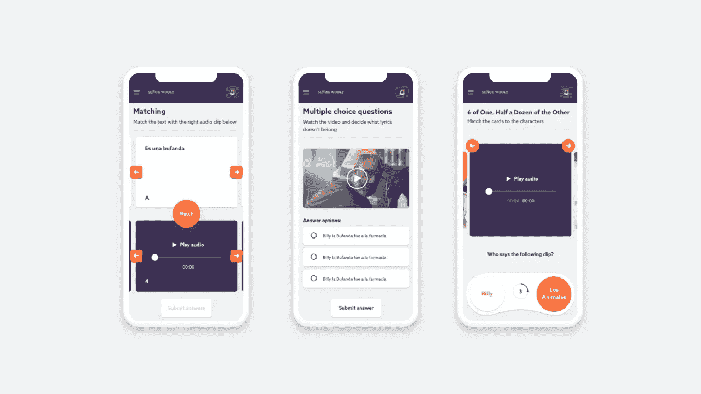
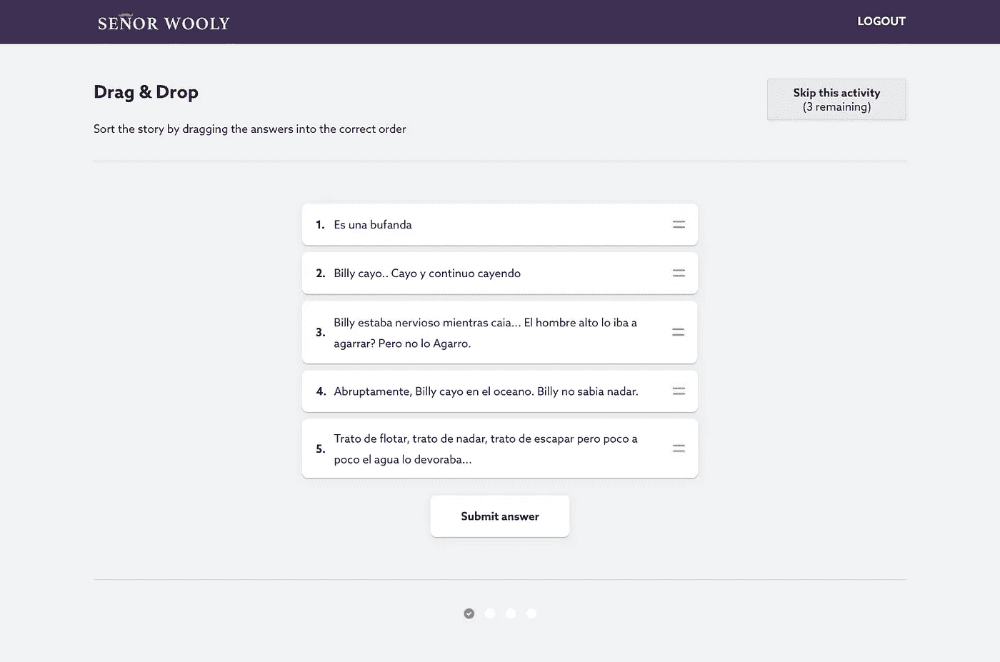
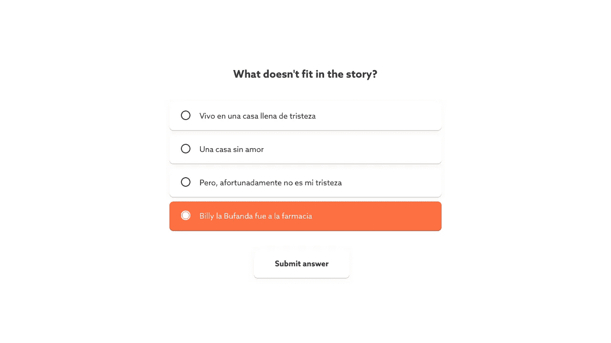

# 构建电子学习应用程序

> 原文：<https://medium.com/swlh/building-an-e-learning-app-18843603ef4b>

我们对这个市场为何如此重要的看法。

some designs we made with [moij.co](http://moij.co)

在高中，我是一个糟糕的学生。我没有做作业，一次又一次地失败了许多考试。这导致我去了私立学校，在那里我通过了考试，后来发现了我的激情:创造和制造产品。

在大学帮助我找到兴趣的地方，我很快又对课程感到厌倦。

当前的学校系统面临着许多障碍。这些问题中的许多成为许多试图解决学习机构失败的创业公司的方法。

这些创业公司从零开始为特定群体打造产品。他们做研究，在没有董事会和政府的情况下做决定，并根据用户的反馈快速行动和迭代。

当这样的公司制造出劣质产品时，他们将找不到合适的市场。大约一年后，它们将不复存在，为表现更好的公司腾出位置。

他们专注于:

👍玩起来很有趣的伟大产品

👩‍💻确保用户学到一些东西

👨‍🏫帮助老师:教学

👬连接人们

🔎发现兴趣

👩‍🎓确保用户树立信心

不到两年前，我们开始帮助一个电子学习平台改进他们的产品。我们现在处于测试阶段。下学年，他们将推出他们的新版本。

这篇文章是关于我们构建产品的经历，为什么我们认为这很重要，以及我们学到的经验教训。

## 学习新事物是很可怕的。

当你学习新的东西时，你总是感到有点焦虑。这超出了你的舒适区。除了焦虑之外，这个区域总是有一些肾上腺素、好奇心和动力。

> "告诉我，我会忘记；教我，我会记住；让我参与，我会学习."―本杰明·富兰克林

wooly 先生是美国学生学习西班牙语的平台。由一位西班牙语老师领导的公司正试图解决我们如何学习的一些困惑。

some work in progress

他们创造了数量惊人的内容、视频和故事情节，为教师提供工具，让学生可以按照自己的节奏学习一门全新的语言。线上线下。

他们认为学习应该是有趣的，没有任何真正的压力。这种开放的态度对我来说很有启发。

他们围绕一个故事开发产品。他们正在建立一个品牌，用音乐、视频、书籍和商品让人们爱上他们所做的事情:学习。

我们帮助他们用新产品设计了这种有趣的方法&我们正在开发一些新游戏。

## 学习应该从一开始就充满乐趣。

当你学习新事物的时候，你会有各种各样的情绪。一方面这很令人兴奋，但在某些时候也很困难。我们都有拖延的时候。考虑激励用户不断学习和进步的特性是很重要的。

开始很重要。

确保用户可以直接看到他们上次停止的地方。同样重要的是，他们可以直接看到自己取得了哪些进展，以及当前最重要的任务是什么。

学习新的东西应该是有效的，除了知识本身之外没有障碍的东西。

## 手机友好游戏。

我们首先设计了所有的手机游戏。我们在寻找简单的互动模式，这样学生就可以专注于手头的任务；学习一门新语言。与产品的交互应该是直观的。

从纸上原型，到可点击的演示和 HTML 中的工作概念。我们全都做到了。

最终结果是在 React.js 和 Go 中开发，以获得更好的用户体验。因为设计和交互应该是完美的，平台的速度是其中重要的一部分。这两种语言使之成为可能。

该平台处理大量视频、音频文件和图像。所以这是一个真正的挑战。

我们现在正在优化所有设备的一切。交互方式和移动端几乎一模一样。再次强调:一致性就是一切。

## 游戏化

2014 年的流行语。但是学习新的东西，当然，作为一个小孩子，需要一些额外的动力。赢取积分有助于您进入下一关，同时您还可以赢取徽章和新头像。这个词可能已经过时了，但是它背后的含义是我们都需要的，去做的额外动力。

## 后续步骤

我在大学里最大的问题是学生和他们实际能做的之间的巨大差异。软件可以通过为每个学生提供适合他们特定知识水平的个性化环境来解决这个问题。他们学习的速度不同，但他们的兴趣也不同。技术有潜力适应这些变量。

希望在未来的 5 年里，学校将更加关注生活的心理方面；在我们的大脑如何工作，同理心，自我意识，销售和耐心。更多地关注宏观层面的主题，而不是那些可以在 5 秒钟内搜索到的东西。

一些朋友，去了完全不同的大学，现在有完全一样的工作。

希望科技可以把有相同兴趣的人聚集在一起。像“经济学院”这样更广泛的研究应该成为过去。话题应该缩小到详细的主题。全球最好的老师为课程增值。

教育系统中的许多问题都太大而难以覆盖，更不用说马上提出解决方案了。

从大学退学不应该是一种荣誉。但是在这个快速发展的世界里，改变是必要的。

我对学校的经验是，他们在寻求对过去正确的价值观的信心。然而，他们应该把注意力集中在如何正确的明天。

—

感谢您阅读这篇文章，并希望听到您的反馈！如果你想了解更多关于这个项目给我发电子邮件斯文在[*【moij.co】*](http://moij.co) *然后我可以给我们做的工作更多的细节。*

## 这篇文章发表在《创业公司》杂志上，这是 Medium 最大的创业刊物，有 306，792 人关注。

## 订阅接收[我们的头条新闻](http://growthsupply.com/the-startup-newsletter/)。

