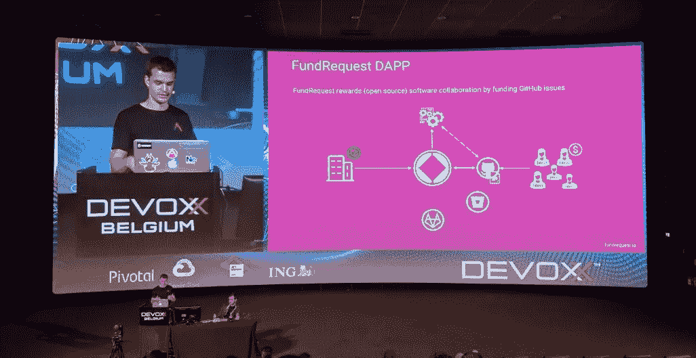

# 零知识构建区块链应用

> 原文：<https://medium.com/swlh/building-blockchain-d-apps-with-zero-knowledge-e34c871c658c>

## 我们在欧洲最大的 Java 会议 Devoxx 2018 上的演讲

在开发 FundRequest 时，我们注意到构建区块链应用程序不是一件简单的事情。学习曲线是陡峭的，要使一个(d)应用程序可扩展有很大的缺陷，更不用说用户友好了。简而言之，最终用户不应该是火箭科学家来使用基于区块链的应用程序。

这就是为什么我们想出了 Arkane 网络。Arkane 让应用开发者能够开发区块链应用，而不需要深入的区块链知识。这使他们能够专注于应用程序、用户和优化体验。开发者和企业可以使用我们的 API，让所有人都可以访问区块链。

在下面的视频中，我们将探索如何使用这些 API 来构建应用。

[Arkane.network](https://arkane.network/) in collaboration with [FundRequest.io](https://fundrequest.io/)

## 这篇文章发表在 [The Startup](https://medium.com/swlh) 上，这是 Medium 最大的创业刊物，有+390，426 人关注。

## 订阅接收[我们的头条新闻](http://growthsupply.com/the-startup-newsletter/)。

