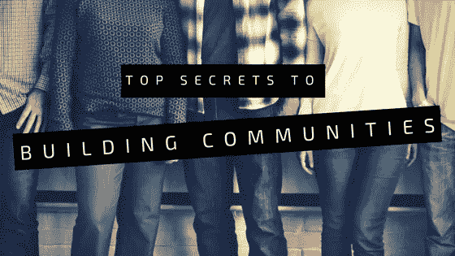
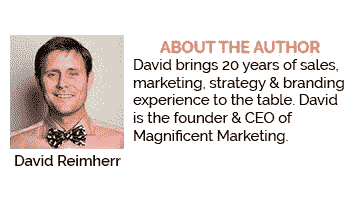

# 建设社区:基尼·迪特里希泄露她的秘密

> 原文：<https://medium.com/swlh/building-communities-gini-dietrich-spills-her-secrets-96e063a19d63>

Community Building

Gini Dietrich 是总部位于芝加哥的整合营销传播公司 Arment Dietrich 的创始人兼首席执行官，Spin Sucks 的首席博主,《全面营销》的合著者，以及每周播客 Inside PR 的联合主持人。

基尼花了近十年的时间建立了一个“狂热的”(令人羡慕的)职业社区:她的受众庞大、忠诚且积极参与。

她让这看起来很容易，但建立一个稳固的在线社区是一个相当大的挑战。

今天，Gini 解释了她是如何走到今天这一步的，并为各行各业和社交媒体层面的专业人士提供了一些内幕提示。

# 她是怎么来的

时间！建立一个稳固的职业社区不会一蹴而就。

对于基尼来说，这就像是在其他领域努力工作的结果,*发生了。*

2006 年，她的团队没有给他们的博客太多关注。事实上，这更多的是事后的想法。当时，社交媒体参与并不是一个重要的考虑因素。

事实上，她的网络团队没有组织，缺乏方向。他们没有可靠的编辑流程，也没有首席内容官。

当经济衰退来袭时，基尼不得不做出一些不舒服的选择。她决定最好的办法是接管自己的博客和 T4 的社交媒体。

Gini 开始每周只写两篇博客，她基本上是从零开始。

那么她是怎么走到这一步的呢？通过伸出手。

Gini 花了很多时间在社交媒体上与人们互动。她会回复收到的每一条评论，同时对其他人的内容左顾右盼。

她认为如果有人花时间评论，她至少可以回复。

这很有效:最终，人们开始关注她。

# GINI 的秘密

Gini 开始她的博客并不是为了吸引超过 40，000 名粉丝和建立一个活跃的社区。

然而，这是一个很好的副作用。

# 1.大胆一点

Gini 刚出道的时候，不管是自己的内容还是别人有价值的内容，她都会尽可能的分享。

人们喜欢听到对他们工作的认可，所以不要害怕评论、标记和接触感兴趣的关键人物。他们甚至可能会跟踪你回来。

早些时候，Gini 写了一篇关于穿牛仔裤参加付费活动的有点争议的博客。有些人喜欢它，而有些人讨厌它。不管怎样，这引起了她所在行业一些知名人士的注意。

# 2.变得有风度

在现实生活中，会见专业人士和建立社区对每个人来说都是充满焦虑的经历。

多亏了社交媒体，你可以和看似遥不可及的人发展相对私人的关系。我们都想要通过提供价值来丰富我们生活的社区。

开始对话，评论你的意见可以产生影响的地方，加入专业团体。

奖励你的观众，让他们知道你重视他们的存在。Gini 喜欢每个月给一个特殊的追随者提供一个爆米花篮子。这不仅让人感觉良好，而且也有助于推荐。

# 3.在意别人的想法

建立一个大型社区是一回事，但是你如何鼓励参与呢？简而言之:关心他们的想法。

记住，这并不意味着你必须一直取悦每个人。提出不同的观点，鼓励相互尊重的辩论或交流。基尼说，这是专业话语中明显缺乏的东西。

同时，你想为你的社区提供有意义的价值和优秀的内容。你不能不问他们的想法就这么做。

基尼建议直接提问:让你的追随者填写调查问卷或开发你自己的方法。她甚至利用自己的调查结果来建立推荐、联系和可靠的反向链接。双赢！

# 4.承担风险，适应变化

建设社区是一个动态的过程。当你的粉丝达到 5 万人时，对你创业有用的东西不一定有用。

在某种程度上，回复每一条评论几乎是不可能的。然而，你仍然需要继续建立你的社区，吸引追随者，对不对？

因此，制定一个适合你的计划，并准备好承担一些风险。社交媒体千变万化，十年前奏效的策略不再奏效。

基尼曾经尝试推出在线会员课程。失败了，但她没有放弃。

她问她的追随者他们想要什么，最终开发了一个一次性的网上研讨会，并取得了巨大的成功。

# 寻找您的社区

无论你的职业是什么，你都可以建立一个稳固的社区。

记得给你的观众提供有价值的内容和资源。如果你是从零开始，继续接触。与你所在领域感兴趣的关键人物或任何看起来感兴趣的人发展网上关系。

通过卡片、礼物或其他奖励，你可能最终将这些关系带入现实世界。让人们知道你关心他们的需求，你想为他们的生活提供价值。

做好跳出框框思考的准备，尽可能走出你的舒适区。建立一个在线职业社区并非没有风险。记得从错误中吸取教训，继续前进。

无论你是律师、记者还是营销专家，你都可以建立一个敬业的职业社区。只是需要一些努力和决心。

Gini Dietrich

# 关于 GINI·迪特里希

Gini Dietrich 是 Arment Dietrich 的创始人兼首席执行官，Arment Dietrich 是一家总部位于 T2 的整合营销传播公司。她也是公关和营销专业人士的[专业发展网站](http://spinsuckspro.com/)、Spin Sucks Pro 的创始人，以及《全面营销的合著者[。](http://www.amazon.com/Marketing-Round-Multichannel-Approaches-Post-Social/dp/0789749173/ref=sr_1_1?ie=UTF8&qid=1323447451&sr=8-1)

Gini 是*公关和营销博客* Spin Sucks 的作者，该博客是 2012 年 Cision 100 强博客、2010 年和 2011 年年度读者选择博客、Junta42 排名前 42 的内容营销博客、Social Media Examiner 排名前 10 的社交媒体博客和 AdAge Power 150 博客。她还是 Inside PR 的联合主持人，这是一个关于沟通、社交媒体以及它们相遇和相交的每周播客。

Magnificent Marketing — Austin, TX

## 这篇文章发表在 [The Startup](https://medium.com/swlh) 上，这是 Medium 最大的创业刊物，拥有+ 380，756 名读者。

## 在此订阅接收[我们的头条新闻](http://growthsupply.com/the-startup-newsletter/)。

