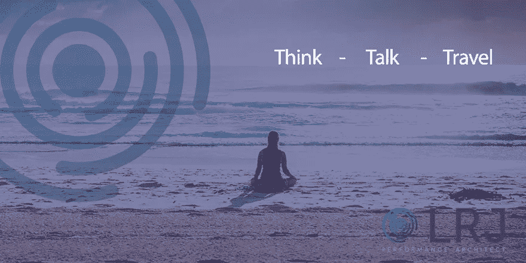

# 通过学习建立信誉……..开始行动的三个 T

> 原文：<https://medium.com/swlh/building-credibility-through-learning-the-three-ts-to-getting-started-23849c4d64a5>

看到了足够多的建议和机会让你在 2018 年前进，但只是想要一些东西让你开始？

关于成功和机遇的三个行动的简洁博客

# 思考的时间

> 思考是优化你惊人的潜意识力量的机会，而不是被你的意识不断击倒

有限的时间、截止日期和人们想要你的一部分(无论是家人、朋友还是工作)意味着我们经常忽视停下来思考的价值。许多“专家”都写过这种价值，包括南希·克莱恩([思考时间](http://www.timetothink.com/))和[肖恩·阿彻](http://www.shawnachor.com/the-books/the-happiness-advantage/) ( [幸福优势](https://www.youtube.com/watch?v=TBRy3QrRGFI))但是成功空间的概念已经存在了几个世纪。我提供三次机会#开始:

a.**将闹钟** **提前 15 分钟**坐在床上，花时间思考和反省。(我就知道夜猫子能做到这一点！)

b.在你回家/继续下一个承诺之前，休息 5 分钟。什么都不做就是做点什么，每个人都会从你不同的个性和想法中受益。

c.**停止**散步、跑步、游泳或者只是坐着闭上眼睛。(如果你选择坐着，戴上耳机并不会让你看起来很傻！)

# 讨论

> 交谈是交流、分享和学习的最古老的方式。它在今天和在我们之前的几年一样有价值。

正如马克·布里兹所说:

知识不存在于我们内心，而是存在于我们之间，存在于我们的对话中

我们认为交谈是一种奢侈品，只有那些“有时间”的人才能负担得起。我最近在 CIPD 与安迪·兰卡斯特交谈，在交谈快结束时，他说让我们进行更多这样的交谈。

当我乘火车回家的时候，我在想这是一个骗局还是一个机会。带着积极的心态，我选择了第二个选择，因为分享的价值是惊人的。

每次谈话都有学习和做出选择的机会。作为专业人士、父母、朋友、教练和社区成员，我们都可以支持他人，同时学习。这里有三种方法可以让你#开始:

a.指导某人——我们都有知识、智慧和不同的视角。无论社区如何，接受挑战，看看你一路上学到了什么，得到了什么样的微笑。

b.**成立一个兴趣小组**——随着我们今天所知的“角色”的演变，工作看起来更像是团队中的短期项目，来来去去。这是一个建立你自己的多元化小组来学习、分享和解决问题的机会。

c.**与你职业/兴趣领域的人交流**并思考结果，你会对自己学到的东西感到惊讶。每周五 0800hrs GMT，试试#LDInsight 怎么样？

# **旅行**

> 旅行是创造力、创新和机遇的源泉。它可以存在于身体和/或思想中。

几个世纪前，人们带着很少或没有资源去寻找新事物和希望。今天的气候意味着这没有什么不同。

a.**散步开会**。在她的 TED 演讲中，Nilofer Merchant 分享了一个关于健康和生产力益处的精彩简短演讲。试一试，沿着这条路走几步。

b.去不同的地方。无论你是在家里的不同房间工作，还是去一个新的城市或阅读不同的东西，新的经历都会创造不同的视角和机会。

c.**前往未知的地方**。做一些能让你伸展一下的事情，去你舒适区的边缘旅行。写博客怎么样？读一本不同类型的小说，尝试一种新的咖啡，或者一周不喝。

你注意到这里的一个主题了吗？学问

学习是所有成功故事的核心。不要错过，腾出时间去思考、交谈和旅行，记得说声谢谢！

*如果能听听你的经历，以及有什么机会和收获，那将会非常棒。快乐学习和发展。*

## 这个故事发表在 [The Startup](https://medium.com/swlh) 上，这是 Medium 最大的企业家出版物，拥有 281，454+人。

## 在这里订阅接收[我们的头条新闻](http://growthsupply.com/the-startup-newsletter/)。

