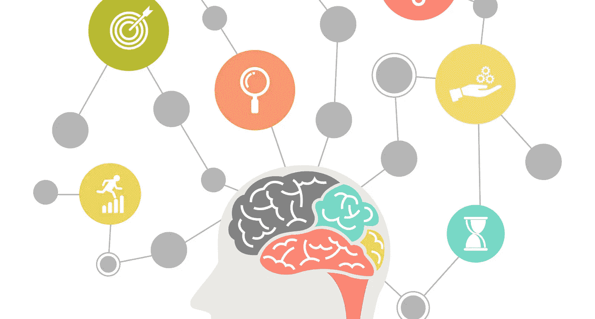

# 构建高度信任的产品:用户体验中信任的神经科学是什么？

> 原文：<https://medium.com/swlh/building-high-trust-products-what-is-neuroscience-of-trust-in-user-experience-5b1bc974690a>

当你的顾客、用户和客户与你的产品互动时，他们的大脑在发生什么？

用户体验的一个方面是信任的元素，大多数产品设计团队没有考虑到或者认为这不是 UX 设计的组成部分。我们把这留给业务开发团队或品牌战略家。

我们想把病毒设计到消费产品中。我们希望我们的 b2b 产品是直观的。虽然大多数时候我们忘记了我们可以并且应该将**信任**设计到用户与我们的产品交互时的体验中。

你如何将信任设计到产品中？当你的客户与你的产品互动时，你应该做什么或不应该做什么来促进他们大脑中产生快乐的催产素的释放。

在阅读了[保罗·j·扎克](https://www.linkedin.com/in/paul-zak-91123510/)(一位著名的神经经济学家)关于组织文化的著作后，我开始测试一种理论，即建立在信任文化基础上的以员工为中心的组织结构可能对企业有益，以及这种结构如何或是否可以在产品用户体验场景中复制。

# 一些问题是:

*   用户使用我们的应用、网络或平台是因为他们信任我们的产品吗？
*   信任与人机交互有很大关系吗？
*   如果是，那么您如何构建高信任度的产品？什么是用户体验信任的神经科学？

在普遍接受的“嘿，那个东西或人看起来很好或很漂亮”的定义中，大多数时候，你只是知道你和那个东西或人之间不会有结果。大多数时候，你无法理解这些感觉和结论的原因。为什么不能相信那个人或者那个事？这并不是说你不喜欢它或喜欢这个人，只是缺少了信任的元素，无论这个人或这个产品对你来说有多漂亮和好看，关系和互动都会被打破。

> 所以我假设，如果用户界面是美丽或一见钟情，通过用户体验将信任设计到你的产品中——UX，是建立长期关系的途径。

— — — — — — — — — — — — — — — — — — — — — — —

这些是他最近在[哈佛商业评论](https://hbr.org/2017/01/the-neuroscience-of-trust)上发表的一篇文章中的一些发现，我把它归结为设计思维，并看看它如何与用户体验相关联:

# 1-可靠性是打开信任之门的钥匙:

不要操纵用户。作为一个用户，当我完成这个步骤时，这个步骤真的如它所说或者看起来会做的那样吗？从用户的最佳实践到产品体验的整个生命周期，每一步和每一次互动都应该赢得用户的信任。保持这种意识。

# 2-信息架构:

对产品的信任百分比是通过品牌、外观和用户界面(排版、颜色……)产生的，其余的则是在 UX 固化的。比如你给我什么样的信息，什么时候给我，为什么给我？

Airbnb 很好地诠释了这一点。当你是一个中间人，或者像[他们称之为](https://airbnb.design/designing-for-trust/)的“共同的朋友设计师”时，对于两个将一起生活在一个屋檐下的完全陌生的人来说，第一次见面，必须对设计信任进行大量的思考和研究，以确定你需要在他们两人之间分享的信息的数量和类型，以便两个陌生人都能够享受这种体验。

来自[的 Joe geb bia](https://www.linkedin.com/in/jgebbia/):Airbnb 的联合创始人和首席产品官，在 Airbnb 上谈论他们如何设计信任。

# 3-你能表现出弱点吗:

你或者作为你的延伸——你的产品——能成为人吗？你会向顾客表明你并不了解全部情况吗？

这项以员工为中心的研究的另一个例子是:“在高度信任的工作场所，领导者会向同事寻求帮助，而不只是告诉他们去做事情…..研究小组发现，这刺激了其他人的催产素分泌，增加了他们的信任和合作。

你可以通过开诚布公来建立你的产品可信度，并向你的客户表明你乐于接受建议，而且你不是一个“无所不知”的人。

# 4-有意建立关系:

这和你的产品**动机**有很大关系。动机是导致一个人或一件产品以某种方式行动的东西。*你的产品每一次精心设计的互动的动机是什么？要让用户信任你的产品，他们需要直观地感受到并知道你的产品符合他们的最大利益。要做到这一点，你需要有意识地设计传达这一点的方式。*

你的产品体验是一致的吗？这也与可靠性有关，但在某种程度上有所不同。为了可靠，你还必须始终如一。

# 5-启用活动制作:

与以员工为中心的组织文化一样，当你作为一个组织尽可能多地“创造工作”时，生产力水平和信任就会提高。以用户为中心的产品也是如此。

与此同时，尽可能不要把某项活动或某项功能强加给用户。当客户决定如何使用你的产品时，他们会更信任产品。

— — — — — — — — — — — — — — — -

# 总之:

以上只是一些指示和方向，但最重要的是记住，你也可以为信任而设计，并寻找不同的方法来做到这一点。这肯定取决于你设计解决方案的问题，最重要的是用户。

再说一次，如果用户界面是美丽或一见钟情，通过 UX 在你的产品中设计信任，是建立长期关系的途径。

我既不是社会科学家，也不是心理学家，也不是神经学家，我们还没有达到用户体验研究的那一点，即当我们进行 A/B 测试时，需要监控用户的脑电波，以监控产品在何时何地无意中变得不可靠。

然而，在设计和测试过程中，一个关于信任元素的简单的有意识的想法将会在很大程度上引导我们走上正确的道路。

因为没有信任就没有关系；没有关系，所有的经历都成了一场游戏。不要让你的用户体验成为一种享受。

如果你喜欢这篇文章，请点击下面的 ❤️ *按钮。真的很感谢！*

## 这篇文章发表在[《创业](https://medium.com/swlh)》上，这是 Medium 最大的创业刊物，有 289，682+人关注。

## 在这里订阅接收[我们的头条新闻](http://growthsupply.com/the-startup-newsletter/)。

