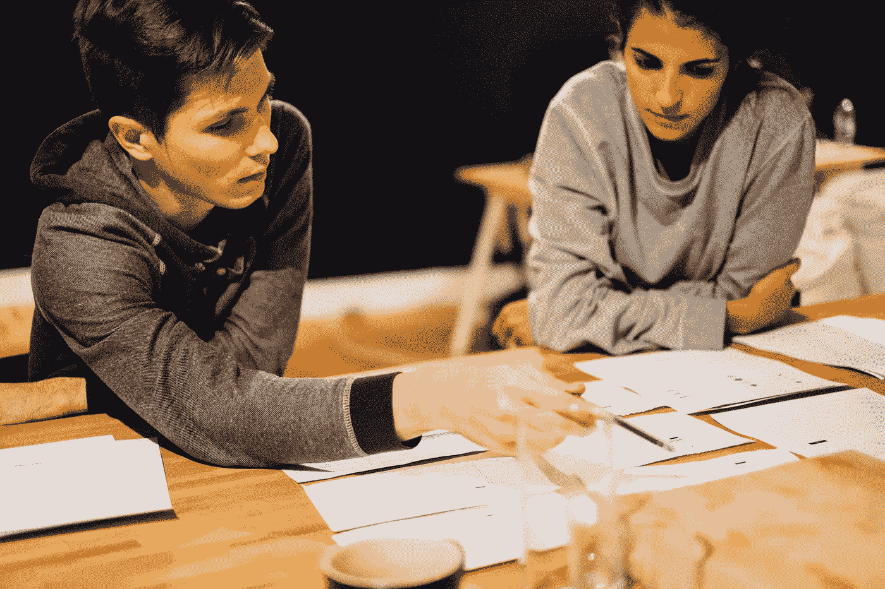
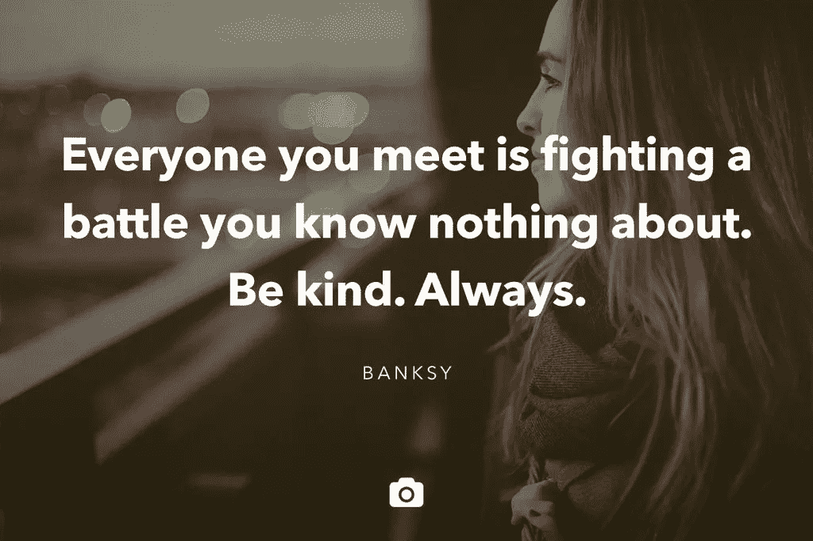

# 公共建筑:它(实际上)像是在建造一个产品

> 原文：<https://medium.com/swlh/building-in-public-what-its-actually-like-building-a-product-a0318d45c01f>

## 一个 6 集系列，涵盖了在[剧组](http://crew.co)和 [Unsplash](https://unsplash.com/) 设计产品背后的好、坏、丑

通往好产品的道路从来都不平坦。

再多的计划也无法让你做好准备，当你出发时，每个角落都有不可避免的坑坑洼洼等着你，踩着踏板，试图把想法变成现实。

通常，我们有的只是一系列问题和一些不成熟的解决方法。没有真正的地图。只有直觉，晴朗的天空，如果你幸运的话，还有一个(或两个)有才华的副驾驶来帮你做出艰难的决定。

就在一年前，我们公司的团队[决定再次上路，从零开始重新设计我们的核心产品](http://backstage.crew.co/building-in-public/)。

由于当时情况的严重性，我们决定用凯鲁亚克式的意识流叙事来记录整个事情，讲述在构建风险投资支持的产品时发生的情感和逻辑斗争。

权衡取舍。相互矛盾的观点。错误的转弯。所有血淋淋的细节都在这里被捕捉，并放在那里给每个人和任何人看。

但是为什么呢？

从一开始，我们就受到其他企业透明度的启发，但我们很快认识到透明度并不总是容易的。

暴露你的缺点很可怕。展示美好时光，把失败藏在心里更容易——把它们藏在地毯下，而不是放在咖啡桌上给任何人看。展示你的缺点会让你在客户、投资者、合作伙伴面前显得软弱。所有人。在这个高度竞争的世界里，我们被教导要永远看起来强大。即使我们沉浸在恐惧中。

但是有很多原因让我们觉得值得分享。

一个。分享创造了一种积极的社会货币形式。人和产品联系不好。人家跟你关系好。

通过让人们参与到你的过程中，你会变得更加平易近人。你让人们有机会在你制作的时候看到你做的东西，创造一种“我们在一起”的感觉。

就是这种感觉把一个访客变成了订阅者变成了粉丝。

但这不是我们与他人分享工作的唯一原因。我们知道有很多事情我们不得不去做，但我们不知道如何去做。但我们会想办法解决的。

我们将会受到一些事情的启发。我们会遇到问题的。大部分时间我们都不知道自己在做什么。但是如果我们花时间记录下我们正在经历的事情并与他人分享，也许会有所帮助。

也许我们犯了一些错误，你可以从中吸取教训。或者我们做的一些激励你的事情，这样你就可以把它应用到你正在做的事情上。

分享好的和坏的会让你更有亲和力。生活很少是绿色的牧场。我们都会在某个时候面临自己的挣扎。

[https://twitter.com/unsplash/status/587459340673638400](https://twitter.com/unsplash/status/587459340673638400)

[看到别人的缺点让我们有信心面对自己的问题](/unsplash-dispatch/share-your-brushstrokes-9f0551cdf747#.e3jlg9ify)知道另一边的人——我们尊敬和重视的人——就在不久前还在这个位置上。

[引用](http://www.fastcompany.com/3045082/my-creative-life/mad-men-creator-matthew-weiners-reassuring-life-advice-for-struggling-artis) *《广告狂人》*创作者马修·韦纳对分享你作品重要性的看法:

> “艺术家经常隐藏导致他们杰作的步骤……这被称为隐藏笔触，这样做的人是在伤害那些欣赏他们的作品并试图模仿他们的人。
> 
> 如果你看不到笔记、重写和步骤，很容易看到一个成品，并产生错觉，以为它是从某人的头脑中涌出来的。年轻或仍在奋斗的人很容易气馁，因为他们不能像他们认为的那样去做。"

这就是为什么我们发布所有的[投资者更新](http://backstage.crew.co/januaryfebruary-2016-investor-update/)、[博客指标](http://backstage.crew.co/february-2016-writing-dispatch/)和[产品设计思维](http://backstage.crew.co/creating-dream-crew/)，即使事情进展不顺利。

我们坚信，如果你把对世界有帮助的东西拿出来，在某个时候会有更好的事情发生。你可能会得到一个新的顾客，一个新的朋友，或者一个合作伙伴。但更重要的是，你可能会激励某人对世界产生更大的积极影响。

现在，[即将发布我们产品的又一次大规模更新](http://backstage.crew.co/building-crew-2/)，我意识到这些一年前的教训不仅仅是发布说明。它们近乎永恒地展现了产品开发过程中的幕后活动。好的和坏的。所以我们希望你能拥有它们。

不仅仅是一群首次创业者奋斗的快照，重读这些帖子，我意识到我正在经历的努力是哲学上的——设计产品是我们认为会成功的，也是我们认为会有真正价值的。

要了解真正的价值，你必须了解你自己。

# 建筑工人在公共场合

隐私见鬼去吧。《公众中的建筑工人》是一系列 6 篇关于产品设计哲学和我们在设计自己的产品时所面临的斗争的短文。可以在 [*剧组后台博客*](http://backstage.crew.co/building-in-public/) *上阅读正版，在路上启发版。*

## 1.[我们都在销售经验](/swlh/were-all-selling-experiences-58ae13a8a0bc)

## 2.[从问题入手。不是解决方案。](/swlh/start-with-problems-not-solutions-8521c53264b2)

## 3.[约束，而不是障碍](/@mikaelcho/constraints-not-barriers-84629bf49ce2#.f3q9we4s7)

## 4.[多问问题](/@mikaelcho/you-can-never-ask-too-many-questions-6d9926988f82#.ynoz2zshy)

## 5.[剖析一个主页](/@mikaelcho/anatomy-of-a-homepage-redesign-9d911e832c4b#.lhlspqtoa)

## 6.[旅程比目的地更重要:设计最佳入职流程](/@mikaelcho/the-journey-is-as-important-as-the-destination-ddc598989eaf#.ddxqmqyga)

# 又及:新成员

我们最近在 Crew 为我们的产品的一个全新版本再次经历了这个过程。你可以在这里阅读所有相关内容。

