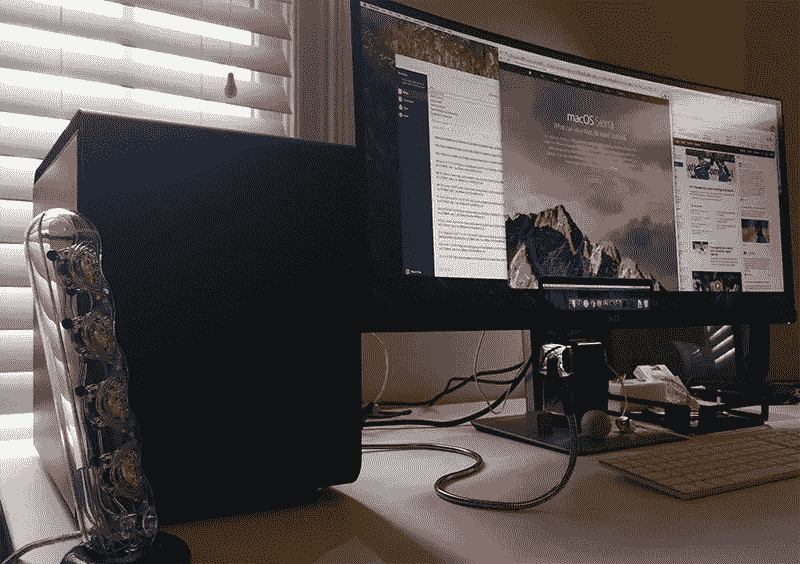

# 打造我价值 1200 美元的电脑

> 原文：<https://medium.com/swlh/building-my-1-200-hackintosh-49a1a186241e>

我想要一台新的苹果电脑已经有一段时间了。现在我有了一台比苹果卖给你的几乎所有 Mac 都快的电脑。我是这样建造的。

我一直是那种拥有一台笔记本电脑，并把它连接到我桌子上的外接显示器来完成真正工作的 Mac 用户。几年来，我一直在使用一台 15 英寸的 retina MacBook Pro(2013 年初)，它被放入了一个 [BookArc](https://www.twelvesouth.com/product/bookarc-for-macbook-pro-retina) 中，用于设计和开发工作的结合。它有一个旧处理器(2.4Ghz 英特尔酷睿 i7)，没有太多内存(8GB DDR3)，大多数时候我真希望它能像我知道的新的 [5K Retina iMac](http://www.apple.com/imac/) 为我的朋友做的那样，在 Photoshop、Keynote、Sublime Text 和 Xcode 之间飞来飞去。

不过，我最近确实对硬件进行了升级，从一台 [Thunderbolt 显示器](http://www.apple.com/displays/)(苹果最近停产了)升级到一台*非常棒的* [戴尔 3415W](https://www.amazon.com/Dell-UltraSharp-34-Inch-LED-Lit-Monitor/dp/B00PXYRMPE) ，这是一台 34 英寸的略微弯曲的超大屏幕显示器。不，它不是 retina sharp，但它足够宽，可以并排打开 3 个大的应用程序窗口，我更喜欢它的宽度，而不是 5K Retina iMac 显示器的清晰度，因为它让我感觉更有效率。

现在让我们来看看 Hackintosh 的决定。

几周前，我和我妻子的一群同事去看棒球比赛，我开始和一个叫 Ian 的开发者聊天，他说他刚刚完成了一个 Hackintosh，这太棒了。老实说，我已经很多年没想过 Hackintosh 社区了，我甚至忘记了它还是一个东西。伊恩说，这个社区现在是围绕一个名为[TonyMacx86.com](http://www.tonymacx86.com/)的网站组织起来的，它有硬件指南、构建教程、论坛和大量更新，在过去的 18 个月左右一直非常活跃，因为现在构建一个 Hackintosh 比以往任何时候都容易。当他告诉我他的定制 Mac 有多快(比任何 iMac 和大多数 Mac Pros 都快)以及价格有多低(约 1200-1300 美元)时，我觉得这是不可能的。我知道苹果很久没有更新他们的 MacBook Pros 或 Mac Pros 了，我也知道当苹果设计的电脑中包含 RAM 或处理器等部件时，你需要支付“苹果税”，但我们越是谈论他的产品，我就越兴奋。就好像有人告诉我，*是啊，当然有飞行汽车，看看我在停车场的飞行汽车。你也想要一辆飞车吗？*

所以我做了很多研究，然后决定尝试一下。

The final product. Matte black, soft touch BitFenix Phenom case next to a Dell 3415W monitor.

## 硬件

过去，构建一个 Hackintosh 是一件极其痛苦的事情。获得正确的硬件组件和这些组件的正确内核扩展以及正确的驱动程序完全是一场赌博。建造一个需要大量的空闲时间和大量的技术知识。任何 OS X 软件更新都有可能淹没你的整个系统，迫使你从头开始。

如今，TonyMacx86.com[的令人难以置信的乐于助人的修理工基本上已经把你需要知道的 1)购买零件，2)组装零件，3)让所有零件运转起来。每隔几个月，他们就会发布一个硬件构建指南，列出最兼容和最友好的组件来创建一个 Hackintosh，我的构建非常接近这个指南。这是他们的](http://www.tonymacx86.com/)[六月硬件构建指南](http://www.tonymacx86.com/buyersguide/june/2016)，我最后得到的是:

*   **主板:** Gigabyte Gaming-5，[亚马逊上 137 美元。](http://amzn.to/2h3YACW)
*   **处理器:**英特尔 i7–6700k 主频 4.0 Ghz，[342 美元。](http://amzn.to/1rT8Hig)
*   **GPU:** GTX 950，[亚马逊上 169 美元](http://amzn.to/2g8dtXv)。
*   **内存:** 64GB DDR4 Ballistix Sport，[【红色的话 229 美元](http://amzn.to/2g8dhrc)。
*   **硬盘:**三星 850 500GB 固态硬盘。 [$154。](http://amzn.to/2hgozWt)
*   **CPU 散热:**海盗船 H60 液冷器。 [$59。](http://amzn.to/1skgmWV)
*   **电源:**海盗船 CS650。 [$81](http://amzn.to/2h42WcU) 但请参见下面的注释。
*   **Wi-Fi:** TP-Link PCI-E 卡。 [$38。](http://amzn.to/2g8g5Vm)
*   **案例:** BitFenix 现象。亚马逊的 86 美元。
*   **显示器:**戴尔 3415W 34 寸宽屏。(已经拥有。)[$751。](https://www.amazon.com/Dell-UltraSharp-PXF79-34-Inch-LED-Lit/dp/B00PXYRMPE/ref=sr_1_1?s=pc&tag=techdeal0d-20&ie=UTF8&qid=1481162579&sr=1-1)
*   **键盘:**苹果有线键盘。(已经拥有。) [$49。](http://www.apple.com/shop/product/MB110LL/B/apple-keyboard-with-numeric-keypad-english-usa)

总数(不包括税或我已经拥有的)大约是 1280 美元。如果你配备 8GB 内存、250GB 固态硬盘或稍慢的处理器，你可以用不到 1000 美元轻松打造一台 Hackintosh。

我购买的硬件的一些注意事项:

1.  它不是全尺寸的高塔建筑。我优化了外壳的外观和尺寸，而不是可扩展性。它基本上是立方体形状，尺寸为 12×16×18 英寸
2.  液体冷却器！上一次我制造电脑时(15 年前…)，我不得不在处理器上安装一个巨大的散热器。现在有不需要维护的液冷系统，售价 60 美元。疯狂。
3.  我订购的海盗船电源到货时已经报废了。我花了至少两个小时拔掉电源插头，反复检查，以为我把某个地方的插头或连接搞砸了，但是没有，电源已经坏了。最后我在当地一家电脑商店又买了一台。他说，从海盗船获得 DOA 电源是非常罕见的。耶，我。
4.  英特尔 i7–6700k 处理器是英特尔最新、最棒的处理器，以前被称为 Skylake。你能从苹果公司买到的唯一装有这种芯片的 Mac 电脑是定制配置的 27 英寸 5K iMac。四核，快得跟屎一样。
5.  以 DDR4 速度运行的 64GB 内存售价 229 美元？你说真的吗？我原本打算买 32GB 的，但如果翻倍并开足马力，只需多花 90 美元。顺便说一下，苹果公司收取 1200 美元配置 64GB 内存的 Mac Pro，那些是较慢的 DDR3 棒。这几乎和整个系统一样多。
6.  我不是一个游戏玩家，也没有建立一个虚拟现实系统，所以 GTX 950 显卡是完美的。它非常有能力，只是对于高端 VR 来说不够快(苹果出售的任何 Mac 中的任何 GPU 都不够快。)如果你是一个游戏玩家，或者确实想建立一个虚拟现实系统，**确保你能为你的卡获取正确的驱动程序。**做一些研究，看看在 Hackintoshes 中支持和常用哪些卡。拼命想把 GTX 1070 或 1080 扔进去？*他们的司机还不存在。*让 GPU 完全投入运行对我来说是最耗时的部分。

## 建筑

当你建造一台 Hackintosh(或任何定制 PC)时，你需要实际建造这台机器，这意味着从亚马逊获得大量送货上门的箱子，从包装中取出每一个，然后从头开始组装电脑。在这个版本之前，我只组装过另外一台计算机，那还是在 2000 年代初，作为大学网络课程的一部分。事情确实发生了变化:有些事情变得简单多了，有些事情变得更复杂了。幸运的是，现在有一个名为 YouTube 的网站，人们在那里演练如何建造一台计算机，你可以观看他们如何做，并学习如何自己做。不可思议吧。

我看了一些视频，展示了人们如何组装一个 Hackintosh，从盒子到完成的构建，我认为这基本上是学习如何做的最好方法，并且对你能完成的事情充满信心。以下是我的最爱。

*   克里斯富斯科 [发布了一个关于他的](https://www.youtube.com/watch?v=dM6aKL6EIDs)[构建和软件设置](https://www.tonymacx86.com/threads/success-hackintosh-i7-ga-z170x-ud5-th-i7-6700k-gigabyte-gtx-970.192392/)的超级详细的视频指南。最近，Chris [发布了他的视频指南的更新版本](https://www.youtube.com/watch?v=le7anbCaP-k),通过 Hackintosh 跑步 Sierra。他的整个 YouTube 频道都很棒。
*   9to5Mac 在打造 Hackintosh 上有一篇令人难以置信的报道。强烈推荐文章+视频。
*   来自 YouTube [的 CreateThis 频道的 Jesse 发布了他的英特尔 6700K Hackintosh 构建的 3 部分系列](https://www.youtube.com/watch?v=-CqiRjyUuB8)，从选择组件到硬件构建到 Mac OS X 的安装。长视频，但对他在此过程中所做的所有决定以及需要注意的问题进行了很好的评论。
*   在 YouTube 或谷歌上搜索“El Capitan Hackintosh”或“6700K Hackintosh”(你将使用的英特尔处理器)，也会让你陷入困境。

构建一个 Hackintosh 基本上是一个两步的过程。第一步是从一箱箱零件到一台完整的可以开机的电脑。如果你没有任何计算机硬件知识，或者以前从未接触过电脑机箱，除非你阅读说明指南、遵循手册和观看 YouTube 视频，否则构建你的 Hackintosh 并启动它将是一个挑战。我不得不多次安装和卸载机箱风扇，拔下并重新插入主板电线，因为其他电线挡住了我的路，所以对我来说，让电脑开机肯定不是 30 分钟的过程。

## 设置

在我终于让我的系统开机后(记得我的电源坏了，我直到穷尽了所有其他可能性才意识到这一点)，是时候把这台电脑变成一台 Hackintosh 了，这意味着让它启动 Mac OS X。

关于运行 Hackintosh 需要注意的是:系统软件更新会破坏你的配置，如果不做一些调整，你的电脑就会停止工作。目前，Mac OS X 的最新非测试版是 10.11.5，所以我的目标是构建一个可以运行 10.11.5 的 Hackintosh，这也是 Xcode 8 的最低操作系统要求，需要在 iOS 10 上构建应用程序。当 10.11.6 退出测试后，我不会像过去用真正的 Mac 那样立即升级我的系统。相反，我会密切关注 [TonyMacx86](http://www.tonymacx86.com/) 论坛和博客，以确保它是安全的，其他的也是成功的。

为了让我的机器运行 Mac OS X，我主要按照这个 [TonyMacx86 逐步指南](http://www.tonymacx86.com/threads/unibeast-install-os-x-el-capitan-on-any-supported-intel-based-pc.172672/)来完成整个过程。上面链接的 9to5Mac 文章和视频也有很好的指导。一般来说，您需要:

1.  已经拥有一台 Mac 电脑，请从应用商店下载 El Capitan
2.  有一个至少 16GB 存储空间的 u 盘
3.  重新格式化 u 盘，这样你就可以从它启动
4.  使用名为 UniBeast 的应用程序使 u 盘可启动
5.  一旦你从 u 盘启动，更新一些 BIOS 设置
6.  将 Mac OS X 安装到电脑的硬盘上
7.  启动 Mac OS X 后，使用名为 MultiBeast 的应用程序调整各种系统和驱动程序参数
8.  下载适合您显卡的显卡驱动程序，并安装到您的新 Mac 上。**重要提示:**我必须确保为我的 OS X 版本(10.11.5)下载正确的 NVIDIA 驱动程序，因为如果你下载了错误的驱动程序，什么都不能工作。
9.  启动时设置 *nvda_drv=1* 选项，这样你的 Hackintosh 将使用那些下载的图形驱动程序。
10.  为你有一个可用的黑客工具而高兴吧！

**尽管**在哈金托什的土地上并非一切都是美好的，所以下面是我遇到的一些问题:

*   我的音响坏了。有一些简单的指南可以让你的音频工作，但我还没有遵循它们，主要是因为我有一个我使用的 USB DAC，所以我不需要使用耳机插孔。
*   连续性和移交不起作用。经过大量的研究和阅读，他们不能在大多数 Hackintosh 系统上工作的核心原因是因为运行 Wi-Fi 和蓝牙的芯片需要是 Broadcom 芯片，这是苹果公司用于所有计算机的芯片。[这是您需要购买的 PCI-E 卡](http://www.osxwifi.com/apple-broadcom-bcm94360cd-802-11-a-b-g-n-ac-bluetooth-4-0-with-adapter-for-pc-hackintosh)，如果您需要连续性和切换来工作。我相信如果你不想买那张卡，也可以使用一些软件。
*   我 Mac 上的 iMessage 无法使用。让 iMessage 在 Hackintosh 上工作基本上是 Hackintosh 社区的圣杯，因为它的功能与您的计算机序列号和其他设置相关联，欺骗/设置它以使 iMessage 工作是很棘手的。在谷歌或 YouTube 上搜索“Hackintosh iMessage El Capitan”可以了解更多关于这个问题的信息。[这里有一个教程](http://www.fitzweekly.com/2016/02/hackintosh-imessage-tutorial.html)，不过好像有点黑幕。
*   这台 Mac 和其他 Mac 之间的隔空投送可以工作，但我必须从隔空投送选择“搜索旧 Mac”才能让我的 Hackintosh 被发现。不要太烦人，但是如果你依赖隔空投送，记住这一点。我听说你可以通过使用 Broadcom Wi-Fi 芯片来解决这个问题，就像我上面链接的 PCI-E 卡一样。
*   我花了很长时间才让我的 Hackintosh 识别并使用我下载的显卡驱动程序。我安装了正确的驱动程序，但是当我将显示器连接到我的显卡，并在设置了 *nvda_drv=1* 标志的情况下重启(迫使我的黑客使用我下载的 NVIDIA 驱动程序)时，屏幕会变成空白。经过大量的研究和阅读，似乎如果 Mac OS X 认为你的系统是 iMac(你可以选择你想要的系统，因为你可以设置你的 Hackintosh，我选择了 27 英寸的 iMac，因为它应该是一个非常兼容的系统定义)有可能它不会识别 PCI-E 插槽中的显卡，因为 iMac 不使用那个插槽。我[在 TonyMacx86 论坛上发现了这个不可思议的页面](http://www.tonymacx86.com/threads/black-screen-with-macpro-6-1-or-imac-15-or-imac-17-system-definition.183113/)，下载了它底部的 AGDPFix 脚本，运行了它，现在我的 Hackintosh 工作得很棒，显卡被识别了。在配置多播时，您可以通过选取 Mac Pro 系统定义来避免此问题。

## 表演

人们过去常常制作黑客电脑，因为它们比你能从苹果公司买到的同等型号的苹果电脑便宜很多。然而现在，由于 Mac Pro 已经 3 年没有更新了(而且主板上的组件已经用了大约一年了)，人们正在构建 Hackintoshes，因为你可以构建一台比苹果卖给你的最快的计算机更快的**Mac，而且，哦对了，它甚至比基本的 Mac Pro 型号还要便宜 1000 多美元。如果你是一名专业摄影师、程序员或视频编辑，并且目前拥有一台 Mac Pro，那么苹果已经抛弃了你。也许是时候考虑打造一款黑客工具了。**

以下是我的 Hackintosh 与所有其他 MAC 电脑的 Geekbench 运行对比。考虑到我的 CPU 只有 4 个内核，多核分数并不令人惊讶，但它几乎击败了 6 核 Mac Pro。单核测试显示，我的系统在日常使用中比苹果生产的任何 Mac 都快。

在运行 Cinebench GPU 基准测试后，结果如下:**比最高端的双 D700 卡 12 核 Mac Pro 的图形功能快得多**，这有点疯狂，因为这台机器比我的价格高出近 7000 美元。

## 最终拍摄

构建一个 Hackintosh 并不适合所有人。如果你需要便携性，你可能应该坚持等待新的 MacBook Pro，并希望它在未来几个月内发布。但是，如果你正在寻找 Mac Mini、iMac 或 Mac Pro，如果你走 Hackintosh 路线，你肯定可以为自己制造一台更快、更便宜的机器。当然，这意味着自己购买计算机部件，构建计算机，运行被黑的引导加载程序，修补神秘的标志和内核扩展，通过在非苹果硬件上运行来违反 Mac OS X EULA，在网络论坛上搜索珍闻，担心系统软件更新，以及大多数人不想处理的一般计算机硬件 nerdery。

但是如果那个人听起来像你，我想你会有很多乐趣。

