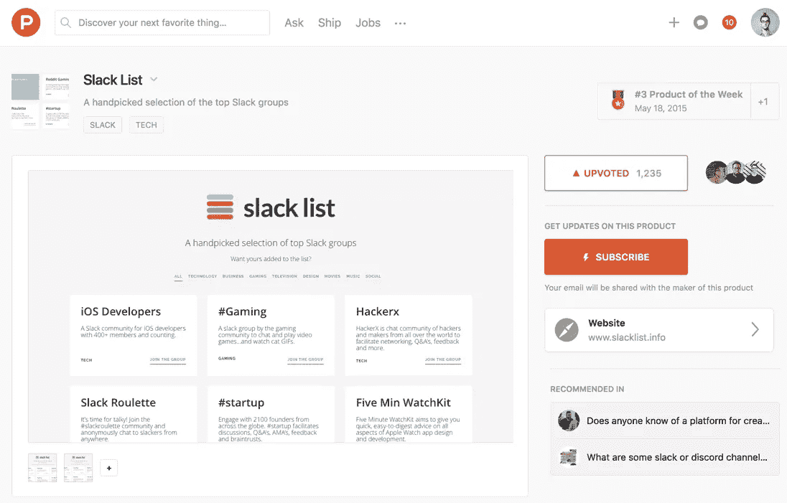
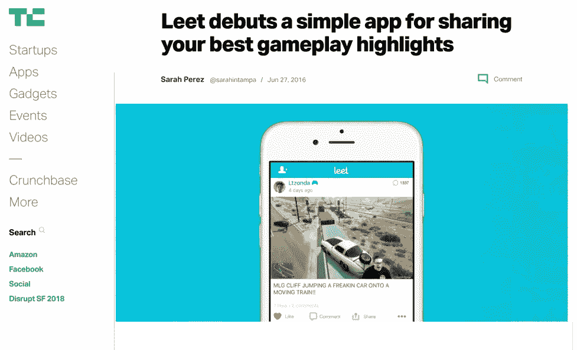
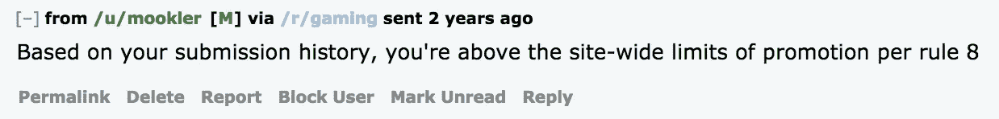
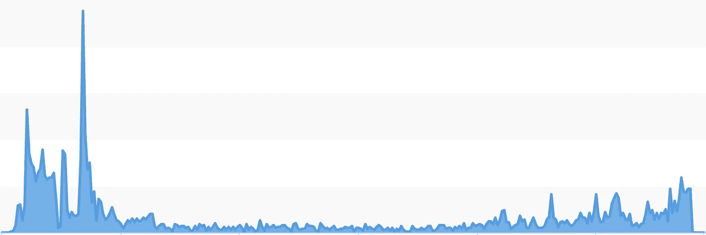
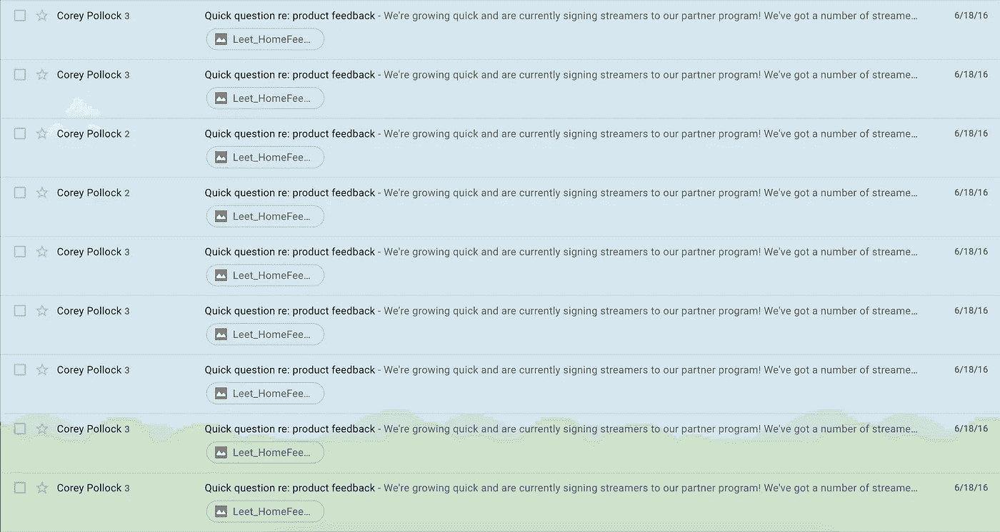
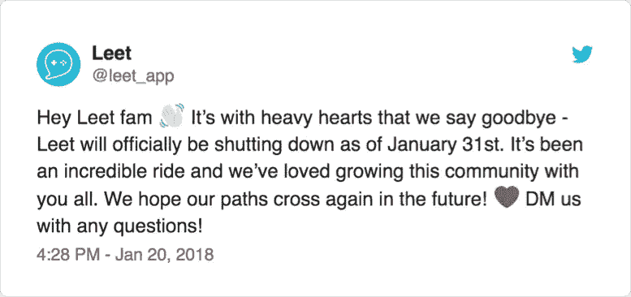
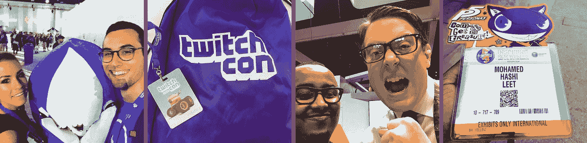

# 建立社交是困难的:李特的事后分析

> 原文：<https://medium.com/swlh/building-social-is-hard-a-postmortem-for-leet-5209f04fecd>

这是一个典型的深夜，我在数字产品工作室“小心脏”与罗布莱一起工作，我在那里担任产品经理(后来被 [Shopify](http://www.shopify.com) 收购)。罗布莱的密友 [Gaming](https://medium.com/u/54d09d63c1d0# <a class=) 的 Slack 社区，打算利用它来推动 Leet 的 beta 注册，并将它放在 Slack 列表的首位。

SlackList on Product Hunt — notice #Gaming at the top there?

当时，这个计划看起来有点疯狂，似乎永远不会成功。但是[产品搜索](https://www.producthunt.com/posts/slack-list)的力量占了上风，Slack List 和#Gaming 都一夜成名。我们不仅创建了一个 beta 测试者社区，后来成为最大的游戏 Slack 组(3000+成员)，而且我们还创建了一个成功的网站，后来被收购。

你可以在这里阅读更多关于我如何在 24 小时内建立一个没有营销的社区👇🏻

 [## 我如何在没有营销的情况下在 24 小时内创建了一个社区

### 我在两件事上遇到了问题…

medium.com](/swlh/how-i-created-a-community-in-24hrs-with-no-marketing-14372892bf66) 

# Leet 发布会🚀

我们花了 6 个月的时间来测试和构建我们真正引以为豪的 MVP(最小可行产品)。

***外卖:*** *回想起来我觉得我们过度限定了 Leet 的功能集。事后看来，去掉 Leet 的社交方面(feed、赞、评论等)可能更好。)最终花费了最多的时间来构建，并简单地发布了一个只关注修剪和共享亮点的 MVP。从那里，我们可以建立牵引力，并增加社会方面的迭代。*

我们的发布计划包括给一群媒体发电子邮件，在 Product Hunt、Reddit 和 HackerNews 上发布，并请求苹果提供一个功能。换句话说，我们计划了一个标准的、有机的发布会。

## 压📰

Leet coverage on TechCrunch

媒体是产生口碑的一个很好的方式，但它肯定不是一个发布计划。我给 36 位作家发了邮件，转化率为 3%，即。1 博客， [TechCrunch](https://techcrunch.com/2016/06/27/leet-debuts-a-simple-app-for-sharing-your-best-gameplay-highlights/) ，这似乎是任何科技企业家的通行权利(谢谢莎拉！).

***要点:*** *新闻很有趣，也是提高产品知名度的好方法，但最终它并不总能带来大量下载。这通常是高努力、高风险的，不能保证有人会写你。如果你要在媒体上投入时间和精力，确保你知道这一点。*

## 🗣社会/社区

我们乐观地认为，Reddit 将成为 Leet 的巨大增长杠杆。我们知道有一个很大的社区已经在许多子街道上分享游戏片段，我们想象他们张开双臂欢迎我们。

Kinda how our launch on Reddit felt like…

这就是我们在 Reddit 上的发布日感觉像☝🏻。朝着头版的荣耀前进，却在我们的文章被删除到神圣的第 8 条规则——禁止自我推销时摔了个嘴啃泥。

☠️

***要点:*** *如果你认为 Reddit 将成为你的应用程序的巨大驱动力，确保提前参与社区，并在发帖前与版主交谈。让你参与的社区多样化也很重要，不要把所有鸡蛋放在一个篮子里。*

总的来说，重要的是要记住发布只是第 0 天。在你产品的大计划中，这是最不重要的一天。当然，它让你的脚离开地面，但增长需要是你的产品中固有的东西，这是我们通过艰难的方式学到的东西。

# 发布后的困境📉

像任何产品发布会一样，我们都很兴奋。我们最初收到了大量的安装，每天都有新用户涌入应用程序。起初，事情看起来像他们向上和向右移动。

Leet installs graph, classic straight up and straight down

但是我们很快意识到我们没有一个可持续发展的计划。

## 鸡和蛋的问题🐣

Leet 有一个典型的先有鸡还是先有蛋的问题:没有用户就没有内容，没有内容就没有用户。缺少这两个组件中的任何一个，应用程序都无法生存，我们立即与这两个组件进行了斗争。

**缺乏内容**

由于 Leet 的价值依赖于用户将他们的内容上传到平台，我们一直在努力提供足够的内容来使应用程序具有粘性，因为我们的用户每次访问时都希望获得新的令人兴奋的视频。想象一下，打开 Instagram，没有新内容——不好玩。

***外卖:*** *事后看来，我们本可以从其他社区(如 GfyCat)众包内容，同时仍然保留我们 Leet 用户喜爱的用户上传功能。如果你正在开发一个鸡和蛋依赖的产品，我强烈建议你阅读陈楚翔的这篇文章。*

**缺乏用户**

发布后，Leet 在相当长的一段时间内保持了强大，有一群专门的用户不断分享和上传他们精彩的游戏集锦。

我们的问题很快变成了如何获得更多的用户，更重要的是，一旦他们安装了 Leet，如何留住他们。

我们的思维立即转向有影响力的人。Twitch 越来越受欢迎，我们认为获得这些受欢迎的横幅的关注将有助于推动 Leet 的持续流量。

这种策略被证明是高强度的，但是效果很差。我们花了很多时间收集潜在影响者的名单，单独联系他们，但没有得到任何回应。

我不怪这些有影响力的人不回应:我们的电子邮件很长，我们没有提供任何回报。

尽管如此，我们还是找到了一些对 Twitch 有影响力的人，他们帮助 Leet 在他们的社区中发展和传播。尽管这不足以拯救产品，但我永远感激那些真正相信我们所做的事情的人们。

Some of our early Leet Partners ❤️ — [@ltzonda](https://twitter.com/LTZONDA), [@missbabydoll](https://twitter.com/MummaBabyDoll), [@kittyhouseknife](https://twitter.com/kittyhouseknife), [@v5at](https://twitter.com/TheV5AT)

值得注意的一个关系是与 YouTube 有影响力的人 [CodFlaws](https://www.youtube.com/watch?v=hywZFpss15Q&t=20s) 的关系，他使用用户提交的游戏剪辑来策划视频。我们合作开展了一项活动，Leet 用户用#CodFlaws 标记他们的视频，有机会赢得奖品，并出现在 Leet 赞助的视频中。这不仅对我们来说是免费的，而且为 Leet 带来了大量的安装和新内容。

***外卖:*** *事后看来，我们本应该加倍努力采用这种方法，将我们的努力集中在这些 YouTube 游戏剪辑策展人身上，而不是 Twitch 影响者。这是一个使用* [*牛眼增长框架*](/@yegg/the-bullseye-framework-for-getting-traction-ef49d05bfd7e) *的很好的例子。随着时间的推移，我们应该停止那些对推动安装收效甚微的增长技术，然后加倍努力。*

## 向投资者推销💰

在 Leet 兼职工作了大约一年后，我们渴望全职投入我们的热情。我们从一开始就启动了 Leet，我们每月的服务器成本变得相当昂贵(代码转换并不便宜)，所以尝试筹集一些资本似乎是合乎逻辑的下一步。

我们从运作我们的网络开始，并与一些风险投资者进行了讨论。这非常有趣，因为准备这些会议的过程让我们进一步完善了我们对产品的愿景，并学到了一项宝贵的技能:推销。我们也有机会与一些令人难以置信的人和公司交谈，如 WarGaming 的风险部门和 BITKRAFT 的 ESL 前首席执行官。

***外卖:*** *我们很快意识到，这些对话的结果总是一样的。投资者理解 Leet 的价值，但由于没有商业模式或盈利途径，他们不愿投资。*

# 未来展望🔮

我们学到的最难的一课是，在任何初创公司兼职都很有挑战性。这当然不会使它不可能成功，但它增加了一系列额外的挑战。

与此同时，在我们的日常工作中，[小心脏被 Shopify 收购](https://techcrunch.com/2016/12/05/shopify-acquires-digital-studio-tiny-hearts-makers-of-wake-alarm-next-keyboard-more/)，不久后莫也加入了我们。面对 Leet 面临的所有挑战，我们决定在今年 1 月将它从应用商店下架。扼杀你的创业总是一个艰难的决定，但我们心里知道是时候了。

Left: me at TwitchCon with [@kittyhouseknife](https://twitter.com/kittyhouseknife), Right: Mo at E3 with Greg from [@kindafunnyvids](http://twitter.com/kindafunnyvids)

建立 Leet 给了我们一些关于如何创业的惨痛教训，但它也让我们探索了一个我们热爱的行业，与大量不可思议的人建立了关系，并创建了一个我们真正引以为豪的游戏玩家社区。

我和莫还没玩完游戏。事实上，我在 Shopify 领导的第一批项目之一是在游戏领域。这是一个如此令人兴奋的新行业，我们渴望为这个充满激情的社区开发另一个产品——尽管希望这一次我们会准备得更充分，掌握更多的技能。

# 待售🏷

Leet 是任何社交分享平台的交钥匙解决方案，特别适合分享视频内容。

无论是否与游戏相关，Leet 都为公司提供了一个机会，来宣传美好的社交体验，或者利用一个强大的开箱即用的后端，为您提供入门所需的一切。

如果你有兴趣或者有一些我们想聊的问题，你可以直接发电子邮件给我，地址是 corey . pol lock 91[at]gmail.com

[***科里·波洛克***](http://www.twitter.com/cpollo01)**是 Shopify 车库团队的产品经理，目前专注于为所有拥有* [*到货*](http://www.tryarrive.com) *的在线买家改善购后体验。此前在* [*的小心脏*](http://www.tinyhearts.com) *(已收购)，和* [*的联合创始人 Leet*](https://twitter.com/leet_app) *一款以游戏为亮点的社交分享 app。**

***如果你喜欢这篇文章，请推荐，帮助别人找到！👏🏻***

***你可能也会喜欢:***

* [## 游戏商品的历史(及其未来)

### 视频游戏玩家和社区是世界上最热情和最投入的粉丝。

medium.com](/shopify-gaming/a-history-of-gaming-merchandise-and-its-future-141880871c67)  [## 如何建立一个让你得到报道的媒体名单

### 找到相关的博客，收集他们的电子邮件，并组织一个新闻列表

medium.com](/swlh/how-to-build-a-press-list-that-gets-you-coverage-e40233a1403d) 

## 这个故事发表在 [The Startup](https://medium.com/swlh) 上，这是 Medium 最大的企业家出版物，拥有 351，974+人。

## 在这里订阅接收[我们的头条新闻](http://growthsupply.com/the-startup-newsletter/)。

*