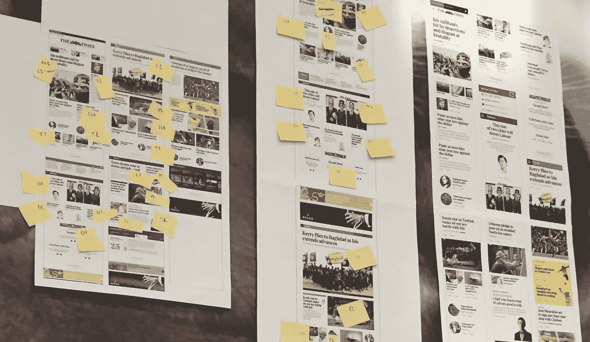
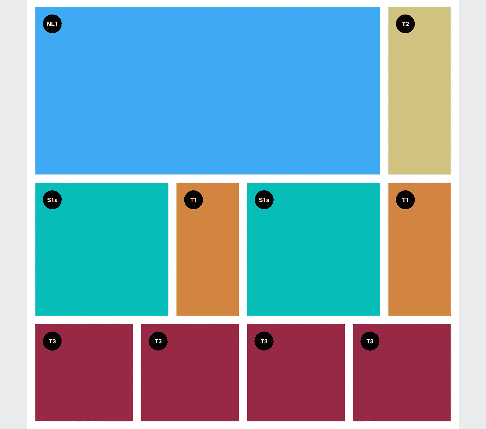
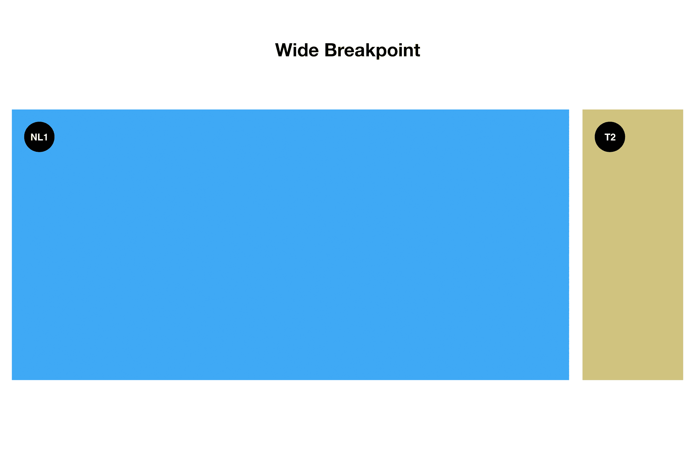
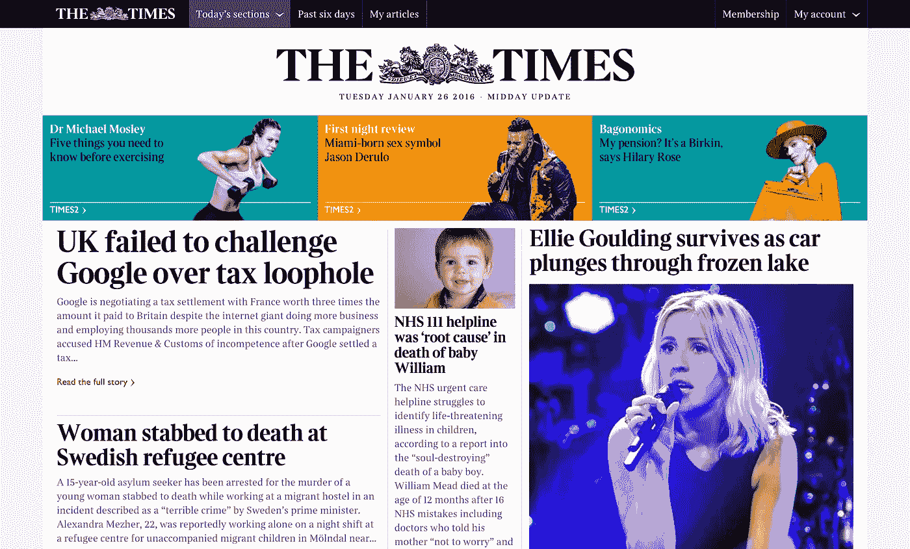
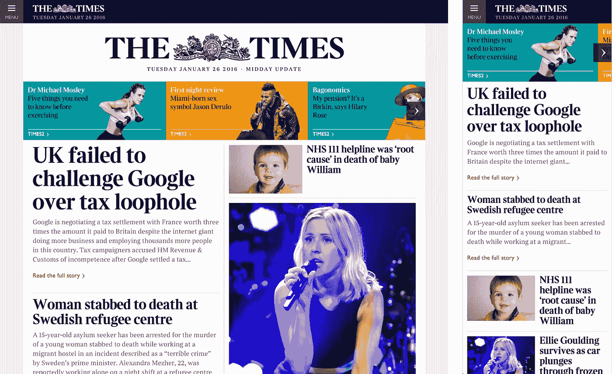

# 为新的泰晤士报网站构建用户界面

> 原文：<https://medium.com/swlh/building-the-ui-for-the-new-the-times-website-26dc4e6569e>

闪亮的新《泰晤士报和星期日泰晤士报》刚刚发行。我认为写一篇关于 UI 结构的文章是个好主意。

我的名字是[佩德罗·杜阿尔特](http://pedroduarte.me)，我是一名专门从事用户界面和用户体验的前端开发人员。英国新闻雇用我专注于新时代&星期日泰晤士报网站的用户界面开发改革。在过去的一年里，这就是我一直在做的事情…

在这篇文章中，我将写下以下内容:

*   概观
*   合作
*   UI 结构
*   半铸钢ˌ钢性铸铁(Cast Semi-Steel)
*   重构
*   视觉质量保证
*   样式指南
*   结论

# 概观

《纽约时报》和《星期日泰晤士报》的重新设计都是关于内容的。它是关于在屏幕上的专用空间显示正确的新闻。在由内容决定的响应性布局中保持这种严格的层次结构是一项艰巨的挑战。

为这样一个大组织重新设计和重建一个新网站不是一件容易的事情。我不是指技术意义上的这个。有这么多的人关心产品，相互矛盾的观点和想法是日常生活的一部分。这里的关键是不要让你自己对你的代码产生感情。[杀死你的婴儿](http://www.urbandictionary.com/define.php?term=kill+your+babies)。

# 合作

为了以最合适的方式构建 UI，我想真正理解设计。我做的第一件事是坐下来和项目的首席设计师凯尔·惠勒一起检查所有的设计。



我们打印并注释了设计，创造了设计和技术之间的共同语言。这将帮助我们更好地交流，并通过我们的组件建立一致性。

通过与设计团队紧密合作，我能够定义 UI 结构，尤其是主页。

与视觉和 UX 设计师合作是如此重要的一步！我❤协作。

# **UI 结构**

目标是保持 UI 结构尽可能简单。不幸的是，这并不像看起来那么简单，但我相信我们已经达到了令人印象深刻的简单程度。

UI 分为组件、模块和全局元素。

## **组件**

组件是非常低级的，它们可以用在各种不同的地方和不同的上下文中。理想情况下，我们希望一个组件无论在哪里使用都有非常相似的渲染。组件通常不会对布局产生重大影响。例如，一个组件不一定知道它跨越了多少个网格列。

组件的示例有:

*   小跟班
*   标签
*   大字标题

## **模块**

模块比组件更复杂。模块对布局有很大的影响，它们通常知道自己在网格中的位置，以及需要如何响应不同的断点。模块并不总是可重用的，例如，全球导航模块将只使用一次。

模块示例如下:

*   部分
*   切片和切片项目
*   相关链接
*   关键事实

## **全局**

全局文件是我们为某些元素、实用程序助手和变量设置一些默认规则的地方。

## 利润

使用组件有两种不同的方式:

1.  好的纯 HTML
    因为我们的组件本质上是“CSS 类”，你可以通过用正确的类编写 HTML 来使用它。
2.  组件助手
    我们使用 [Dust.js](http://www.dustjs.com/) 作为我们的模板语言，因为它可以在服务器端和客户端呈现我们的视图。js 允许我们创建定制的助手，所以我们利用它来创建一个 uiComponent 助手。

在下面的代码片段中，我分享了 Dust.js uiComponent 助手

Dust.js custom uiComponent Helper

下面是一个将组件作为 HTML 并通过 Dust.js Helper 包含的示例:

拥有一个 uiComponent 助手非常好，因为它确保了每个组件的每个实例都使用完全相同的标记。此外，它为每个组件创建了一个真实的来源，如果我们需要更新标记，我们只需要更新一个文件。

# 半铸钢ˌ钢性铸铁(Cast Semi-Steel)

我想和你分享一些我们使用的 CSS 结构和方法。

## **命名约定**

对于 CSS 命名约定，我们使用[套装 CSS](https://github.com/suitcss/suit/blob/master/doc/naming-conventions.md) 。下面是一些 SUIT CSS 语法的例子:

```
ComponentName
ComponentName--modifierName
ComponentName-descendentNameis-*
u-*
```

我们还稍微扩展了它以支持以下类:

```
has-*
no-*
js-*
```

## **断点**

我们试图将断点的数量保持在最低，以避免不必要的复杂性，但是，我们希望有一个灵活的解决方案，允许我们扩大规模，或者在特定模块需要时定义自定义断点。

当我们决定使用 [Susy 2](http://susy.oddbird.net/) 来驱动我们的网格系统时，我们定义断点的方式是使用一个名为 [susy-breakpoint](http://susydocs.oddbird.net/en/latest/toolkit/#susy-breakpoint) 的 mixin，它建立在著名的[断点](http://breakpoint-sass.com/) Sass 插件之上。

下面是我们的断点片段:

这是我们 Susy 设置的一个例子:

我们还创建了一些助手 mixin 来帮助我们轻松有效地使用 mixin。下面是我们断点设置的一个例子:

## **网格**

电网由 Susy 2 驱动，如果你没有听说过，我强烈建议你去看看。过去，我已经从头开始构建了几十个网格系统，但是在这种情况下，使用 Susy 节省了大量时间。Susy 非常灵活，你可以在它上面建立任何你想要的网格，Susy 只是做数学！

不过，我围绕默认的 Susy API 创建了一些 mixins，因为我想要一个自定义设置来支持不支持 flexbox 的浏览器的回退。稍后会有更多的介绍。

网格非常简单，在移动设备上是 6 列，在更大的设备上是 12 列。

下面是一个用法演示:

Custom mixin wrapper for Susy’s span mixin

Example of a module defining its position in the grid

## **切片和切片项目**

《泰晤士报》的主页本质上是不同切片的组合。我们创建了大约 20 种不同的变体，根据故事的数量和重要性，以不同的方式显示新闻内容。

**切片** 切片就是包装切片项目的元素。切片被构建成尽可能的哑。

**切片项目** 切片项目必须始终位于切片元素内。从本质上讲，切片项目是新闻内容所在的地方。每个切片项目都扩展了一个切片项目标识符，这些标识符也在设计中使用，您会看到它们在下面标记为 *Nl1、T2、S1a、T1 等*。

下面是切片和切片项目最简单形式的示例。



Examples of Slices and Slice Items in their simplest form

使用上面的模式意味着我们可以为所有切片项目提供一致的结构和非常简单的方法。

下面的代码演示了如何将上述设计中的第一个**切片** ( *NL1 + T2)* 复制成代码:

Sample Slice markup

CSS for NL1 Slice Item

CSS for T2 Slice Item

如上面在**网格**部分所述，它由 12 列中宽断点组成。记住这一点，我们在 CSS 中需要做的就是指定每个切片项目跨越多少列，记住列的相加必须等于 12。

简单地说，上面的代码是这样做的:

**NL1 切片项**中断点= 9 列
宽断点= 10 列

**T2 切片项**中断点= 3 列
宽断点= 2 列

对于移动设备，两个模块跨度均为 100%。这是一张展示最终结果的 GIF 图:



# 重构

重构，重构，重构…在我看来，这是把事情做好的最关键的一步。在我们的过程中增加一个重构步骤意味着我们可以自己清理。第一次编写一些代码时，通常不会很完美，或者不会很好地反映逻辑。通过给自己一些时间来重构代码，你可以使代码更加简洁、优化和可维护。

# 视觉质量保证

我们流程中另一个真正重要的步骤是做可视化 QA。这基本上就像和设计师坐下来仔细检查 UI 组件一样简单，确保它们看起来和工作起来都符合预期。这是一个很棒的工作流程，因为它意味着你可以按照设计来构建组件，但是它允许你“在浏览器中进行细化”。做可视化 QA 真的不需要很长时间，因为预期的变化很小，但它确实会对整体结果产生巨大的影响。

# 样式指南

每个伟大的构建都有一个[风格指南](http://www.thetimes.co.uk/styleguide/)。目前是 WIP，但是你可以了解我们的组件以及如何使用它们。

# 结论

像《泰晤士报》这样的网站将会存在很多年，谁知道会有多少开发人员在上面工作，所以建立最初的结构可能会很可怕。通过定义约定和结构，您可以使它更易于维护和扩展。

创建组件和模块的一个巨大好处是你的代码被封装了。在我看来，这是大型构建最重要的事情之一。它确保特定 CSS 文件中的更改将只影响该组件/模块，而不会对其他元素产生任何副作用。

总的来说，这个项目中使用的方法非常简单。它的强大之处在于我们如何构建代码。选择命名约定和基于组件的方法将自动迫使我们以更加面向对象的方式思考。

最后，这里有一些现场[版本](http://beta.thetimes.co.uk)的截图:



感谢阅读。在[推特](https://twitter.com/peduarte)上找到我🐤

👋