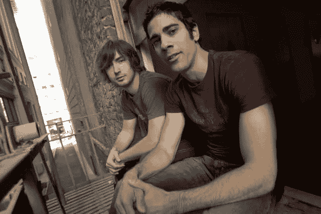
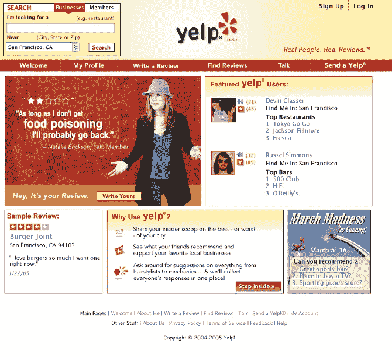
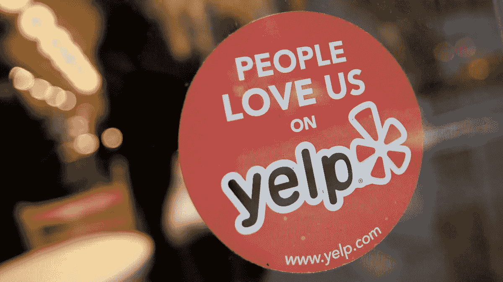

# 构建 Yelp

> 原文：<https://medium.com/swlh/building-yelp-bc4e62c4db3b>

## 关于如何创办大型科技公司的历史课

2004 年秋天，杰里米·斯托佩尔曼得了流感。

那年夏天他刚到旧金山，所以他跳到网上，希望能找到医生的推荐信。相反，斯托普尔曼找到的都是一些基本的目录和无用的信息。

但这给了他一个想法。他和拉塞尔·西蒙斯在旧金山为一家名为 MRL 风险投资的企业孵化器工作，在互联网上寻找“下一件大事”。他和西蒙斯共进午餐。

晚饭前，两人在老板麦克斯·拉夫琴的办公室里推销他们的新概念。他们没有 PowerPoint 演示文稿，也没有具体的收入计划；只是觉得他们可以做出吸引很多人的东西。

Early photo of Simmons (left) and Stoppelman (right).

莱佛青犹豫了。“我不确定这是否可行。但是男生们对此很有热情。以我的经验来看，当你有一些合作愉快的聪明人时，不投资是愚蠢的。”

也许他感到幸运，因为那天是他的 29 岁生日，或者也许是他最近从贝宝退出[后剩下的几千万美元，但是莱佛青同意了。他对这个不成熟的想法投资了 100 万美元，斯托普尔曼和西蒙斯开始工作。](https://www.wikiwand.com/en/Max_Levchin#/PayPal)

# Yelp 1.0

那么他们在建造什么？两位创始人从斯托佩尔曼的医生经历中认识到，寻找业务的最佳方式是通过口碑。但是口头传播还没有转移到网络上。他们问的问题是，“我们如何把这些面对面的推荐*放到网上*？”

他们认为答案是电子邮件，而这正是 Yelp 的最早版本。在西蒙斯创建的网站上，用户可以给他们的朋友发电子邮件，询问他们对特定地点或地方类型的建议。回应被记录在一个公共网站上，让每个人都可以看到。

他们的第一次审查是在 2004 年 10 月 12 日。凯瑟琳·w 给了真正的地中海四颗星和一个简单但令人信服的:

> “非常便宜，好吃的沙拉三明治。”

尽管那篇评论很有希望，他们的想法还是失败了。除了创始人的朋友和家人之外，它很少吸引用户，也没有打动斯托佩尔曼在 2004 年底推荐的风险投资者。

“我们一次又一次地被拒之门外，”斯托佩尔曼说。事情就在他们眼前开始失败。

# 顿悟

创始人们没有被吓倒，他们寻找改进产品的方法。一天，他们注意到了一些事情。

该网站有一个链接，埋在页脚的某个地方，如果你想提交评论而不被要求，你可以点击它。在研究他们的分析时，他们意识到人们不仅发现了这种联系，而且开始经常使用它。

他们看到越来越多的用户主动提交评论。它变得比电子邮件要求的评论还要大。人们会一次写 5、10 或 15 篇评论。

他们知道他们偶然发现了一件大事。因此，2005 年 2 月，两人推出了一个全新的网站，这一次完全专注于主动提供的评论。Yelp 2.0 的流量迅速上升。它是成功的。

# 基金会

A 2005 version of yelp.com

为了启动为这一新的审核系统构建平台的过程，他们购买了一个包含 2000 多万个业务位置的数据库。这个数据库既旧又不准确，但它为 Yelp 所谓的“声称的商业地点”创建了一个框架。

空白的业务页面起到了公开邀请人们提交评论的作用。它激励人们，至少，写一些关于业务的话。事实上，许多早期的评论只是:“这个地方太棒了”，或者“这个地方糟透了。”但随着时间的推移，评论者开始更加认真地对待这个平台，并撰写更长、更深入的评论。这个框架后来获得了回报。

此外，他们不会像在 Citysearch 上那样将用户的贡献归入专业评论，也不会像黄页网站那样归入目录信息。相反，Yelp 通过赞扬和关注激励人们分享评论，这是其他人没有做到的。这些社交网络功能让他们脱颖而出。

# 社交化

现在他们有了正确的方向，他们需要扩大用户群。由于没有在全国推广的资金，Stoppelman 决定首先把重点放在让 Yelp 在当地出名上。

在他心血来潮聘请的一位 buzz 营销大师的帮助下，Stoppelman 决定挑选几十个人——网站上最活跃的评论者——为他们举办一个露天酒吧派对。作为一个玩笑，他称这个团体为 Yelp 精英班。

A Yelp Elite event

莱佛青认为这个想法很疯狂:“我当时想，‘天哪，我们离盈利还差得远呢；‘这太荒谬了’。”但是 100 人参加了第一次聚会，网站的流量开始增加。因为聚会是为多产的评论者保留的，他们给临时用户一个更多使用网站的理由，给非用户一个加入的理由。

到 2005 年 6 月，Yelp 已经有了 12，000 名评论者，其中大部分在湾区。去年 11 月，斯托佩尔曼回到风投公司，从 Bessemer Venture Partners 获得了 500 万美元。他用这笔钱在纽约、芝加哥和波士顿举办了更多的派对，并雇佣了派对策划人——Yelp 称他们为“社区经理”。社区经理和 Yelp 精英小组今天仍然存在。

# 贴纸

到 2006 年，网站上的评论者人数增加到了 10 万。斯托普尔曼还筹集了数百万美元的风险投资。到 2006 年夏天，Yelp 的月访问量达到了 100 万，而且他们还在慢慢增加更多的城市。

现在用户数量在增长，他们开始关注下一个问题:他们需要让商家扮演更深层次的角色。评论者用户群的增长是好事，但是硬币的另一面是商业本身。更不用说他们是 Yelp 唯一的收入来源。

他们决定开始一场积极的运动，让商家要求企业名录，填充它们(例如菜单、时间、网站等)，并激励他们自己的客户在 Yelp 上回顾他们的体验。

The Yelp sticker

他们这样做的方法之一是使用一个标签。这是一个天才的举动。

大多数企业已经熟悉 Zagat 和手机贴纸，以及它们对认知度的影响。但是 Yelp 对此更加积极，甚至分发了额外的营销材料。这对评论数量产生了显著的影响。有机评论数量激增，更多的企业加入进来。

Yelp 贴纸在湾区的著名餐厅几乎无处不在，今天仍在为公司服务。对于潜在的评论者、潜在的访问者和商家来说，它们是 Yelp 的日常提醒。

# Yelp 的遗产

斯托普尔曼、西蒙斯和 Yelp 团队的其他人都很坚持，足够谦虚，足够聪明，能够看到他们面临的真正问题，并使用创造性的方法来克服它们。

Yelp 继续增长。这项服务不断增加城市，最终走向国际。他们推出了一款成功的手机应用。斯托佩尔曼聚集了数千万的风险投资，然后将其 IPO。在撰写本文时，该公司的市值约为 37 亿美元。

他们在这个过程中犯了一些错误，有人说他们正处于[分裂](https://hbr.org/2015/12/what-is-disruptive-innovation)的过程中。但 Yelp——最初的位置评论之王——催生了许多应用和初创公司，并改变了消费者看待他们与企业关系的方式。

为此，他们得到…

## 这篇文章发表在[《创业](https://medium.com/swlh)》上，这是 Medium 最大的创业刊物，有 271，813+人关注。

## 在这里订阅接收[我们的头条新闻](http://growthsupply.com/the-startup-newsletter/)。

