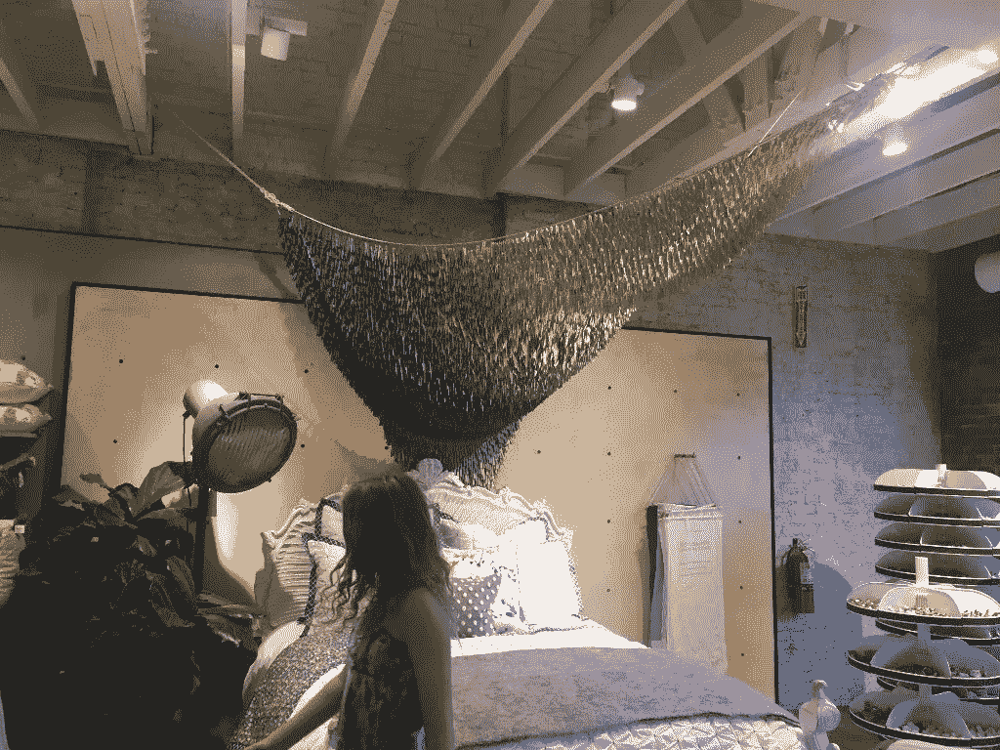

# 没钱也能创业

> 原文：<https://medium.com/swlh/building-your-business-with-no-money-b9c086ac921a>

Photo by Pixabay

我最常从企业家那里听到的两个借口涉及两个领域:时间和金钱。

我们都太忙了。我们只是没有时间。

我们破产了。我们没有钱去做我们真正想做的事情。

这两个借口都有道理，但是缺乏任何一个资源都不是放弃的理由。

我会在接下来的几周谈论时间的问题，但是今天让我们讨论钱的问题。

在某种程度上，当你说“我没有足够的钱”时，你实际上是在说，“我现在没有足够的钱，但我相信有一天我会的。”

在未来的某个时候，你会有足够的资源来雇佣你想要的人，支付你需要的设备，或者最大限度地投资你的企业。虽然这可能是真的，但这并不意味着你必须等待去做令人惊奇的事情。

典型的例子，人类学。

如果你从未去过他们的商店，想象一下如果全食超市和茂盛化妆品公司有了孩子。

这是很花哨的科切拉式服装。

商店绝对是华丽的，任何有实体销售点的人都应该研究他们做什么。这是我在田纳西州富兰克林附近的一张照片。

Photo by Jon Acuff

床上的展示令人惊叹。我的照片不是很好，但从不同的角度看，雕塑似乎漂浮着，悬挂在那里，悬浮在色彩和运动中。

你知道最棒的是什么吗？商店员工建造的。

他们用了什么？染色的衣夹。

仅此而已。绳子和便宜的木制衣夹。商店里的大部分展示品都是由员工制作的。该品牌要求员工成为艺术家，而不是向每个商店运送昂贵的艺术容器。设计一次，创建说明，然后让团队成员购买衣夹，这要便宜得多。

Anthropologie 有钱吗？确实如此。如果你曾经买过他们的衣服，你就知道他们有现金。他们可以在展示上花很多钱，或者他们可以花很少的钱，但仍然让它令人惊叹。

**我的观点是:总会有一个时间和地点向你的企业投资，但永远不要为找到一种廉价的方式做某事而感到羞愧。**

变得好斗。发挥创造力。努力攒钱，这样你就可以腾出更多的资金用于真正重要的事情，比如员工。

那就是你要花钱的地方。

## 这篇文章发表在[《创业](https://medium.com/swlh)》上，这是 Medium 最大的创业刊物，有+400，914 人关注。

## 在这里订阅接收[我们的头条新闻](http://growthsupply.com/the-startup-newsletter/)。

