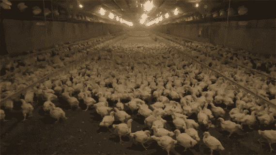

# 狗屁工作

> 原文：<https://medium.com/swlh/bullshit-jobs-c1815fc10b77>

为什么你目前的工作场所不令人满意。

作为一名专业软件开发人员，我已经取得了一定程度的成功。市场非常好，越来越多的自动化需求涌入。因此，我在各种各样的场合都有每小时 150 美元的报酬。我远程工作，制定我自己的时间表(主要是)，我有一定程度的自由来决定我做什么样的项目。

显然，有些人崇拜我，我每天都会在 LinkedIn 上收到几条信息，寻求帮助或职业建议(还有几条请求咨询服务)。大多数人想知道如何做才能得到我的职位，而我正在寻找最大化我的自由和代理/自主权的方法，同时在我认为相关的项目上工作。

抛开那些滑稽的时刻(曾经有人问我，我的时薪是不是用罗马尼亚元计算的——提示:根本没有这种货币)，我想我们 10 年后回顾当前的状况，会惊叹于我们过去是如何在如此僵化的结构中组织起来的。

## 工作场所的现状

时间是你唯一无法挽回的东西。那么，目前的就业市场对你的影响如何？

在工业革命期间，在一些工业场所实行每天 12 至 16 小时，每周 6 至 7 天的工作时间表。

另一方面，在我们作为狩猎采集者的时代，我们每天的工作时间短至 3-4 小时。

如今，每天花在工作上的时间似乎在 8 小时左右。但这与我们的最佳表现同步吗？你最终工作了多少，又有多少在饮水机旁或在一个没有成效的会议中浪费了？一项研究表明，一个工作日只有 2:23 小时是有效率的！！！众所周知，查尔斯·达尔文和历史上其他许多有成就的人工作时间都很短。似乎[他们的大部分日程都围绕着我们可能认为的休闲时间](http://theweek.com/articles/696644/why-should-work-4-hours-day-according-science)，进行长时间的散步和思考。

我们如何调和这两个截然不同的世界？在光谱的一端，我们有工业革命时期的工人，每周工作多达 100 小时，勉强维持生计。另一方面，我们有达尔文，他每天总共只工作六个小时，却出版了 19 本书，重塑了生物学。

当然，人与人之间的创造力、智力和专注能力以及其他许多特征是有差异的。让我们严格地看一下**生产率**和投入的**时间**之间的关系。在阅读了几十份关于这个主题的研究后，我发现重复性工作和创造性工作之间有着明显的区别。重复性工作，如在工厂装配线上检查汽车零件的质量，几乎可以无限期地进行，几乎没有或没有产量损失。如果取消大多数国家的规章制度，这些工人将每天苦干 16 个小时甚至更多。然而，创造性的工作是不同的。认知和生产力的下降早在 4 小时后就开始了，而且往往与智商有关。工厂工人很容易被取代，一个开发人员或一个高层管理人员，更是如此。

为了激励在基本任务之外工作的员工，Daniel Pink 确定了以下三个提高绩效和满意度的因素:

*   自主——我们渴望自我指导。它增加了参与度而不是合规性。
*   精通——获得更好技能的冲动。
*   目标——做有意义且重要的事情的愿望。那些只关注利润而不重视目标的企业最终会得到糟糕的客户服务和不满意的员工。

## 我真的非常非常好奇。你现在的工作涵盖了这三者中的多少？如果你快乐，你是怎么找到一份让你在上班路上跳踢踏舞的工作的？怎么会更好呢？

A man in a helicopter works on high-voltage power lines. That’s quite amazing!

如果我们对自己诚实，我们会发现很少有人有幸拥有这样的工作场所。什么样的工作最没有成就感？大卫·葛雷博在他的新书《狗屁工作】中列举了一系列此类工作。

根据大卫的说法，大约五分之二的工作都是扯淡。

1930 年，经济学家约翰·梅纳德·凯恩斯(John Maynard Keynes)断言，到 21 世纪，技术进步将导致每周 15 小时工作制。我不是凯恩斯的粉丝，但他在这一点上完全正确。我们大多数人应该每周工作 15 小时。

凯恩斯关于技术进步的预测也是完全正确的——但是他关于工作的预测也是大错特错。为什么？

100 年前基本不存在的新工作开始涌现。

事情是这样的:这些工作都不是真正必要的。不像清洁工、公共汽车司机和护士，他们的缺席会让城市和社会陷入停滞，游说者和私募股权公司的首席执行官并不那么重要。没有他们，生活也不会更糟。我知道，但是继续读下去。

换句话说，狗屁工作的特点就是毫无意义。那么从事这类工作的人对它们有什么感觉呢？

2013 年英国 YouGov 民意调查发现，整整 37%的人认为他们的工作没有“对世界做出有意义的贡献”丹麦一项类似的民意调查显示，这一数字为 40%。

扯淡的工作有五种截然不同的类别:*奴才*、*打手*、*窝囊废*、*检票员、*和*监工*。

雇用奴才只是为了让一个人或一个组织看起来重要。想想中世纪的看门人。现在，看看办公楼里的接待员。他们实际上没做什么，只是提升了他们工作的机构/公司的地位。

**打手**被收买，操纵者，侵略者。像公司律师、游说者和公关人员，以及其他任何觉得他们的工作令人反感的人，因为他们的工作从根本上来说就是操纵。

**导管锥形**，通常只是为了解决别人不想解决的问题。导管锥度*是需要的*，但它们不应该。如果组织和他们的技术工作正常，管道锥将被淘汰——这就是废话所在。

与**检票机**相同。他们纯粹而简单地被需要，所以一个组织可以表明它正在做一些实际上可能没有做的事情。

我们最后一种扯淡的工作是毫无意义的监工——他的员工根本不需要任何监督。

我想玩一个小游戏。你能指出以下工作属于哪一类吗？

一名工人报告说，他们每天花 8 个小时复印退伍军人的健康记录，因为——管理层说——购买数字化技术太贵了。另一个人报告说，在他的旅游公司，有人被雇用来接收最新的航班时刻表，并将它们手工复制到电子表格中。

蕾拉在公司合规行业工作，为美国公司服务，根据法律，这些公司必须证明他们没有与任何海外腐败供应商合作。蕾拉提交尽职调查报告。他们看起来不错，有足够的行话听起来令人印象深刻。但是它们真的有帮助吗？根据蕾拉的说法，除非有真正明显的危险信号，例如供应商的老板有犯罪记录，否则这样的报告不可能提到腐败的迹象。打勾，但这都是为了表演。

Alphonso 是一名本地化经理。他的工作是管理一个翻译团队，但是他们——他说——完全有能力在没有他的情况下工作。他们训练有素，能够更好地管理自己的时间和工作所需的适度任务。Alphonso 所做的就是通过一个在线系统接收任务请求，并把它们传递给某人。Alphonso 报告说，他唯一感到有成就感的是，他成功地向上级隐瞒了他的团队的工作量轻得令人难以置信。尽管没有足够的工作来证明五名翻译的合理性，但阿方索的欺骗确保了没有人被解雇。

我们醒着的大部分时间都在工作。所以做一份狗屁工作一定会对灵魂造成伤害，对吧？

还记得 YouGov 民调发现 37%的人认为他们的工作毫无意义吗？调查还发现，33%的人觉得自己的工作没有成就感。这告诉我们，虽然一小部分人可能在他们的狗屁工作中感到快乐，但大多数人并不快乐。

一个原因是虚假——表现得不真诚或不诚实——很难处理。

有目标是人类的需要。狗屁工作让我们失去了这些。

对充分就业有一种强烈的文化和政治偏见。清教徒认为工作是惩罚和救赎。政客们，不管是左派还是右派，都在努力保住那些狗屁工作。

巴拉克·奥巴马提出，放弃美国私有化的医疗保险体系，转而采用单一支付模式，将节省数十亿美元的保险和管理费用。奥巴马说，这些节省意味着“一百万、二百万、三百万个工作岗位”的损失。他问道，我们该拿这些新失业的人怎么办？当时世界上最有权势的人正在鼓吹数百万个狗屁办公室工作。

众所周知，政府效率低下。企业呢？

嗯，企业往往不会以有效的方式行事，原因通常是显而易见的。以西蒙为例，他被一家大银行聘为问题解决者。有一次，他创建了一些软件来修复一个系统错误和安全风险。他向一位银行高管和他的 25 人团队介绍了他的方法，但得到的反应是负面的。Simon 慢慢意识到为什么:他的程序会使整个团队的工作自动化。甚至主管也不认可西蒙的工作。为什么？嗯，没有他的仆人，他什么也不是——就像一个没有随从的中世纪领主。

很容易想象不需要工作生存的人选择成为幼儿教师。或者公共汽车司机、玩具制造商、手工甜甜圈零售商或任何必要的、令人愉快的或两者兼而有之的角色。很容易想象。

很难想象有经济自由的人会选择花时间为一家医疗成本管理公司突出表格，或设计横幅广告或研究公司合规性。

我想保持平衡的观点。游手好闲是魔鬼的玩物。尼采说，在和平时期，好战的人会攻击自己。历史上有很多很多例子表明，闲人的想法造成了混乱。

选择我们想做什么的自由可能不会解决工作世界的所有问题。但是考虑到目前的工作分配是多么的低效，它几乎肯定不会让事情变得更糟。

很少有人能从工作中获得满足感。很少有人有自主权、主导权和目标，使得他们的工作时间是值得的。太多的人被困在无聊的工作中，并因此遭受心理伤害，失去目标，无法对世界产生积极的影响。

**不幸的是，我们的社会天生相信工作，重视在办公室的日子，即使产出毫无价值。但是还有另一种方法。**

**例如，普遍基本收入将允许人们选择如何造福人类——这几乎肯定会有利于我们的工作方式。我正在做另一个。如果你想了解更多，我正在私下分享我在该主题上的工作。请通过电子邮件、LinkedIn、Twitter 或 ravens 联系我。**

## 这篇文章发表在 [The Startup](https://medium.com/swlh) 上，这是 Medium 最大的创业刊物，有+ 380，756 人关注。

## 订阅接收[我们的头条新闻](http://growthsupply.com/the-startup-newsletter/)。

