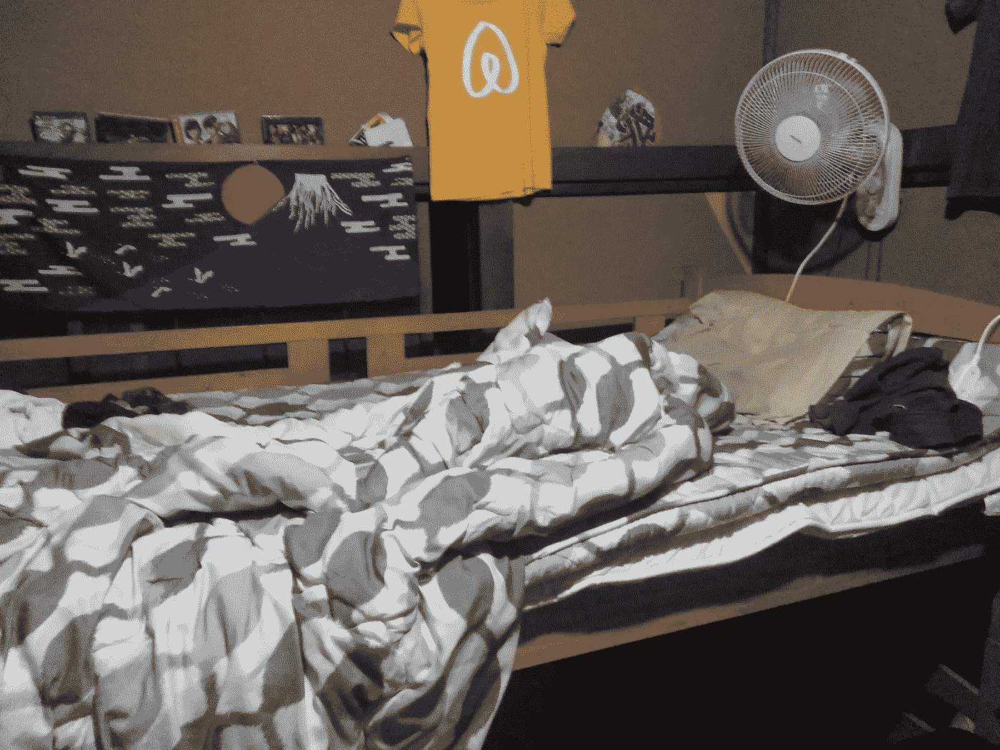
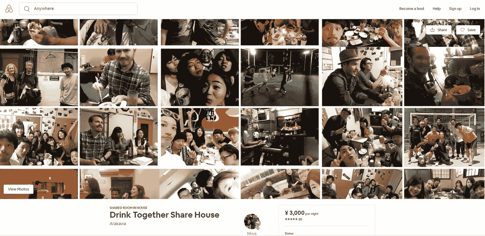

# 一个破旧的双层床是如何成为东京最受欢迎的航空床之一的

> 原文：<https://medium.com/swlh/bunk-bed-success-story-9e34d4563d45>

This is it, in all it’s glory folks!

## 定位定位定位。

你在上面看到的图片就是 Airbnb 中的双层床。

无论如何想象，对于背包客或精打细算的 20 多岁年轻人来说，都不是不适合居住的。

但这并不完全是我会看到的照片，然后说，嗯，我肯定会留在这里。

现在考虑到它甚至不在东京市中心，它本身肯定不足以全年预订满，受到五星评论的轰炸，并让它的主人变成一个例行的超级

> 那么，为什么它做得这么好呢？

显然床和房间不是原因，那么这家 Airbnb 的神奇酱到底是什么？

让我们来看看人们在选择住宿地点时通常会优先考虑的事情:

*   位置
*   舒适
*   价格/价值
*   服务

## 位置

位置，位置，位置。

它的位置一定很好，对吗？

从东京铁塔，皇宫，涉谷或其他地方的石头扔出…

太离谱了。

它远离大多数普通的旅游景点，以及商业中心和休闲场所。

虽然位置不算太差，但也不太方便。

同样，位置本身并不是推动需求/客户满意度的优势。

## 舒适

虽然有一个厨房和一个浴室(在原建筑的附属建筑中，因为浴室仍然是房子在 60 年代建造时的标准),但设施也不是一个强有力的论据。

这里没有游泳池、按摩浴缸、为你准备的迷你酒吧和香槟或任何可以证明结果的东西。

唯一能拯救格雷斯的便利设施(如果你喜欢那种东西的话)是有一台电视和一台能正常工作的任天堂 64 游戏机，还有那些真的会和你玩到凌晨的人。

## 价格/价值

再说一次，在标价上，它并不是所在地区最便宜的 Airbnb，你必须和另外两个人合住一个房间(其中一个是一个奇怪的，高个子的挪威人，名叫“Ragnar”)，当 Airbnb 根据需求自动提高价格时(在主人注意到之前)，它仍然基本上被预订满了。

## 服务

现在我们进入了正确的区域，但同样，这种服务不完全是五星级酒店的服务，这种服务很可能会惹恼[那些在逗留期间宁愿独处的人](/@krisgage/why-im-over-airbnb-f4a35aacc951)；实际上被当作客人/朋友。

但是没人会生气。

每个人都给出了 5 颗星的评价(甚至将清洁度列为 5，尽管这是一栋住着 8 个年轻人的老房子……)

但实际上，很难预先量化服务，并根据专注于此的个人资料开始获得第一批客人。

# 配置

只要快速浏览一下页面，我们就能很快发现 Rikiya 并没有试图向任何人推销在他的一个共用房间里放上下铺的想法。

友情。

酒友。

美好时光。

他在推销一种体验。

这是这一页的主导主题，在他写的文字和他选择的图片中清楚地表现出来。

几乎在每张照片中，他都展示了住在共享屋的现在或过去的人与以前的客人一起玩乐，而不是空间本身的乏味照片。

他没有把他的 Airbnb 定位为一个住宿的地方。

他传达了 Airbnb 的独特优势，并没有让潜在客人的住宿体验取决于他们的想象力。

通过将他的 Airbnb 定位为年轻人的有趣体验，他设法只获得他想要的客户，并在一个大多数人每月只有几个客人的地区保持 Airbnb 的预订满员。

不要害怕脱颖而出。

不要害怕疏远那些对你实际提供的东西不感兴趣的人。

将你的业务定位于你真正想与之合作的人。

*完全披露:我和 Rikiya 住在一起，是“Hakuna Matata”的长期成员之一。*

*如果你去东京，我会邀请你和我们住在一起，但是因为日本新的“Minpaku 法律”,我们只能接待住一个月或更长时间的客人。*

我去年五月去过那里，并半开玩笑地说，当我今年晚些时候回到东京长期居住时，我会搬进去。半年后我搬进来了，这证明了 Rikiya 对待通过 Airbnb 住在那里的人的方式；作为朋友。(他甚至帮我找到了自由职业客户。)

## 这篇文章发表在 [The Startup](https://medium.com/swlh) 上，这是 Medium 最大的创业刊物，拥有 335，210 多名读者。

## 在这里订阅接收[我们的头条新闻](http://growthsupply.com/the-startup-newsletter/)。

