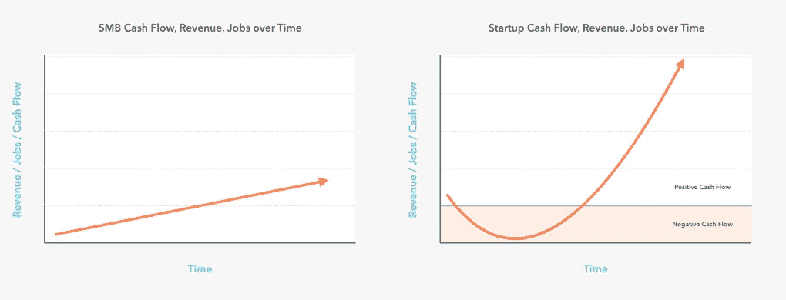
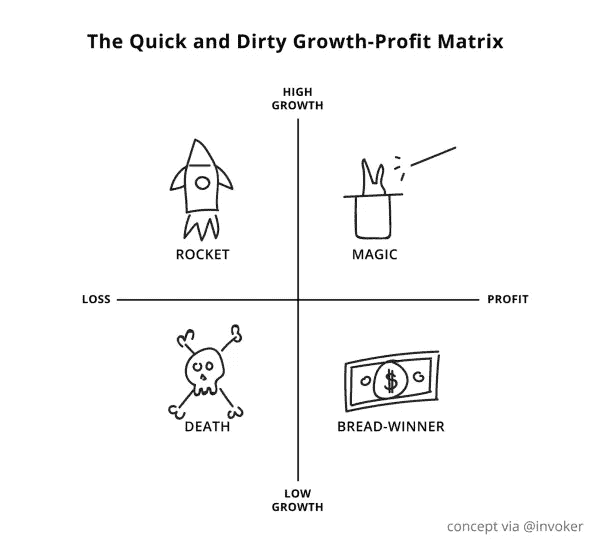
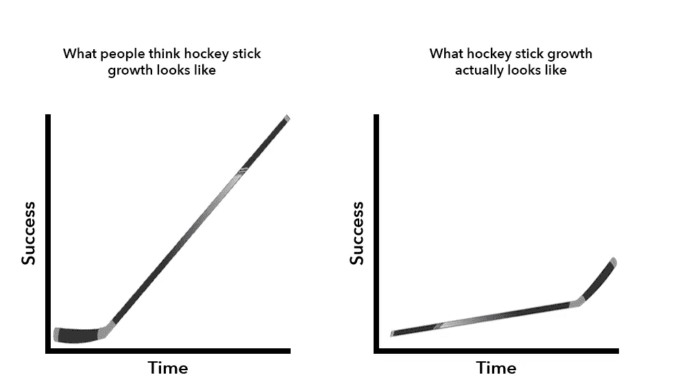

# 创业的燃烧率 101:15 分钟简介

> 原文：<https://medium.com/swlh/burn-rate-101-for-startups-a-15-min-introduction-6755936efc88>

Originally published at [http://www.appsterhq.com](http://www.appsterhq.com/?utm_source=CP&utm_medium=Medium)

超过 90%的创业公司都失败了。[许多](https://s3.amazonaws.com/startupcompass-public/StartupGenomeReport1_Why_Startups_Succeed_v2.pdf) [研究](http://innovationfootprints.com/wp-content/uploads/2015/07/startup-genome-report-extra-on-premature-scaling.pdf) [认为](http://www.cbinsights.com/research/startup-failure-reasons-top/)这种高失败率可以归咎于新公司无力开发[史蒂夫·布兰克](https://steveblank.com/2010/01/25/whats-a-startup-first-principles/)所说的“可重复和可扩展的商业模式”。

简单来说，创业公司关门是因为他们缺乏经济资源来继续为他们的运营提供资金，也就是说，他们用完了现金。

因此，创始人必须不断衡量他们企业的支出和收入。维持可持续的现金流需要理解消耗率和跑道的关键概念。

在这篇文章中，我将详细解释这些和几个相关的概念，并概述促进长期创业成长的各种策略。

# 简单说一下上下文

重要的是要认识到，对烧钱速度和跑道的讨论必然包含在对创业赚钱的主要概念、策略和过程的讨论中。

在 Appster，我们已经写了很多详细的文章，研究了金钱和增长之间关系的许多不同方面。

在阅读今天的文章时，请记住以下几个重要的动态:

*   **市场动态最终决定**你是否能产生足够的资金来扩大你的创业公司的运营规模(见: [1](http://www.appsterhq.com/blog/early-stage-entrepreneurs-launch-profitable-startup) 、 [2](http://www.appsterhq.com/blog/markets-fancy-ideas-create-successful-start-ups) 、 [3](http://www.appsterhq.com/blog/costly-mistakes-avoid-first-time-entrepreneur) 、[4](http://www.appsterhq.com/blog/3-crucial-features-high-growth-startups))；
*   你的创业公司应该在适当的时候利用一些经过实践检验的真正的赚钱策略(参见:[这里](http://www.appsterhq.com/blog/app-monetization-models))；
*   **确保你充分利用病毒式营销**，包括“病毒循环”(见:[此处](http://www.appsterhq.com/blog/startup-growth-viral-loops))；
*   创业股本是创业赚钱的一个棘手但至关重要的方面(见:此处)；
*   **有各种基本的财务指标**，所有的初创公司都应该仔细衡量(参见:[此处](http://www.appsterhq.com/blog/track-5-mobile-app-marketing-metrics))；和
*   **成功的创业公司最大限度地利用前沿的**业务发展战略(参见:[此处](http://www.appsterhq.com/blog/business-development-for-startups))。

# 定义:“燃烧率”和“跑道”

货币化，即将资产或物品转化为货币或法定货币，是所有业务的核心。

如果一家企业赚的钱最终没有超过它花的钱(这种状态被称为“[正现金流](http://www.investopedia.com/terms/c/cashflow.asp)”)，那么这家企业将不可避免地破产(见这里的)。

同样，如果获得一个新客户所花费的金额(即“[客户获取成本](https://blog.kissmetrics.com/customer-acquisition-cost/)”)经常远远超过新客户为你的公司增加的价值(即“[客户终身价值](https://blog.kissmetrics.com/how-to-calculate-lifetime-value/)”)，那么你的创业公司将无法在未来继续运营。

正现金流和负现金流是你公司的“[收入模型](http://www.businessdictionary.com/definition/revenue-model.html)”的一个方面，即“你的业务将如何赚取收入、产生利润并产生高于平均水平的投资回报”的框架

刻录和跑道也是你的收入模式的关键组成部分。

在最近的一篇文章中，我提供了这两个概念的基本描述，以及一个如何计算它们的值的假设示例:

> *“了解你的总成本是至关重要的，因为你的业务花费的金额会影响到你是否能够盈利，如果是，那么什么时候可以盈利(以及盈利多少)。*
> 
> *支出资金(即成本)也严重影响你的初创公司* ***跑道*** *的长度，即你的公司在没有稳定收入的情况下可以生存的时间。*
> 
> *你可以用你的* ***现金余额*** *来计算你的跑道，即你的创业公司需要烧钱的金额，然后除以你的* ***烧钱率*** *，即你的企业每月的赔钱率。*
> 
> *比如:*
> 
> *跑道= 125，000 美元的现金余额**每月 25，000 美元的消耗率*
> 
> *Runway = 5 个月(直到你把钱用完)*(来源: [1](https://www.capshare.com/blog/burn-rate-101/) 、 [2](https://www.thebalance.com/what-does-burn-rate-mean-and-how-is-it-calculated-393196) )。”

因此，一般来说，“烧钱”指的是你的公司亏损的速度(即，花费它没有恢复的现金)，“跑道”——也称为“ [**零现金日期**](https://www.capshare.com/blog/burn-rate-101/)”——是假设你的当前烧钱速度，你的企业可以运营的时间长度。

我们可以通过区分以下各项来进一步阐明烧伤:

*   “**”——即你每个月花费的资本量，不考虑你产生的收入，**
*   **以及“**”——即扣除收入后剩余的费用金额(即计算完所有收入和支出后的总损失)。****

****这里有一个例子:****

*   ****如果你每年花费 500，000 美元，那么你每月的**总**消耗(即总花费)是 41，666.67 美元:500，000 美元÷ 12 个月=**；41，666.67 美元**。****
*   ****如果你每年花费 500，000 美元，但你每月产生 25，000 美元的收入，那么你每月的**净**消耗(即减去收入后损失的金额)是 16，666.67 美元:500，000 美元—(25，000 美元 x 12 个月)÷ 12 个月=**；16，666.67 美元**。****

****你可以使用下面的公式计算你的零现金日期，即你的创业公司将耗尽资金，从而无法以当前费用继续运营的大致日期:****

******零兑现日期** =当前日期+(当前日期银行存款÷[月总消耗率 x 3] x 91 天)****

****例如:****

*   ****零兑现日期= 2017 年 9 月 7 日星期四+(＄500，000÷[＄25，000 x 3] x 91)****
*   ****零兑现日期= 2017 年 9 月 7 日星期四+(500，000 美元÷75，000 美元 x 91)****
*   ****零兑现日期= 2017 年 9 月 7 日星期四+ 607 天****
*   ****零现金日期= 2019 年 5 月 7 日星期二(来源: [1](https://www.equitynet.com/crowdfunding-terminology/business-burn-rate) 、 [2](https://www.timeanddate.com/date/dateadded.html?m1=9&d1=7&y1=2017&type=add&ay=&am=&aw=&ad=607&rec=) )。****

****值得注意的是，这个公式没有考虑到你的公司产生的收入，也没有考虑到你的初创公司在其整个生命周期中经历显著收缩和扩张的真实可能性。****

****记住这一点，当你试图筹集外部资本时，计算你的零现金日期特别有用(这个过程有时需要[4-6 个月的时间](https://www.inc.com/mark-suster/how-much-should-you-be-losing-to-win-heres-how-to-discover-your-companys-burn-ra.html))。****

****持续准确地计算你的燃烧率和跑道图是至关重要的，至少有三个原因:****

1.  ****这些数字明确提醒你，如果你最终没有开始产生足够的收入(即实现正现金流状态)，你的初创公司*将在未来的某个时候*耗尽资金。****
2.  ****这些数字会影响投资者对你公司的评估和决策。****

> *****“投资者观察一家初创公司的烧钱速度，并将其与该公司的未来收入进行比较，以* ***决定该公司是否值得投资*** *。如果烧钱速度比预测的要快，或者如果公司的收入增长没有预测的那么快，那么投资者可能会认为这家公司不是一个好的投资。这可能风险太大，因此他们可能不会投资。”—* [来源](https://www.thebalance.com/what-does-burn-rate-mean-and-how-is-it-calculated-393196)****

****3.如果这些数据表明支出失控，那么你的投资者可能会感到焦虑，促使他们干预你的创业公司的运营。****

****Union Square Ventures 的联合创始人 Fred Wilson 解释了其中的原因:****

> *****“在公开股票市场，当你(作为投资者)对一支股票感到紧张时，你通常可以卖掉头寸，继续前进。在私人股本领域，你会被投资套牢。”*****

****换句话说，因为风险投资家通常不能让你[为创办一家失败(或即将失败)的初创公司承担个人财务责任](http://www.appsterhq.com/blog/startup-legal-advice-tips)，也就是说，他们通常不能没收你的个人资产，可怕的烧钱速度和跑道数量可能会促使他们采取行动，防止投资(进一步)损失。****

# ****增长与利润****

********

****正如我最近在[讨论](http://www.appsterhq.com/blog/realities-21st-century-start-ups)，[科技初创公司往往有很高的前期成本](https://www.fastcompany.com/1841912/true-costs-launching-startup)，他们试图在以后通过利用增长来恢复这些成本:****

> *****“初创公司不同于 SMB 中小型企业，因为小型企业通常需要尽快产生利润才能维持运营，而在初创公司中，人们基本上想当然地认为新公司必须牺牲利润才能实现增长。成功的初创公司通常会在相当长的一段时间内陷入“赤字”，然后突然“扭亏为盈”，并开始产生可观的收入。”*****

********

****2014 年，Benchmark 的合伙人比尔·格利(Bill Gurley)接受了《华尔街日报》的采访，他在采访中警告读者，硅谷的初创公司花费了大量危险的现金，承担了过度的风险。****

****其他有影响力的领导者和投资者，包括弗雷德·威尔森、马克·安德森和马克·苏斯特，也加入了关于创业公司烧钱率的公众讨论。****

****大多数人似乎同意格利的观点，即风险投资的初创公司花费了太多的钱——或者至少比他们从客户那里获得的收入要多得多(来源: [1](https://www.wsj.com/articles/venture-capitalist-sounds-alarm-on-silicon-valley-risk-1410740054) 、 [2](https://dealbook.nytimes.com/2014/09/25/marc-andreessen-sounds-warning-on-start-ups-burning-cash/?mcubz=0) 、 [3](https://techcrunch.com/2014/09/25/andreessen-goes-on-tweet-storm-about-burn-rates-and-says-worry/) 、 [4](https://www.businessinsider.com.au/bill-gurley-silicon-valley-is-taking-on-too-much-risk-2014-9) )。****

****几年后，创业界仍在积极讨论理想的烧钱率以及增长和利润之间更普遍的竞争(例如: [1](https://bothsidesofthetable.com/should-startups-care-about-profitability-828250a34a7d) 、 [2](https://www.inc.com/mark-suster/how-much-should-you-be-losing-to-win-heres-how-to-discover-your-companys-burn-ra.html) 、 [3](https://bothsidesofthetable.com/what-is-the-right-burn-rate-for-your-startup-6f392d67deca) 、 [4](https://www.forbes.com/sites/georgedeeb/2017/02/03/the-battle-between-driving-growth-or-profitability/) 、 [5](https://www.fastcompany.com/40424468/this-ceo-doodled-a-chart-to-help-your-startup-balance-growth-with-profit) )。****

****如今，软件行业尤其见证了增长和盈利之间根深蒂固的权衡。****

****快速提醒一下:****

*   ****“增长”指的是一家公司“增加资源或基础设施来应对增长的需求，其成本或多或少相当于收入增加的水平(严格来说，这是衡量销量增加的指标)”的状态；和****
*   ****利润是指“当从一项业务活动中获得的收入金额超过维持该活动所需的费用、成本和税收时实现的财务利益”。****

****软件即服务( [SaaS](http://www.investopedia.com/terms/s/software-as-a-service-saas.asp) )公司面临着一个独特的挑战，他们不得不花费大量(也许是全部)资金来获得客户*，然后才能以收入的形式收回成本，从而产生利润。*****

****因此，在外界(包括投资者)看来，一家 SaaS 公司最初的烧钱速度可能令人担忧。****

****[Andre essen Horowitz 的合伙人 Scott Kupor 和 Preethi Kasireddy](http://a16z.com/2014/05/13/understanding-saas-valuation-primer/) 很好地解释了这些高燃烧率背后的动力:****

> *****“在基于服务的模式下，即使客户通常签订 12-24 个月的合同，公司也不会提前将这 12-24 个月的费用确认为收入。相反，会计规则要求公司在交付软件服务时确认收入(因此，对于为期 12 个月的合同，每月按合同总价值的 1/12 确认收入)。*****
> 
> *****然而，该公司一开始就花费了几乎所有的成本来获得该客户——销售和营销、开发和维护软件、托管基础设施。随着时间的推移，这些预付费用中的许多并没有在损益表中得到确认，这就是问题所在:收入和费用的时间安排不一致。”*****

****举例来说，一家 SaaS 公司有 7 名全职员工，每月总烧钱 100，000 美元，最近一轮 A 轮融资的银行存款为 500 万美元，按照目前的烧钱速度(100，000 x 50 个月= 500 万美元)，它的跑道为 4 年零 2 个月。****

****假设，这是一个相当令人印象深刻的跑道:该公司有 4 年多的时间来实现增长并最终实现盈利。****

****然而，实际上，任何一家初创公司都不太可能在 4 年多的时间里保持稳定的燃烧速度。****

****为什么？****

****因为在接下来的 50 个月中，公司几乎肯定会投资额外的资源，甚至可能[转向](http://www.appsterhq.com/blog/start-ups-business-plans-lean-canvases-pivots)以鼓励、管理和加速增长。****

****因此，燃烧率可能会增加，导致跑道减少(特别是如果没有来自付费客户的现金收入)。****

****在评估燃烧率和跑道方面，持续计算、重新计算和重新制定策略对于任何给定的启动几乎总是必要的。****

****《精益画布》的创作者 Ash Maurya 认为，建立一个低消耗的创业公司需要在正确的时间采取正确的行动:****

****“在创业的每一个阶段，都有一系列对创业公司来说‘正确’的行动，因为它们最大化了时间、金钱和努力的回报。一个精益/白手起家的企业家忽略了所有其他的东西" ( [来源](https://blog.leanstack.com/bootstrapping-lean-startup-low-burn-startup-1662b32a3b50))。****

****烧钱速度和跑道对风险投资和[创业公司](http://www.appsterhq.com/blog/strategies-how-to-bootstrapping-startup)都至关重要。****

****自费公司的创始人必须特别足智多谋和高效:利用有限的资源(时间、金钱、关系等)工作。)，他们应该寻求最大限度地降低烧钱率，同时承诺在正确的投资上花钱(在营销、员工等方面)。).****

****有关运行精益启动的更多信息，请参见此处: [1](http://www.appsterhq.com/blog/start-ups-business-plans-lean-canvases-pivots) 、 [2](http://www.appsterhq.com/blog/costly-mistakes-avoid-first-time-entrepreneur) 、 [3](http://www.appsterhq.com/blog/strategies-how-to-bootstrapping-startup) 、 [4](/swlh/the-ultimate-8-000-word-introductory-guide-to-preventing-your-startup-from-failing-b77de791c454) 。****

****[Ryan Holmes](/@invoker/a-dummies-guide-to-startup-growth-vs-profit-72cb35311219) “初创公司的普遍增长与利润信息图:****

********

****如果你在寻找利润与增长的更详细的对比，那么考虑读一下这篇文章，它描述了越来越流行的“40%法则”。****

# ****什么是“正确的”燃烧速率？****

********

****2011 年，[弗雷德·威尔逊](http://avc.com/2011/12/burn-rates-how-much/)提出了一个计算(他认为应该是)初创公司最大烧钱率的基本公式:****

****一个很好的经验法则是将团队人数乘以 1 万美元来得到每月的消耗。这不是你付给员工的数目。这是一个人的‘全部负担’成本，包括房租和其他成本。”****

****因此，如果一家初创公司有 5 名全职员工，每月支出 100，000 美元，那么根据威尔逊的公式，该公司的支出是其应有支出的 2 倍(即 50，000 美元对 100，000 美元)。****

****另一个普遍接受的经验法则是每月花费不到你最近一次融资的 10%。****

****举个例子，如果你在最近一轮融资中筹集了 150 万美元，那么你每个月的支出应该少于 15 万美元。****

****在这种情况下，重要的是要认识到，在你需要筹集新一轮资金之前，这样的金额只会给你的公司 10 个月的时间。****

****那么，一个稍微小一点的数字，比如 5%到 9%可能更合适(取决于筹集了多少资金)。****

****事实上，天使投资人马丁·双立人强调了这一点:****

*****“如果你的跑道还不到一年，是时候开始寻找新的资金注入，或者制定并实施 B 计划来确保生存。你的目标是神奇的盈亏平衡点和曲棍球棒利润增长曲线。从专业投资者，甚至是朋友和家人那里筹集资金需要时间。从开始融资到新支票兑现，需要六个月的时间。”*****

****因为不是所有的烧钱都是一样的，所以不可能遵循一个精确的公式来简单通用地确定所有创业公司的“正确”烧钱率。****

****两家烧钱速度相同的公司在各自的市场地位上可能“天壤之别”。****

****机会成本、增长速度、不同的投资方式以及许多其他因素都会影响特定公司特定燃烧率的适用性(和可持续性)。****

****有些人，比如创始人基金的合伙人[斯科特·诺兰](http://techcrunch.com/2015/04/05/burn-rate-doesnt-matter/)，甚至建议创始人应该更少关注烧钱率本身，而更多关注公司支出对执行力的影响:****

*****“烧钱速度并不能说明一家初创公司是否步入正轨。只有评估一个公司对现金的使用和长期战略，才能诊断出高燃的好坏。在许多情况下，低燃烧理想实际上是危险的。我们避免投资公司，除非它们在消耗现金。当投资会更快带来积极的进展时，我们就来投资，这通常表现为现金转化为资产和增加消耗。现金流为正的企业通常已经过了这个拐点。*****

****马克·苏斯特[提出了类似的观点，他坚持认为，如果不首先考虑创始人(难以衡量)的风险承受能力，即为了实现快速增长而做出让公司面临潜在崩溃的决策的意愿，就不可能确定一个可接受的烧钱率。](http://www.bothsidesofthetable.com/2016/02/15/so-what-is-the-right-level-of-burn-rate-for-a-startup-these-days/)****

****自筹资金的创业公司应该以他们能够合理管理和维持的速度增长。****

****事实上，我们已经写了很多关于与过早扩展相关的[危险的文章(例如，试图过快地扩展到过大的规模而“贪多嚼不烂”)。](https://www.google.ca/url?sa=t&rct=j&q=&esrc=s&source=web&cd=2&cad=rja&uact=8&ved=0ahUKEwje_teN0pPWAhUn0oMKHVhwA9MQFgguMAE&url=http%3A%2F%2Fwww.appsterhq.com%2Fblog%2F4-financial-metrics-startups-measure&usg=AFQjCNGbwlsXH9mhcSkxpyFSNyG0f2Kwkg)****

****正如试图建立一家高增长创业公司的许多其他方面一样，你必须在疯狂支出和现金耗尽与过于谨慎和错过真正增长的机会之间达成平衡。****

****正如我之前提到的，许多初创公司在最终陷入亏损之前，会很快转变为盈利。****

****重要的是要记住，如果你的公司要取得成功，它很可能会遵循曲棍球棒的增长模式:****

********

****最终，找出你的最佳烧钱率和跑道需要你对你公司的所有主要经济和战略方面进行整体(即全面)分析，从解决[真正的客户痛苦](http://www.appsterhq.com/blog/early-stage-entrepreneurs-launch-profitable-startup)，创造和测试[最低可行产品](http://www.appsterhq.com/blog/mvp-app)，确保[产品/市场适合度](http://www.appsterhq.com/blog/markets-fancy-ideas-create-successful-start-ups)，到应用和测试不同的[盈利战略](http://www.appsterhq.com/blog/app-monetization-models)，与[顾问和导师](http://www.appsterhq.com/blog/startup-advisory-boards-mentors)合作，以及[国际扩张](http://www.appsterhq.com/blog/4-crucial-steps-expanding-startup-internationally)。****

# ****优化燃烧速度的 6 种方法****

********

****为了结束这篇文章，现在让我们简单讨论一下优化燃烧速度的 6 种不同策略。****

****除了彻底探索和测试您的特定创业公司的独特需求和能力，您还可以通过遵循以下原则来优化您的燃烧率:****

1.  ******工资外支出不要超过预算的 5-10%******

****除了工资、税收、设备/技术和租金之外，您应该避免在资源或投资上花费超过 10 %的预算。****

******2。在大量投资特定营销方法之前，测试营销渠道******

****对你的创业公司来说，最有吸引力的营销渠道是那些能够带来最低的客户获取成本、吸引最多的用户、在提供最高转换率方面表现最好的渠道。****

****正如我们之前在 Appster 讨论的那样，你的目标应该是利用营销策略，使你的客户终身价值和客户获取成本达到 3:1 的比例。****

******3。仅在必要时投资于人******

****给员工发工资几乎总是一家初创公司最昂贵的支出。****

****因此，你需要确保你的招聘行为是基于你公司的真正需求和新员工给你公司带来的预期价值。****

****问问你自己:我们目前缺少什么技能？由于技能短缺，我们忽略了或没有充分关注业务的哪些领域？我们是否应该考虑外包、内部招聘和/或其他各种招聘方式？****

******4。缩短您的现金转换周期******

****一家“运转良好”、持续增长、执行力强的初创公司，其现金转换周期较短。****

****目标是在不损害业务的情况下，尽可能快地将你花费的每一美元作为费用重新申报为收入。****

****简而言之，不要仅仅为了优化短期游戏而牺牲长期游戏(即，在未来几个月甚至几年获得可观的收入)(即，每天在这里或那里赚回几美元)。****

****目标是收回你已经花掉的钱*,这样你就可以再投资这些钱*,花更多的钱让你的创业公司变得更大。****

******5。形成战略伙伴关系******

****Appster 博客包含大量关于战略合作伙伴关系的重要性和方法的详细内容。****

****请务必查看以下链接，深入讨论通过与其他公司合作而不是疯狂地花光银行账户中的每一分钱来发展业务的各种方式。****

******6。进行盈亏平衡分析，并尽快达到盈亏平衡点******

****[美国小企业协会](https://www.sba.gov/starting-business/business-financials/breakeven-analysis)将“盈亏平衡分析”描述为:****

****“这是一个过程，用于确定您的企业何时能够支付所有费用并开始盈利。重要的是要确定你的启动成本，以确定你的销售收入需要支付持续的业务费用”。****

****你公司的"[盈亏平衡点](https://www.business.qld.gov.au/running-business/finances-cash-flow/managing-money/break-even-point)是指你的收入(即你从销售中获得的金额)与你的支出(即你的[固定成本和可变成本](http://www.appsterhq.com/blog/4-financial-metrics-startups-measure)的金额)完全匹配的点。****

****超过盈亏平衡点的点就是你开始积累利润的点。****

****计算盈亏平衡点可以让你通过发现和记录公司的重要经济数据来提高烧钱速度。****

****正如这里讨论的，分析你的盈亏平衡点可以确定:****

*   *****“你现在的产品线有多赚钱；*****
*   *****在你开始遭受损失之前，销售可以下降到什么程度；*****
*   *****你需要卖出多少台才能盈利；*****
*   *****降低价格或销量将如何影响您的利润；和*****
*   *****你需要增加多少价格或销量来弥补固定成本的增加。*****

****坦率地说，达到盈亏平衡点可能意味着创业公司的生死存亡。****

****追求收支平衡点需要评估必要和可选的开支，并做出各种困难的决定。****

****什么时候，如果有的话，你愿意:****

*   ****限制或增加对产品开发或营销的投资？****
*   ****降低你个人和/或员工的工资？****
*   ****解雇员工？****
*   ****搬到更便宜的城市？****
*   ****更加努力地提高毛利率？****

****从好的方面来看，实现盈利将使投资于具有巨大潜力的计划成为可能，从而产生高增长。****

****实际上，你可以通过以下方式更快地达到收支平衡点:****

*   ****尽可能消除一次性费用；****
*   ****[提高固定成本的效率](http://www.appsterhq.com/blog/4-financial-metrics-startups-measure)利用新技术——如 Google Docs、Quora、Skype 和 Slack——与您的客户和同事/合作伙伴交流，收集数据，和/或以比更传统的市场研究、广告和沟通方式更便宜的方式进行研究；和****
*   ****协商灵活的软件许可。****

****//****

## ****感谢阅读！****

# ****如果你喜欢这篇文章，请随意点击下面的按钮👏去帮助别人找到它！****

****************

# ****对应用程序有想法吗？[我们来聊聊](http://www.appsterhq.com/?utm_source=CP&utm_medium=Medium)。****

****在过去的几年里，我们已经帮助建立了超过 12 个数百万美元的创业公司。[查看我们如何帮助您](http://www.appsterhq.com/?utm_source=CP&utm_medium=Medium)。****

********

> ****最初发表于 http://www.appsterhq.com****

********