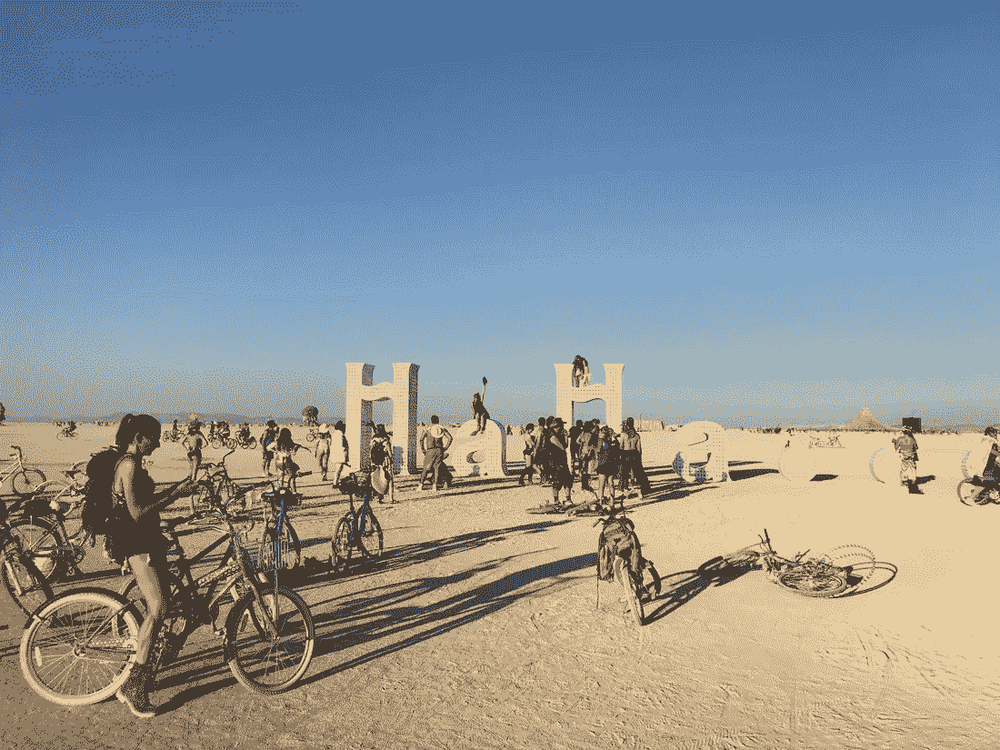
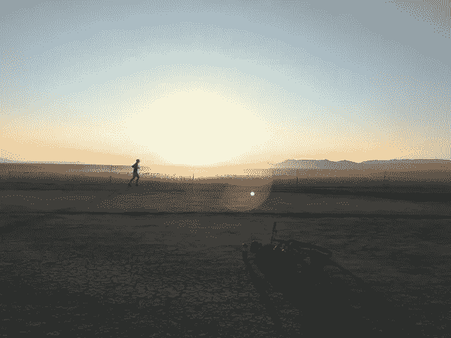
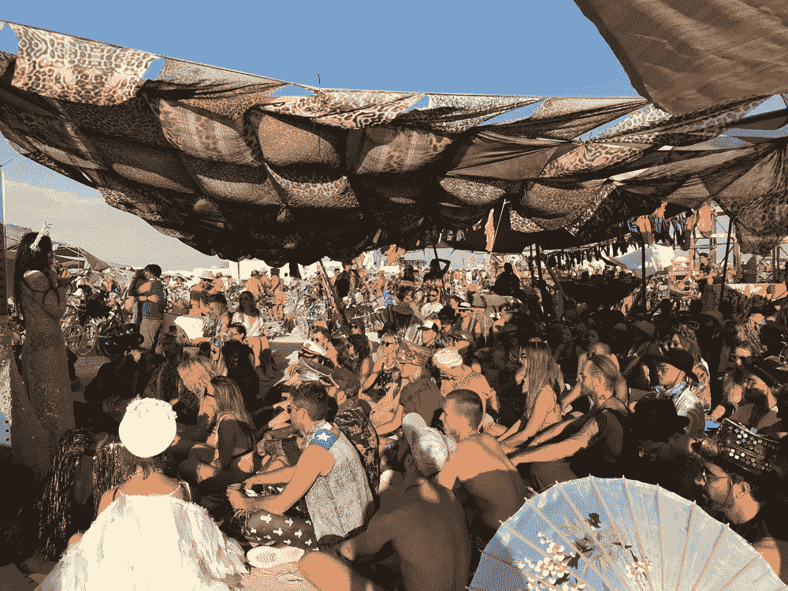
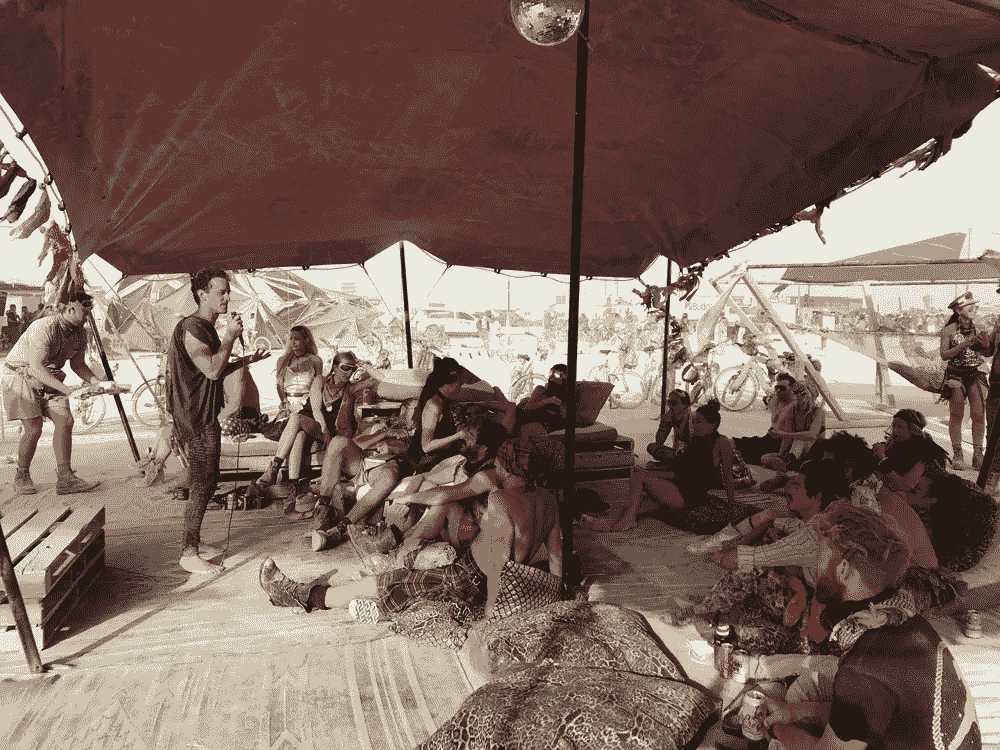

# 燃烧的人:一个现成的指南(燃烧器制作)

> 原文：<https://medium.com/swlh/burning-man-a-ready-to-go-guide-burner-made-dcbe1a46bb74>

## 燃烧的人让每个人都变得简单

燃烧的人，也许是地球上最狂野、超现实、充满田园风情和创造力的**之一。也可以说它是这个星球上能量、共鸣、天赋、魔力最集中的地方之一，让我们不要欺骗自己，金钱。正如我的朋友 Víctor 在 Instagram 帖子中所说，这可能是地球上最生动的沙漠。正如 [**我在 2014 年**](https://isragarcia.es/tag/burning-man) 说的，我第一次参加这个 8-9 天就出生和死亡的世界，向一个还没有走的人解释燃烧的人是什么就像告诉一个盲人颜色是什么一样。这是一个相当棘手的任务。**

****

**我敢肯定的是，今天，燃烧的人是数百万人最渴望的，郁郁葱葱的和有吸引力的目的地之一。尤其是社交媒体出现之后。**

# **什么是燃烧的人，简化**

**简化一点，黑岩城沙漠里一个八万多人聚会的地方，在 [**十大原则**](https://burningman.org/culture/philosophical-center/10-principles/) 下共存。**

1.  **自由基内含物**
2.  **慷慨/礼物。**
3.  **使退役**
4.  **彻底的自给自足**
5.  **激进的自我表现。**
6.  **共同努力**
7.  **公民责任**
8.  **不要留下任何痕迹。**
9.  **参与。**
10.  **直接性/紧迫性。**

**许多硅谷公司将这些原则作为商业价值观和哲学。这就是燃烧的人是什么的开始。**

# **三年后的体验**

**那是我第三年，2014，2016，2018。当你生活在美洲大陆以外的地方，比如欧洲或者更远的地方，物流变得更加复杂。另外，以我的情况来说，每年都做，多少有些重复。这就是为什么每两年甚至每三年一次是接近它的好方法。至少对我来说是这样。事实是，我去的每一年，我都经历了完全不同的经历，经历了他们的学习，经历了他们特殊的时刻。它总是在变，因为你永远都不一样了。**

**燃烧的人可以作为一个退路，一个断开的地方，一个向任何人开放的地方。一个团结的地方，释放你自己，重新联系你自己，做你永远不会做的事情。它可以让我们狂欢到发疯，或者从了不起的人那里学到你在其他地方学不到的东西，或者从其他地方学不到的东西。它服务于并且可以以如此多的方式接近，我认为组合是无穷无尽的。**

**今年，我会说，燃烧的人(和 [**非洲燃烧**](https://isragarcia.com/afrika-burn-amazing-experience-festival) 为例)是，我会说，他们是绝对断开的地方，流向哪里，进入我自己很深。一个与自然互动、与共鸣者交流的地方。我重复一遍，对我来说，这是一个超级静修地，那里聚集了巨大的能量。**

**Isra，什么是燃烧的人，嗯，对我来说，这是一个重要的经历，对一些人来说，它甚至改变了他们的生活。**

# **如何生活燃烧的人**

**不只有一种方法；我上面说的公式有几百个。我记得我们生活的第一年更多的是一种发现。此外，我们是一个很好的团体，八个人。第二年有些轻松，但同时也很紧张，大部分时间都是白天，我们三个人。这一个，第三个，更主观，但同时也更开放，因为我认识很多我正在寻找的人。这一次，我和朋友 Elena 一起去了。最好的部分是，它是为所有类型的人考虑的，从家庭、老年人、青少年、夫妇等等。**

****

**当你在那里时，你会忘记其他一切；就像生活在另一个星球上。这是一个乌托邦，听起来有些夸张，其实不然。**

**活着的燃烧人取决于许多因素:**

*   **你和谁一起去？我在阿朵和一个异性尝试过团体，三个朋友。如果有下一次，我会一个人去。**
*   **你要去的地方:许多人选择免费的露营区，更多的人选择与朋友或新人一起“露营”。经历变化不一样，我去过两个营地， [**IDEATE**](http://www.ideate.org/) 两年， [**营地 Bang Bang**](http://www.campbangbang.com/) 这一年。彼此完全不同，有各自的房子。也许接下来的一年我会尝试露营，我还不知道，但我觉得很喜欢。**
*   **你打算怎么做？你可以选择带着你的帐篷，你的蒙古包，或者去一个房车，如果你有和想要的话。但是，您可以租用这些选项中的任何一个。不过，让我告诉你，当日期到来时，它们的价格会成倍增长，尤其是大篷车。第一年我住蒙古包，第二年住大篷车，第三年住帐篷。三次都是租的。我喜欢最后一个选择。这和我选择《非洲燃烧的两年》是一样的。**
*   **你准备贡献什么:你可以去接收，打晚会，那也行。你可以去看看他们来了，你也可以去参与。就我而言，第一年我帮助火人族。第二件事是在 Anastroka 顶上组织一个有 Squire 和 Alci 参加的聚会，还有，在另一天，一个有数百人参加的大型桑格利亚汽酒聚会。这第三个我贡献了一个新的燃烧人任务和一系列的演讲，我组织了两天，超过 14 个演讲者。除了参与厨房轮班，酒吧，打扫卫生等。**

# **没人告诉你的关于火人节的事情**

**这是我认为每个人都应该知道的事情，即使他们不想去，尽管说实话，98%的人死也要去:**

*   **得到一张票是极其困难的。有两三百万人的需求。大约有 70，000 张票在出售。在其网站上，有三次当他们上市销售。首先，你必须注册成为“燃烧者”然后在 Ticketfly 平台上报名。三年来，我都没买到。幸运的是，我有朋友帮助我得到它。**
*   **“在火人节没有钱，”他们说。没错，是因为你去之前花光了所有的钱。一张票的价格从 450 美元到 1500 美元不等。航班将取决于你来自哪里。你选择的住宿选择，你选择的交通工具，你支付给营地的费用(从 600 美元到 70，000 美元不等)，你带的食物，饮料和供应品(你可以正确地花费每人 500 美元)，前几天，后几天。我估计我们可以谈论至少在 2500 美元和 4000 美元之间。不废话。**
*   **一年比一年更加耀眼。如果你转一转观察，你会发现拍照的人比享受当下的人多。**
*   **这股“**”潮流很疯狂。****
*   ****第一次的最初几天是如此艰难，尤其是在开始的时候，你甚至想离开。整合并不像看起来那么容易。****
*   ****激进包容是火男的原则之一，但你去了就会意识到，你并不是用例子来说教的。****
*   ****这是一个为迷幻而创造的地方，既有艺术作品，如" [**艺术车**](https://burningman.org/culture/history/art-history/perspectives-on-playa-art/art-cars-on-the-playa/) ，"灯"等。****
*   ****等待进入的队伍可能长达 10 个小时。尤其是如果你在第一天(周日)上午 11 点以后到达。****
*   ****你永远不会看到所有的东西，有太多的活动、研讨会、聚会、音乐会、互动，你不可能在那八天里看到超过 30%的东西。这也是为什么现在有了 [**iBurn**](https://iburnapp.com/) 这样的 APP。超级实用有用到你想去的地方，找到你感兴趣的东西，看到你想要的人。****

# ****关于火人节你应该知道的更多事情****

********

****最重要的是，你阅读并跟随 [**这本生存指南**](https://survival.burningman.org/) ，在那里你有你需要知道和购买的一切。更多的预算，是的。然后，订阅他们的简讯， [**杰克兔说话**](https://burningman.org/culture/stories/jrs/) 。”在那里你会发现各种各样的信息，从时间到交通，最后一分钟的新闻，推荐等等。****

****之前我写了 [**我喜欢的东西和我不喜欢的东西**](https://isragarcia.es/burning-man-bueno-malo) ，基于什么是火男。我也写过这个现象背后的 [**真实价值**](https://isragarcia.es/cultura-burning-man-el-valor) 。****

# ****关于燃烧的人是什么的结论****

****如果你去过，你就知道什么是燃烧的人。如果你没有去过，我主动给你的建议是，你应该去，至少去一次。每个人都应该尝试一下。****

****这一年，我对自己，对自己的情感有了更多的了解。我一直住在白天，只有两个晚上我离开了，凌晨 1 点我在睡觉。我有过两次反省。我也遇到过像卢卡斯、托尼、米格尔、尼科、努里尔这样迷人的人。然后，我更多地与我已经认识的人联系，如曼尼、凯文、道格、马丁、伊莱恩。****

****燃烧的人是了解每个人内心的最佳场所。一切都很突出，一切都有对比，当你通过第五天，几乎是在生存模式下，人们的真实“我”就出来了。在别人面前考验自己，展示自己真正的脆弱，这很棒。了解没有盾牌的人，及其所有的细微差别，是令人感动的。****

****你去过火人节吗？你觉得我漏掉了什么？你有什么问题吗？在评论里留下吧，我会尽快回答的。****

****愿旅行继续。****

****【本帖最早出现在 isragarcia.com 的****

# ******只有当你觉得值得的时候，才让这个故事震撼吧！如果你发现任何有价值的东西，请鼓掌。******

> ******Isra Garcia = 55 个客户，48 家企业，400 次演讲，3.574 篇帖子，24 个项目，6 本书，380 场讲座，6 家公司，17 次冒险，26 次实验，∞失败。到目前为止…******
> 
> ******[营销人员](https://isragarcia.com/wp/marketer)。顾问。扬声器。作家。教育家。经理。 [IG](http://thisisig.com) 的负责人。博主。企业家。颠覆性创新。数字化转型。高绩效者和生活方式实验者。******

# ******行动号召>>点击[这里](http://feeds.feedburner.com/isragarcia)订阅更多类似的文章！******

************

## ******这篇文章发表在 [The Startup](https://medium.com/swlh) 上，这是 Medium 最大的创业刊物，拥有+ 372，020 名读者。******

## ******订阅接收[我们的头条新闻](http://growthsupply.com/the-startup-newsletter/)。******

************