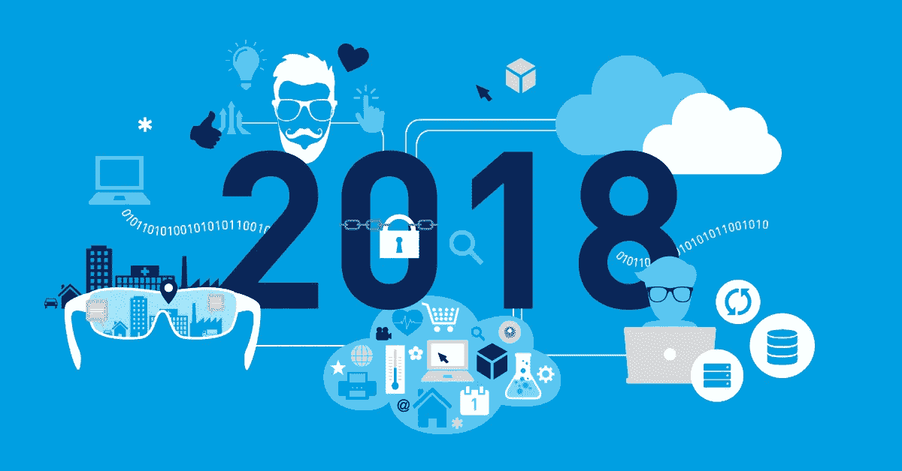
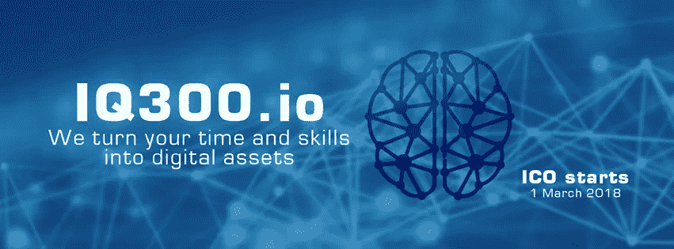

# 区块链的商业作为一种数据保护技术正在被引入我们的生活

> 原文：<https://medium.com/swlh/business-in-blockchain-as-a-data-protection-technology-is-being-introduced-into-our-lives-5d4f21764cef>

Blokchain 终于被引入了我们的生活。如今，只有最懒的人才不会讨论这项技术。关于我们在不久的将来会面临什么，区块链会有什么样的影响，有很多观点。俄罗斯第一个管理业务流程的服务的创始人，基于这项技术——[**www . IQ 300 . io，**](http://www.iq300.io,) **Alexander Tkachov 分享了他的想法和推测，以及对 IT 领域的前景。**

你认为 21 世纪商业的主要威胁是什么？也许，这是不受控制的技术发展，不是吗？在你看来，商业的主要危险隐藏在哪里？

我认为当今全球化是商业的主要威胁。目前，全球化意味着利用成功的项目创造严重的金融怪物和商业模式，为了某一小部分人的个人利益而影响市场，因为这种性质使他们无法全面地看待某一部门的商业状况。这种低估和误解导致了经济的上升。全球企业发展缓慢且惯性大，因此最大的威胁是缺乏能够有效应对不断变化的发展中市场和世界的技术。

至于技术的发展，在我看来，现代经济的主要任务是减少将想法付诸实施所需的时间。不使用数字技术和人工智能是不可能的时代已经到来。他们的发展应该如何管理的问题似乎是开放的。应该承认，如今信息流动速度如此之快，以至于根本不可能控制一切——没有完全控制的工具。也许，它们会在某一天发生，但是顺便说一下，目前我们可以宣称在相当高的程度上存在着某种不可控性。

**你相信俄罗斯的数字未来吗？能说说在数字化方面有些落后国外吗？**

是的。在我看来，我们国家的数字化未来是不可避免的。否则，俄罗斯的未来将受到质疑。如今，没有一个拥有活跃的进步经济的国家没有将其数据数字化。而且数字化程度越大，市场越习惯，经济的发展就越有效率。由于国家一直是经济的核心，国家必须是第一个数字化的国家。否则，它会成为经济的负担。如果俄罗斯打算跟上外国，经济的数字化应该成为优先事项之一。

然而，有一个严重的问题阻碍了我国的发展。这是一个非常有限的高质量和有能力的表演者。我们一次又一次地面临人员缺口。不可能永远装载相同的执行者。这是我们的经济落后于外国成功模式的主要原因。

对于管理者来说，智商、情商和技术哪个更重要？

我很确定，如果没有现代技术，没有很好地利用它们，人和机器的性能会大大降低。数据比较和为商业项目寻找最佳解决方案的技术是目前所有过程中最重要的催化剂。不管这听起来多么令人困惑，很明显，在解决设定的任务时，最有经验的经理甚至不能接近包含许多经理和专家的经验和知识的技术解决方案。有经验的经理和专家是为做生意创造新技术的人。如今，技术是智慧和科学成就的共生。在我看来，这种组合是一种真正有效的模式。如果你和你的组织已经学会在你的部门使用技术，我相信过一段时间，它会在质量和数量上显示出不同于你的竞争对手的结果。

**在你看来，哪些 IT 方向似乎最有前途？趋势和预测。**

人工智能和大数据是未来的事情。这将在不久的将来改变世界，将每个人团结成一个单一的集体智慧，创造一种完全不同的人和技术的组织形式。我们的 IQ300 系统是这一假设的生动例子。在一个项目中，即使是三个人的合作，也比一个人最杰出的知识和经验给我们提供了更好的结果。当我们证实了这一效果，分析了所显示的努力和成就后，项目的前景变得清晰起来——我们应该在现有平台中引入越来越多的新技术:目前是密码学和密码经济学，很快将是大数据和人工智能，我们将看到接下来会发生什么……

**IT 领域正在动态发展，业务流程正在快速优化。一个现代经理应该怎样做才能保持领先？**

大胆是 21 世纪的管理者首先应该具备的性格特征。新事物总是让人害怕。出示卡片也总是让人害怕。但是，如果让你选择隐藏什么或者展示什么，你会选择什么？我选择敞开心扉。历史上有很多不同的限制和铁幕，但它们已经显示出执行的无用性。最成功的企业都是冒着风险、满怀希望起步的。如今这样的项目是最可靠的。能够感受到合适的时机，做出大胆的决策，就是要做第一，也就是**【物极必反】**。

**您认为使用端到端解决方案完成业务任务的潜力如何？**

现成解决方案的时代已经过去——它们太大了，在实施时就过时了，这就是为什么我们的产品关注适应性:系统随着其中的业务增加并获得新功能，这是一个持续的过程。观察业务本身如何通过简单的活动教会我们的系统变得有用是非常有趣的。用户是开发平台的人，平台开始承担大部分功能，使专业人员和管理人员可以自由从事脑力劳动。

**目前最流行的 IQ300 端到端解决方案有哪些？有什么独特的东西可以提供给你的用户吗？**

编程业务流程、创建项目模板、业务流程透明和团队自组织是 IQ300 的主要优点，但不是唯一优点。最重要的是，我们激励我们的用户。平台是以这样一种方式建立的，即不可能不参与成功，对于一个人来说，重要的是要看到目标是如何实现的，并看到个人对实现目标的贡献。至于有没有需求，这是个很难回答的问题。我只能确认，IQ300 平台及其功能确实找到了他们的客户。该系统是有需求的，它确实有效，它在同事和合作伙伴中被讨论和推荐——这是一个既成事实。

您的客户如何从 IQ300 中获益？

挺简单的！客户不会为不必要的服务支付过多的费用，清楚及时地为表演者的某些工作计划费用。所有行动都受到控制。我们为客户提供了以最有效的方式工作的机会，因为我们有一个合格的部分支付系统，并在此类部分支付的基础上形成了预算的支出部分。如今，对企业来说，最重要的是分析和比较所有成本，并能够控制它们。

**有一种观点认为，在不久的将来，人们将努力与那些毫不隐瞒区块链技术的公司合作，相反，公开维护文件、付款等。你怎么想？你的预测是什么？**

开放是必然的。我相信，开放将为人类的发展注入新的动力。然而，你不应该混淆公开和保密。该系统应 100%开放，用户应 100%控制其数据的保密性，以及其合作伙伴和客户的数据。这是我们的主要任务。这并不容易，但我们成功地解决了它。

**对你个人来说，区块链上最有趣的项目是什么？**

当然是 IQ 300 区块链(笑)。严肃地说，分散化和可信度是所有好项目的特征。我们努力经受住竞争，向他人学习，并与用户分享我们的经验。我们的任务是帮助所有决定自己创业并冒险将数字时代的新技术引入其业务的人。这种大胆的事业是我们国家和整个地球的未来。

查看我们的网站:[IQ 300 . io](http://iq300.io)[iq300.com](http://iq300.com)

[查看我们的宣传视频](https://www.youtube.com/watch?v=zSKQYFuQjR8)

[阅读上一篇文章](/@9248429/600-russian-companies-are-changing-over-to-the-blockchain-system-b9dae6e15dee)

## 这篇文章发表在[《创业](https://medium.com/swlh)》上，这是 Medium 最大的创业刊物，有 290，182+人关注。

## 订阅接收[我们的头条新闻](http://growthsupply.com/the-startup-newsletter/)。

