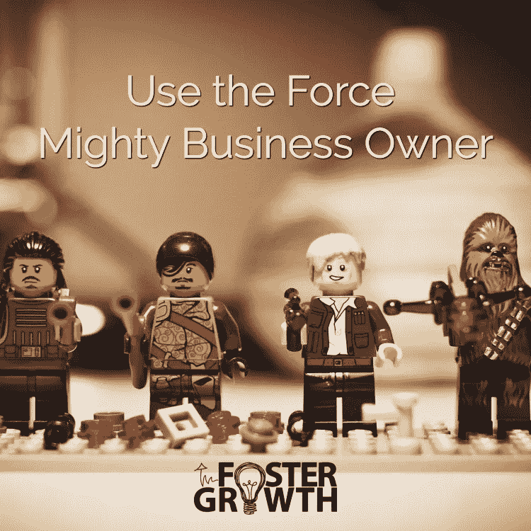

# 商业领袖:是时候释放你内心的怪胎了！

> 原文：<https://medium.com/swlh/business-leaders-time-to-unleash-your-inner-geek-764ffad8c787>

是的，你以前听说过，甚至自己也这么认为“技术是为极客、书呆子和只为男人准备的。”

**我有消息给你……你。是。不对。**

> 在最好的情况下，对业务的技术方面一无所知会让你每年损失数千美元。最坏的情况是，它将数据暴露给世界，导致您的企业关门大吉。

技术是为你准备的。

为什么？因为你是企业主。

你们大多数人创业是因为你擅长做某事或者你有一个绝妙的想法。

你创业的事实是非凡的。

不幸的是，一个企业不能仅仅依靠人才。

技术有能力让你的商业生活变得更加容易，但是你需要保持了解。

# 决定您的流程，让技术减轻负担

*Technology has the power to make your business life so much easier, but you need to stay in the know. Use The Force, Mighty Business Owner!*

您需要适当的程序和系统来确保您的业务运行。

您的客户应该得到[标准化体验](https://fostergrowth.tech/branding-more-than-a-logo)。你设定了黄金标准，并一再重复。

你应该休息一段时间。

> 作为首席执行官、掌门人、蜂后和企业所有者，技术是必须的。标准化现场流程并创建技术自动化来反映该流程，可以让您的业务在没有您的情况下也能正常工作。

这会减少你为是否记得跟进而烦恼的时间。

这导致了更多的休息时间。

**这里有一些你可以自动化的商业技术的例子:**

*   网站(全球资讯网的主机站)
*   应用程序
*   电子邮件
*   文档存储
*   备份
*   客户关系管理(CRM)
*   电子邮件营销
*   销售点系统
*   会计
*   在线交流(例如聊天机器人)
*   社会化媒体
*   安全性

我并不主张一切都自动化。没有什么能比得上个人接触和亲身的商业体验。

然而，在数字时代，没有技术就不可能推动业务发展。

我知道你在想什么——我会为此雇人的。在一定范围内，这很酷。

技术和自动化是令人难以置信的，但你需要知道它在高层次上是如何工作的，这样你就会知道什么时候不对劲。

# 释放怪胎！保护您最重要的业务资产:信息

*Technology and automation are fabulous, but you need to know how it works at a high level so you will know when something isn’t right.*

你可能会害怕，这是可以理解的，因为你不喜欢技术。

> 但是，现实是如果你不控制你的技术，那么别人会。服务提供商、员工，或者在最糟糕的情况下，罪犯进入并对您的系统和数据造成严重破坏。如果你不控制你的技术，你的企业就离失败更近了一步。

每个商业决策都会影响你的钱包和底线。我们希望对这两件事产生的唯一影响是积极的。

在[早期的文章](https://fostergrowth.tech/website-update-plan-change)中，我谈到了制定计划和愿景的重要性。这个过程包括你在整个过程中保持参与。

你不需要知道如何建立所有的联系。您需要知道技术支持您的流程。了解信息如何从客户接收到付款，再到交付和跟进。

> 让你的供应商把一切都规划出来。如果你是一个 DIY 者，一定要把它画出来。然后，如果出了问题，你就知道问题的范围了。您也有文档来帮助您尽快修复它。

**所以出去释放你内心的怪胎吧。**

**你甚至不需要口袋保护套！**

你可以做到的。为什么？因为你是一个伟大的商业领袖！

# 准备好了吗？

太多的企业将技术所有权交给服务提供商。准备好保护您的在线业务资产了吗？下载这个免费的网站所有权清单。

[点击此处获取清单！](https://fostergrowth.tech/account-ownership-checklist)

# 寻找动手的方法？

如果你不确定你需要什么，安排一次免费的 [30 分钟的技术战略会议](https://fostergrowth.tech/contact)。促进增长帮助企业制定战略，规划和实施技术项目。

*原载于 2018 年 4 月 4 日*[*foster growth . tech*](https://fostergrowth.tech/unleash-inner-geek)*。*

## 这篇文章发表在 [The Startup](https://medium.com/swlh) 上，这是 Medium 最大的创业刊物，拥有 315，028 多名读者。

## 在这里订阅接收[我们的头条新闻](http://growthsupply.com/the-startup-newsletter/)。

