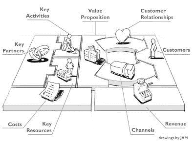
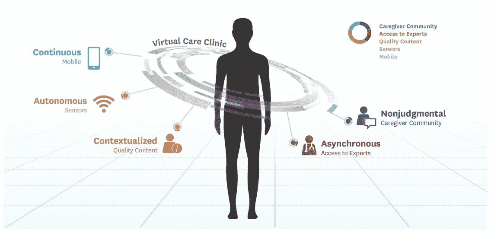
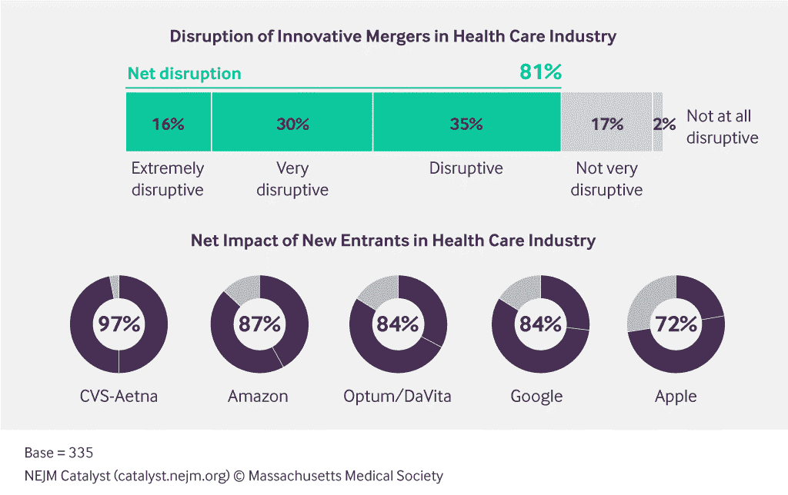

# 商业模式创新:指数技术如何颠覆你的行业

> 原文：<https://medium.com/swlh/business-model-innovation-how-exponential-technologies-can-be-disruptive-in-your-industry-6ee51c2036ce>

每天我们打开报纸，阅读令人兴奋的新的指数级技术，这些技术有可能“颠覆”一个行业。 [*人工智能*](https://hbr.org/2018/05/10-promising-ai-applications-in-health-care) *，3D 打印，“人造”肉，自动驾驶汽车，机器人技术，虚拟和增强现实，纳米技术，等等。然而，在适应这些技术来创造真实和具体的产品和服务的巨大挑战暴露出来之后，兴奋感通常会很快消退。这包括说服客户放弃他们的传统解决方案，并接受一种可以扩展并成为主流的新价值主张的艰巨任务。似乎我们对技术进步感到惊讶，但我们“还不能让它们为我们工作”。这个拼图中缺少的一块是商业模式创新。新技术是变革的力量，也是颠覆一个行业的必要条件，但商业模式创新才是让技术革命成为新现实的使能因素。在这篇文章中，我们提供了一些关于商业模式创新在一个行业中的力量的见解，这个行业一直在发展，并处于新的科学发现的尖端:医疗保健。然而，我们的结论并不仅仅适用于医疗保健。我们相信它们可以应用于任何行业，这将在以后的文章中探讨。*

首先，让我们超越术语“指数技术”来理解这个术语的含义。可以说有两个组成部分:一方面是“指数”，意思是快速加速的东西，比如规模翻倍或者成本减半。[指数技术](https://su.org/concepts/)包括人工智能(AI)、增强和虚拟现实(AR、VR)、数据科学、数字生物学和生物技术、数字医学、纳米技术和数字制造、网络和计算系统、机器人和自动驾驶汽车。另一方面，它是一种[技术，现在它的性价比](https://creativehq.co.nz/what-is-exponential-technology/)使得它有可能以以前不可能的方式被纳入解决今天的问题。

尽管这是可能的，但获得指数技术的全部价值还不是现实。使指数技术的应用成为现实的唯一方法是通过使用它们的主要催化剂:新的、创新的商业模式——商业模式是一个组织如何创造、交付和获取价值的基本原理。只有当指数技术应用于价值的创造、交付或获取时，它们不可思议的好处和影响才会充分实现。只有新的创新商业模式成为手段，指数级技术才能真正颠覆一个行业，并最终帮助解决人类面临的最大挑战。

作为一种形象化商业模式创新力量的方式，让我们以奥斯特瓦尔德和皮涅尔的“商业模式画布”框架为例，该框架来自[他们的畅销书“商业模式生成”](https://www.amazon.com/Business-Model-Generation-Visionaries-Challengers/dp/0470876417)，该框架已成为广泛建立的分析和描述跨行业商业模式的框架。下图突出显示了该模型的九个不同元素。

这九个要素强调了企业如何创造(关键活动、关键资源、关键合作伙伴)、交付(客户、客户关系、渠道)和获取(价值主张、成本、收入)价值。

如果你想利用指数技术，问题很清楚:在商业模式的哪个领域可以使用它们来增强、改善或实现卓越的价值主张。在有些领域，这一点更加“明显”，比如电子商务或社交媒体。但是为了展示应用指数技术的潜力，作者选择了一个不太明显但同样强大的不同行业:医疗保健。在商业模式画布的九个元素中的五个元素中，给出了具有指数技术力量的创新商业模式如何改变这一典型行业的例子。

# 价值主张:“为患者提供他们需要的东西。而不是你得到的报酬。”

迈克·E·波特和罗伯特·S·卡普兰在他们的 HBR 文章《如何支付医疗保健费用》中批评说，目前支付医疗保健服务的“收费服务”模式奖励数量，而不是医疗保健的质量或效率。他们建议采用一种“捆绑支付”系统，这种系统几乎存在于所有类型的非医疗保健相关产品和服务中，客户只需为整个套餐支付一个价格。当购买汽车时，客户得到的是汽车，而不是一个供应商的发动机、另一个供应商的车轮和第三个供应商的天线等等。多学科护理的整合创造了对结果的责任。

例如，这一理念正在克里夫兰诊所得到实施，克里夫兰诊所[围绕病情](https://my.clevelandclinic.org/departments/clinical-transformation/depts/quality-patient-safety/treatment-outcomes#about-treatment-outcomes-tab)组织医疗保健，并支持围绕结果和测量的透明度。另一个例子是橡树街医院，它专门针对一个群体——“老年人”。[橡树街医院通过基于价值的实践(包括特别关注疾病，而不是收费服务，并对患者护理的整体财务负责)、技术支持的方法(例如，以最有需求的患者为重点的人口健康数据驱动方法)和基于团队的模式(例如，在患者护理中具有明确角色的跨学科团队)，将住院率降低了 40%以上，节省了大量成本](https://catalyst.nejm.org/caring-for-older-adults-in-a-value-based-model/)。

# 渠道:不要去医疗保健，让医疗保健来找你

当你可以在家里的沙发上接受第一次诊断时，为什么还要去看医生呢？想不想避免通勤和在医生那里等待？通过智能手机上的应用程序预约医生？像德国的[https://minxli.com/](https://minxli.com/)或瑞典的[https://www.kry.se/](https://www.kry.se/)这样的供应商已经提供了这些服务，并在你和医生之间建立了联系。但是，不仅独立的新进入者使用“类似 skype”的技术，像西班牙医疗保健巨头 Sanitas 这样的公司也积极利用技术为其客户提供联系医生的新方式。

但与约翰·霍普斯金大学与其合作伙伴正在开发的“[家庭医院](http://www.hospitalathome.org/)”(HaH)模式相比，这是“简单”的。传感器技术、可穿戴设备和通过智能手机实现的更快的无线通信实现了“移动健康”，患者可以在自己的家中而不是在医院接受治疗，可以使用远程监控技术，接受医生和其他护理人员(例如护士、呼吸治疗师和物理治疗师)的日常访问:心电图、x 射线和超声波都可以在患者家中使用便携式技术进行。[患者只有在“病情严重”时才会去医院](https://catalyst.nejm.org/hospitals-case-decentralization-health-care/)。这些项目最初是为偏远地区设计的，现在非常成功，越来越多地应用于城市地区——这也是因为事实证明，与类似的传统住院治疗计划相比，它们可以节省高达 [20%的费用，而且效果相当或更好。](https://www.ncbi.nlm.nih.gov/pubmed/22665835)

一个类似的模型“ [USC 虚拟护理诊所](https://www.uscbodycomputing.org/virtual-care-clinic-2/)”正在南加州大学的身体计算中心使用，以提供世界级的医疗保健，而不必亲自去诊所。通过任何智能手机上的一个简单的应用程序“doc on ”,患者可以全天候向房颤专家咨询与该疾病有关的任何事情。该应用程序理解人类语言，因此可以“随时随地”提供关怀和建议。

# 客户群:网络中的蜘蛛

23andme 由琳达·艾维和安妮·沃西基于 2006 年创立，是世界上最大的个人基因组公司，拥有 200 多万客户。但这只是对部分商业模式的认可。基因测试是收集大量健康信息的前端。[他们 80%的客户同意分享他们的数据用于研究](http://revenuesandprofits.com/how-23andme-makes-money-understanding-23andme-business-model/)。这些基因信息是制药公司研发的金矿，这是他们的第二个“客户群”。与基因泰克、辉瑞和其他公司的不同合作表明了这项业务的潜力。例如，如果制药公司通过临床试验寻找人类中特定的罕见突变来测试疗法，23andme 可以查询其数据库，并可能将患者与临床试验赞助商联系起来，这样可以大大加快临床试验的注册。但是 23andme 并没有止步于此。他们希望进入药物开发领域:“数据的规模——数百万的客户和不断增长的客户——以及基因型和表型信息的独特组合，为洞察人类健康提供了一个无与伦比的研究平台，”[红杉的博塔说，他是去年 23andme 2.5 亿美元轮](http://fortune.com/2017/09/12/23andme-250-million-sequoia-drugs/)的主要投资者。2015 年 4 月，23andme 成立了治疗部，由 Richard Scheller 博士领导[:“它致力于发现和开发能够为患者带来益处的新疗法](https://mediacenter.23andme.com/therapeutics/)。这个专门的研究和药物开发小组使用 23andMe 基因数据库确定新的靶点，生成这些靶点的先导化合物，并进行临床前研究，以支持未来的临床开发。”

这种模式并不独特——2015 年 1 月被罗氏收购的 Foundation Medicine 正在建立一种类似的模式:“[我们的精确登记计划](https://www.foundationmedicine.com/insights-and-trials/foundation-smarttrials#enrollment)识别具有罕见或特定生物标志物的患者，并使用 FoundationSmartTrials 引擎将他们与赞助商试验进行匹配。除了有效的患者匹配，精确登记计划提高了社区对临床试验和不断发展的科学的认识；这进一步扩大了参与度。”

# 成本结构:用人工智能降低成本推动流程自动化

你和莫莉谈过了吗？如果你最近和 UCSF 或者达德利和西伯明罕的 NHS 医院有联系的话，可能会。 [Molly 是一名来自屡获殊荣的初创公司 Sensely](http://www.sensely.com/) 的虚拟护士，能够识别语音，将口语翻译成文本，并无缝集成会员数据。它可以询问病人关于他们健康的问题，评估症状，并指引他们去看下一个最好的医生。HBR 估计[人工智能驱动的护士助理每年可以节省 20%的护士维护病人的时间，从而节省 200 亿美元](https://hbr.org/2018/05/10-promising-ai-applications-in-health-care)。但是甚至还有由人工智能驱动的更复杂的应用程序，并且注定要降低成本——Optra Health 刚刚推出了他们的[“数字基因助手”，以帮助患者理解他们的基因数据](http://www.optrahealth.com/index.php/news-events/item/39-optra-health-launches-digital-genetic-assistant-for-explaining-genetic-tests)。在另一个例子中，Beth Israel Deaconess Medical Center 开发了一个支持人工智能的应用程序，用于筛查癌症患者，准确率几乎达到了人类病理学家的 92%和 96%。

# 关键伙伴:共同应对最紧迫的挑战

一方面，在过去的几个月里，医疗保健行业的不同部门明显出现了整合。 [CVS Health 以 6900 万美元收购 Aetna](https://www.nytimes.com/2017/12/03/business/dealbook/cvs-is-said-to-agree-to-buy-aetna-reshaping-health-care-industry.html)—将这家药店巨头与最大的健康保险公司之一合并，形成基于社区的医疗保健中心，可以提供血液检测并帮助管理慢性病。联合医疗保健公司以 49.00 亿美元收购了 DaVita 医师集团，将现有的保险业务与大型盈利性透析中心链相结合。这不仅仅是“又一次并购交易”——而是一家保险公司积极进军直接医疗服务领域。

另一方面，也有一些“不太直观”的联盟正在出现:“我们希望我们的员工以更低的成本获得更好的医疗保健”，[沃伦巴菲特在 2018 年 5 月](https://www.reuters.com/article/us-berkshire-buffett-healthcare/buffett-targets-ceo-for-berkshire-amazon-jpmorgan-healthcare-venture-soon-idUSKBN1I60RG)说道，此前他在 Amazon.com、摩根大通和伯克希尔之间成立了一家合资企业，并指出医疗保健是一种损害美国公司竞争力的“饥饿的绦虫”。T2 的声明让医疗保健和股票市场大吃一惊。但这种联合努力将如何发挥作用还有待观察。[摩根大通首席执行官杰米·戴蒙已经表示，大数据和虚拟技术](https://www.investors.com/news/jamie-dimon-jpmorgan-chase-amazon-berkshire-venture/)将用于解决成本问题，并专注于价值。

总而言之，商业模式创新将成为变革的驱动力——严重依赖指数技术作为“达到目的的手段”。在一本新出版的书“[中，你的数字商业模式是什么？彼得·威尔(Peter Weill)和斯蒂芬妮·韦尔纳(Stephanie Woerner)提出了六个问题，帮助你打造下一代企业。高管们被问到，他们认为未来五年有多大比例的收入受到威胁。平均而言，高管们认为 28%的公司面临威胁——但更有趣的是那些收入超过 70 亿美元的公司的估计:这些首席执行官认为整个企业的 46%,几乎一半，处于危险之中。](https://www.amazon.com/Whats-Your-Digital-Business-Model/dp/1633692701)

事实上，所有行业迟早都会在其商业模式中应用指数技术。那些做得最好的将会看到难以置信的好处。每年，波士顿咨询集团都会发布一份关于“年度最具创新力公司”的报告。波士顿咨询公司 2018 年最具创新力公司排名中的五十家公司中有十一家——包括前十名中的七家——是数字原生企业，因此被定义为数字创新者。迈克尔·林格尔和哈迪·扎布利特写道，榜单上的大多数人(如果不是全部的话)已经将数字技术纳入了他们的创新计划，最重要的是，涵盖了商业模式的所有要素和所有行业，甚至是最“保守”的行业。似乎我们才刚刚开始。

*本文由 Juan Martinez-Barea 和 Christian Hense 于* [*哈佛德乌斯托*](https://www.harvard-deusto.com/innovacion-en-los-modelos-de-negocio-el-impulso-necesario-para-que-las-tecnologias-exponenciales-revolucionen-su-industria) *首次以西班牙语发表。*

## 这篇文章发表在 [The Startup](https://medium.com/swlh) 上，这是 Medium 最大的创业刊物，拥有+383，380 名读者。

## 在这里订阅接收[我们的头条新闻](http://growthsupply.com/the-startup-newsletter/)。

