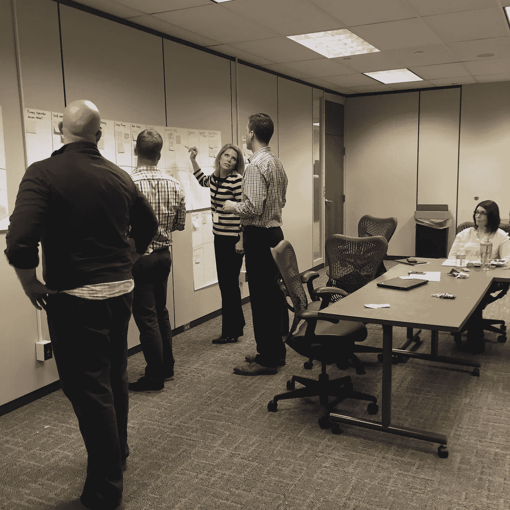

# 成为一名商业头脑设计师

> 原文：<https://medium.com/swlh/business-of-design-efd298b24389>

Design is more than aesthetics. Real insights and strategic thinking must be a part of your design strategy.

设计不仅仅是流行和潇洒。事实上，当谈到设计时，这些词应该非常谨慎地使用(pop 根本不应该使用，但我会因为这些 z 而让 pizzaz 滑动)。设计影响客户参与、业务流程、品牌价值、产品价值等。这个清单还在继续。顺便说一下，这不是什么隐藏的统计数据，这是一个公认的事实。如果你是一名设计师，这个世界需要你创造性的洞察力。是的，你的创造性洞察力、模式识别、同理心和整合想法的能力将影响未来的计划和战略，尤其是当你发现更深层次的参与问题时。

# 我们从事思想传递的工作

在文章“设计师不应该编码，他们应该学习商业”中，Joshua Taylor 指出，对设计师来说，学习商业艺术比学习编码更重要。约书亚说，有商业头脑的设计师帮助公司的不仅仅是像素的完美。他说*“我认为这些公司之所以如此成功，是因为他们的设计师更关注这些企业的需求，而不是每个像素看起来有多完美。”*

是的。同意。事实上，外面的世界非常渴望设计思维可以注入的创意镜头(你可以选择自己的拍摄地点)。作为一个创意者，你不仅仅是像素或彩通。如果你没有学会如何从消费者那里收集见解，并将这些知识应用到你的设计工作中，那么你就没有为自己增加真正有影响力的价值。最终，是你思考的方式，你如何感同身受，以及你如何利用这种感同身受来与消费者沟通，为公司提供了最大的价值。美学品质是每一个约定的既定结果。事实上，在演示时不要谈论它，相反，用深思熟虑的见解、感同身受的故事来支持你的设计，也许，仅仅是也许，你可以谈谈你的审美决定是如何令人敬畏。

> 你不仅仅是像素或彩通…美学质量应该是每一个约定的结果。

永远不要走进一个会议，开始喋喋不休地谈论字体。作为一名设计师，你应该知道你需要与你的观众产生共鸣，学习和交流。直到理解每个决定都需要一个商业案例，并且总是有财务影响。Brandon Grotesque 有一个巨大的价格标签，特别是随着越来越多的人访问该网站。你最好知道为什么这张脸会对你的观众产生最大的影响。正如约书亚所说“*我认为，如果我们能够进行富有洞察力的对话，并提供关于核心商业原则的宝贵建议，我们关于设计的建议将会更有分量。”*

你的设计就是你的想法。你的想法很好。有时候很棒。当与真实的业务对象和信息结合时，它们可以变得更好、更强大、更有洞察力。事实上，他们必须这样做。我们在平板电脑前有了一个从未有过的位置，我们工艺的真正价值正在一点点被发现。现在不是在像素炼狱里闲逛的时候，用双手抓住那个机会，把自己拉到窗台上。太阳出来了，是时候享受机会的光芒了。

# 别担心，有证据

Forrester 的一篇文章“[你最好的投资是数字客户体验](http://www.cmswire.com/digital-experience/forrester-your-best-investment-is-digital-customer-experience/)”讲述了一家公司通过投资你的创造性思维所获得的回报。这里有一些不错的剪辑:

*   超越表面层次的变化，通过“有纪律的简化”来达到你的目标
*   客户旅程图为您的投资带来相关性。你必须了解能引起顾客共鸣的具体设备、接触点和互动方式。

在设计策略以及该策略如何影响业务和未来决策上投入时间是很有价值的。老实说，我最大的目标是在即将到来的项目中拥有发言权。我想确保我开发的移动应用对用户和企业的成功至关重要。我想为我未来的项目建立案例，我想通过人种学研究、分析性评论、跨学科合作，再加上杀手级的执行力来完成。我是这样看的，一颗从山顶掉下来的鹅卵石，在底部变成了雪崩。如果你想成为一名有影响力的设计师，那就做一个从山顶上扔鹅卵石的人(钉死它)。

> “我想确保我开发的移动应用对用户和企业的成功至关重要。”

# 证据就在布丁里

这个行业正在发生变化(就像《权力流浪者》一样)。设计正在前排座位上发挥作用，那些想开车的人可以扣好安全带，抓住方向盘。有多种方式可以开始:

*   阅读各学科思想领袖的文章。不要偏离你的舒适区太远。例如，我想学习比特币和区块链，所以一些朋友给我发了一个简单的入门方法。一个很好的适合假人的老式 youtube 视频！
*   在 Twitter 上关注新的有趣的人，然后…天哪…问他们一些问题。就像和他们真正接触一样。
*   抓取一些关于战略和设计的好读物(我稍后会提供书单)
*   找到一个业务、运营、供应链、IT、伙伴，开始谈论他们做什么和你做什么。看看有没有合作的方法。
*   帮助他们中的任何一个人，你就会成为他们中的神。上帝啊。
*   使用你找到的任何信息，让别人帮你建立一个实际的商业案例，用数字和图表说明你的见解将如何省钱或赚钱。记住，总会有影响。
*   如果其他方法都失败了。个人项目。个人项目。个人项目。哦，我多么爱他们。你也必须。

祝你好运。如果你有任何其他想法，请在下面的评论中分享。

[Dribbble](http://dribbble.com/WattleandDaub)|[Twitter](http://twitter.com/Wattle_n_Daub)|[insta gram](http://www.instagram.com/wattlendaub/)