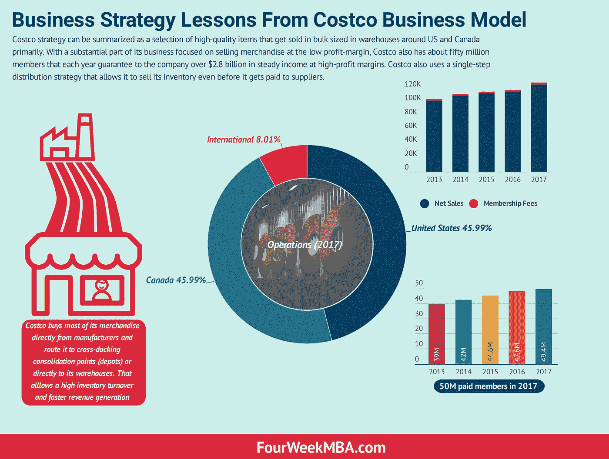
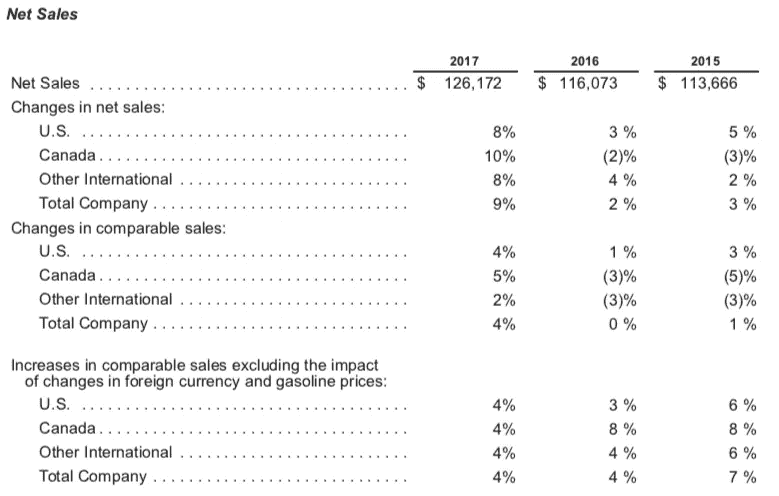
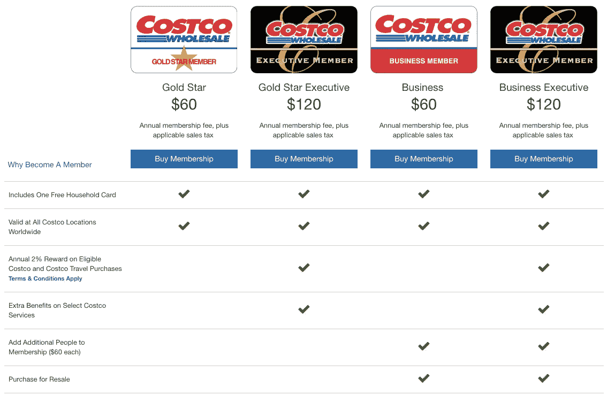
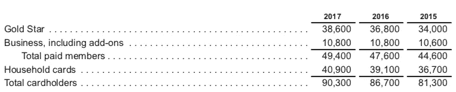
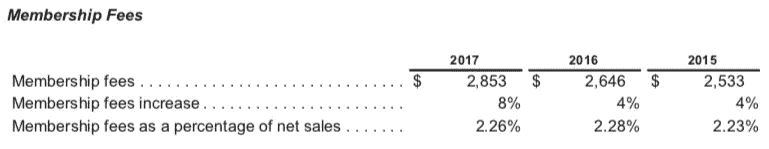

# 好市多的商业战略教训

> 原文：<https://medium.com/swlh/business-strategy-lessons-from-costco-105e46180e51>

*Costco* [*商业模式*](https://fourweekmba.com/what-is-a-business-model/) *战略可以概括为主要在美国和加拿大的仓库中批量出售的精选优质商品。好市多的很大一部分业务专注于销售低利润率的商品，它还拥有大约 5000 万会员，这些会员每年保证公司获得超过 28 亿美元的高利润率稳定收入。好市多还使用单步* [*分销策略*](https://fourweekmba.com/sales-distribution-peter-thiel/) *，这使得它甚至可以在向供应商付款之前出售库存。*

就像 ALDI 试图保持尽可能低的价格一样，好市多也成功做到了这一点，它故意降低利润率，将节省下来的成本转嫁给消费者。

事实上，好市多希望在消费者心目中被认为是高质量、低价格、可以批量购买的商品。

好市多商业模式还有其他一些有趣的方面，我们让它与众不同，让它的[价值主张](https://fourweekmba.com/value-proposition-canvas/)引人注目。

# 一瞥 Costo [商业模式](https://fourweekmba.com/what-is-a-business-model/)几个关键要素

好市多[商业模式](https://fourweekmba.com/what-is-a-business-model/)的[价值主张](https://fourweekmba.com/value-proposition-canvas/)相当强大。该公司向其成员提供低价产品，包括种类繁多的国家品牌和自有品牌产品。

虽然这些商品会产生很高的销量，但它们也会受到快速库存周转的推动。

好市多提供几个主要类别的商品:

*   食品包括干粮、包装食品和杂货
*   杂物，包括零食、糖果、酒精和非酒精饮料以及清洁用品
*   硬线包括主要电器、电子产品、健康和美容辅助设备、硬件、花园和庭院
*   新鲜食品包括肉类、农产品、熟食店和面包店
*   由服装和小家电组成的软线
*   附属设施，包括加油站和药房

而食品是 2018 年最大的类别；这些类别中的每一个都在全食超市的成功中扮演着至关重要的角色。

让我们看看好市多商业模式成功的关键因素是什么，从公司如何管理库存开始。

# 高库存周转率:关键是跨站台和单步[分销渠道](https://fourweekmba.com/distribution-channels/)

好市多通常会在付款前就出售库存。正如其年度报告所指出的:

> *我们直接从制造商处购买大部分商品，并将其发送到跨站台集合点(仓库)或直接发送到我们的仓库。我们的仓库接收来自制造商的大量货物，并将这些货物快速运送到各个仓库。这一过程创造了货运量和装卸效率，消除了与传统多步* [*分销渠道*](https://fourweekmba.com/distribution-channels/) *相关的许多成本。*

好市多能够有效地将商品从制造厂转移到仓库的关键因素是让公司能够快速销售库存。

事实上，由于它的会员资格，好市多确信它会很快卖掉大部分库存。因此，库存损失(萎缩)远低于典型的零售业务。

事实上，在典型的零售运作中，有一个多步分销渠道，零售商必须将商品从制造商处转移到仓库，然后再转移到零售店进行销售。

Costo 仓库本身就是商店。因此，当商品转移到那里，它很快就被卖出去了。

另一个重要的方面是，当商品批量到达好市多仓库时，它们不需要太多的重新包装或复杂而庞大的操作，而是直接批量销售。

# 辅助业务:利用利润微薄的商品和货物来销售初级商品

> *我们仓库内或附近的附属企业提供更多产品和服务，鼓励会员更频繁地购物。这些业务包括我们的加油站、药房、配镜中心、美食广场和助听器中心。我们在除韩国和法国之外的所有国家销售汽油，不同国家的加油站仓库数量差异很大。我们在 2017 年、2016 年和 2015 年底分别运营了 536 个、508 个和 472 个加油站。*

有人可能会想，为什么要出售像汽油这样利润率极低的商品。答案很简单。天然气让好市多吸引人们来到它的仓库。

去好市多是一种全程的“体验”。从购买汽油到为汽车储备商品。

好市多利用两个主要的辅助业务来吸引尽可能多的顾客回到它的仓库，这两个业务是汽油和药品。

# 限制商品选择:更好的供应商协议和付款，低价格高质量

> *我们的战略是以我们认为始终低于其他地方的价格为我们的会员提供各种高质量的商品。我们寻求将商品限制在畅销的型号、尺寸和颜色上。在我们的核心仓库业务中，每个仓库平均有大约 3，800 个有效库存单位(SKU ),明显少于其他宽带零售商。许多消费品是以盒装、盒装或多包的形式出售的。*

把商品销售中的局限性看作一种优势是很违反直觉的；在这里，其他大玩家如[沃尔玛](https://fourweekmba.com/walmart-business-model/)和[亚马逊](https://fourweekmba.com/amazon-business-model/)在提供任何商品上自我标榜。

像 ALDI 一样，好市多反其道而行之，称赞自己的股票选择有限。

这使得好市多能够获得更好的供应商协议，好市多的客户可能会更乐意拥有更少但质量更高的商品，并且好市多管理商品销售变得更加容易，相比之下，这降低了其运营负担。

# 在线商务提供仓库里没有的东西

> *在线业务为我们的会员提供额外的产品和服务，其中许多是我们的仓库所没有的。我们在线业务的净销售额在 2017 年和 2016 年分别约占我们总净销售额的 4%，在 2015 年约占 3%。*

尽管好市多并不专注于网上销售，但它将网上销售作为一种方式来提供其仓库中可能没有的产品和服务。这是会员享有的特权。

# 作为主要业务指标的可比销售增长

好市多坚持不懈地关注销售增长，通过一个简单而有效的指标:可比销售增长。

这被定义为*开仓一年以上的销售，包括改建、搬迁、扩建，以及经营一年以上的电子商务网站相关的网络销售。*

***来源****:Costco 2017 年年报*

# 会员模式创造稳定收入流以提高盈利能力的能力

如果你想享受好市多的体验，除了成为会员，没有别的出路。事实上，*2017 年，美国和加拿大的会员续订率为 90%,全球为 87%*。

通常，续保发生在续保日期后的六个月内。会员资格包括四个主要类别

*   金星和金星执行官
*   业务和业务主管，包括附加产品

这些年来，会员数量稳步增长:

***来源****:Costco 2017 年年报*

2017 年有近 5000 万付费会员，其中大多数代表着美国家庭的很大一部分，会员费在 2017 年增加到超过 28 亿美元:

***来源****:Costco 2017 年年报*

为什么这个[营收模式](https://fourweekmba.com/what-is-a-business-model/)这么有意思？有几个原因:

*   有了会员制模式，中远可以将商品的一部分节省转移给会员
*   与此同时，这些会员将花费更多，他们将获得更多的储蓄
*   好市多将享受更高的收入增长，以及由其会员代表的稳定收入流
*   这种收入流可以用来投资，进一步增加成本
*   虽然它将允许好事多进一步降低价格，同时为其会员保持高质量

会员收入流——虽然它只占好市多净销售额的 2.26%，但却有很高的利润率。

因此，一方面，好市多在微薄的利润上经营其主要业务，而它依赖于五千万会员(并且还在增长),从长远来看，这是好市多业务的稳定收入来源。

# 散装尺寸使跨码头更容易，而好市多销售更多，会员节省更多

关于好市多商业模式的另一个关键因素是它的火爆，与其他零售商店相比，它销售的商品是散装的，数量更大。这有一个简单而强大的逻辑:

*   好市多购买的数量越多，从制造商那里获得的价格就越便宜
*   与传统零售商相比，它也销售更多的商品
*   与此同时，会员以更高的便利获得更低的价格

# 总结好市多的主要业务驱动因素

中远集团未来成功的几个关键驱动因素是:

*   增加新会员和现有会员的购物频率以及他们每次消费的金额(所谓的平均门票)
*   通过以合适的价格向好市多会员提供合适的商品，增加可比销售额
*   以有竞争力的价格提供高质量的商品和服务
*   被视为“定价权威”(低价优质商品)
*   利用辅助业务来增加利润率较高的初级商品的销售(以汽油业务为例，它将会员吸引到好市多的仓库)
*   保持好市多仓库的增长
*   会员制是中远集团商业模式不可或缺的一部分，具有高盈利能力和稳定的收入来源

# 你可以应用到你公司的商业经验

好市多是一个巨人，对于一个小企业来说，很难与它联系起来。然而，仔细看看，你会发现好市多使用的商业策略也可以复制并应用到你的中小型企业中。下面是一些你可能想在你的企业中测试的商业药丸，这样做是有意义的:

*   **在你的主要收入流之上建立会员基础:**你可以为会员提供专属优势和优惠，以换取小额年费。这种加班也将提高你的其他业务领域的销售，因为会员将愿意以更方便的价格购买更多
*   **以较低的价格卖出更多的数量:**无论是销售实物商品还是无形服务，你都可以以更优惠的价格卖出更多的数量。这将为您的客户带来更多价值，同时让您获得更多销售额
*   **提供辅助商品或服务以维持主要商品或服务的销售:**我们都喜欢谈论优化我们的业务运营。然而，有时为了赚钱，你需要在别的事情上赔钱。在某种程度上，这是[剃须刀和刀片业务战略](https://fourweekmba.com/razor-blade-business-model/)的一个变种。一方面，你卖的是不赚钱的服务，另一方面，你卖的是有高利润的互补商品或服务。这一策略几乎可以应用于任何行业。例如，想象一下一家数码代理公司以微薄的价格出售一个网站设计，却没有任何利润。它将销售补充性的数字营销服务，而不是高利润率
*   使用单步分销策略:分销是任何商业成功的关键因素。与其让它变得复杂，不如试着简化它，减少服务或产品到达最终消费者手中之前的步骤

*原载于 2018 年 11 月 19 日*[*【fourweekmba.com】*](https://fourweekmba.com/costco-business-model/)*。*

## 这篇文章发表在 [The Startup](https://medium.com/swlh) 上，这是 Medium 最大的创业刊物，拥有+415，678 名读者。

## 在这里订阅接收[我们的头条新闻](http://growthsupply.com/the-startup-newsletter/)。

