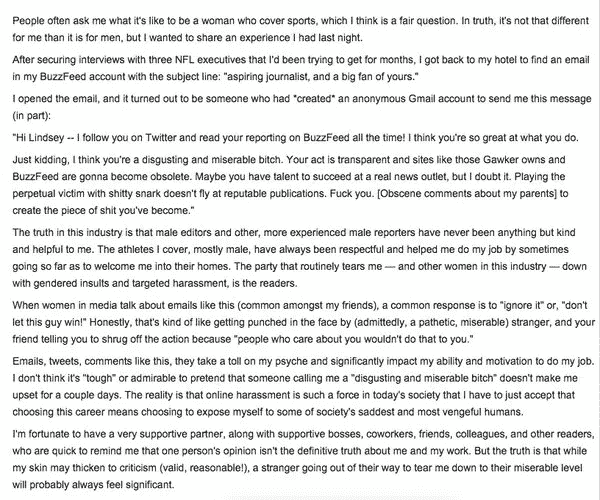

# 但是他们赢了

> 原文：<https://medium.com/swlh/but-then-they-win-c7177b98f177>

我的情绪平衡最近一直不稳定。我基本上还好，如果只是逆来顺受的那种还好，但有时我会感到胸口突然发闷，呼吸变浅，愤怒的热泪盈眶。

今天，当我在 Twitter 上看到一名女性体育记者的这种反映时，这种情况再次发生，她收到了一封令人讨厌的淫秽匿名邮件，攻击她、她的工作，甚至她的父母。她写道，“电子邮件、推文、诸如此类的评论，对我的精神造成了伤害，极大地影响了我工作的能力和动力。我不认为假装有人叫我“恶心、可怜的婊子”不会让我难过几天是“艰难”或令人钦佩的。”

[https://twitter.com/Lahlahlindsey/status/711183067814223874](https://twitter.com/Lahlahlindsey/status/711183067814223874)

这对我打击很大。过去一周我一直徘徊在情绪边缘的原因同样是互联网上一个残酷、毫无根据、匿名的攻击，它质疑我的性格和我为科技多样性所做工作的动机。很扯淡，但还是很痛。这让我想知道我在做什么，为什么我甚至烦恼。也许我应该退出。别再说多样性了，闭嘴吧。回去写代码吧。无论如何，我更喜欢创造产品，而不是打破多样性的记录。

但是他们赢了。可怕的匿名偏执狂和恶霸赢不了。

*原载于 2016 年 3 月 20 日*[*【triketora.com】*](http://triketora.com/2016/03/19/but-then-they-win/)*。*