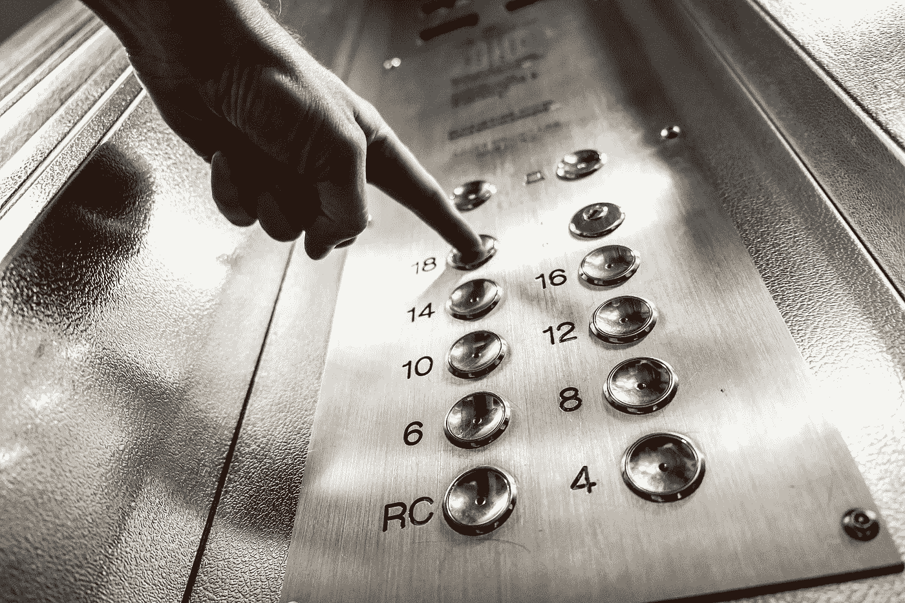

# 要按的按钮

> 原文：<https://medium.com/swlh/buttons-to-press-e34a22c67aed>

Image from Pixabay

## 建造你自己的，或者让电梯带你去不需要的楼层

温斯顿·丘吉尔曾经说过:“如果没有战争的最高方向，事件和敌人就会控制局面。”。那你就不必去参加战争来接受丘吉尔的建议，因为在你的日常生活中，你处于个人的“战争”中，每一场战争都有其壮观之处！如果你对自己的个人生活没有定位，你周围的一切都会把你带到一个你不想去的地方，你会问自己发生了什么让这个地方成为你的现实。

然而，为了给你的生活提供一些指导，有必要获得一些知识，并从中提取对你的日常生活有益的东西。这样的知识可以通过日复一日地读一些东西、听一些人说话、看一些发生的事情甚至生活新闻生活经历来获得。在仔细分析所获得的知识后，你将会确立你个人生活的方向。最好的说法……你将在你的个人生活中建立人生电梯的“按钮按钮”!

英国科学家迈克尔·法拉第在他工作的小书厂里阅读他装订的每一本书。马其顿国王亚历山大大帝聆听希腊哲学家亚里士多德的教诲，学到了很多哲学知识。海军中将霍雷肖·纳尔逊获得了观察其他指挥官的丰富经验。他们建造了自己人生电梯的“按钮”，他们自己的人生定位。

但是我们不需要走那么远来举例说明建造生命电梯的重要性。看我...读传记，我了解到光读书是不够的。你必须阅读并保留从《传记文学》中学到的经验教训；听我的孩子说，我了解到他们也有能力保持所学的知识；通过观察我的父母，我了解到他们也有需要学习的课程，通过体验我了解到的军队生活，所有学到的课程都应该保留。自然，所有的经验教训都变成了方向！

所有这些学习产生了我的理论“心智的必要条件——sqn Mind ”,这是我一生中创造的最佳方向！SQNMind 是什么意思？阅读下面的内容，为你的个人生活建造你最好的生活电梯。

_ _ _ _ _ _ _ _ _ _ _ _ S Q N Mind _ _ _ _ _ _ _ _ _ _ _ _ _

上面的文字是我之前在 MEDIUM 网站上写的另一个例子。SQNMind 理论试图从你阅读的每本书中提取精华。该理论包括将书中最有趣的段落提取到你头脑的“必要条件”类别中。这将把你的大脑变成原始知识的海洋，随时准备在任何情况下适应你的现实。

所以为了更好地解释这个理论，我在定位类别中写了一些解释，这是我在多年阅读后形成的二十个解释之一。作为动力，我使用了温斯顿·丘吉尔、迈克尔·法拉第、亚历山大“大帝”、亚里士多德、霍雷肖·纳尔逊和我(小丹尼尔先生:)

分开书的段落！你不需要像我上面那样写它们，只要尽可能多的阅读它们就行了。与那些不读书、不读书、不记所学知识的人相比，一个有 SNQMind 的人在不同领域都有很好的成功机会。

这是第 3 章/场景 3，定位。下一个场景是关于学习的。但是如果你错过了关于 SQNMind 理论的最后一整章，请点击[注意差距](/@danieljunior_58594/mind-the-gap-e6dd7ee7ad0e)。

**未完待续！**

The DJerian theory number ONE

## 这篇文章发表在[的《创业](https://medium.com/swlh)，这是 Medium 最大的创业刊物，拥有+397，714 人关注。

## 在这里订阅接收[我们的头条新闻](http://growthsupply.com/the-startup-newsletter/)。

