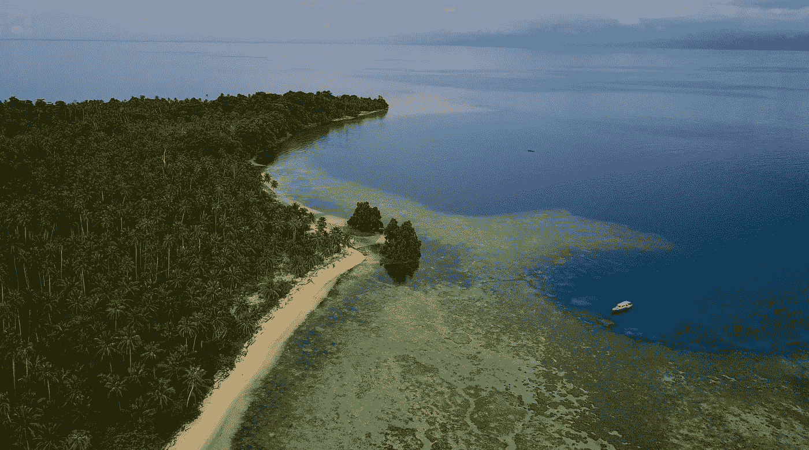

# 在苏拉威西岛中部买岛？

> 原文：<https://medium.com/swlh/buying-an-island-in-central-sulawesi-51f896410eb8>

在我们错过了昨天的航班之后，因为帕卢机场关闭了，我们不得不改变我们所有的行程。

我们又花了 5 个小时的车程到达苏拉威西岛中部的安帕纳，这是离我想买的岛屿最近的城镇，乘船 30 分钟就到了。

—

提醒:该计划是在苏拉威西岛中部购买一个岛屿，以便将其开发成一个可持续的生态度假村。

这个岛是离机场最近的，而且还是处女地。它是一个叫做托吉安群岛的岛屿群的一部分，托吉安群岛是印度尼西亚最美丽和野生动物最丰富的地区之一。

这个项目叫做[重新连接。](https://upscri.be/app/www.reconnect.id)

—

要买一个岛，你不需要把一些现金放在桌子上，瞧，你有一个岛。

这是一个漫长的过程，入口处的障碍比我最初预期的要大得多(然而，我们正在接近那里！)

首先，我必须在印度尼西亚注册一家房地产外国投资公司，我可以拥有 100%的股份。

这是该项目的其余部分的基础，因为我不能以外国人的名义在印度尼西亚购买土地。

然而，在某些条件下，外国投资公司可以购买土地和财产。

我花了将近 6 个月的时间来完成这一过程，但今天我们已经实现了以下目标:

-注册公司和银行账户
-建立我在印度尼西亚的税务居留权
-为自己获得投资者工作许可证，这使我能够在印度尼西亚各地发展我的业务和工作
-注册我所有的现有员工，并为他们提供医疗保险
-注册不同的授权和许可，以允许购买土地、建设项目，并在未来实际运营该岛的项目

现在这项工作已经完成，我们正在进行以下步骤:

-与巴厘岛最好的房地产律师之一进行尽职调查(我们让他飞到苏拉威西岛中部，仔细检查土地和项目的所有法律基础)
-着手购买第一块土地(13，800 平方米，200 平方米的海滩)
-登记土地的全部文件&证书
-获得我们需要开始在 100%合法的土地上建设的无止境的授权清单
-联系岛上的其他土地所有者(少于 10 个)开始购买他们的土地并控制岛上的更大部分

现在，这是一个非常小的岛(大约 2 公里宽)，当我说*【买岛】*的时候，我明确地说的是控制大部分。因此，当我们尽最大努力以可持续的方式发展这个岛屿时，没有人能来这里建造一个巨大的混凝土酒店。

—

一天下来，我们到达了安帕纳。

第一项活动是与我们正在购买的土地所有者和来自另一个多哥群岛的生态度假村所有者共进晚餐。

在这之后，我们花了一些时间在安帕那当地的一个活动上，在那里人们筹集资金帮助地震和海啸的受害者，这次地震和海啸发生在离那里 400 公里的帕卢。

我是那里唯一的外国人，他们显然很感激我帮他们募捐。我被要求与他们合影，或者在他们的现场视频前说些什么。

尽管旅途漫长而疲惫，但这是我们在那里开始一周的好方式。

—

我们的律师将于明天晚上到达现场，在此之前，我们将探索，花时间与当地人，土地所有者和其他企业主。

有什么比直接向已经完成了类似你想做的事情的人提问更好的学习方法呢？

*我希望你喜欢这些每日邮件和我目前忙碌的更新，*

感谢您的阅读，

托马斯

## 这篇文章发表在[《创业](https://medium.com/swlh)》上，这是 Medium 最大的创业刊物，有+ 376，592 人关注。

## 订阅接收[我们的头条新闻](http://growthsupply.com/the-startup-newsletter/)。

