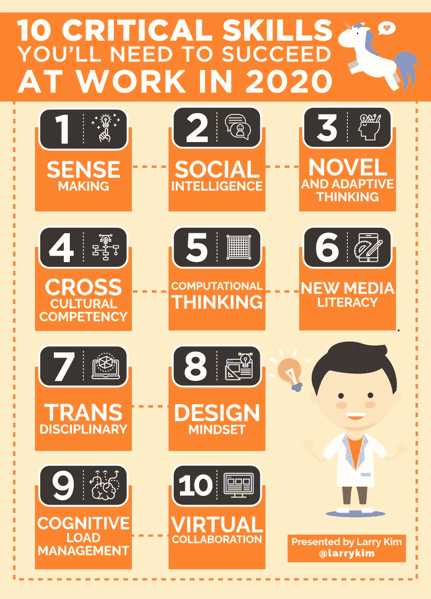

# 到 2020 年，这 10 项员工技能将很快被大量需求！

> 原文：<https://medium.com/swlh/by-2020-these-10-employee-skills-will-soon-be-in-huge-demand-13ab03c6d06f>

一张新的信息图显示，六个关键因素正在推动我们现在看到的变化:极端长寿、智能机器和系统的崛起、我们的计算世界、新媒体生态、超结构组织和全球互联世界。

有了这些大问题，五年后的工作环境会是什么样子？员工需要哪些[技能](https://mobilemonkey.com/blog/2018/02/digital-marketing-courses)才能成功？

我要告诉你一件事:它们看起来一点也不像工业革命时期，甚至是网络时代的工人所需要的技能。

2020 年，[想出解决方案](http://www.inc.com/larry-kim/9-ways-to-become-more-creative-in-the-next-10-minutes.html)的能力、想法和回应将备受追捧，并将把你推向业务线的前沿。

新媒体素养——通过有效利用和利用新媒体形式来批判性地评估和开发内容的能力——将是员工非常需要的。

随着工作和商业日益全球化，跨文化能力，即在不同文化背景下运作的能力，将会在工作和商业中蓬勃发展。

一种[设计思维](http://www.inc.com/larry-kim/33-creative-ways-to-visualize-ideas-infographic.html)也将是关键。如果你能够表现和发展创造预期结果的任务和工作流程，你将会很受欢迎。

如果你不能在虚拟环境中与他人很好地合作，那么…远程办公不仅仅是一些嬉皮士雇主提供的时髦东西。

虚拟协作(Virtual collaboration)是一种高效工作的能力，能够提高参与度，并展示自己是虚拟团队的一员，这种方式将越来越多地成为商业行为。

# 做驴海里的独角兽

获取我的最佳独角兽营销和创业成长秘诀:

1.  [**报名直接发到你邮箱**](https://mobilemonkey.com/blog-subscription)

**2。** [**通过 Facebook Messenger 注册偶尔的 Facebook Messenger 营销新闻&提示。**](http://m.me/447438332063924?ref=e58448cdd16367419b279793544e132f5388067506f92c92e6)

# **关于作者**

拉里·金是全球最好的 Facebook Messenger 营销平台提供商 MobileMonkey 的首席执行官。他也是 [WordStream](http://www.wordstream.com/) 的创始人。

你可以在 [Facebook Messenger](http://m.me/447438332063924?ref=e58448cdd16367419b279793544e132f5388067506f92c92e6) 、 [Twitter](https://twitter.com/larrykim) 、 [LinkedIn](https://www.linkedin.com/in/larrykim) 、 [Instagram](https://www.instagram.com/kim_larry/) 上和他联系。

最初发布于[Inc.com](http://www.inc.com/larry-kim/10-critical-skills-you-ll-need-to-succeed-at-work-in-2020.html)