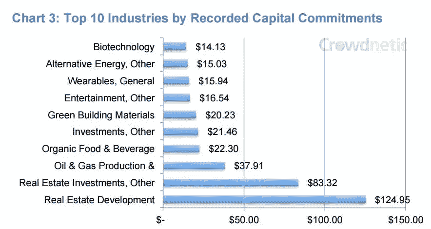
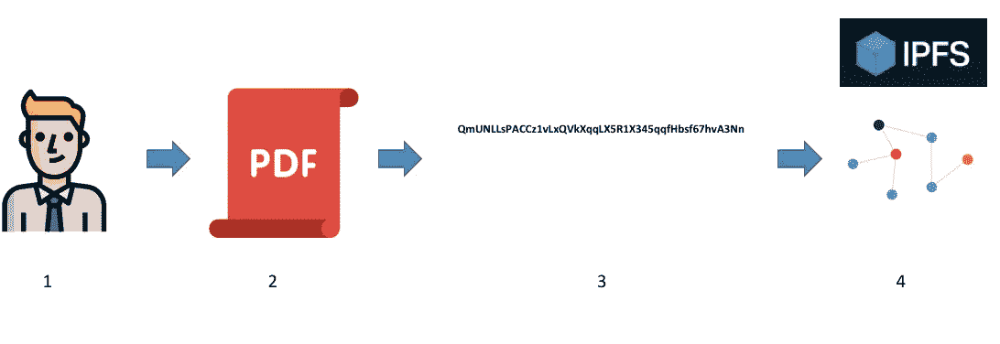
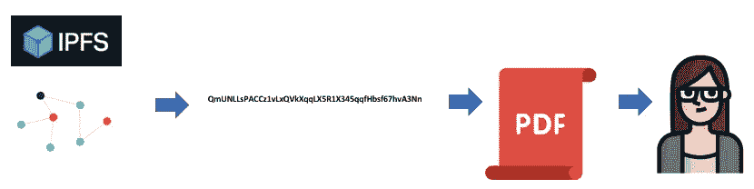

# 到 2021 年，大多数房地产众筹平台将利用令牌化

> 原文：<https://medium.com/swlh/by-2021-most-real-estate-crowdfunding-platforms-will-leverage-tokenization-3101ea4f028f>

## 房地产众筹的局限性以及记号化如何为克服未来的挑战提供答案。

随着 2013 年至 2014 年的早期众筹投资交易走向成熟(7 年至 10 年的锁定期)，该行业将需要采取新的战略来留住客户/投资者，并达到预期的增长目标。

> “尽管全球金融危机正逐渐成为历史，但下一场危机的根源可能已经开始扎根。”
> 
> — [《纽约时报》](https://www.nytimes.com/interactive/2018/09/12/business/the-next-recession-financial-crisis.html)

尽管摩根大通(J.P. Morgan)的分析师表示，下一场危机可能会对 T2 造成比过去几场危机不那么痛苦的打击，但个人投资者可能没有足够的信心继续锁定长期众筹投资，尤其是在不确定的时期。

让客户使用“老一套”的房地产众筹产品进行再投资将不是一件容易的事情，即使是对那些成熟的平台来说。另一方面，房地产资产的令牌化为投资者提供了更多流动性和控制的承诺……不仅通过在线交易市场，还通过场外交易大厅。

基于我们的研究、分析和发现，我们预测，到 2021 年，大多数房地产众筹平台将利用令牌化。不是因为他们选择这样做，而是因为用户确实需要这样做。网上投资者可能会受到激励，投资于潜在的[5-30%流动性溢价](https://hackernoon.com/traditional-asset-tokenization-b8a59585a7e0)的交易，从而降低“传统”众筹投资的吸引力。

> [房地产等传统资产将被令牌化，因为如果不这样做，它们将失去流动性溢价，](https://hackernoon.com/traditional-asset-tokenization-b8a59585a7e0)房地产众筹很可能是第一个采用它的细分市场。

# 当颠覆者被打乱时会发生什么？

企业认识到中断的威胁是一个现实，但在许多情况下，他们不知道该怎么办。一旦一家公司或创新者扰乱了一个市场，他们就有可能遭遇同样的事情。

如今，房地产众筹平台正面临颠覆性的威胁。如果你还看不到它，不代表它不存在。基于区块链的令牌化本质上是数字股份的发行和分配。它将为投资者带来更高的流动性、更好的 T2、分散投资的机会、通过代币持有者分散风险、通过点对点交易打开新的市场。

一如既往，明天的赢家将是那些行动迅速、今天就开始采用技术的人。谢天谢地， [Blocksquare](http://blocksquare.io) 有合适的产品来帮助和提供房地产众筹平台保持领先——只需插入& play，无需开发自己的区块链应用程序。

# 房地产众筹 1.0

房地产众筹相当简单，自 2013 年左右以来一直在增长。你可以把它想象成一种方式，把(相对)少量的钱投资到一项房地产投资的股票上。像 [Fundrise](https://fundrise.com/) 和 [RealtyShares](https://fund.realtyshares.com/) 这样的网站提供来自“领先”房地产投资者或开发商的先前审查过的交易，其中大多数都有丰富的经验。投资者在一笔大交易中占一小部分，有预期的年回报和退出日期(如果适用)。

[http://crowdexpert.com/crowdfunding-industry-statistics/](http://crowdexpert.com/crowdfunding-industry-statistics/)

> “房地产众筹仍然是一个充满活力、不断发展的行业。到 2025 年，整个众筹行业的价值预计将超过 3000 亿美元，在线房地产市场将充分利用这一爆炸性增长。”——福布斯

# 符号化？我们是来帮忙的！

我们都可以从乔治·R·R·马丁的一部著名小说中找到答案，他说:“恐惧比刀剑更伤人。”

但是不要害怕！恐惧是思维的杀手。如果你把自己暴露在恐惧中，它就会失去控制你的力量。

出于对未知的恐惧，我们总能想出几十个不做某事的理由。然而，创新的潜力在于未知。那些能够克服这种恐惧的人会把它变成机会，继续他们的成功之旅。

> 作为技术提供商，我们让您的公司能够轻松创建和发行与房地产相关的代币(数字股份)。这意味着我们的解决方案提供了所有需要的技术基础设施，使任何已建立的房地产众筹公司能够以经济高效的方式对房地产进行令牌化，而无需投资于高级区块链开发。
> 
> —[Viktor Brajak](https://medium.com/u/aea0be671b96?source=post_page-----3101ea4f028f--------------------------------),[block square](http://blocksquare.io)的首席技术官

# 超级地产众筹

投资者面临的最大问题之一是，众筹房地产投资**的流动性非常差，而且不能交易。**这意味着在紧急情况下，在房产出售前，几乎不可能兑现投资。在网上进行一项新投资可能很容易，但在退出方面，投资者没有任何控制权。

房地产等资产的令牌化提供了一种改变，而大众投资者将受益最大。

安全令牌是位于区块链上的数字共享。它们提供了一种有效的途径来细分单个高价值资产，如房地产。随着更多的资产被令牌化，我们可以实现更好的资产分配。从规模上看，这为投资者开辟了新的策略。

> “随着部分所有权交易活动的增加，价格发现将得到加强，对于过去由于单位成本高而不常交易的资产，市场将变得更加有效。”
> 
> —斯蒂芬·麦肯

随着二级市场流动性的增加，基于区块链的数字股票正在改变我们在线投资的方式。虽然令牌化不限于房地产，但房地产代表了世界上最大和最缺乏流动性的资产类别——217 万亿美元，在线中断的时机已经成熟。

# 全球市场

我们在 [Blocksquare](http://blocksquare.io) 提供的市场运行在由 [0x](https://medium.com/u/109d6442eba6?source=post_page-----3101ea4f028f--------------------------------) 开发的去中心化区块链协议上。它使投资者能够在任何时间和几秒钟内直接进行点对点交易，无需中间人。最精彩的部分？令牌化的房地产可以在任何地方交易，没有限制。可以说，这里没有围墙花园。区块链生态系统是一个技术栈，其中“永远开放”是交易所事实上的标准。事实上，我们看到了一个有许多可互操作的市场的未来，在那里，令牌化的财产将全天候交易。

让我们来看看为什么数字股票(如证券代币)优于其他记录和交易所有权主张的方法:

*   全天候市场
*   分散贸易
*   交易透明度
*   不可逆代码
*   公共审计
*   投资者伪匿名
*   快速结算
*   直接成本的减少
*   增加流动性和市场深度
*   部分所有权
*   可编程序性
*   自动化合规
*   资产互操作性
*   自我监护

> “房地产的符号化无论是在众筹平台内，还是在传统的卖方和买方互动中，都是房地产的圣杯。当风险通过透明度和效率降低时，市场总是反应良好。当这种情况发生时，利用数字股份将最终增加价值，因为通过分布式所有权降低了风险。这是一个双赢的局面。”
> 
> 兰斯·w·多尔

**听起来不错！但是，如果******都不复存在了呢？如果你关闭店铺，发行的股票/代币(及其投资者)会发生什么？****

**当数字股票在区块链上发行时，它们的账户和存在状态存储在全球节点网络上，而不是集中的服务器上。删除记录在区块链上的历史是不可能的。这意味着房地产资产的代币将继续独立于 Blocksquare 的存在而存在，从而保护投资者和发行者。**

## **法律文书的保管呢？**

**事实证明，在区块链上存储文件是非常容易的 IPFS，或星际文件系统，由协议实验室的人创建。这是一种对等协议，其中每个节点存储一组散列文件。想要检索这些文件的客户机可以访问一个很好的抽象层，只需调用所需文件的散列即可。然后，IPFS 梳理节点，并向客户端提供文件。关于这个主题的一篇写得很好的文章可以在这里找到。**

**这里有一些简单的图表，所以你可以看到 IPFS 的工作流程。**

****

**Image credits to CoralHealth**

**现在，无论谁想要访问 PDF 文件，只需要上面第 3 步的散列，并使第 1-4 步正好相反。所有人需要做的是从 IPFS 打电话哈希，并获得 PDF 文件的副本。相当酷。**

****

**Image credits to CoralHealth**

**这意味着任何原始法律文档都可以作为哈希附加到标记化属性的智能合同，任何人都可以在任何给定时间访问。如果某个法律文档需要更新，则以前的哈希将被新的哈希替换，但是包含更改信息的交易将被记录在区块链上，从而将两个文档的记录都链接到令牌化的属性。**

**如果证券代币优于任何其他记录索赔的方法，传统投资者会采用这种新方法吗？**

# **早期采用已经在这里**

**在 [Blocksquare](http://blocksquare.io) ，我们坚信**房地产虚拟化将首先通过众筹被个人投资者采用。**虽然规模更大、更老练的投资者有闲情逸致等着看事情如何发展，但很明显，个人将从这种新的技术支持的在线存储、记录和交易所有权的方法中受益最多。**

## **世界上第一个令牌化的 RE 属性？一个车库停车位！**

**NDP 的一家本地资产管理公司成功地将斯洛文尼亚的一处小型房地产——位于卢布尔雅那科技园区的一个地下车库停车位——进行了令牌化。这种最低可行财产(MVP)吸引了来自世界各地的小投资者，他们通过长达 16 天的众筹周期参与进来。**

****

**Technology park in Ljubljana**

**在卢布尔雅那科技园区，该物业只有一个车库停车位，面积较小，因此有机会专注于执行，而不是投资者关系。**

> **“来自 4 个不同大洲的 19 名投资者投资于单一的令牌化房地产资产，这一事实令人惊讶！我邀请任何对房地产令牌化感兴趣的人来看看 Blocksquare 发布的试点报告。”**
> 
> **——亚历山大·德·博卡德，[奥克斯纳&事务所](http://www.ochsnerassocies.ch/)**

# **新的商机**

**对投资者来说，寻找房地产投资交易需要本地知识和专业技能，这使得房地产众筹平台很难在全球范围内扩张。另外，启动这样一个平台本身就非常困难，更不用说以令牌化为核心来做了。**

**此外，创建一个定制的解决方案非常耗费资金和时间。根据您所在的地区，一个与区块链集成的定制平台将花费您数十万美元和数月的开发时间。这个数字让创业变得困难，尤其是对房地产专家而言。**

****但是如果我告诉你，有一个解决方案…****

1.  **成本只是它的一小部分，**
2.  **可以让你在几周内开始，而不是几个月，**
3.  **并允许企业家投资于他们的业务、客户和增长，而不是产品开发？**

> **在 [Blocksquare](http://blocksquare.io) 上，我们创建了一个开箱即用的解决方案，为您推出新的令牌化房地产众筹平台提供了最简单的方式！**
> 
> **[了解更多…](/blocksquare/launch-your-real-estate-crowdfunding-platform-with-blocksquare-48a146266f9b)**

# **保持领先地位**

**尽管我们为贵公司提供了创建、发行、销售、分销、管理和交易与房地产相关的代币的所有工具，但我们明白迈出**第一步是最困难的部分。****

**这就是为什么我们让您尽可能容易地涉足房地产令牌化的未知领域。**在您孤注一掷之前，**我们为您提供了最简单的试运行方法——一个试点项目，以便您的公司可以评估房地产令牌化的潜在破坏性。**

**我们的团队将全程陪伴您。我们甚至会从我们的网络中为您安排一名经验丰富的法律顾问。**

****在下面申请**，我们的团队将为您提供更多详细信息和一份清晰的文件，该文件分析了机会，定义了试点项目的主要特征，并确定了向市场交付令牌化房地产所需的所有活动。**

**💌取得联系:**

**[*加入我们的电报群*](https://t.me/blocksquare)*[*在 twitter 上关注我们*](https://twitter.com/blocksquare_io)*[*喜欢我们的 facebook 页面*](https://www.facebook.com/blocksquare.io)****

*****…或者发邮件至****future @ block square . io*******

## ****非常感谢所有支持我们的人！****

******我们的顾问:** [沃尔特·斯特拉梅兹](https://medium.com/u/68e14733d776?source=post_page-----3101ea4f028f--------------------------------)，[米歇尔·马丁](https://medium.com/u/dce65783bea9?source=post_page-----3101ea4f028f--------------------------------)，[迈克尔·特鲁贝斯坦](https://medium.com/u/1e9aff3053c2?source=post_page-----3101ea4f028f--------------------------------)，[阿奇姆·杰德斯基](https://medium.com/u/3dd919cd64a3?source=post_page-----3101ea4f028f--------------------------------)，[菲利普·纳恩](https://medium.com/u/38c0ad15bf5f?source=post_page-----3101ea4f028f--------------------------------)，达米扬·斯拉帕尔****

******我们的大使:**
[凯蒂·麦卡斯基](https://medium.com/u/4c37a6013513?source=post_page-----3101ea4f028f--------------------------------)，[西蒙·克鲁斯](https://medium.com/u/b2487e3006b5?source=post_page-----3101ea4f028f--------------------------------)，保罗·安格斯，丹尼·克里斯，[海伦·于](https://medium.com/u/c1bbb59b5828?source=post_page-----3101ea4f028f--------------------------------)****

******你们所有人我们不可能在这里标记！******

********

## ****这篇文章发表在 [The Startup](https://medium.com/swlh) 上，这是 Medium 最大的创业刊物，拥有+401，714 名读者。****

## ****在此订阅接收[我们的头条新闻](http://growthsupply.com/the-startup-newsletter/)。****

********