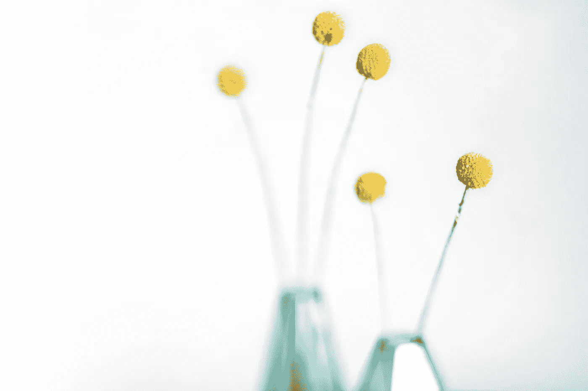
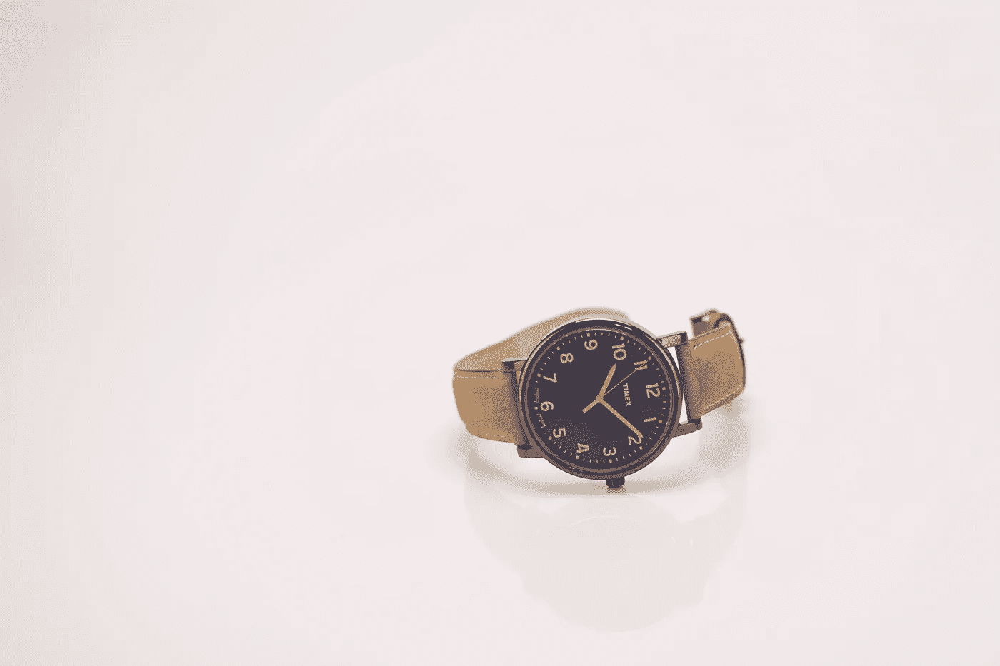
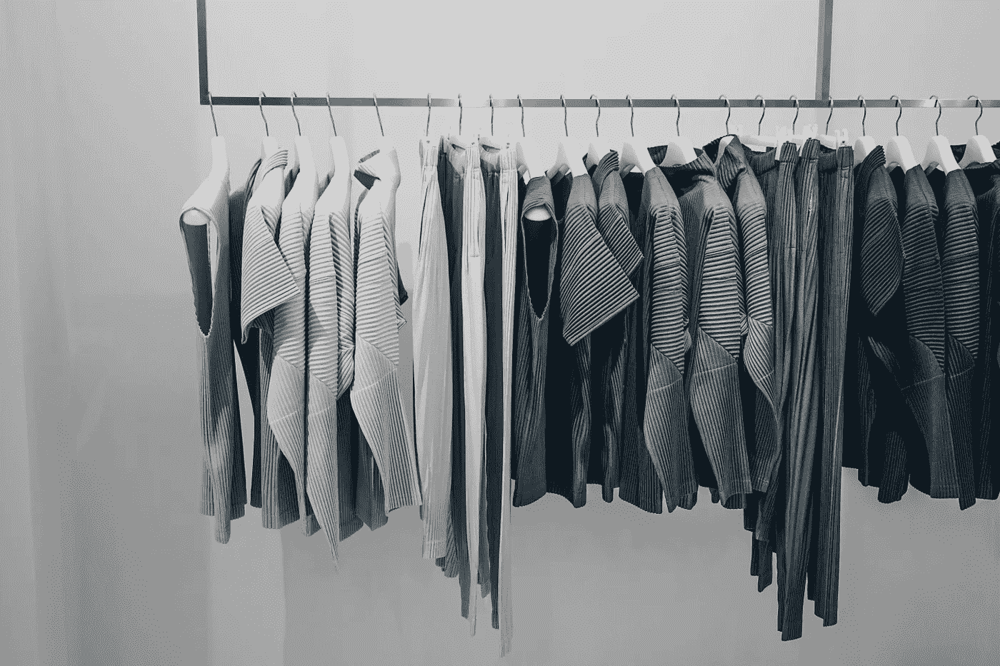

# 再见的东西，你好极简主义

> 原文：<https://medium.com/swlh/bye-bye-stuff-hello-minimalism-3d98adb400a>

直到我在 Unsplash.com 为我的前一篇文章寻找一些照片时，我才真正考虑过这个问题。我偶然发现了极简主义的主题，它的简单和干净吸引了我的注意。

这让我反思我过去是怎样的:难以置信的占有欲和对我拥有的所有东西的依恋，甚至渴望更多。满意的点从来没有满足。我对我所拥有的一点也不满意。许多高质量的斜纹棉布裤、意大利衬衫、手表、皮革饰品，所有这些都不够，我厌倦了自己的不满足感。

> “我们不需要更大的车或更华丽的衣服。我们需要自尊、认同、团体、爱、多样性、美丽、挑战和一个大于物质积累的生活目标。”—多内拉·梅多斯

# **少即是多**

我曾经认为我拥有的越多，我就会越幸福。我买了很多不必要的昂贵的东西，相信所有这些财产会增加我的自我价值，并导致更幸福的生活。我喜欢收集很多没用的东西，我不能扔掉任何东西。我以为这会让我成为一个更有趣的人。

这种想法来自于我永远不知道明天会发生什么的焦虑。这转化为对大量金钱和其他物质奢侈品的需求，所以我逐渐开始根据人们拥有多少钱来判断他们。我说服自己，我需要赚很多钱，这样我就不会错过成功，不管是什么成功。

与此同时，我不断地将自己与拥有更多或更好东西的人进行比较，这常常让我感到痛苦。我觉得自己很蠢。所以，几年前我告别了很多东西，其中很多我已经拥有了很多年。现在，我每天都活得更开心。我比以往任何时候都感到满足。

> *“我在努力练习拥有更少的东西。”—亚历姗卓拉·保罗*

以下是我开始接受的五个改变，在生活中拥有更少。

# **1。** **超值活动超过购物**

一旦我承诺过节俭的生活，我就开始寻找不同的方式来度过我的宝贵时间，而不仅仅是我下一步能买什么。我宁愿把时间和金钱花在创造回忆上，而不是给我的生活添乱——经历、活动和冒险已经变得比获得更多东西更重要。

# **2。** **停止购买我不需要的东西**

我倾向于更多地考虑我会把什么带进我的空间。我不再购买最新的和新的东西，只是为了满足我的需求。相反，我只买那些我已经仔细考虑过并认为会给我的生活带来价值的东西。我开始买得更少，并且更加意识到我买的是什么。

在这种心态转变之后，我的消费习惯总体上发生了变化。我优先考虑把钱花在活动和体验上，而不是买更多的“东西”。

> 如果你厌倦了整理东西，就不要再买东西了—约书亚·贝克尔

# **3。** **对我的时间变得更有意**

我开始拒绝与我的价值观不一致的承诺。以及对那些占用了我太多宝贵时间的承诺说不。我认识到我的时间是我最有价值的资源，并开始更有意识地安排我的时间。这种思维模式的转变改变了我允许占用的时间和空间。

# **4。** **意识到幸福不是来自于事物**

在我接受了转变的心态后，我不再觉得自己总是需要更多。我不再把我的快乐与我所拥有的联系在一起，一旦我得到了最新最棒的“东西”，我就会感到快乐。我不再相信我下一次购物后会快乐。

我的幸福和自我价值不再取决于我拥有什么。我意识到我所拥有的东西是为我服务的，要么是有用的，要么是给我带来快乐。我所拥有的并不能定义我是一个人，也不能决定我的幸福。

# **5。**

我已经放弃了跟上最新产品的想法。我满足于我所拥有的。不仅我所拥有的东西不能定义我是一个人，而且我还有意选择只保留我所使用和喜爱的东西。

我对我的物品感到满意，知道它们给我的生活带来价值而不是负担。因此，我不再拿自己的东西和别人的相比。这已经不重要了，因为我的财产并没有定义我的生活或我的价值。我满足于拥有更少，因为拥有更少让我的生活更美好。基于人们拥有的东西进行比较变得毫无意义。

> *“不要再买你不需要的东西，去打动你甚至不喜欢的人。”—苏茜·欧曼*

*原载于 2018 年 3 月 30 日*[*ye-chen.com*](https://ye-chen.com/bye-bye-stuff-hello-minimalism/)*。*

## 这篇文章发表在《创业》(The Startup)杂志上，这是 Medium 最大的创业刊物，有 311，185 人关注。

## 在这里订阅接收[我们的头条新闻](http://growthsupply.com/the-startup-newsletter/)。

